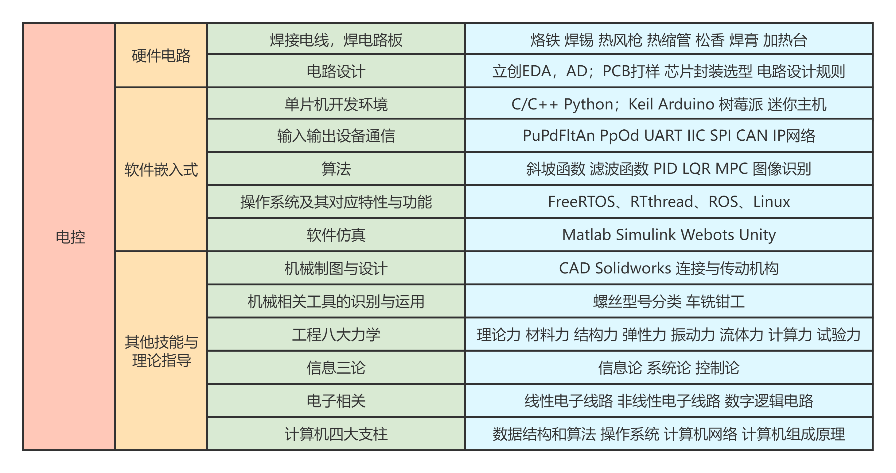

# 电控学习指南 · Electronic Control Learning Guide

> 作者：VOW

## 前言

作者曾苦于学校没有完整的电控培训体系，直到现在校内也没有可供参考的公开学习路线。于是决定整理这份电控学习指南，供同学们参考。本文由多人协作撰写，内容力求覆盖电控核心技能，但受限于作者水平与经验，难免有疏漏与不足，欢迎批评指正。

下图是中科大 RoboWalker 战队总结的电控技能树，涵盖内容较广。图中技能不必全部掌握——每个人都有自己擅长的方向，应根据兴趣和项目需求，选择适合自己的技术路线深入学习。本文将围绕该图的主要脉络展开。

## 目录

### 1. 硬件电路
- [1.1 电路设计](docs/01-硬件电路/01-电路设计.md)
- [1.2 焊接](docs/01-硬件电路/02-焊接.md)

### 2. 软件嵌入式
- [2.1 单片机](docs/02-软件嵌入式/01-单片机.md)
- [2.2 通讯协议](docs/02-软件嵌入式/02-通讯协议.md)
- [2.3 算法](docs/02-软件嵌入式/03-算法.md)
- [2.4 RTOS](docs/02-软件嵌入式/04-RTOS.md)
- [2.5 Linux](docs/02-软件嵌入式/05-Linux.md)
- [2.6 软件仿真](docs/02-软件嵌入式/06-软件仿真.md)

### 3. 其他技能与理论指导
- [3.1 上位机设计](docs/03-其他技能与理论指导/01-上位机设计.md)
- [3.2 计算机四大支柱](docs/03-其他技能与理论指导/02-计算机四大支柱.md)
- [3.3 开发工具与工程实践](docs/03-其他技能与理论指导/03-开发工具与工程实践.md)

### 4. 学习路线
- [仅存于设想中的理想学习路线](docs/04-学习路线/理想学习路线.md)

### 5. 附录
- [后记](docs/05-附录/后记.md)
- [致谢](docs/05-附录/致谢.md)

## 使用说明

电控的学习路线从来不是线性的——你不需要把本文所有内容学完才能动手做项目。恰恰相反，先做项目，遇到问题再回来补对应的知识，这才是最高效的学习方式。也不必被这篇文章的篇幅吓到，每个人走的路都不一样，找到适合自己的节奏，持续积累，终会有所成。

欢迎通过 Issue / PR 提出修改建议或补充内容。

## 致谢

感谢中科大 RoboWalker 战队的开源教程，B 站视频链接：
https://www.bilibili.com/video/BV1z14y1G77V

同时也感谢小作文批判小组的支持与帮助，详见 [致谢](docs/05-附录/致谢.md)。

## License

本文档采用 [CC BY-NC-SA 4.0](https://creativecommons.org/licenses/by-nc-sa/4.0/deed.zh) 协议，转载请注明出处，禁止商用。
