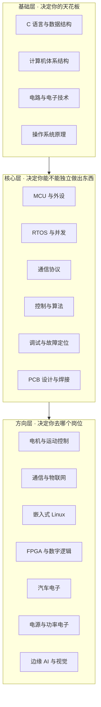

# 0.1 嵌入式岗位图谱

> **前置知识**：无。本篇是全篇导读的起点，建议先读这一篇再决定往下看什么。
>
> **掌握标准**：能说清嵌入式行业有哪些岗位、每个岗位大致做什么、自己目前最想走哪个方向。
>
> **对应岗位**：全部（本篇即岗位地图本身）
>
> **练手建议**：读完本篇后，去招聘网站搜索其中 2~3 个岗位，各看 10 份 JD，把反复出现的关键词抄下来，和本篇的技能表对照。

## 嵌入式到底是一个什么行业

很多人对嵌入式的第一印象是"写单片机的"，这个印象不算错，但远远不够。

嵌入式系统的定义是：**嵌入到某个设备内部、为特定功能服务的计算机系统**。它和 PC、服务器最大的区别在于——它不是通用计算机，它只干一件事，但要把这件事干得足够可靠、足够便宜、足够省电。你身边的每一个带电的东西几乎都包含嵌入式系统：空调、洗衣机、电动车、路由器、扫地机器人、无人机、血压计、电梯、光伏逆变器、汽车的每一个 ECU。

这个"什么设备都要用"的特性，决定了嵌入式行业的岗位分布非常分散。同样叫"嵌入式工程师"，做空调主控的和做汽车域控制器的，日常用的技术栈可能只有一半重合。所以**先搞清楚岗位地图，比急着学某个具体技术点重要得多**——因为不同岗位的学习路径差别很大，走错方向的成本是几个月。

> **说明**：下面的岗位划分是行业常见形态的归纳，不是标准分类。不同公司（尤其是大厂和中小厂）的岗位边界差别很大，很多小公司一个人要干三个岗位的活。这里给出的是"典型画像"，用来帮你建立方向感，不要当成教条。

## 技术体系的三层结构

在讲岗位之前，先看技术本身是怎么分层的。理解了这个层次，你就能明白为什么有些技术是"必修"，有些是"方向"。

这张图最重要的信息是**箭头方向**：基础层不牢，核心层会一直卡；核心层不牢，方向层学得再多也做不出完整的东西。

很多初学者的问题恰恰是跳过 L1、L2，直接冲 L3 的某个热门技术（比如 FOC、Linux 驱动、深度学习部署），结果就是"看得懂教程，自己做不出来"。原因不是那个技术太难，而是它下面的地基没打。

## 岗位图谱

嵌入式岗位大致分成软件、硬件两大块，外加几个横跨两边的角色。

> **说明**：下面每条只列**这个岗位区别于其他岗位**的章节，公共基础不逐条重复。岗位一列出的 [第 1 章](../01-编程与软件基础/README.md) ~ [第 4 章](../04-实时操作系统/README.md) 与 [第 7 章](../07-通信与物联网/README.md)，是绝大多数软件类岗位都要过的地基；硬件类岗位的地基则是 [第 10 章](../10-硬件电路与PCB/README.md) 和 [11.1 测量仪器](../11-工具仪器与仿真/01-测量仪器.md)。看某一条岗位时，把它和对应的地基合起来看——这和上面那张三层结构图讲的是同一件事。

### 一、嵌入式软件工程师（MCU 方向）

**最主流、岗位数量最多的方向。**

- **做什么**：基于 STM32、GD32、ESP32 这类单片机，写外设驱动、业务逻辑、通信协议、控制算法，把硬件和产品功能连起来。典型工作内容可能是"用 SPI 读一颗传感器，处理后通过 CAN 发给上位机"。
- **核心技能**：C 语言 → MCU 外设（GPIO/UART/SPI/I2C/TIM/ADC/DMA）→ 中断与 DMA → 通信协议 → RTOS → 调试能力。
- **进阶技能**：Bootloader/OTA、低功耗设计、代码架构分层、Flash 存储管理。
- **常见行业**：消费电子、家电、工控、医疗设备、机器人、无人机。
- **本教程对应章节**：[第 1 章](../01-编程与软件基础/README.md)、[第 2 章](../02-MCU与体系结构/README.md)、[第 3 章](../03-嵌入式软件工程/README.md)、[第 4 章](../04-实时操作系统/README.md)、[第 7 章](../07-通信与物联网/README.md)。

### 二、MCU 驱动 / BSP 工程师

**比上面更靠近硬件一层。**

- **做什么**：写和芯片、外设芯片（传感器、存储、WiFi 模组、显示屏）打交道的底层代码，包括寄存器操作、驱动框架、BSP 移植。别人调 `sensor_read()` 的时候，写这个函数的人是你。
- **核心技能**：在软件工程师的基础上，额外要求**会读数据手册**、懂时序图、会用示波器和逻辑分析仪验证、理解寄存器级原理。
- **进阶技能**：驱动框架设计（统一设备模型）、多芯片平台移植、Linux 驱动。
- **常见行业**：芯片原厂、方案公司、模组厂、汽车电子。
- **和软件工程师的区别**：软件岗看现象写逻辑，驱动岗看波形找原因。**能不能把"数据手册 + 示波器波形 + 寄存器值"这三样东西串起来定位问题，是这个岗位的真正门槛。**
- **本教程对应章节**：[2.3 通用外设](../02-MCU与体系结构/03-通用外设.md)、[3.6 调试方法论](../03-嵌入式软件工程/06-调试方法论.md)、[12.2 数据手册阅读方法](../12-工程素养与交付/02-数据手册阅读方法.md)、[11.1 测量仪器](../11-工具仪器与仿真/01-测量仪器.md)。

### 三、电机控制工程师

**嵌入式领域薪资天花板较高的方向之一。**

- **做什么**：让电机按预期转起来、转得准、转得稳、转得省电。小到云台、云台相机，大到电动车主驱、工业伺服、机器人关节。
- **核心技能**：电机原理与选型 → 驱动电路 → 位置/电流检测 → PID/FOC/SVPWM → 观测器（无感控制）→ 实时性与代码优化。
- **难点在哪**：它是一个"软硬通吃"的方向。你得同时懂 MOSFET 为什么发热、电流采样为什么有偏置、编码器为什么丢脉冲，还要懂控制环路为什么震荡。任何一头不懂，都会卡住。
- **常见行业**：新能源汽车、工业伺服、机器人、无人机、家电（变频）。
- **本教程对应章节**：[第 6 章 电机与执行器](../06-电机与执行器/README.md)（整章）、[5.2 控制算法](../05-控制与算法/02-控制算法.md)、[5.3 滤波与姿态解算](../05-控制与算法/03-滤波与姿态解算.md)、[10.3 电源设计](../10-硬件电路与PCB/03-电源设计.md)。

### 四、通信与物联网工程师

- **做什么**：让设备连上网、连上云、和别的设备说上话。包括有线（CAN/RS-485/以太网）、无线（WiFi/BLE/LoRa/NB-IoT/4G）、应用层协议（MQTT/Modbus/CoAP）以及云平台对接。
- **核心技能**：串口收发框架（这是基本功中的基本功）→ AT 指令与模组 → 协议栈 → 云平台 SDK → 安全与加密 → 低功耗。
- **常见行业**：智能家居、共享设备、工业物联网、车联网、能源监控。
- **一个容易忽视的点**：这个方向最难的部分不是协议本身，而是**不稳定**——数据丢包、模组死机、断线重连、弱网环境。能把一套通信在没有人工干预的情况下跑三个月不出问题，才算真正掌握。
- **本教程对应章节**：[第 7 章 通信与物联网](../07-通信与物联网/README.md)（整章）。

### 五、嵌入式 Linux 应用工程师

- **做什么**：在跑 Linux 的板子（树莓派、RK、全志、i.MX 等）上写应用程序：数据采集服务、网关程序、通信中间件、边缘计算任务。
- **核心技能**：Linux 命令行 → C/C++ 系统编程 → 进程线程与 IPC → Socket 网络编程 → Shell 与 systemd → 交叉编译与构建。
- **一个重要提醒**：这个岗位**前期学的东西和"嵌入式"三个字关系不大**，本质是 Linux 开发。不要一上来就冲着"点灯"去，那是学到中期才做的事。详见 [8.1 学习路线与环境](../08-嵌入式Linux/01-学习路线与环境.md)。
- **常见行业**：智能硬件、机器人主控、边缘网关、工业 HMI、车载娱乐。
- **本教程对应章节**：[第 8 章 嵌入式 Linux](../08-嵌入式Linux/README.md) 的 01~02 篇。

### 六、嵌入式 Linux 驱动 / 内核工程师

- **做什么**：写内核模块、适配设备树、调试驱动框架，把厂商提供的一堆"半成品 SDK"变成能用的东西。岗位数量比应用岗少，但稀缺度高。
- **核心技能**：内核模块机制 → 字符设备驱动 → 设备树 → Platform 总线模型 → 中断与并发处理 → 内核调试（dmesg/ftrace/perf）。
- **门槛**：通常要求 3 年以上经验或硕士起点，不建议作为第一份工作的目标，但可以作为 3~5 年后的方向。
- **本教程对应章节**：[8.3 驱动开发](../08-嵌入式Linux/03-驱动开发.md)、[8.4 系统移植与构建](../08-嵌入式Linux/04-系统移植与构建.md)。

### 七、FPGA / 数字逻辑工程师

- **做什么**：用 Verilog/VHDL 描述硬件电路，做高速接口、实时信号处理、并行计算。和软件岗位思维差异很大——软件是"一条指令一条指令地执行"，FPGA 是"所有逻辑同时工作"。
- **核心技能**：Verilog RTL 设计 → 仿真与综合 → 时序约束与静态时序分析（STA）→ 跨时钟域同步（CDC）→ 接口 IP（DDR/PCIe/MIPI）→ AXI 总线。
- **常见行业**：通信设备、医疗影像、雷达、高端仪器、芯片验证。
- **和嵌入式的交叉**：现在很多系统是"ARM 负责逻辑、FPGA 负责实时"，两者通过 AXI 总线协同，这也叫异构架构。做嵌入式的人懂一点 FPGA 会很吃香。
- **本教程对应章节**：[第 9 章 FPGA 与数字逻辑](../09-FPGA与数字逻辑/README.md)（整章）。

### 八、汽车电子工程师

- **做什么**：车载 ECU 的软件开发或测试。技术栈相对独立：CAN/CAN FD、LIN、车载以太网、UDS 诊断、AUTOSAR 架构，以及严格的功能安全流程。
- **核心技能**：在通用嵌入式基础上，重点补 **CAN 总线 → UDS 诊断 → AUTOSAR → 功能安全（ISO 26262）**。
- **特点**：流程规范程度远高于消费电子，代码要过 MISRA 检查，改动要过评审，测试要写完整报告。适合喜欢规范化工程的人。
- **常见行业**：整车厂、Tier1 供应商、芯片厂、检测机构。
- **本教程对应章节**：[7.2 网络与应用层协议](../07-通信与物联网/02-网络与应用层协议.md)、[12.4 功能安全与可靠性](../12-工程素养与交付/04-功能安全与可靠性.md)。

### 九、嵌入式硬件工程师

- **做什么**：画原理图、画 PCB、选型、打样、调试、出量产文件。做的是软件的"舞台"。
- **核心技能**：电路与电子技术 → 器件选型与数据手册 → EDA 工具（立创 EDA/AD/KiCad）→ PCB 设计（布局布线/铺铜/接地）→ 焊接与返修 → 调试仪器使用。
- **进阶技能**：信号完整性（SI）、电源完整性（PI）、EMC 整改、电源设计、高速信号（DDR/HDMI/差分对）。
- **常见行业**：几乎所有硬件公司。
- **本教程对应章节**：[第 10 章 硬件电路与 PCB](../10-硬件电路与PCB/README.md)（整章）、[11.1 测量仪器](../11-工具仪器与仿真/01-测量仪器.md)。

### 十、电源工程师

- **做什么**：设计供电方案——LDO、Buck、Boost、反激、LLC，把 220V 或 12V 变成芯片能用的 3.3V，还要保证效率高、纹波小、不烧。
- **核心技能**：电源拓扑 → 电感与变压器设计 → 环路稳定性 → 热设计 → 保护电路 → EMC。
- **为什么单列**：电源是硬件里最"深"的方向之一，和数字电路几乎是两门手艺。很多硬件工程师做数字板很溜，一碰电源就抓瞎。
- **本教程对应章节**：[10.3 电源设计](../10-硬件电路与PCB/03-电源设计.md)、[10.5 信号完整性与 EMC](../10-硬件电路与PCB/05-信号完整性与EMC.md)。

### 十一、硬件测试 / 验证工程师

- **做什么**：不是"测试软件的测试"，而是用仪器验证硬件指标：信号质量、电源纹波、EMC、ESD、高低温、振动。出测试报告、支持认证。
- **核心技能**：仪器使用（示波器/频谱仪/网分/信号源）→ 测试用例设计 → 认证标准（CCC/CE/FCC/UL）→ 数据处理与报告。
- **适合谁**：细心、喜欢流程和标准化、不排斥写报告的人。相对来说技术深度不是最高，但岗位稳定、门槛友好，是进入硬件行业的常见入口。
- **本教程对应章节**：[11.1 测量仪器](../11-工具仪器与仿真/01-测量仪器.md)、[10.5 信号完整性与 EMC](../10-硬件电路与PCB/05-信号完整性与EMC.md)、[12.4 功能安全与可靠性](../12-工程素养与交付/04-功能安全与可靠性.md)。

### 十二、其他值得知道的岗位

| 岗位 | 说明 |
|---|---|
| **边缘 AI / 算法部署工程师** | 把训练好的模型量化、裁剪后部署到 MCU 或 NPU 上跑。新兴方向，要求懂一点 AI + 懂嵌入式 |
| **FAE 现场应用工程师** | 芯片原厂或代理商的岗位，帮客户解决技术问题。技术面广、沟通要求高、出差多 |
| **上位机 / 测试工具工程师** | 做 PC 端工具、产测软件、调试平台。技术栈偏 C++/Qt/Python，和嵌入式交叉但独立 |
| **机器人 / 无人机整机工程师** | 小团队里常见，一个人横跨电控、算法、结构沟通，最能锻炼系统能力 |

## 技能 → 岗位 反查表

前面是"岗位需要什么技能"，这张表反过来：**你已经会了某个技能，能去哪些岗位**。

| 技能 | 对应的岗位（✓ = 核心要求，○ = 加分） |
|---|---|
| C 语言 + 指针/内存 | 全部软件岗位 ✓ |
| MCU 外设驱动 | MCU 软件 ✓ ｜ 驱动/BSP ✓ ｜ 电机控制 ✓ ｜ 物联网 ✓ ｜ 汽车电子 ✓ |
| 通信协议（UART/SPI/I2C/CAN） | 全部软件岗位 ✓ |
| RTOS | 电机控制 ✓ ｜ 物联网 ✓ ｜ 汽车电子 ✓ ｜ MCU 软件 ○ |
| 控制算法（PID/FOC） | 电机控制 ✓ ｜ 机器人 ✓ ｜ 无人机 ✓ ｜ 汽车电子 ○ |
| 嵌入式 Linux | Linux 应用 ✓ ｜ Linux 驱动 ✓ ｜ 边缘网关 ✓ ｜ 机器人主控 ○ |
| FPGA / Verilog | FPGA ✓ ｜ 芯片验证 ✓ ｜ 通信设备 ✓ ｜ 高端仪器 ○ |
| 电路 + PCB 设计 | 硬件工程师 ✓ ｜ 电源 ○ ｜ 硬件测试 ○ |
| 电源拓扑设计 | 电源工程师 ✓ ｜ 硬件工程师 ○ |
| 仪器与测量 | 硬件测试 ✓ ｜ 硬件工程师 ✓ ｜ 驱动/BSP ✓ ｜ 电机控制 ○ |
| 数据手册阅读 | 驱动/BSP ✓ ｜ 硬件工程师 ✓ ｜ 全部硬件岗位 ✓ |
| 上位机 / 脚本 | 测试工具 ✓ ｜ 全部岗位 ○（日常效率工具） |

## 软硬件岗位的边界与交叉

行业里有一个常见的误解：**"做软件的人不用懂硬件，做硬件的人不用懂软件"**。在嵌入式领域，这句话是错的。

原因是嵌入式软硬件之间的耦合太紧：

- 串口收不到数据，可能是软件配置错了，也可能是 TX/RX 接反、共地没接、波特率晶振不匹配；
- ADC 采出来全是噪声，可能是软件没加滤波，也可能是采样电阻布局不对、参考电压不稳；
- 电机一转就复位，可能是代码逻辑问题，更可能是电源扛不住浪涌。

**现实中大量"看起来像软件 bug"的问题，根因在硬件。** 反过来也一样：一颗芯片不工作，可能是焊接问题，也可能是驱动里某个寄存器位没配。

所以：

| 你的主方向 | 需要了解的另一侧 |
|---|---|
| 软件 | 能看懂原理图、会用万用表和示波器、知道电源和接地的作用、看懂数据手册的时序图和电气参数 |
| 硬件 | 能看懂基本的 C 代码、知道 MCU 怎么初始化外设、会用串口打印排查、理解中断和通信协议的基本概念 |
| 想走管理/系统 | 两边都要有判断力，能评估方案的可行性和成本 |

这不是要求你两边都精通——那是极少数人的事。**要求的是"能和对面的人对话"**：硬件工程师说"这里加个上拉"，你知道为什么；软件工程师说"分成两个任务跑"，你知道会带来什么实时性问题。

这个交叉能力，恰恰是嵌入式工程师在就业市场上的核心差异点。纯软件的人做不了嵌入式，纯硬件的人也做不了——**中间那层懂两边的人，才是这个行业真正缺的**。

## 关于岗位要求的诚实说明

前面每一条都是归纳，不是绝对标准。实际情况是：

1. **同一个岗位名称，不同公司的要求可能差一倍。** 大厂分工细，可能只要你会一个很小的领域；小公司一个人干三个岗位，要求你什么都会一点。
2. **同样的技能，不同年份的热度不同。** 比如几年前很热的方向，现在可能已经饱和；国产替代、边缘 AI、汽车电子是这两年相对明确在涨的方向。
3. **学历和经验的权重往往高于技能清单本身。** 校招看基础和潜力，社招看项目深度。这份图谱能帮你补技能，但补不了项目经历——项目的事在 [13.2 项目实战阶梯](../13-学习路线与项目实战/02-项目实战阶梯.md)。
4. **不要用这份图谱来"全都要"。** 它的作用是让你知道地形，不是给你一份必须全部打完的清单。真正该做的是：**选一个方向，做出一个能讲清楚的项目，然后再横向扩展。**

## 学习建议

如果你现在完全没方向，建议按这个顺序缩小范围：

1. **先做排除法**。上面 12 个岗位里，哪些是你一看就确定不感兴趣的（比如"不想画板子"、"不想写报告"）？先划掉，不用纠结。
2. **再看交叉点**。剩下的里面，哪些岗位用的是同一套基础（大多软件岗位都共享第 1~4 章）？先把这个公共基础打了，方向可以晚一点定，但基础早打不亏。
3. **用项目验证方向感**。看十篇文章不如做一个项目。做一个循迹小车能让你同时接触到传感器、电机、通信、控制、调试——很多人在这个过程里会突然发现自己真正喜欢的是哪一块。项目清单见 [13.2](../13-学习路线与项目实战/02-项目实战阶梯.md)。
4. **最后再决定深入哪条线**。确认方向后再看 [0.2 三条路线与技能依赖](02-三条路线与技能依赖.md)，那里的路线图会告诉你具体该按什么顺序读。

**不要在没有方向的时候就开始纠结选哪个方向。** 嵌入式各方向的基础层是高度共用的，先动手做出点东西，方向感是"做"出来的，不是"想"出来的。

## 小节总结

嵌入式不是一个岗位，而是一整个行业。它的岗位分布从最底层的电源设计、PCB 布线，一直到最上层的云平台对接、算法部署，中间还有 FPGA、汽车电子这些相对独立的分支。

但所有岗位共享同一套底层逻辑：**用有限的资源，可靠地控制真实的物理世界**。这个共同点，决定了嵌入式工程师的核心竞争力不在"会多少个技术点"，而在于**能不能把软硬件串起来，定位并解决真实系统里的问题**。

看完这一篇，你应该已经能回答三个问题：这个行业有哪些位置、每个位置要求什么、我大概想去哪个。带着这三个答案去看下一篇的路线图，会顺畅很多。

---

本章目录：[0. 导读](README.md) ｜ 总目录：[返回首页](../../README.md)
上一篇：[0. 导读](README.md) ｜ 下一篇：[0.2 三条路线与技能依赖](02-三条路线与技能依赖.md)
