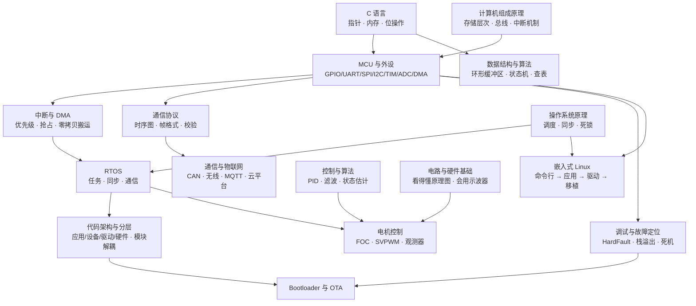
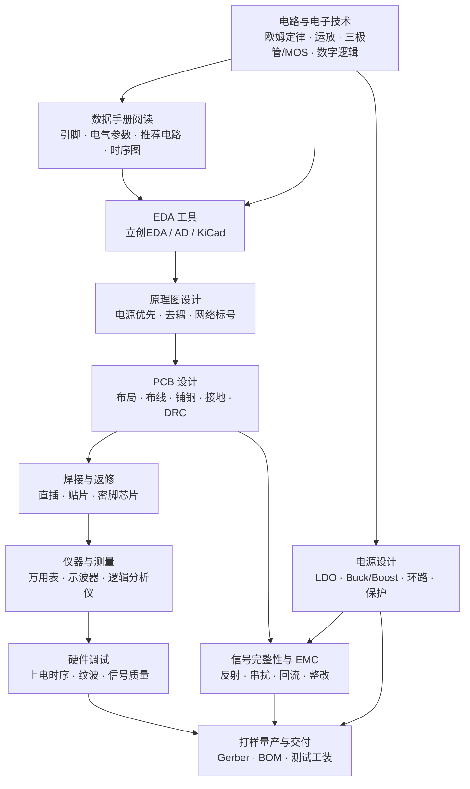

# 0.2 三条路线与技能依赖

> **前置知识**：[0.1 嵌入式岗位图谱](01-嵌入式岗位图谱.md)
>
> **掌握标准**：能画出自己要走的那条路线的技能依赖链，并说清每一步的前置条件是什么。
>
> **对应岗位**：全部（本篇决定你的阅读顺序）
>
> **练手建议**：把下面属于你那条路线的技能表抄到自己的笔记里，每学完一项就打个勾，并补上"我做出了什么"。

## 路线不是身份，是可随时切换的路径

先纠正一个很常见的心理负担：**不要觉得"选了软件路线就永远是软件的人"。**

嵌入式行业里，软件背景转硬件、硬件背景转软件、两边都做的人非常多。真实的职业路径通常不是"一开始就选对，然后一路走到底"，而是"先走一段，发现更感兴趣的分支，横向切过去"。

所以这一篇的目标不是让你现在就做一个不可更改的决定，而是让你知道：**每一条路线的第一步是什么、第二步依赖第一步的什么**。这样你在任何时候切换方向，都知道自己已经走过的路有没有白费——而好消息是，嵌入式各方向的**基础层几乎完全共用**，换方向的沉没成本比大多数行业都低。

## 三条路线的定义

| 路线 | 覆盖岗位 | 特点 |
|---|---|---|
| **软件路线** | MCU 软件、驱动/BSP、电机控制、物联网、Linux 应用/驱动、汽车电子 | 岗位最多、门槛相对友好、对计算机基础要求高 |
| **硬件路线** | 嵌入式硬件、电源、硬件测试/验证 | 岗位数量少一些但更稀缺、依赖动手条件和仪器、成长周期长 |
| **全栈路线** | 机器人/无人机整机、小团队技术负责人、创业型岗位 | 软硬通吃、系统能力强、但每一样都不容易到顶尖 |

三条路线共享同一个基础层。区别在于**从核心层开始往哪个方向分叉**。

## 技能依赖关系图

### 软件路线的依赖链



**几个关键的依赖关系，值得单独强调：**

1. **不学调试方法论，项目永远停在"能跑就行"。** 大部分人的技术停滞不是因为不会新技术，而是因为遇到问题只会"改代码试试"。能定位 HardFault、能查栈溢出，是水平的分水岭。
2. **电机控制是软件路线里唯一强制要求懂硬件基础的方向。** 不碰电机的话，硬件部分了解即可；要碰电机，就必须能看懂驱动电路和波形。
3. **Linux 和 RTOS 是两条平行的分支，不是先后关系。** 有人先学 RTOS，有人直接做 Linux，都可以。它们背后的操作系统原理是共用的，先把原理学了，两边都会快。

### 硬件路线的依赖链



**几个关键的依赖关系：**

1. **数据手册阅读是硬件路线的第一道分水岭。** 不会看数据手册，画原理图只能抄参考设计，出了问题无从下手。这一项在软件路线里同样重要（见 [12.2](../12-工程素养与交付/02-数据手册阅读方法.md)）。
2. **焊接和测量是"动手前提"，不是可选项。** 硬件的问题大部分要靠"测"出来，而不是"想"出来。没有仪器和焊接能力，学了再多理论也只能纸上谈兵。
3. **电源设计是硬件里相对独立的一支。** 数字电路做得好不等于会做电源，两者的知识几乎不重叠。想走电源方向，需要单独投入。
4. **EMC 是经验学科。** 它的理论并不复杂，但整改靠的是经验和案例积累，通常需要在真实项目里踩过坑才学得会。

### 全栈路线

全栈不是"前面两条路的并集"，而是**在两条路各掌握一个足够的子集，重点是理解交界处**：

```
软件侧：C 语言 + MCU 外设 + 通信协议 + RTOS + 调试方法论   （够用即可，不必每个都到顶）
硬件侧：看得懂原理图 + 会用仪器 + 能画简单板 + 焊接        （够用即可，不必会做电源）
交界处：软硬件联合调试 · 系统方案选型 · 性能与成本权衡      ← 这才是全栈的核心竞争力
```

**全栈路线的陷阱**：很多人把它理解成"什么都要学到精通"，结果三年过去每一样都停在入门。正确的做法是——**纵向至少有一项要到能做项目的深度，横向的其他项到"能对话"的深度**。没有纵向深度的人，在任何一个岗位上都不占优势。

## 三条路线的阅读顺序

下面把本教程的章节排成具体顺序。**带 ★ 的是必读，其余按方向选读。**

### 软件路线

| 阶段 | 读什么 | 学完能做什么 |
|---|---|---|
| **打地基** | [1.1 C 语言](../01-编程与软件基础/01-C语言（嵌入式视角）.md) ★ · [1.2 数据结构与算法](../01-编程与软件基础/02-数据结构与算法.md) ★ · [1.3 计算机组成与操作系统原理](../01-编程与软件基础/03-计算机组成与操作系统原理.md) ★ | 写得出规范的 C 代码，说得清程序从源码到运行发生了什么 |
| **入门 MCU** | [2.1 单片机平台选型](../02-MCU与体系结构/01-单片机平台选型.md) ★ · [2.2 Cortex-M 架构与启动流程](../02-MCU与体系结构/02-Cortex-M架构与启动流程.md) ★ · [2.3 通用外设](../02-MCU与体系结构/03-通用外设.md) ★ · [2.4 中断系统与低功耗](../02-MCU与体系结构/04-中断系统与低功耗.md) ★ | 能独立用 HAL 库驱动常用外设，做出第一个小项目 |
| **学会说话** | [7.1 总线协议](../07-通信与物联网/01-总线协议.md) ★ · [11.1 测量仪器](../11-工具仪器与仿真/01-测量仪器.md) ★ | 能打通 MCU 与传感器/模块/上位机的通信，并验证时序 |
| **学会工程** | [3.1 代码架构与分层](../03-嵌入式软件工程/01-代码架构与分层设计.md) ★ · [3.2 构建系统与工具链](../03-嵌入式软件工程/02-构建系统与工具链.md) ★ · [3.3 Git](../03-嵌入式软件工程/03-Git与代码托管.md) ★ · [3.6 调试方法论](../03-嵌入式软件工程/06-调试方法论.md) ★ · [3.7 Bootloader 与 OTA](../03-嵌入式软件工程/07-Bootloader与OTA升级.md) ★ · [2.5 Flash 存储与参数管理](../02-MCU与体系结构/05-Flash存储与参数管理.md) | 代码能维护、能协作、能定位故障、能远程升级 |
| **上并发** | [4.1 RTOS 概述](../04-实时操作系统/01-RTOS概述与裸机局限.md) ★ · [4.2 FreeRTOS](../04-实时操作系统/02-FreeRTOS.md) ★ · [4.4 RTOS 常见问题](../04-实时操作系统/04-RTOS常见问题.md) ★ | 能设计多任务系统，避免优先级反转和栈溢出 |
| **选方向** | 电机 → [第 6 章](../06-电机与执行器/README.md) ｜ 物联网 → [第 7 章](../07-通信与物联网/README.md) ｜ Linux → [第 8 章](../08-嵌入式Linux/README.md) | 在某个具体方向上有可讲的项目 |
| **找工作** | [13.2 项目实战阶梯](../13-学习路线与项目实战/02-项目实战阶梯.md) · [13.4 求职准备](../13-学习路线与项目实战/04-求职准备.md) | 简历上有项目，面试能讲清楚 |

**第 5 章《控制与算法》没排进上面的阶段表，因为只有会闭环的项目才用得上它。** 依赖图里有一条从"控制与算法"指向"电机控制"的边，说的就是这件事：想做电机、无人机、云台、平衡车这类会动的项目，**在进第 6 章之前先读 [5.2 控制算法](../05-控制与算法/02-控制算法.md) 和 [5.3 滤波与姿态解算](../05-控制与算法/03-滤波与姿态解算.md)**，否则第 6 章里的电流环、位置环只能照着抄，出了问题不知道往哪查。做纯通信、上位机、Linux 应用方向的，把 [5.1 常见算法总览](../05-控制与算法/01-常见算法总览.md) 扫一遍，知道有什么算法就够了。

### 硬件路线

| 阶段 | 读什么 | 学完能做什么 |
|---|---|---|
| **懂理论** | [10.1 电路与电子技术基础](../10-硬件电路与PCB/01-电路与电子技术基础.md) ★ · [12.2 数据手册阅读方法](../12-工程素养与交付/02-数据手册阅读方法.md) ★ | 能看懂原理图和数据手册，理解每个模块在干什么 |
| **会画板** | [10.2 原理图与 PCB 设计](../10-硬件电路与PCB/02-原理图与PCB设计.md) ★ | 能独立画出一块能用的两层板并下单打样 |
| **动手** | [10.4 焊接与返修](../10-硬件电路与PCB/04-焊接与返修.md) ★ · [11.1 测量仪器](../11-工具仪器与仿真/01-测量仪器.md) ★ | 能把板子焊出来、上电、用仪器测出问题 |
| **进阶层** | [10.3 电源设计](../10-硬件电路与PCB/03-电源设计.md) · [10.5 信号完整性与 EMC](../10-硬件电路与PCB/05-信号完整性与EMC.md) · [10.6 打样量产与国产替代](../10-硬件电路与PCB/06-打样量产与国产替代.md) | 能设计电源方案、处理 EMC 问题、支撑量产 |
| **补软件** | [2.3 通用外设](../02-MCU与体系结构/03-通用外设.md) · [3.6 调试方法论](../03-嵌入式软件工程/06-调试方法论.md) | 能和软件工程师对话，联合定位软硬件交界的问题 |

### 全栈路线

按软件路线的**第 1~3 阶段**走完，然后：

- 硬件侧补：[10.1](../10-硬件电路与PCB/01-电路与电子技术基础.md) · [10.2](../10-硬件电路与PCB/02-原理图与PCB设计.md) · [10.4](../10-硬件电路与PCB/04-焊接与返修.md) · [11.1](../11-工具仪器与仿真/01-测量仪器.md)
- 交界处：[3.6 调试方法论](../03-嵌入式软件工程/06-调试方法论.md) ★ ★ · [6.2 电机驱动电路](../06-电机与执行器/02-电机驱动电路.md) · [12.1 需求分析与方案选型](../12-工程素养与交付/01-需求分析与方案选型.md)
- 系统视角：[13.2 项目实战阶梯](../13-学习路线与项目实战/02-项目实战阶梯.md) ★

## 什么时候该切换路线

路线切换的信号通常不是"我学不会了"，而是下面这几种：

| 信号 | 说明 | 建议 |
|---|---|---|
| **做项目时只对某一环特别来劲** | 比如调试电路时特别有耐心，写业务逻辑就犯困 | 往那个方向切，兴趣是可持续性最强的驱动力 |
| **卡在同一个地方反复受挫** | 比如总是搞不定时序问题，查了资料也没用 | 退回上一层的依赖项补课（多半是基础层缺了东西），而不是硬啃 |
| **发现自己的岗位天花板到了** | 比如做应用很多年，想往内核走 | 横向扩展，补齐依赖链上的缺口再跳 |
| **方向本身在收缩** | 某些技术方向会随产业周期冷热 | 观察招聘市场的关键词变化，提前 1~2 年做准备 |

**不建议切换的情况**：因为"听说另一个方向工资高"而切。薪资差异通常来自**你在某个方向的深度**，而不是方向本身。一个方向做到前 20% 的人，收入普遍高于另一个方向的中位数。

## 学习建议

1. **不要按目录顺序读。** 本篇给出的顺序是依赖顺序，不是阅读顺序。每个阶段都可以只读你当下用得到的那几篇。
2. **每个阶段都要有产出。** 没有产出的学习等于没学。每一篇的篇头都有"练手建议"，照着做。
3. **基础层不要跳。** 第 1 章看着最枯燥、最不"嵌入式"，但它决定了你后面能走多远。一个 C 语言和内存布局扎实的人，学任何 MCU 都是几天的事。
4. **允许自己"暂时不懂"。** 依赖图意味着有些东西你现在看不懂是因为前置没学，这很正常。标记一下继续往前，回头再补，比卡在原地强。
5. **一年一次复盘。** 对照本篇的路线表，看看自己走到了哪、哪些技能是"以为会了其实不会"。这个动作比多学一个技术点有用。

## 小节总结

三条路线共享同一个基础层，从核心层开始分叉。软件路线岗位最多、依赖计算机基础；硬件路线门槛在动手条件和仪器；全栈路线的价值不在"什么都会"，而在**理解软硬件交界处**——那正是这个行业最缺的能力。

依赖图里最重要的两条信息：**调试方法论是水平分水岭**、**电机控制是软件路线里唯一强制要求硬件基础的方向**。

路线可以随时切换，嵌入式各方向的基础层高度共用，换方向的成本远低于你的想象。真正该避免的不是"选错方向"，而是"在没有方向的时候原地纠结"。

---

本章目录：[0. 导读](README.md) ｜ 总目录：[返回首页](../../README.md)
上一篇：[0.1 嵌入式岗位图谱](01-嵌入式岗位图谱.md) ｜ 下一篇：[0.3 怎么用这份教程](03-怎么用这份教程.md)
