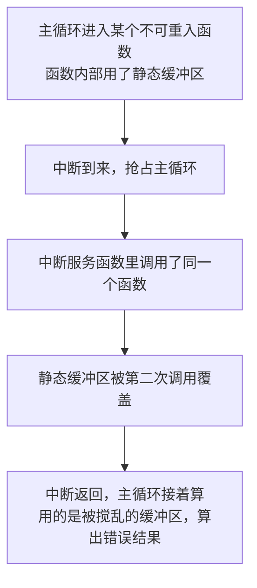

# 1.1 C 语言（嵌入式视角）

> **前置知识**：无（会一点 C 就能读，但要动手写）
> **掌握标准**：能说清 C 语言里哪些特性在嵌入式里是危险源、哪些是必需工具，并能写出不依赖动态内存、不越界、可重入的嵌入式代码
> **对应岗位**：全部嵌入式软件岗位
> **练手建议**：拿一段你写过的 C 代码，逐行找出所有指针解引用、数组下标、类型转换，检查每一处是否有越界或未定义行为的可能

## 为什么把 C 语言放在第一篇

嵌入式行业 90% 以上的代码是 C。不是因为它先进，而是因为它**贴着硬件**：能直接操作地址、能精确控制每个字节的布局、生成的机器码可控、不需要庞大的运行时支持。RTOS 是 C 写的，Linux 内核是 C 写的，芯片厂商的 SDK 是 C 写的，面试时的算法题也大多用 C 表达。

结论很直接：**你在 C 语言上的能力边界，基本等于你在嵌入式里的能力边界。**

但这个结论有个前提——这里的"C 语言水平"不是指"能写出多复杂的表达式"。在 PC 上写 C，比的是抽象能力和工程组织；在单片机上写 C，比的是**知道每一行代码在内存里到底做了什么**。同样一句 `int i = 0;`，在 PC 上可能只是寄存器里的一个值，在单片机上它可能落在栈上、占四个字节，而这一层栈还剩多少空间是你必须心里有数的。

所以这一篇不教语法。它讲的是：**同一门语言，在 PC 上和在单片机上，哪些地方是安全的、哪些地方是雷区。** 这些差异教科书里不会专门讲，但你写第一行嵌入式代码时就会撞上。

本篇和下一篇是配对的：这一篇讲语言本身的行为，[1.2 编译链接与内存布局](02-编译链接与内存布局.md) 讲这些代码最终被放到内存的哪里。**一个变量的危险程度，一半由写法决定，一半由它落在哪个段决定。**

## 指针：最核心的工具，也是最大的危险源

**指针的类型决定解引用时读几个字节**，这是最容易被忽略的一点，也是很多诡异 bug 的根源。`int *p` 解引用读 4 字节，`short *p` 读 2 字节，`char *p` 读 1 字节。所以在嵌入式里，只要你要按固定宽度访问一块内存——解析通信帧、读写寄存器——**类型的选择就是协议的一部分**，不能随手写成 `int *` 了事。数据手册上写着"这个寄存器 32 位、偏移 0x04"，你就必须保证访问它的指针确实是 32 位宽的类型，理由在后面的"类型与转换"一节会展开。

**野指针和悬空指针是两回事**，虽然现象都是"访问了不该访问的内存"：

- **野指针**：从来没被赋过值，或者指向一个随机地址。典型来源是"声明了但忘了初始化"，局部指针变量尤其危险，它里面是栈上残留的垃圾值。
- **悬空指针**：曾经指向合法内存，但那块内存已经失效了。典型来源是"函数返回了局部变量的地址""释放了内存之后还在用"。

区分它们不是为了考试，而是因为**防住的办法不一样**：野指针靠"声明即初始化"（没想好指向哪儿就先赋空），悬空指针靠生命周期的纪律（不返回局部变量地址、不跨作用域保存指针）。**一条硬规则：任何指针在解引用之前，你要能用一句话说出它指向那块内存的归属、大小和寿命。** 说不出来，就别解引用。

**指针运算的边界**。指针加减以它指向的类型大小为步长，`int *p; p+1` 前进 4 字节。这在遍历数组时很好用，但有两类错误极常见：

- 用数组名做 `sizeof` 除以元素大小来求长度。这个做法在数组退化成指针之后就失效了——`sizeof` 算出的是指针的大小，不是数组的大小。这是 C 里最经典的一类 bug，而且它不报错。
- 越界后的指针本身就已经是未定义行为，哪怕你还没解引用它。`p + n` 只有在落在数组范围内（含末尾后一个位置）时才合法。

**多级指针是嵌入式里绕不开的一层。** 函数需要"返回一个指针"或者"修改调用者的指针"时，参数就是二级指针；接口需要"传一个缓冲区数组给函数，函数往里填若干块数据"时，参数是"指针的指针"。判断该用几级指针的方法很机械：**看你要改的是"指针指向的内容"还是"指针本身"。** 改内容用一级指针，改指针本身用二级指针。多级指针读起来累，所以工程上的常见做法是：能用返回值的就用返回值，必须通过参数回传时才用二级指针，并且保证每一级都清楚它代表什么。

**函数指针在嵌入式里有三大用途**，值得单独记住：

| 用途 | 场景 |
|---|---|
| **回调注册** | 驱动层不知道上层要干什么，只保存一个函数指针，事件发生时回调 |
| **状态机跳转表** | 用一张函数指针数组代替一大段 switch，代码紧凑、好扩展 |
| **中断向量表** | 本质就是一张函数指针数组，由启动文件和链接器决定放在哪里（见 [1.2](02-编译链接与内存布局.md)） |

用函数指针要盯两件事。一是**签名必须完全匹配**：C 不会检查你传进去的函数参数类型和个数对不对，签名叫不上通常不报编译错误，而是运行期跳到一个错误的位置，现象是死机或者跑飞。二是在单片机上跳转表一般放在 Flash 里、是只读的，**不要试图在运行时改写它**。想动态更换处理函数，应该在表里存可写变量，或者用固定的几个函数入口做分发。

## 内存：栈是第一个撑爆的东西

嵌入式里内存问题的第一现场不是堆，是**栈**。原因很简单：栈是编译器自动管理的，你写代码时根本不会注意到它，但它的大小在链接阶段就固定了，用超了也没有任何提示。

**栈上开大数组是头号杀手。** 一个局部数组、一个大的结构体、一个用于拼接字符串的缓冲，只要写在函数内部，就都在栈上。默认栈大小常见的是 1KB 到 8KB 这个量级（具体看芯片和工程配置），你在一个函数里写个 2KB 的局部数组，再加上调用链上其他函数的栈开销，很容易就踩过去了。

栈溢出的现象极具欺骗性：它不会在你写超的那一行崩，它会**悄悄盖掉相邻内存里的数据**——可能是一个全局变量，可能是另一个任务的栈，也可能是硬件外设依赖的内存。所以症状往往是"改了个八竿子打不着的变量，系统就乱了"。规避手段有几条，都很简单：**大缓冲区一律声明成全局或静态变量**（它们落在 .bss，不占栈）；**嵌套调用深的函数里更要省着用栈**；**参数传递大结构体时传指针而不是传值**，传值会在栈上复制一份。栈用量的检查方法见 [3.6 调试方法论](../03-嵌入式软件工程/06-调试方法论.md)。

**为什么嵌入式要尽量避免动态内存（malloc/free）**，三条理由，按重要性排：

1. **碎片化不可控**。反复分配和释放不同大小的块之后，堆会被切成碎片。你可能明明还有 20KB 空闲，但申请一块连续的 1KB 就是失败——然后这个失败发生在深夜、在客户现场。
2. **失败不可恢复**。在 PC 上 `malloc` 失败还能弹个错误框；在单片机上你申请不到内存，能做什么？重启？降级？大多数代码根本没有处理这个返回值，直接就用空指针，结果就是硬件异常。
3. **执行时间不确定**。分配和释放的耗时与堆的状态有关，不是常数。对实时性有要求的系统来说，一个"大多数时候很快、偶尔很慢"的操作是不能接受的。

**替代方案是内存池和静态分配。** 静态分配是指编译期就把所有缓冲区定下来，程序运行期间不再申请——听上去很土，但它让内存使用变成完全可预测的，这在嵌入式里是巨大的优点。内存池是折中方案：预先从静态内存里切出一块，按固定大小切成若干个块，用的时候取一个、用完还回去。因为块大小统一，**不会有碎片**，分配和归还的时间也是固定的。要记录"哪些块在用"，用一张位图就够了。绝大多数嵌入式场景里"需要动态内存"的需求，用固定大小内存池都能满足。

**结构体对齐与填充**是另一件必须心里有数的事。编译器为了让每个成员都落在它自己对齐要求的位置上，会在成员之间塞进一些填充字节。后果是：**`sizeof(结构体)` 通常大于所有成员大小之和**，而且成员顺序会直接影响结构体的大小——把 `char`、`int`、`char` 按这个顺序写，会比 `char`、`char`、`int` 多占好几个字节。所以调整成员顺序是一个真实存在的省内存手段。

这件事在两种场景下必须认真对待：

- **通信协议结构体**。如果这个结构体是要按字节发出去的（不管是对接上位机、对接另一个芯片还是存进 Flash），那对齐填充就是你协议的一部分——填充在哪里、有几个字节，双方必须完全一致。用编译器扩展（GCC 的 `__attribute__((packed))`、Keil 的 `__packed`）可以取消填充，但要清楚代价：非对齐访问在某些架构上会直接触发硬件异常或者大幅降低性能。**更稳妥的做法是：需要精确布局时，不要直接发结构体，而是写一对打包/解包函数，一个字节一个字节地组装。** 代码多一点，但可移植、可读、不会因为换个编译器就悄悄出错。
- **共享内存结构体**。两个核（比如 ARM 和 DSP、ARM 和 FPGA 软核）共享一块内存时，双方对布局的理解必须一致，此时对齐规则、宽度定义都得写进约定里。

顺带说一个相关的坑：**多字节数据在内存里的顺序有两种排法**（大端和小端），同一个 32 位数，大端机器上最高字节在低地址，小端机器上最低字节在低地址。你在上位机和单片机上互传数据时，只要有一方按字节硬解析，就必须约定清楚用哪种顺序，否则收到的数永远是错的。协议里通常干脆约定"统一按大端传输"，发送方拆字节、接收方拼字节，把平台的差异隔离在两端。

## volatile：被误解最多的关键字

`volatile` 在嵌入式面试里出现频率极高，答错的人也极多。它只有一个意思：**告诉编译器，这个变量的值可能在程序自己看不见的地方被改掉，所以每一次读写都必须真真正正地去访问内存，不许缓存到寄存器里，不许把重复的读合并掉，不许把你以为没用的读删掉。**

为什么需要它？因为编译器的优化前提是"这段代码里只有我在改这些变量"。在嵌入式里，这个前提经常不成立：变量可能被中断服务函数改、可能被 DMA 硬件直接写进内存、可能就是一个外设寄存器、其值由硬件自己改变。这个优化与 `-O0`/`-O2` 的关系在 [1.2](02-编译链接与内存布局.md) 里有更完整的说明。

**必须用 `volatile` 的三种场景**，一个都不能漏：

| 场景 | 为什么 |
|---|---|
| **中断服务函数与主程序共享的变量** | 主循环可能在等一个标志，中断里把它置位。不加 `volatile`，编译器可能把标志读到寄存器里，循环变成死循环 |
| **DMA 的目标缓冲区** | CPU 不参与搬运，数据是 DMA 硬件写进去的，编译器完全看不见这些写操作 |
| **映射到内存地址的硬件寄存器** | 寄存器的值由外设硬件改变，读它还有副作用（比如读一次就清标志），必须每次真读 |

第三点里有个新手容易忽略的细节：**硬件寄存器本身也应该加 `volatile`，而不仅仅是指向它的指针**。很多 SDK 的头文件里已经把寄存器定义成了 `volatile` 类型，你直接拿来用就行；但如果你自己定义一个指向寄存器的指针，`volatile` 要写在指针指向的类型上（`volatile uint32_t *p`），而不是写在指针变量上——这两种写法含义完全不同，前者是"指向的地址里的值会变"，后者是"指针本身会变"。写错位置等于没加。

**`volatile` 不能解决什么，这一段比上面更重要：**

- **它不保证原子性。** `volatile` 只保证"每次都真读真写"，不保证这个读或写是一次做完的。在 32 位机上写一个 64 位变量，或者对一个 32 位变量做"读—改—写"（比如 `counter++`），中间都可能被中断打断。两个中断同时更新一个计数器，`volatile` 一点忙都帮不上，该丢的数还是会丢。
- **它不保证顺序可见性。** 它阻止的是编译器对这一个变量的优化，不构成内存屏障，多核或带 Cache 的系统里，别的核什么时候能看到你的写、你什么时候能看到别人的写，是另一套机制管的事。
- **它不是"加了就更安全"的保险。** 给一个普通全局变量随手加 `volatile`，只会让编译器放弃对这个变量的优化，代码变慢，问题却一个没解决。

**"要保证原子性"的正确做法**是关中断做临界区，或者用平台的原子操作指令（ARM 的 LDREX/STREX 一类）。在 RTOS 里则是互斥量或者临界区。判断方法很简单：**如果一段操作涉及"读—改—写"三个动作，或者访问的宽度超过一次总线访问，`volatile` 就不够了。** 这句话能过滤掉绝大部分误用。

## const 与 static：两个被低估的关键字

`const` 在 PC 上主要是给编译器和你自己看的"意图声明"；在嵌入式里它还有一个非常实在的作用：**省 RAM**。

加 `const` 的全局变量通常会被放进只读段，落在 Flash 里，运行时占的是 Flash 而不是 RAM（详见 [1.2](02-编译链接与内存布局.md) 里关于各段的说明）。一张几百项的查表数组、一段固定的字库、一组标定参数，加不加 `const` 可能直接决定你的 RAM 够不够用。**凡是编译期就定下来、运行期不需要改的大数组，一律加 `const`。** 这是一个几乎零成本的优化动作，却经常被人忽略。

`const` 用在函数参数上（`const uint8_t *buf`）是另一层价值：它是在函数签名里写清楚"我不会改你传进来的这块数据"，别人读代码时一眼就能看出来，编译器也会帮你挡住误写。

`static` 有两个完全不同的含义，必须分清：

- **修饰全局变量或函数时：限制作用域。** 意思是"这个符号只在本文件内可见"。它有实实在在的好处：不会和别的文件里的同名符号冲突，链接器也能据此做优化（不用为它保留外部可见的名字）。**在嵌入式里，凡是只在一个 .c 文件里用的全局变量和辅助函数，都应该加 `static`。**
- **修饰函数内部的局部变量时：改变生命周期。** 它让变量在函数返回后依然存在，下次进入函数还是上次的值，存放位置从栈变成了静态区。这叫"保持值"，和"限制作用域"没有任何关系。

第二层含义在嵌入式里是双刃剑。好的一面是省栈（它不在栈上）；坏的一面是**它让函数变得不可重入**——因为所有调用者共用同一份数据。一个用了 `static` 局部变量的函数，在中断里被调用、或者在 RTOS 里被多个任务调用，就会互相踩数据。这是下一节要讲的问题，很多"偶尔算错"的 bug 都出在这里。

**头文件里的全局变量定义是个坑。** 在头文件里写 `int g_flag = 0;` 看上去很自然，但头文件会被多个 .c 文件包含，包含几次就等于定义了几份同名全局变量，链接时会报"符号重复定义"。更隐蔽的变体是写成 `int g_flag;`（没有初值），老标准下这算"暂定定义"，某些编译器和链接设置下多个文件会合并成一份，某些情况下会各自一份——**行为取决于编译器，这正是最该避免的一类代码**。正确做法只有一条：**头文件里放 `extern` 声明，把定义放进唯一一个 .c 文件里。** 至于变量该不该做成全局，那是代码架构问题，见 [3.1 代码架构与分层设计](../03-嵌入式软件工程/01-代码架构与分层设计.md)。

## 位操作：嵌入式的日常语言

嵌入式的对外接口大多是位级别的：一个寄存器 32 位里，可能第 0 位是使能、第 3~5 位是分频系数、第 7 位是中断标志。所以位操作不是"技巧"，是**日常表达方式**。四个动作要练到不用想：

| 动作 | 写法 | 说明 |
|---|---|---|
| **置位** | `reg \|= (1 << n);` | 只改第 n 位，别的位不动 |
| **清零** | `reg &= ~(1 << n);` | 注意是"与上取反"，不是直接赋值 0 |
| **翻转** | `reg ^= (1 << n);` | 常用于软件触发、翻转输出 |
| **检查** | `if (reg & (1 << n))` | 检查结果非零即为真 |

多位的字段也一样：先用掩码与出来，再右移到最低位。**读—改—写这三步是嵌入式里最典型的非原子操作**，如果这段代码在一个外设寄存器和中断之间共享，就要考虑临界区保护——这是 `volatile` 帮不了你的地方。

还有一个习惯值得养成：**用命名常量而不是裸数字**。`reg |= (1 << 5)` 写起来快，但三个月后没人知道第 5 位是什么；写成寄存器手册里的字段名，代码就自带文档。厂商 SDK 通常已经把位定义整理好了，直接用。

**位域（bit field）看着很美，用起来要小心。** 它允许你在结构体里直接写"这个成员占 3 位"，读代码时非常直观。但它的布局规则**由编译器实现决定**：位从哪里开始排、能不能跨字节、有符号位域怎么解释，C 标准都没有规定死。后果是换一个编译器或者换一个架构，同一段代码的二进制布局可能就变了。所以位域适合用在"只是本模块内部用、不涉及对外协议"的地方；**只要涉及通信协议、寄存器映射、跨设备共享的数据，一律用掩码和移位手工拼，不要用位域。**

**用移位代替乘除法**这件事，现在更多是"读懂老代码"的技能。现代编译器在优化等级打开时会把乘除常数自动转成移位和加法，你手工写反而可能干扰它。但在两种情况下还是值得自己动手：一是编译器优化被关掉时（比如为了调试或者省空间），二是你要在代码里表达"这一步是纯粹的位操作"的意图时（比如 CRC 计算、位反转、字节序转换）。看到 `x << 3` 就知道是乘 8，这个直觉读老代码时很有用。

## 类型与转换

**整型的宽度在 C 标准里是不确定的。** `int` 可能是 2 字节也可能是 4 字节，`long` 在 32 位和 64 位平台上不一样长。在 PC 上你几乎不用管这件事，在嵌入式里它直接决定协议能不能对得上、寄存器访问宽度对不对。

结论就是：**写嵌入式代码，一律使用固定宽度类型**（`uint8_t`/`int16_t`/`uint32_t` 这类，定义在 `stdint.h` 里）。凡是涉及硬件访问、通信协议、数据存储、跨平台共享的结构体，宽度都必须写死。`int` 只在纯计算的局部循环变量上还算安全。

**隐式类型转换是诡异 bug 的富矿**，最容易出事的是 `int` 和 `unsigned` 混用。C 的规则是"混合运算时向等级更高的类型转换"，而这个等级序列里 `unsigned int` 排在 `int` 之上——于是当你写 `if (a - b > 0)`，而 a、b 中有一个是无符号的，结果就会被当成无符号数比较。a 比 b 小的时候，得到的是一个巨大的正数，条件成立。这类 bug 的可怕之处在于**逻辑看起来完全正确**，你盯着那一行看十分钟也看不出问题。防御办法很朴素也很有效：**尽量不在同一个表达式里混用有符号和无符号**；比较之前先确认两个操作数类型一致；编译器打开类型相关的告警（比如 `-Wsign-compare`）并且**认真看告警**。

**有符号整数溢出是未定义行为**，注意是"未定义"而不是"回绕成负数"。编译器有权假设它不会发生，并据此删掉你写的一些边界检查。所以不要依赖 `if (x + 1 < x)` 这类的溢出检测。无符号溢出则是明确定义的（按模回绕），这也是为什么做校验和、做哈希这类允许回绕的计算时，用无符号类型更放心。

**联合体（union）是混合数据解析的常用工具。** 它让多个成员共用同一块内存，而且所有成员都从同一个地址开始。嵌入式里最典型的用法是"同一块缓冲区，既想按字节看，又想按结构体看"——把两者放进同一个 union，就能在不解引用野指针的前提下完成两种视角的切换。另一个高频用法是**类型双关**：把一个 32 位整数和一个 4 字节数组叠在一起，用于拆字节、拼字节、处理字节序。用 union 做类型双关比用指针强转更安全（至少对齐和别名规则上更可控），但要注意一件事：**union 的实际布局同样依赖编译器的对齐规则**，涉及对外协议时还是回到"手工打包"那条路更稳。

**浮点在单片机上是要有意识做的选择。** 关键问题只有一个：**这颗芯片有没有硬件浮点单元（FPU）？** 有 FPU（很多 Cortex-M4F/M7 都有）的话，单精度浮点运算很快，用起来没什么负担。没有 FPU 的话，浮点运算全靠软件库模拟，一次乘法可能就是几十到几百个周期，而且还可能引入库函数、占空间。在这种平台上，**定点数**是常见替代：把小数放大固定倍数存成整数，用整数运算完成，最后在显示或输出时再还原。代价是要自己管好量纲和小数位数，好处是速度和确定性都上去了——**所有定点运算的耗时是固定的，这对实时控制很重要**。电机控制、数字滤波这些领域大量使用定点，原因就在这儿。

## 宏与内联函数

宏是预处理阶段的文本替换，它不懂类型、不懂作用域、也没有调试信息。三个经典陷阱：

- **参数不加括号**。写 `#define SQUARE(x) x*x`，调用 `SQUARE(a+1)` 展开成 `a+1*a+1`，结果肯定是错的。规则是**每个参数和整个表达式都要加括号**。
- **参数被多次求值**。同样这个宏，`SQUARE(i++)` 会把 `i++` 执行两次，产生非常隐蔽的副作用。
- **没有类型检查、没有作用域**。参数类型写错了，编译器可能一声不吭地算出一个错误结果。

**判断标准很简单：能用函数的地方就用函数。** 现代编译器的内联优化已经足够好，一个短小的 `static inline` 函数在优化打开时通常和宏生成的代码没有区别，但它有类型检查、有作用域、能单步调试、不会重复求值。**唯一真正需要宏的场景是"编译期就必须确定"的事情**：条件编译（`#if`）、头文件保护、需要拼接符号名或取字符串的场景、以及需要跨文件共享的常量定义。至于"为了省一次函数调用开销"而用宏——那是二十年前的理由，现在基本不成立。

## 可重入与线程安全

**可重入函数**的定义可以压缩成一句话：**同一个函数，在被反复进入（比如执行到一半被中断打断，中断里又调用它）时，结果依然正确。** 要做到这点，函数必须满足：

- 不依赖任何静态或全局的可变数据（只用自己的局部变量和参数）
- 不调用任何不可重入的函数
- 不加锁（加锁本身就意味着它不能在中断里被安全调用）

**中断服务函数里不能调用不可重入的函数**，这是嵌入式里最硬的一条纪律。三个典型反例：

- **`strtok`**：它内部用静态变量记录上次切到哪了。主循环正在切字符串，中断来了也调一次，主循环的进度就被冲掉了。
- **`malloc`/`free`**：堆的管理结构是全局共享的。主循环正在改链表，中断里再分配一次，链表就断了——而且这个损坏是永久的，之后每一次分配都可能在错误的内存上操作。
- **`printf`**：内部有缓冲区，而且通常是不可重入的。中断里调它，轻则输出错乱，重则死锁（如果它内部用了锁）。

**要调怎么办？** 简单粗暴且正确的做法是让中断服务函数**只做最少的事**：置一个标志、往缓冲区里存一个字节、发一个信号量，具体的处理丢给主循环或任务去做。这也是几乎所有嵌入式代码规范都会写"中断要短"的真实原因——不只是为了响应速度，更是为了避开可重入性问题。

**可重入和线程安全不是一回事**，虽然经常被一起提。可重入强调"不依赖共享状态，因此不需要保护"；线程安全强调"有共享状态，但用锁之类的机制保护住了"。一个函数可以在 RTOS 里线程安全（因为用了互斥量），但依然不可重入（因为它加锁了，中断里调用会死锁）。在中断上下文里，只有可重入的函数才是安全的。这个区别在写 RTOS 代码时会经常用到，详见 [4.4 RTOS 常见问题](../04-实时操作系统/04-RTOS常见问题.md)。

## 常见危险函数

标准 C 库里有一批函数，设计时默认"输入是可信的、空间是够的"。在网络和嵌入式环境里这两个前提都不成立，所以它们成了 bug 的主要来源。

| 危险函数 | 问题 | 替代做法 |
|---|---|---|
| `strcpy` / `strcat` | 不看目标缓冲区有多大，源串长了就溢出 | 用带长度限制的版本，或者自己写"先算长度再判是否放得下"的封装 |
| `sprintf` | 格式化后的长度不可控，很容易超 | 用带长度参数的版本（`snprintf` 这类），并且检查返回值 |
| `gets` | 完全不限制输入长度，早就该从代码里消失 | 一律不用 |
| `memcpy` | 本身安全，但**长度参数算错是嵌入式最常见的越界来源** | 长度一律用 `sizeof(目标)` 或明确的常量，绝不用手算的数字 |
| `atoi` 一类 | 出错时不告诉你成功还是失败 | 自己解析并校验 |

关于 `memcpy` 值得单说一句，因为它是真正高频的事故点，而且错误类型就那么几种：**源和目标写反**（编译不报错，行为是反向复制）、**长度用的是元素个数而不是字节数**（`memcpy(dst, src, 10)` 本意是 10 个 `uint32_t`，实际只搬了 10 字节）、**目标缓冲区没算对**（复制过去刚好差一个字节）。**一个能省掉大量返工的写法是：长度一律写成 `sizeof(目标数组)`，或者 `n * sizeof(元素类型)` 这种自解释的形式，绝不写裸数字。** 另外，源和目标重叠时 `memcpy` 行为未定义，需要重叠复制就用 `memmove`。

## 未定义行为清单

下面这张表值得贴在桌上。**未定义行为的意思是：C 标准没有规定会发生什么，编译器可以做任何事——包括"现在看起来正确"。**

| 未定义行为 | 典型现象 |
|---|---|
| **数组越界读写** | 有时没事，有时改掉了旁边的变量，有时直接硬件异常 |
| **空指针解引用** | 地址 0 处若有合法映射（很多单片机就是这样）则"悄悄成功"，让你以为代码是对的 |
| **有符号整数溢出** | 编译器可以假设它不发生，从而删掉你的边界检查 |
| **使用未初始化的变量** | 值取决于栈上残留内容，换一次编译优化等级结果就变 |
| **函数有返回值却没有返回** | 返回值是随机的，`-O0` 和 `-O2` 下表现可能完全不同 |
| **对同一变量在一个表达式里多次修改** | 比如 `i = i++ + 1`，求值顺序没有规定 |
| **指针类型不匹配的强制转换后解引用** | 在严格要求对齐的架构上直接触发硬件异常 |
| **访问已经失效的局部变量** | 现象是"大部分时候对，偶尔错"，最难查的一类 |

这类问题最需要建立的观念是：**"它在我这能跑"不等于它是对的。** 未定义行为的特点是"当前环境下恰好没出事"。你改了一行无关的代码、换了个编译器版本、把优化等级从 `-O0` 调到 `-O2`、多申请了一个变量——它就开始出事了。而到那时，你已经不记得三个月前写过这么一行。

## 一个务实判断

嵌入式里的 C 语言水平，不体现在会写多复杂的表达式上，而体现在**知道每一行代码在内存里做什么**。

看到一句代码，脑子里应该能自动浮现出几个问题：这个变量在栈上还是静态区？它占几个字节？这块内存的生命周期有多长？这个操作会不会被打断？中断里能不能安全调用这个函数？

能条件反射地问出这几个问题的人，写出来的代码也许不花哨，但**不会在客户现场崩**。而这正是嵌入式行业最看重的东西——你的代码跑在别人修不了的设备里，稳定性比技巧值钱得多。

## 学习建议

1. **先把本篇当检查表用，不要当教材读。** 拿你写过的一个最熟练的 C 文件，对照上面的小节逐条过：有没有指针没初始化、有没有大数组开在函数里、中断和主循环共享的变量加没加 `volatile`、有没有 `strcpy`。找出三处以上是正常的，这说明这份清单有用。
2. **`volatile` 那一节值得反复读，直到你能给别人讲明白。** 面试里这一题答得含糊，基本就暴露了没做过真正的嵌入式项目。重点不是"它是什么"，而是"它不能做什么"。
3. **先建立"内存归属"的直觉，再谈其他。** 这一篇里大半的危险（栈溢出、悬空指针、不可重入、对齐）本质上是同一件事：这块内存在哪、谁在用、什么时候失效。这个直觉建立起来之后，后面学 RTOS 的栈分配、学 DMA 的缓冲区、学 Cache 一致性都会快得多。
4. **指针、位操作、类型这三节要动手练。** 读会不等于会写。找一个小项目（点灯、串口收发都行），刻意地用固定宽度类型、刻意地用掩码而不是位域、刻意地检查每一次指针使用。
5. **不要为了"安全"把代码写得过度防御。** 每个指针都判空、每行都写断言，会让代码难读而且慢。真正的原则是**在边界处严格校验**（外部输入、通信数据、用户参数），在模块内部信任约定。分不清哪里是边界，才是问题。
6. **可以略过的部分**：位域、用移位替代乘法这两节，了解即可——前者现代项目里用得越来越少，后者交给编译器。但如果要读老代码（尤其是十几年前的驱动和通信代码），这两节会突然变得很有用。

## 小节总结

**C 语言在嵌入式里的核心矛盾是：它给了你直接操作内存的权力，同时把全部责任也交给了你。** 指针是最典型的例子——它是访问寄存器、管理 DMA 缓冲区、实现回调机制的唯一工具，也是野指针、悬空指针、越界的唯一来源。判断一个指针能不能解引用，标准只有一个：你能不能说清它指向的那块内存归谁、多大、活多久。

**内存这块，最该建立的三个习惯是：大缓冲区不放栈上、动态内存尽量不用、涉及协议的字节布局手工拼。** 栈是嵌入式里最容易被撑爆又最没有提示的资源；堆的问题不是"慢"，而是失败和碎片化不可控，固定大小内存池能解决绝大部分需求；结构体对齐和字节序在 PC 上是细节，在嵌入式和协议对接里是要写进约定的东西。

**`volatile`、`const`、`static` 三个关键字，考的不是记忆而是边界感。** `volatile` 只解决"编译器看不见的修改"，不解决原子性和顺序，涉及"读—改—写"的操作必须另作处理；`const` 是零成本的省 RAM 手段；`static` 的两个含义要分清，尤其要知道"static 局部变量"正是让函数失去可重入性的元凶之一。可重入性是嵌入式独有的硬约束——中断随时会打断你，只做最少的事、调用可重入的函数，是中断里唯一安全的活法。

**最后，这一篇真正想传递的是一条判断标准：代码能不能在你看不见的地方稳定运行。** 未定义行为清单之所以重要，是因为它的特点就是"当下恰好没出事"——换个优化等级、加一个变量、换一块板子，就开始出事，而那时你早已忘了自己写过什么。把"知道每一行在内存里做什么"当成目标去练，这一篇里所有的具体规则，最终都是这一个习惯的副产品。

---

本章目录：[1. 编程与软件基础](README.md) ｜ 总目录：[返回首页](../../README.md)
下一篇：[1.2 编译链接与内存布局](02-编译链接与内存布局.md)
