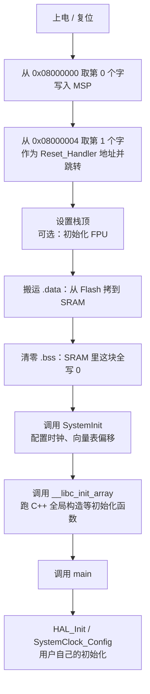

# 2.2 Cortex-M 架构与启动流程

> **前置知识**：[2.1 单片机平台选型](01-单片机平台选型.md)
>
> **掌握标准**：能说清 Cortex-M 内核的特权级别、异常模型与内存映射，并能独立分析一次上电启动到 main 的完整过程
>
> **对应岗位**：嵌入式软件工程师 · MCU 驱动/BSP 工程师 · 电机控制工程师 · 汽车电子工程师
>
> **练手建议**：打开一份厂商启动文件（startup_xxx.s），逐行读一遍，标出栈指针在哪里被设置、.data 在哪里被搬运、中断向量表的前 16 项分别是什么

很多人的单片机学习是从"照着例程改 GPIO"开始的，改到能跑就停了。这类人往上走会遇到一堵墙：HardFault 为什么会进、中断为什么嵌套不生效、Bootloader 跳转为什么要手动设向量表——全都答不上来。答案是同一个：**你没有真正理解 Cortex-M 内核。**

这一篇是第 2 章里最底层的一篇，也是最值得反复读的一篇。它不教你驱动任何外设，但它解释了所有外设为什么能工作。

## Cortex-M 家族：先搞清楚你手上是哪一颗

ARM 自己不做芯片，只卖内核授权。ST、兆易、极海、国民技术拿去内核，配上自己的 Flash、SRAM、外设，才是一颗能买到的单片机。所以 STM32F103 和 GD32F103 内核一样，但外设和 Flash 控制器完全不同——这是国产替代能快速起来的原因，也是替换时踩坑的原因。

| 内核 | 典型型号 | 关键特征 | 定位 |
|---|---|---|---|
| **Cortex-M0** | STM32F030 | 总线结构最简单、指令集最小、无硬件除法 | 极低成本场景，替代 8 位机 |
| **Cortex-M0+** | STM32G0、LPC800 | 在 M0 基础上加总线优化、单周期 IO | 低功耗、低成本，比 M0 更值得选 |
| **Cortex-M3** | STM32F103 | 指令与数据总线分开、硬件除法、位带、无 FPU | 最经典的入门内核，教程最多 |
| **Cortex-M4** | STM32F407、GD32F4 | M3 全部特性 + 单精度 FPU + DSP 指令 | 电机控制、音频、信号处理的主力 |
| **Cortex-M7** | STM32F7/H7 | 双发射 6 级流水、I-Cache/D-Cache、TCM、双精度 FPU | 高性能计算，跑图形和复杂算法 |
| **Cortex-M33** | STM32L5/U5、GD32E5 | M4 特性 + TrustZone 安全隔离 | 安全物联网、金融终端 |
| **Cortex-M55** | 部分 AI 芯片 | M 系列首个带 Helium 向量单元（MVE） | 边缘 AI、机器学习推理 |

怎么选，看三个问题就够了。

**第一，你要不要做电机控制。** 要，首选带 FPU 的 M4。FOC 里满是浮点乘加，M3 上跑浮点要靠软件模拟，同样的算法可能慢三到五倍。这个差距不是优化代码能补回来的，是硬件级的。

**第二，你有没有 Cache 需求。** M7 有 Cache 也有 TCM。Cache 让跑大程序变快，但也带来新的坑：DMA 和 CPU 看到的可能不是同一份数据（Cache 一致性）。新手用 M7 常常在这里翻车。如果不是真的需要算力，M4 比 M7 省心得多。

**第三，你的安全性要求。** 需要做安全启动、密钥隔离、防止固件被抄，M33 的 TrustZone 是目前性价比最高的方案——它在硬件上把内存和外设分成"安全/非安全"两块，非安全区就算被攻破也读不到安全区的数据。

一个务实的建议：**入门就从 M3 或 M4 开始，把 M4 当作默认选择。** M7 和 M33 是有了具体项目需求之后再去碰的东西，它们带来的额外复杂度（Cache、TCM、TrustZone 配置）在你还不会点灯的时候毫无价值。

## 特权级与操作模式

Cortex-M 有**两种模式**和**两种特权级**，它们组合成四个状态：

| | 特权 | 非特权 |
|---|---|---|
| **Thread 模式** | 复位后的默认状态，裸机程序就跑在这里 | 受限制的应用代码，M33 上可以配合 MPU 做沙箱 |
| **Handler 模式** | 中断和异常处理的唯一状态 | 不存在（Handler 只能特权） |

几个必须记住的规则：

1. **复位后是 Thread 模式 + 特权级**。所以裸机程序默认拥有一切权限。
2. **Handler 模式永远用 MSP、永远是特权**。这是硬件强制的，改不了。
3. **Thread 模式的特权级可以改**，通过 CONTROL 寄存器的 nPRIV 位。
4. **特权级不能自己升回去**。非特权代码想变回特权，只能触发一个异常（SVC 指令），由异常处理程序代它做——这就是"系统调用"的实现原理。

这套设计的价值在 RTOS 上体现得最清楚：任务是非特权的，内核是特权的。任务想开门、想改时钟、想共享资源，只能通过 SVC 请求内核。任务一旦野指针乱写，MPU 立刻拦下并触发 MemManage 异常，而不是悄悄改坏别的任务的数据。

在 M33 上这套机制再叠一层 TrustZone，就变成"安全世界/非安全世界"的四态组合。这也是为什么工业网关、车规控制器越来越倾向 M33——**它的安全能力是硬件给你的，不需要你自己写一堆检查代码。**

## 内存映射：外设为什么"长得像内存"

Cortex-M 定了 4GB 地址空间的固定划分，所有厂商都必须遵守。记住这张表，你的调试直觉会好很多：

| 地址范围 | 区域 | 装什么 |
|---|---|---|
| 0x0000_0000 ~ 0x1FFF_FFFF | 代码区 | Flash、ROM。在 STM32 上被别名到 0x0800_0000 |
| 0x2000_0000 ~ 0x3FFF_FFFF | SRAM 区 | 内部 SRAM、TCM |
| 0x4000_0000 ~ 0x5FFF_FFFF | 外设区 | 所有外设寄存器都在这里 |
| 0x6000_0000 ~ 0x9FFF_FFFF | 外部 RAM 区 | 外扩 SDRAM（M7 有 FMC 才能用） |
| 0xE000_0000 ~ 0xFFFF_FFFF | 系统区 | NVIC、SysTick、SCB、MPU、ITM，统称 PPB |

**外设寄存器"看起来像内存"，是因为它们真的被映射到了内存地址上**，这叫统一编址。GPIOA 的输出寄存器就在 0x4800_0014（H7）或 0x4001_080C（F1）这样的地址上，你对这个地址做一次普通的指针写，硬件就真的把引脚拉高了。所以 C 语言里那句 `*(volatile uint32_t *)0x40020014 = 1;` 并不是什么魔法，就是往一个特定地址写了一笔。

这也顺带解释了一个新手常见困惑：**为什么外设寄存器的指针必须加 volatile。** 因为编译器看到"你写了一个值，然后再也没读过它"，会判定这次写没有意义并优化掉。加上 volatile 就是告诉编译器"这个地址的内容可能被硬件改变，不许优化、不许缓存，每次都要真实读写"。

### 位带操作：一个被低估的老特性

M3 和 M4 有个叫**位带（Bit-Banding）** 的特性：把 SRAM 区和外设区的每一个 bit 映射到一个独立的 32 位地址上。写这个地址上的 0 或 1，就等于原子地修改原来那个 bit。

它的价值在于**原子性**。传统做法是"读寄存器 → 改某一位 → 写回"，这三步中间如果来个中断、而中断里也改了同一个寄存器，你的改动就被冲掉了。位带把三步合成一步，不需要关中断。

不过要说句实话：**今天位带用得越来越少。** M7 和 M33 已经取消了位带，厂商也普遍提供了 BSRR 之类的原子置位/复位寄存器（效果类似），加上原子操作和临界区，位带的必要性大幅下降。了解它、知道有这么个东西就够了，不必刻意去用。

## 异常与中断模型

Cortex-M 把所有能打断正常执行流程的事件统称为**异常**，中断只是异常的一种。这个统一带来一个好处：中断服务函数和异常处理程序写起来一模一样，都是普通的 C 函数。

### 异常号与向量表

异常号是固定的，前 16 个属于内核（系统异常），从 16 开始是外设中断（IRQ0 起）：

| 异常号 | 名称 | 说明 |
|---|---|---|
| 1 | Reset | 复位，优先级固定最高 |
| 2 | NMI | 不可屏蔽中断 |
| 3 | HardFault | 兜底异常，所有没被单独使能的错误都会掉到这里 |
| 4 | MemManage | 内存保护错误（需要 MPU） |
| 5 | BusFault | 总线错误，访问了不存在的地址 |
| 6 | UsageFault | 用法错误，比如除零、非对齐访问、执行了非法指令 |
| 11 | SVCall | 由 SVC 指令触发，RTOS 的系统调用入口 |
| 14 | PendSV | 可挂起的系统异常，RTOS 用它做任务切换 |
| 15 | SysTick | 内核自带的定时器中断 |
| 16+ | IRQ0, IRQ1, … | 外设中断，具体编号由厂商定义 |

向量表就是这个异常号到处理函数地址的映射数组。**第 0 项不是异常**，它放的是 MSP 的初值；第 1 项是复位处理函数，第 2 项开始才对应上表的异常号。第 16 项对应 IRQ0。

这张表里，PendSV 和 SVCall 是专门为 RTOS 留的，SysTick 也是内核为操作系统准备的。这个细节值得琢磨：**ARM 在设计内核时就预料到了人们会拿它跑操作系统。**

### 优先级：数值越小，优先级越高

这是最容易记反的一条，务必记牢：**Cortex-M 的优先级数值越小，优先级越高。** 优先级 0 最高，优先级 15 最低（STM32 上通常实现 4 位优先级，即 16 级）。

Reset、NMI、HardFault 的优先级是负数，比任何外设中断都高，而且不可配置。

STM32 上的中断优先级寄存器有 8 个 bit，但只用高 4 个 bit 生效，低 4 位写什么都读回 0。**这个细节坑过很多人**：你写 NVIC_SetPriority(IRQ, 1)，实际存进去的可能是 0x10。如果你在做裸机中断嵌套调试时发现"我设的优先级怎么和想的不一样"，先查这一点。

### 优先级分组：抢占优先级与子优先级

4 位优先级可以被拆成两段：**抢占优先级（Preempt Priority）** 和**子优先级（Sub Priority）**。这就是分组（Priority Group）。以 STM32 常见的 NVIC_PRIORITYGROUP_4 为例，4 位全部作为抢占优先级，没有子优先级。

两者的区别是本质性的：

- **抢占优先级**决定能不能打断别人。高抢占优先级的中断可以打断正在执行的低抢占优先级中断，形成嵌套。
- **子优先级**只在两个中断同时挂起时决定谁先执行。**它不能抢占**——已经在跑的那个不会被后到的、子优先级更高的中断打断。

常见的坑就出在这里：你给两个中断配了不同的优先级，却发现它们不能嵌套。多半是因为你把差值配在了子优先级上，而抢占优先级是相同的。

### 抢占、尾链、迟到

三个术语，理解了它们，你就能解释中断响应时间的绝大部分现象：

**尾链（Tail-chaining）**：一个中断处理完，如果还有一个同级别或更高级别的中断在挂起，内核不会完整地"出栈再入栈"，而是直接跳过去执行下一个。这让连续中断的切换只花约 6 个周期，而不是完整出入栈的二十多个周期。这是 Cortex-M 中断响应快的重要原因之一。

**迟到（Late-arriving）**：低优先级中断正在做入栈（压保护现场）时，一个高优先级中断来了。内核不会等低优先级的中断跑完，而是先取高优先级那个来处理。**而且这次切换几乎不额外花钱，因为入栈的动作是共用的。**

**抢占（Preemption）**：高抢占优先级中断可以打断正在执行的低抢占优先级中断。这是默认行为，也是新手最容易被"咬"的地方——你在一个中断里改了个全局变量，另一个更高优先级的中断随时可能插进来改同一个变量，数据就坏了。

这三个机制合起来的效果是：Cortex-M 的中断响应延迟可以低到十几个周期。**你不需要记住具体的周期数，但要记住结论——Cortex-M 的中断是快且可预测的，中断延迟主要取决于你关中断的时间有多长。** 所以真正的优化方向不是研究内核，而是检查自己有没有在中断里做耗时的事。

## NVIC：真正干活的中断控制器

NVIC（Nested Vectored Interrupt Controller，嵌套向量中断控制器）是内核的一部分，不在外设区，而在系统区的 0xE000_E100 附近。它管四件事：

1. **使能/关闭**某个中断（ISER / ICER 寄存器，对应 CMSIS 的 NVIC_EnableIRQ / NVIC_DisableIRQ）
2. **挂起/清除挂起**（ISPR / ICPR）。挂起的意思是"记下这个中断请求，等条件合适再执行"。这个能力在调试时很有用——你可以在调试器里手动挂起一个中断，强制它跑一次。
3. **优先级配置**（IPR 寄存器，对应 NVIC_SetPriority）
4. **活动状态查询**（IABR）。查这个能知道某个中断是不是正在执行，做驱动状态机时偶尔用得上。

**中断从触发到执行，要过两道门：外设自己的中断使能位，和 NVIC 的使能位。** 两处都开了才会进中断。如果你发现"配置明明都对，就是进不去中断"，先确认是不是只开了一处——这是新手最常见的低级错误。

## 从上电到 main：一次完整的启动

现在把上面所有东西串起来。这是本篇最核心的一段，建议对照手上的启动文件读。

### 为什么向量表的前两项是 MSP 和复位向量

这是理解整个启动流程的钥匙。

上电那一刻，CPU 里所有寄存器都是垃圾值，包括 SP。**但 CPU 总得有个栈才能干活，而栈地址又不能靠代码去设置——因为代码还没开始跑，SP 还是垃圾，你连函数都调用不了。**

所以 ARM 做了一个硬件上的约定：**复位时，内核自动从向量表第 0 项读一个 32 位值装进 MSP，从第 1 项读一个值装进 PC。** 两步都是纯硬件行为，不需要任何指令。

这样一来，SP 在所有 C 代码运行之前就已经是合法值了。这是"启动流程"所有后续步骤能成立的前提。

顺带说一个现象：**如果你把栈顶地址配错了（比如链接脚本里的栈顶超出了实际 SRAM 范围），第一个函数调用就会立刻 HardFault。** 因为压栈压到了不存在的内存上。这类问题看起来诡异，其实根源就在这一项上。

### 启动文件到底做了什么

厂商生成的 startup_xxx.s 里，Reset_Handler 通常做这几件事，顺序基本固定：

1. **设置 SP**（有些内核在复位时已经做了，启动文件里会再显式设一次，属于保险动作）
2. **搬运 .data 段**：`.data` 是"有初值的全局变量和静态变量"，它们在 SRAM 里运行，但初值存在 Flash 里。启动时必须把初值从 Flash 拷到 SRAM。**这就是为什么带初值的全局变量会同时占用 Flash 和 SRAM。**
3. **清零 .bss 段**：`.bss` 是"没有初值或初值为 0 的全局变量"。它们不占 Flash 空间（因为值就是 0，不需要存），但启动时必须把对应的 SRAM 区域全部写 0。**这就是为什么未初始化的全局变量默认是 0，而局部变量是随机值。**
4. **调用 SystemInit**：配置时钟、设置向量表偏移（VTOR）、使能 FPU。
5. **调用 __libc_init_array**：跑 C++ 的全局对象构造函数和在 main 之前注册的初始化函数。
6. **跳转 main**。

**注意 [1.1 C 语言](../01-编程与软件基础/01-C语言（嵌入式视角）.md) 讲的变量分段、[3.2 构建系统与工具链](../03-嵌入式软件工程/02-构建系统与工具链.md) 讲的链接脚本，在这里闭环了。** 如果当时没看懂段和链接脚本的概念，现在回头看会清晰很多；如果现在还是不清晰，说明那两处需要重读。

### 一个容易被过时教程误导的点

很多老教程说"SystemInit 里配时钟"。这在早期标准库时代是对的，但 **STM32CubeMX 生成的工程把时钟配置挪到了 main 里**，由 HAL_Init 之后的 SystemClock_Config 负责，而 SystemInit 只剩下设置 VTOR 和使能 FPU 这类内核级动作。

所以如果你拿 CubeMX 生成的工程对照老教程，会发现对不上。**不是教程错了，是版本演进的结果。** 判断依据永远是：打开你手上这份工程，看 SystemInit 的实际实现。

### 中断向量表偏移（VTOR）

向量表默认在 0x0000_0000（在 STM32 上被映射到 Flash 起始地址 0x0800_0000）。但是做 Bootloader 时，应用程序不在 Flash 起始地址，它的向量表在别处。

这时候就必须在跳转前设置 SCB->VTOR 为应用程序的向量表地址，否则中断会跳到 Bootloader 的向量表去，程序莫名其妙地跑飞。**这是 Bootloader 调试中最经典的坑，没有之一。** 记住这一点，将来做 OTA（3.7 篇）时会省下你一整天。

## 系统时钟树：为什么外设时钟要单独开

几乎所有单片机都有类似的时钟树结构：

**时钟源** → **PLL 倍频** → **SYSCLK** → **AHB 分频得到 HCLK**（内核、DMA、SRAM 用） → **APB 分频得到 PCLK1 / PCLK2**（外设用）。

两个时钟源要分清楚：

- **HSI**：内部 RC 振荡器，通常是 8MHz 或 16MHz。上电就能用，不需要外部器件，但精度差（温度漂移可能到百分之几）。**它存在的意义是"保底"**——外部晶振坏了系统还能跑，可以做故障降级。
- **HSE**：外部晶振，常见 8MHz，精度高（几十 ppm）。**要跑串口、CAN、USB 这类对时基敏感的外设，必须用 HSE。** 用 HSI 跑串口，通信对端大概率会收到乱码。

**外设时钟必须单独使能**，这是新手最常撞的墙：代码逻辑完全正确，寄存器就是没反应。原因十有八九是忘了开 RCC 里对应外设的时钟。这个设计是刻意的——**复位后所有外设时钟默认关闭，为了省电。** 一个只用了两个串口的项目，没必要让 ADC、SPI、SDIO 都耗着电。

有一个反直觉的规则值得单独记：**当 APB 的分频系数不为 1 时，定时器的时钟会是 PCLK 的两倍。** 因为定时器需要更高的分辨率。这个规则不记住，算出来的定时周期会差一倍，而你完全不知道错在哪。

## SysTick：内核自带的定时器

SysTick 是一个 24 位的递减计数器，属于内核而不是外设。它有几个别的定时器没有的优点：

1. **所有 Cortex-M 都有**，寄存器地址固定，代码可以跨厂商复用。
2. **不占用外设资源**，不需要开 RCC 时钟。
3. **异常号固定是 15**，不用查数据手册。

它的主要用途有三个：HAL 库用它产生 1ms 时基（HAL_GetTick 和所有 HAL 超时机制都靠它）、RTOS 用它作为系统节拍（tick）、给裸机程序提供一个稳定的周期性任务触发源。

**为什么说它和 RTOS 关系密切？** 因为 RTOS 的整个调度逻辑都建立在"节拍"上：每个 tick 中断里，内核检查有没有任务需要唤醒、有没有任务的时间片用完、有没有延时到期。SysTick 中断的优先级通常被设成最低（也就是 4 位优先级里的 15，对应 IPR 寄存器里的 0xFF），这样它不会打断其他中断——但这也意味着，**如果你的高优先级中断执行时间超过了节拍周期，系统节拍就会被拖慢。**

比如你设了 1ms 节拍，却有个中断每次都跑 3ms，那 RTOS 的"时间"就比真实时间慢了三倍，所有延时和超时都会失准。这个坑在电机控制里特别常见——电流环中断跑得太久，是整个系统时序崩坏的源头。

## 常见困惑与坑

**为什么中断里不能调用 printf？**

三个层面的原因，任何一个都足以致命：

1. **printf 不可重入**。它内部有静态缓冲区。如果主程序正在 printf、中断进来又 printf 一次，两块数据会互相覆盖，输出乱码算轻的，缓冲区管理结构被写坏就直接崩。
2. **栈消耗巨大**。printf 的调用链很深，一次可能吃掉几百字节到 1KB 的栈，而中断用的栈通常就是主栈，很容易溢出。
3. **可能死锁**。如果 printf 最终调用了 HAL_UART_Transmit，它内部是轮询等待发送完成、而且带超时，超时靠 HAL_GetTick 计算，而 HAL_GetTick 依赖 SysTick 中断。**如果你的中断优先级比 SysTick 高，SysTick 永远进不来，tick 永远不变，等待就变成了死循环。** 现象是卡死在中断里，被看门狗复位。

那怎么在中断里输出调试信息？**把数据写进环形缓冲区，让主循环去发**——这是工程上正确的做法；应急时也可以直接往 USART->DR 里写，绕开整个 printf 机制。

**为什么改了时钟之后串口波特率就不对了？**

因为波特率的计算依赖外设时钟：`波特率 = fPCLK / (过采样倍数 × USARTDIV)`。你把 PLL 倍频改了、或者改了 APB 分频，fPCLK 变了，但 USARTDIV 是初始化时算好写进寄存器的，它不会自动跟着变。结果就是波特率整体偏移，对端收到乱码。

**改时钟树之后，所有基于时钟的外设初始化参数都要重算。** 这也是为什么推荐用 CubeMX 配时钟——它会把外设参数一起联动更新，手改寄存器很容易漏。

**为什么优先级配置不起作用？** 按出现频率排，依次查这三条：

1. **优先级分组没设或设错了**。默认分组下你的"抢占优先级"可能实际是子优先级。HAL 里这一步通常在 MX_NVIC_Init 或 HAL_Init 里做一次，全局生效，容易被忽略。
2. **以为子优先级可以抢占**。同一抢占优先级下的两个中断，无论子优先级怎么配，都不会嵌套。
3. **数值方向记反了**。数值越小优先级越高，写成"大的先执行"是最常见的低级错误。

最后补一句：`__disable_irq()` 关的是所有可屏蔽中断，**NMI 和 HardFault 关不掉**。而且关中断会直接拉高系统的最坏中断延迟，是最后手段而不是首选——能避开临界区就避开，能用原子操作就用原子操作，实在不行才用最短的临界区包住真正共享的那几行代码。

## 学习建议

1. **不要先读这一篇。** 按本章 README 的建议，先把 2.3 通用外设和 2.4 中断系统跑一遍，手上有点感觉了再回来读。上来就啃内核，收获会大打折扣。
2. **一定要打开启动文件读一遍。** 这是本篇唯一不可省略的动手环节。用调试器单步跟一遍启动过程，看着 MSP 从垃圾值变成合法栈顶、看着 .data 被逐字节搬运，比读十遍文档都管用。
3. **优先掌握这四件事**：向量表前两项的含义、特权级与操作模式的四种状态、优先级数值方向与分组的区别、VTOR 的作用。这四点覆盖了日后 90% 的底层调试场景，其余细节可以现查。
4. **位带、Cache、TrustZone 可以先跳过。** 现阶段用不到，等真遇上再回来补。
5. **遇到 HardFault 别慌，这是最好的学习机会。** 把发生时的 LR、PC 和栈内容读出来，反查是哪条指令、哪个地址出的问题。能独立解决三次 HardFault，你对内核的理解会超过大多数人。
6. **每学完一个外设，回头问自己一句"它的时钟从哪来、它的中断走哪条路"。** 这个习惯能把零散的外设知识拧成一张体系图。

## 小节总结

Cortex-M 的设计哲学是**用统一和简洁换可靠性**：统一的地址空间让外设寄存器像内存一样访问，统一的异常模型让中断和系统调用写起来一样，统一的向量表让启动流程可以被硬件直接读懂。这一篇讲的每个机制，背后都是"让嵌入式开发少一点黑魔法"这个目标。

**启动流程是本篇最容易被跳过的一段。** 它看起来只是启动文件里那几十行固定代码，但它决定了栈指针由谁设置、.data 从哪里搬来、VTOR 什么时候才能改——而这些正是 Bootloader 和 HardFault 排查的全部基础。而**启动流程的排查和一次 HardFault 的排查，本质上是同一种能力**——都是在没有源码、只有硬件行为的层次上推理。把"上电到 main"这条链条走通一次，你就具备了这个层次的思维，而这正是从"会改例程"到"能定位问题"的分界线。

最后一句话值得记下来：**这一篇不教你写任何一行新代码，但它决定了你能读懂多少别人写的代码。** 短期看它"没用"，长期看它是所有其他知识的地基。第 2.3 篇开始你会大量用到这里的模型——每一个外设的寄存器读写、每一次中断的进出，都是这一篇讲的东西在具体场景里的展开。

---

本章目录：[2. MCU 与体系结构](README.md) ｜ 总目录：[返回首页](../../README.md)
上一篇：[2.1 单片机平台选型](01-单片机平台选型.md) ｜ 下一篇：[2.3 通用外设](03-通用外设.md)
