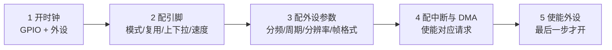

# 2.3 通用外设

> **前置知识**：无（会 C、手上有一块能下载程序的板子即可。本篇不涉及 2.2 讲的那些内核机制，2.2 放到读完本篇之后再读更顺。）
>
> **掌握标准**：能独立配置 GPIO、定时器、ADC、DMA、串口等常用外设，并能根据需求判断该用哪个外设、该怎么配置
>
> **对应岗位**：嵌入式软件工程师 · MCU 驱动/BSP 工程师 · 电机控制工程师 · 汽车电子工程师
>
> **练手建议**：用同一个定时器分别实现三个功能——精确定时中断、PWM 输出、输入捕获测频率，体会"一个外设的多种用法"

外设看起来五花八门，其实只有两类任务：一类负责和外部世界交换信号（GPIO、ADC、DAC、定时器、串口、SPI、I2C），一类负责在芯片内部搬运和组织数据（DMA、CRC、加速器）。

配置外设这件事，新人容易陷入两种极端：一种是照抄别人的初始化代码，改个引脚号就烧进去，跑不起来就到处问；另一种是把数据手册几百页外设章节从头读到尾，读到一半放弃。两种都不对。正确的做法是——**记住一套通用的配置骨架，再针对每个外设补三个关键信息：它解决什么问题、什么时候该用它、配置时哪里最容易错。**

## 配置外设的通用套路

不管哪个外设，配置流程基本都是这五步，顺序基本固定：

顺序错了会怎样，这几种情况新人几乎都会遇到：

**第一步忘记开时钟，后面所有寄存器写入全部无效。** 这是"代码看起来完全正确但没反应"的头号原因。写寄存器不会报错，读回来还是 0——因为时钟没开，寄存器根本不应答。用标准库或寄存器开发时这一步要自己写；用 HAL 库时，CubeMX 生成的代码里有一句 `__HAL_RCC_GPIOA_CLK_ENABLE()`，很多人不知道它是干什么的，看着多余就给删了。

**第二步引脚复用配错，外设完全没输出。** 引脚默认是普通 GPIO，外设要用它必须先把引脚切到"复用"模式，再指定具体是哪一个外设（AF 编号）。少配任何一条，引脚就还是 GPIO，外设信号出不来。

**第五步提前使能，外设会先用默认参数跑一段。** 正确的做法是参数全部配完再使能。如果先使能再改参数，中间那段时间外设是按默认值工作的——对 PWM 来说，可能先输出一段错误频率的波形，如果这段波形驱动着功率管，是有实际风险的。

HAL 库把这五步封装成了 `HAL_xxx_Init()` 和一整套 `__HAL_RCC_xxx_CLK_ENABLE()`，CubeMX 生成的代码顺序是固定正确的。但你要能看懂它在做什么，而不是只会点鼠标——因为一旦 CubeMX 没覆盖到你的需求（比如你想动态改 PWM 频率、想在运行时切换引脚功能），你就得自己去改。

## GPIO：看起来最简单，实际上坑最多

GPIO（通用输入输出）是唯一一个"不看数据手册也能上手、但看了数据手册才发现自己一直用错"的外设。它有四种模式，新人最常犯的错误是把它们混着用。

**输入模式**分浮空、上拉、下拉三种。浮空输入的引脚是高阻态，电平完全由外部决定；如果外部没有明确的驱动源（比如一个按键只接了引脚和地，没有接上拉），引脚电平会在 0 和 1 之间随机跳——读到的值乱七八糟，这就是"浮空输入乱跳"。

**输出模式**分推挽和开漏。

推挽输出能主动输出高电平（上管导通，接到电源）和低电平（下管导通，接到地），驱动能力强，是最常用的输出模式。开漏输出只能主动拉低——输出高电平时内部管子断开，引脚处于高阻，高电平必须靠外部上拉电阻拉上去。

那什么时候必须用开漏？三种情况，都绕不开：

一是 **I2C 总线**。I2C 是多设备共享的两根线，任何一个设备都可能拉低，但只要有一个拉低，总线就得是低的。这种"线与"逻辑用推挽做不到——两个设备一个想输出高、一个想输出低，直接短路，电流烧管子。开漏天然支持：谁都不拉就是高，任何一个拉低就是低。

二是 **电平转换**。3.3V 的单片机要控制一个 5V 的器件，用推挽输出 3.3V 高电平对方可能识别不了。开漏加上拉到 5V，就能输出 5V 的高电平，同时单片机引脚上不会出现高于电源的电压。

三是**多个输出并联做线与逻辑**，或者共享一根中断线。

**上拉下拉电阻**的作用是在没有外部驱动时给引脚一个确定的默认电平。选上拉还是下拉，看"默认状态希望是什么"。按键一端接引脚、一端接地，那引脚默认应该是高电平，所以配上拉；如果按键一端接引脚、一端接电源，那配下拉。

STM32 内部上拉电阻大约 30~50 千欧，很弱。这一点要记住：**做 I2C 时内部上拉通常不够**，因为 I2C 是开漏加上拉、上拉电阻和总线电容构成 RC 充电回路，电阻太大边沿会变缓，高速通信直接失败。I2C 一般还是要外接 2.2k~10k 的上拉电阻，具体值看总线速率和总线电容。这是"内部有上拉就不用外接"这个想法的直接反例。

**输出速度**为什么可以配置？因为它控制的是引脚电平翻转时边沿的陡峭程度（转换速率）。边沿越陡，高次谐波越丰富，电磁干扰（EMI）越大，功耗也越高；边沿越缓，干扰小，但可能跟不上高速信号。

所以默认应该用低速，只有需要的时候才调高。SPI 时钟、高速 PWM 输出这类信号要用高速（否则边沿跟不上，波形变成三角波）；普通 LED、继电器控制用低速就够。新人的两个反向错误：全部设成高速，结果 EMI 超标、旁边 ADC 采样值乱跳；或者把 SPI 时钟设成低速，波形畸变导致通信不稳定。

还有一个隐藏的坑：**调试引脚被当普通 GPIO 用了**。SWD 调试用的 SWDIO/SWCLK 引脚（常见是 PA13/PA14）复位后默认是复用状态，如果你在初始化里把它们配成了普通输出，程序一烧进去下次就连不上调试器了。解决办法是上电时按住复位、用调试器的"连接时复位"选项，或者用 BOOT 引脚进入系统存储器启动模式擦除。踩过一次之后你就会记住这条。

**复用功能（AF）的配置步骤**是：使能 GPIO 端口时钟 → 把引脚模式设为复用 → 写入 AF 编号选择具体功能 → 配输出类型、速度、上下拉 → 使能外设自己的时钟。四处都要对。

最容易错的是 AF 编号。同一个外设的同一个功能，在不同封装的引脚上 AF 编号可能不同，必须查数据手册的"复用功能映射表"。另一个常见问题是**忘了使能外设时钟**——引脚配好了，但外设本身没开，等于信号线接了一个没通电的芯片。反过来，有时候一个引脚被两个外设同时申请（比如某个引脚既在定时器通道表里又在 SPI 表里），配置时要在数据手册里确认自己选的是哪一个，别让两个外设互相打架。

## 定时器：单片机里最被低估的外设

定时器的本质就是"数数"——每来一个时钟脉冲，计数器加一，数到设定的值就产生一个事件。就这么简单的结构，却能变出七八种用法。**如果你只学会了"用定时器做延时"，等于浪费了这个外设一大半的价值。**

它的基本结构是一条链：时钟源 → 预分频器（PSC）→ 计数器（CNT）→ 自动重装载寄存器（ARR）→ 各个比较/捕获通道。

预分频器 PSC 决定"每来几个时钟脉冲让计数器加一"，自动重装载寄存器 ARR 决定"数到多少算一轮"。于是定时频率的算法是：

**定时频率 = 定时器时钟 ÷ ((PSC + 1) × (ARR + 1))**

举个具体的：定时器时钟 72MHz，PSC 写 71，就是 72 分频，计数器每 1 微秒加一；ARR 写 999，就是每 1000 个数溢出一次，于是得到 1ms 一次的定时中断。

**这里必须记住加一。** 寄存器里写 0 表示 1 分频，写 71 表示 72 分频。想要 1000 分频，寄存器要写 999。这个 off-by-one 是定时器最经典的错误，表现是"定时时间总是差那么一点点"，短定时看不出来，长定时（比如 1 秒）会明显偏快。

定时器的几种用法，按实用程度排：

**定时中断**是最基础的，做周期性任务：每 1ms 采样一次传感器、每 10ms 跑一次状态机、每 100ms 刷新一次显示。这里的中断指的是"事件发生时打断主程序、跳到一小段专用代码（中断服务函数）里处理，处理完再回到原处继续"。本篇后面还会多次用到它，机制细节（优先级、嵌套、什么能写什么不能写）详见 [2.4 中断系统与低功耗](04-中断系统与低功耗.md)。

**PWM 输出**是电机和电源方向的必备技能。用 ARR 定周期，用捕获比较寄存器 CCR 定占空比：**占空比 = CCR ÷ (ARR + 1)**。想改变占空比就改 CCR（电机调速、LED 调光都走这条路），想改变频率就改 ARR。

PWM 有几个参数要按场景选，不能凭感觉。频率方面：驱动直流电机通常取 10~20kHz，这是"人耳听不见"和"开关损耗"之间的折中——要到 20kHz 以上才彻底超出人耳听觉范围，而频率越高开关损耗越大，所以实际取值常常压在 20kHz 上下；LED 调光 1kHz 以上眼睛就看不到闪烁；舵机是固定的 50Hz，周期 20ms，靠 0.5~2.5ms 的脉宽定角度。占空比方面：电机驱动不能给到 100%，自举电容需要下桥导通才能充电，通常留 5% 余量。

**死区**是功率电路里不可省略的一项。H 桥的上下两个开关管如果同时导通，电源直接短路到地，管子瞬间烧毁。死区时间就是在上下管切换之间插入的一小段"两个都关"的空白时间，典型值几百纳秒到几微秒。**只有高级定时器有死区发生器**，通用定时器做不出硬件死区——这是选型时必须先确认的事。

**互补输出**通常和死区一起用：一对通道 CH1 和 CH1N，硬件自动生成互补且带死区的两路波形，专为半桥、全桥、三相桥设计。三相电机驱动要三对互补通道，正好对应一个高级定时器的三个通道。

**输入捕获**是很多人忽略但极其实用的功能：在边沿到来时把计数器的值存下来，两次捕获的差值就是信号周期，直接算出频率。更进一步，PWM 输入模式可以用一个通道同时测出频率和占空比——测一个外部传感器输出的方波、测风机转速反馈、测红外遥控的脉宽，都是这个路子。

**编码器接口模式**是电机和云台方向的必备：把正交编码器的 A、B 两相直接接到定时器引脚上，硬件自动根据相位关系做加减计数，转速和方向直接从 CNT 读出来，**不需要写一行中断代码**。相比用外部中断一个个数脉冲，这种方式既不占 CPU 又不会丢脉冲，是正确做法。

此外还有**单脉冲模式**（收到一个触发就输出一个宽度精确的脉冲，用于超声测距、激光测距的驱动）和**定时器触发 DMA**（定时器事件直接触发 ADC 或其他外设，实现硬件级的等间隔采样）。

最后要分清定时器的档次，这直接影响你选芯片和选引脚：

**基本定时器**（如 TIM6/TIM7）只能定时，没有输出通道。但别小看它——它经常被专门用来触发 DAC 和 ADC，因为功能少、结构简单、不容易干扰别人。

**通用定时器**（如 TIM2~TIM5）有完整的输入捕获、PWM 输出、编码器接口，日常用途最广。

**高级定时器**（如 TIM1/TIM8）在通用定时器基础上多了三样东西：互补输出、死区发生器，以及**刹车输入**（BKIN）。刹车输入是安全相关功能——过流比较器一报警，硬件在一个时钟周期内把六路 PWM 全部封掉，不经过任何软件。做电机和电源必须用高级定时器，这不是"性能更好"的问题，而是软件保护根本来不及。

## ADC：模拟世界和数字世界的唯一入口

ADC（模数转换器）把电压变成数字。看几个参数就能判断一个 ADC 够不够用。

**分辨率**是能区分的最小电压台阶。12 位是 4096 级，参考电压 3.3V 时 1 个最小刻度约 0.8mV。听起来够用，但要注意：这是理想值，实际有效位数（ENOB）通常比标称分辨率低 1~2 位，因为噪声吃掉了低位。

**参考电压**是所有精度的天花板。可以用芯片的模拟电源，也可以用单独的外部基准引脚。参考电压的噪声会原封不动地进入转换结果——如果模拟电源上有几十毫伏的开关纹波，那 ADC 的后几位就全是噪声。这就是为什么很多设计会单独给模拟部分加 LC 滤波、甚至外接一个基准芯片。

**采样时间**是最容易被忽略、也最容易导致"读数不准"的参数。ADC 内部有一个采样保持电容，转换前需要先通过输入引脚给这个电容充电，充到和输入电压一样。这个充电过程需要时间。采样时间给太短，电容还没充满就进入转换，读到的值会偏低——而且这个偏差和输入电压有关，表现是"读数线性度不好""大电压时偏得更多"。

信号源的输出阻抗越大，充电越慢，需要的采样时间越长。所以一个非常常见的坑是：**用两个大电阻分压来测高电压**（比如 100k 加 100k 分压测 24V），结果 ADC 读数总是偏低。原因就是这么大阻抗给采样电容充电太慢。解决办法有三个，按推荐顺序：降低分压电阻（比如改成 10k 加 10k，牺牲一点功耗）、加长采样时间、加一级运放做缓冲。分压电阻不能无限降，因为会持续耗电，电池设备要权衡。

转换总时间 = 采样时间 + 逐次逼近的转换时间（12 位大约需要十几个 ADC 时钟周期）。算采样率的时候两个都要算进去。

**单次、连续、扫描**三种模式：单次是软件启动转一次就停，连续是转完立刻自动开始下一次，扫描是按顺序轮询多个通道。三个可以组合，比如"连续 + 扫描"就是不停地轮流采多个通道。

**外部触发**是这里最该掌握的一点。ADC 可以由定时器的触发输出或者外部引脚来启动转换。为什么重要？因为**要做等间隔采样，必须用定时器触发**。

如果你写个循环轮流采 ADC，每轮的间隔包含了中断响应、判断分支、其他任务的干扰，抖动可能有几微秒甚至更多。做一个 1kHz 的电流环、或者对采样做 FFT，这个抖动直接毁掉结果——频谱上会出现莫名其妙的杂散。用定时器触发，采样时刻由硬件保证，间隔精确到时钟周期。**判断标准很简单：只要你的采样结果要做频域分析或者反馈控制，就必须用定时器触发；只有测个温度、读个电位器这种慢速场景，才可以用软件循环。**

**规则通道和注入通道的区别**，是电机控制方向必须搞清楚的一件事。

规则组是常规转换序列，通常多个通道排队轮流转换，配合 DMA 自动搬运，适合慢速、批量、不着急的数据（母线电压、温度、多个传感器）。

注入组是高优先级通道，最多四个，**可以打断正在进行的规则组转换**——规则组转换到一半，注入触发来了，硬件先插入完成注入转换，再回到规则组继续。而且注入组转换完成可以触发中断，结果立刻就能读到。

电机控制里为什么用注入组？因为电流采样对时机要求极其严格：必须在 PWM 周期的特定时刻（通常是下桥导通的中点）采样，才能采到真实的相电流；采完还要立刻拿去做坐标变换、跑电流环。这个时机不能等、不能被别的转换排队耽误。所以典型配置是：注入组专门采电流，由定时器的触发信号精确同步；规则组留给温度、母线电压这些慢量，走 DMA 慢慢搬。**这是"外设怎么配"背后真正由需求决定的一个例子——不理解需求，你只会照抄配置而不知道为什么。**

最后说精度问题，这几条几乎是所有 ADC 精度问题的根源：

**参考电压和电源噪声**是第一大来源，前面说过。**输入阻抗和采样时间是第二大来源**，前面也说过。**采样保持电容的通道间串扰**是第三：切换通道后的第一次转换往往不准，因为电容里还残留着上一个通道的电压，正确做法是丢弃第一次转换结果，或者给通道切换留出足够时间。另外**模拟部分的地和数字部分的地要分开走**，数字信号翻转的电流不要流经模拟地，否则开关噪声全进 ADC。

**过采样**是一个白捡的有效位数。把 4 的 n 次方次采样求平均，理论上有效分辨率可以提升 n 位——12 位想做到 16 位，需要 256 次采样求平均。STM32 的 ADC 里有硬件过采样单元，配好之后自动完成累加和移位，不需要 CPU 参与，代价只是速度变慢。

但要清楚过采样提高的是**分辨率**，不是**精度**。如果输入信号本身有系统性偏差（比如参考电压不准、分压电阻误差），平均一万次也纠正不了，只是让结果更平滑、噪声更小。分辨率是"能分辨多小的变化"，精度是"离真值有多远"，这是两个概念。

## DAC：什么时候真的需要它

DAC（数模转换器）比 ADC 简单得多，用途也窄得多，所以判断"要不要用"比"怎么配"更重要。

**波形生成**是主要用途：配合 DMA 和定时器触发，把一个正弦表或任意波形表循环输出，就能产生任意频率的模拟波形。做函数信号发生器、做扫频激励、做音频输出都是这个路子。定时器决定了输出速率，DAC 每次收到触发就取下一个数据点。

**模拟基准输出**是另一个用途：给比较器提供阈值、给传感器提供激励电压、给运放电路提供偏置。这种情况下 DAC 输出的是一个稳定不变的电压。

**模拟量输出控制**：工业上常见的 0~10V 或 4~20mA 输出模块，本质就是 DAC 加一级放大和电压电流转换。

什么时候**不**需要 DAC？如果你只是要一个固定电压做参考，**PWM 加 RC 滤波**可能就够了——一个引脚加两个元件，成本几乎为零。判断标准是速度和精度：信号变化快（波形生成）、或者对纹波和精度要求高（精密基准），才需要真正的 DAC。STM32 的 DAC 是 12 位，需要更高精度就要外接 DAC 芯片。

## DMA：解放 CPU 的关键，也是新人最容易忽略的一环

DMA（直接存储器访问）是一个能自己搬数据的硬件单元。**它存在的唯一理由，是某些数据流靠 CPU 一个字节一个字节搬根本来不及。**

算一笔账就明白了：串口在 115200 波特率下大约每 87 微秒来一个字节，每个字节中断一次，CPU 还算撑得住。但如果换成 3Mbps 的 SPI 或者 1Msps 的 ADC，就是每微秒甚至每几百纳秒一次数据——CPU 光进中断就出不来了，主程序等于没在跑。这时候把搬运工作交给 DMA，DMA 搬完一批再通知 CPU 一次，CPU 占用率能从 100% 降到几个百分点。

**通道与仲裁**：每个外设的 DMA 请求连到固定编号的通道上（不同芯片的对应关系不同，必须查数据手册），多个请求同时来的时候按优先级和通道编号仲裁。

**传输方向**有三种：外设到内存（ADC 采样、串口接收）、内存到外设（串口发送、SPI 刷屏）、内存到内存。

**单次模式和循环模式**的区别很关键。单次模式搬完设定长度就停；循环模式搬完自动回到开头继续搬，适合持续数据流（ADC 连续采样、音频播放），**不需要每次都重新启动 DMA**——这是很多人第一次做连续采集时容易忽略的：用单次模式就会发现数据只搬了一批就停了。

**半传输中断和传输完成中断**是双缓冲处理的经典机制。让 DMA 循环搬运一个长度 2N 的缓冲区，搬到 N 的时候触发半传输中断，你处理缓冲区的前半段；搬到末尾触发完成中断，你处理后一半。这样 CPU 处理其中一半的时候，DMA 正在填另一半，两边互不干扰。**只要 CPU 的处理速度跟得上数据到来的速度，就永远不会丢数据。** 这个模式做音频、做高速数据采集都用得上，值得专门练一次。

**增量模式**指的是地址要不要自增：外设端地址通常固定（永远是那个数据寄存器），内存端地址必须自增（否则所有数据都覆盖到同一个位置）。

几个最典型的应用场景：

**ADC 连续采样加 DMA** 是最经典的组合，让 ADC 自由连续转换，DMA 默默把结果填进数组，CPU 隔一段时间来看一眼就行。

**串口接收配合 DMA 和空闲中断**是接收不定长数据的标准做法。串口配 DMA 接收，同时开"空闲中断"（总线空闲一段时间就触发）——一帧数据收完，空闲中断来一次，在中断里算出这一帧有多长，交给任务去解析。相比每来一个字节中断一次，这种方式 CPU 开销小得多，是实际项目里最常用的方案。

**SPI 刷屏**：一块 240×320 的彩色屏，一帧图像约 150KB，靠 CPU 一个字节一个字节写进去要几百毫秒，屏幕刷新肉眼可见地卡。用 DMA 之后 CPU 只需要发一句"搬这 150KB"就可以去干别的。

**音频输出**：I2S 播放音频这类固定速率、连续不断的场景，不用 DMA 基本做不了。

**DMA 和 Cache 的一致性问题**，是在带 D-Cache 的内核（比如 Cortex-M7）上必然踩到的坑，值得单独强调。

M7 内核有一级数据缓存（D-Cache）。CPU 读内存时，数据会被缓存到 Cache 里，下次再读同一个地址就直接从 Cache 拿。问题是：**DMA 是绕过 CPU 直接改内存的，它改了内存，但 Cache 里的旧数据还在**。于是 CPU 读到的还是过期的副本。

现象是什么？"ADC 采集的数据偶尔跳变""串口收到的数据偶尔是上一帧的内容""偶尔丢一个采样点"——而且**难以复现，重启一下又好了**，调试的时候极其折磨人。因为缓存刷新的时机和 DMA 的时序是竞争关系，有时候差一点点就出问题。

解决办法两个。一是在每次 DMA 传输完成后手动做 Cache 失效（接收方向）或回写（发送方向），让 CPU 和内存重新同步。二是用 MPU 把 DMA 缓冲区所在的内存区域配置成"非缓存"或"写穿"属性，从根本上不让它进 Cache。第二种更省心但会牺牲那部分内存的访问速度，第一种性能更好但要小心别漏掉某个路径。

还有一个相关的坑：**DMA 缓冲区放错内存区域**。M7 有些芯片的 SRAM 分成多个域，不是所有域都能被所有 DMA 访问，缓冲区必须放在 DMA 够得着的区域里，否则 DMA 传输出错或者根本没反应。

最后是两个琐碎但常见的：DMA 的传输长度寄存器是 16 位，一次最多搬 65535 个数据，超过就要分块或者用别的模式；传输完成中断标志忘了清，会反复进中断。

## 看门狗：程序跑飞之后的最后一道防线

看门狗是一个独立的倒计时器，程序必须定期"喂狗"（重置计数），一旦超时没喂，就复位整个系统。它的价值在于**给一个已经跑飞、无法自救的程序最后一次恢复的机会**——尤其是在无人值守的设备上（工业控制器、汽车电子、远程终端），现场没有人能去按复位键。

**独立看门狗（IWDG）** 由芯片内部一个独立的低速时钟驱动，和主时钟系统没有关系。这意味着**即使主时钟挂了（晶振损坏、PLL 失锁、时钟切换失败），看门狗照样在跑**。可靠性最高，是应该默认启用的那个。

**窗口看门狗（WWDG）** 由总线时钟驱动，特点是喂狗时间有一个"窗口"——不能喂得太晚（超时复位，和普通看门狗一样），也不能喂得太早（窗口打开之前喂狗也算违规，直接复位）。

为什么需要"不能喂太早"这个规则？因为独立看门狗有一个盲区：**它只能发现"程序不跑了"，发现不了"程序跑飞了但还在喂狗"。**

设想一个野指针把栈踩坏了，程序跳到一个乱七八糟的位置，恰好执行了几句喂狗指令然后陷入死循环——独立看门狗每次都被按时喂上，永远不会复位，设备就这么僵在那里，用户看到的就是"设备没反应，但也不重启"。窗口看门狗能抓住这种情况：正常的喂狗是有固定节奏的（比如主循环 10ms 一圈），如果喂狗间隔突然变得极短，说明程序已经不在正常路径上了。

代价是窗口看门狗需要主循环的执行时间比较确定，如果主循环里有个耗时不确定的分支（等一个慢速外设、大批量数据处理），喂狗时机就容易掉出窗口导致误复位。所以在时序不规律的系统里，独立看门狗更稳妥。

**喂狗应该放在哪里？这是这一节最重要的一句话：放在主循环末尾，绝不能放在定时器中断里。**

为什么？看门狗要保护的是"主程序还在正常跑"。如果喂狗放在定时器中断里，那么即使主循环彻底死掉（卡在某个 while 里出不来），定时器中断仍然会照常触发、照常喂狗——狗永远不会咬人，看门狗等于不存在。

更糟的是，这种做法**看起来能工作**：设备正常运行时一切正常，你也测试通过了，只有真正出问题的时候才发现保护完全没有生效。这是新人最典型的错误，而且靠测试发现不了，只有靠理解。

在 RTOS 里有个例外做法：单独开一个最低优先级的任务去喂狗，同时要求每个关键任务定期上报"心跳"标志，喂狗任务检查所有心跳都更新过才喂。这样任意一个任务卡死都会导致看门狗复位。这个做法要成立，前提是任务优先级与阻塞行为都设计对，相关内容见 [4.2 FreeRTOS](../04-实时操作系统/02-FreeRTOS.md)。

另外，**调试时看门狗会捣乱**：你在断点处停下来思考，看门狗超时把芯片复位了，调试器断开连接。所以调试时要么先在初始化里关掉看门狗，要么把调试寄存器配置成"调试暂停时冻结看门狗"（DBGMCU 相关配置）。新手经常在这里浪费半小时，以为是自己程序的问题。

## RTC：掉电也要走时

RTC（实时时钟）是一个独立计数的年月日时分秒计数器。它通常外接一个 32.768kHz 的晶振——这个数字不是随便选的，32768 正好是 2 的 15 次方，做 15 级二分频就得到精确的 1Hz。

RTC 属于**备份域**，配合 VBAT 引脚上的纽扣电池，主电源断掉之后仍能继续走时，主电源回来时读到的还是正确的绝对时间。备份域里还有若干个备份寄存器，可以存少量掉电不丢的数据（比如设备序列号、累计运行时间、上一次的故障码）。

用途主要有三个：**数据记录的时间戳**（每一条日志都要带绝对时间，否则数据没法分析）、**定时唤醒**（闹钟中断可以把芯片从低功耗模式唤醒，做那种"每 10 分钟醒一次采个数据"的电池设备）、**在超低功耗场景下替代普通定时器**（RTC 功耗极低）。

坑主要是硬件层面的：32.768kHz 晶振起振慢而且脆弱，有的场景上电后要好几秒才稳定，读时间之前要先判断起振标志。晶振的负载电容选错会导致走时不准甚至不起振，这个参数要按晶振数据手册来，不能随便套用。另外备份域的配置一旦被写乱（尤其是开启读保护之后），有些芯片需要整片擦除才能恢复，操作备份寄存器前要谨慎。最后要清楚，普通 32.768kHz 晶振的精度有限，一个月差几分钟很正常，做精准的时钟（电表、计费设备）通常要外接带温度补偿的 RTC 芯片。

## CRC 与硬件加速单元：用了就是白捡的性能

这几类外设的共同特点是：**你没听说过它们，但你的项目一旦碰到它们的适用场景，用和不用差好几倍。**

**硬件 CRC 单元**能在很短的周期内算出一帧数据的 CRC32，比软件查表快十倍以上。典型用途有两个：bootloader 升级时校验固件完整性（几万字节的固件，软件算要几百毫秒，硬件算只要几毫秒）、通信协议里的帧校验。

**CORDIC**（坐标旋转数字计算机）是一个硬件三角函数加速器，能算正弦、余弦、反正切、平方根、幅值。**电机控制方向要特别注意这个**：FOC 的坐标变换每次都要算三角函数，求角度和幅值还要开方，如果全靠软件查表或者用无 FPU 的芯片慢慢算，电流环的周期就被算力卡死了。STM32 的 G4、H7 系列内置 CORDIC，用上之后能省出大量余量。

**FMAC**（滤波数学加速器）是硬件数字滤波器，能跑 FIR 和 IIR 滤波。电机里的电流采样滤波、传感器信号滤波、音频处理都用得上，同样是把自己算变成硬件算。

判断方法很简单：**如果你发现代码里有"周期性、大量地算三角函数/开方/滤波"，先去查一下你选的芯片有没有对应的加速器。** 有的话用起来，没有的话考虑换芯片——这往往是选型阶段就能省下来的性能。

## 外设怎么读：轮询、中断还是 DMA

前面每个外设都提到了这三者的取舍，这里先从外设这一侧说清楚，因为这套判断在所有外设上是通用的。完整的判断规则在 [2.4 中断系统与低功耗](04-中断系统与低功耗.md) 里集中给出。

**轮询**是 CPU 主动反复去问"好了没有"。优点是简单、执行时间可预测、没有并发问题（不会有意料之外的打断）。缺点是 CPU 空转、并且会阻塞其他事情。

它适合的场景比新人想象的多：事件很慢（毫秒级甚至更久一次）、只需要做一次然后继续往下走的操作，比如按键消抖、初始化时等一个标志位、读一个慢速传感器。**新人常犯的错是"什么都想用中断"，结果一个简单功能配了三层中断嵌套，把自己绕进去。**

**中断**是硬件在事件发生时主动通知 CPU。优点是 CPU 不用空转、响应快、不阻塞主流程。缺点是进出中断有开销，事件太频繁会把 CPU 全吃掉，而且中断里做的事会影响系统实时性（因为会打断别人）。

适合：事件发生时间不可预测、但要求响应快（按键、外部信号变化、串口来数据），或者需要和主流程并行处理的事。

**DMA**适合高速、大批量、周期性的数据搬运。判断标准是：**如果每个数据都要 CPU 参与一下，就该考虑 DMA 了。**

大致的经验分界：事件间隔大于 1 毫秒、数据量小的，轮询就够；事件不可预测或者要求快速响应的，用中断；数据流连续、速率高的，用 DMA。这只是估算，真实项目里要按 CPU 占用率来算。

还有一条和中断配合的铁律：**中断服务函数里不要做耗时的事。** 解析一帧协议、做一次浮点运算、打印一句日志——这些都不该放在中断里。串口接收一帧数据的正确做法是前面说的 DMA 加空闲中断：中断里只置一个标志，通知主循环"有数据了"，真正的解析放到主循环或任务里做。中断里多待一微秒，其他中断的响应就被推后一微秒，系统里所有时序的余量都在减少。

## 学习建议

**先学 GPIO、定时器、ADC、串口这四个，其余按需学。** 这四个能覆盖入门项目里九成的需求。SPI、I2C、CAN 属于通信外设，最好是"用一个学一个"——你在调一个 OLED 屏的时候学 I2C，效率比单独看教程高得多。DMA 和看门狗不要拖到最后才学：DMA 一旦用上就很难回头，看门狗则是越早用越好，很多人的第一个项目就是因为在现场死机不加看门狗而反复被叫回去处理。

**学外设的正确顺序是"先跑通、再改坏、再理解"。** 先用 CubeMX 生成代码把功能跑起来，看到现象（灯亮了、波形出来了、串口有输出）。然后**故意改错一个参数**，看看现象怎么变——把采样时间改短看看 ADC 读数怎么偏，把 PSC 改错看看定时时间怎么变，把 PWM 频率调到几百赫兹听听电机的啸叫。这一步比读十遍数据手册都管用，因为它把"参数"和"现象"建立了直接的因果联系。

**示波器和逻辑分析仪是学外设的必需品，不是奢侈品。** 调 PWM 要看波形占空比和频率对不对、调串口要看波特率对不对、调 I2C 要看时序和应答。几十块钱的逻辑分析仪，能让你从"猜哪里错了"变成"看到哪里错了"。省下这个钱的结果通常是浪费更多的时间。

**新手最容易踩的坑，按出现频率排**：忘记开外设时钟（第一名，遥遥领先）；定时器分频和重装载值忘记减一；ADC 采样时间给太短导致读数偏低；I2C 用了内部上拉导致通信失败；DMA 缓冲区遇到 Cache 一致性问题；看门狗喂在中断里等于没开；调试引脚被配成 GPIO 导致连不上调试器。**这一份清单值得抄在笔记本上，遇到"完全没反应"的时候按顺序过一遍。**

**可以略过的部分**：DAC（用得少，用到再学）、高级定时器的复杂功能和 RTC 的细致配置（做对应方向时再回来读）、各芯片特有的加速器。不要在入门阶段追求"所有外设都配一遍"，那是低效的。

## 小节总结

外设配置有一套稳定的骨架：开时钟、配引脚、配参数、配中断或 DMA、最后使能。**九成的"外设不工作"问题，答案都在这五步的顺序和完整性里，而不是在什么高深的地方。** 记住这五步，你就不需要背任何一段初始化代码。

每个外设都有"标称功能"和"真正价值"的差别。GPIO 的真正价值不在点灯，而在于理解推挽、开漏、上下拉分别对应什么电气约束；定时器的真正价值不在延时，而在于 PWM、输入捕获和编码器接口这三种用法；ADC 的真正价值不在"能读电压"，而在于理解采样时机、采样时间和参考噪声如何决定精度。**能说清楚"什么时候该用哪个外设、参数为什么这么配"，才算真的掌握了外设，而不是"跑通过一次例程"。**

在这些外设里，DMA 和看门狗是两个分水岭。会 DMA 的人，程序里 CPU 是在干活的；不会 DMA 的人，CPU 大部分时间在搬数据。开了看门狗的项目，才谈得上是"产品"；没开的，只能算"实验"。这两个东西给项目带来的不是新功能，而是**量级上的差别**。

最后要建立一个习惯：**从需求反推配置，而不是从例程正推。** 做电机驱动，你得先知道电流采样必须和 PWM 同步（于是用注入组加定时器触发）、上下桥不能直通（于是要死区）、过流必须硬件封波（于是用高级定时器的刹车输入），然后才知道该怎么配寄存器。反过来照着例程配，你配出来的东西是"抄来的"，一旦需求变一点，你就不知道哪里要改了。

---

本章目录：[2. MCU 与体系结构](README.md) ｜ 总目录：[返回首页](../../README.md)
上一篇：[2.2 Cortex-M 架构与启动流程](02-Cortex-M架构与启动流程.md) ｜ 下一篇：[2.4 中断系统与低功耗](04-中断系统与低功耗.md)
