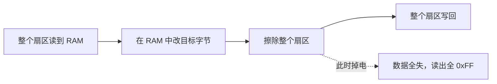
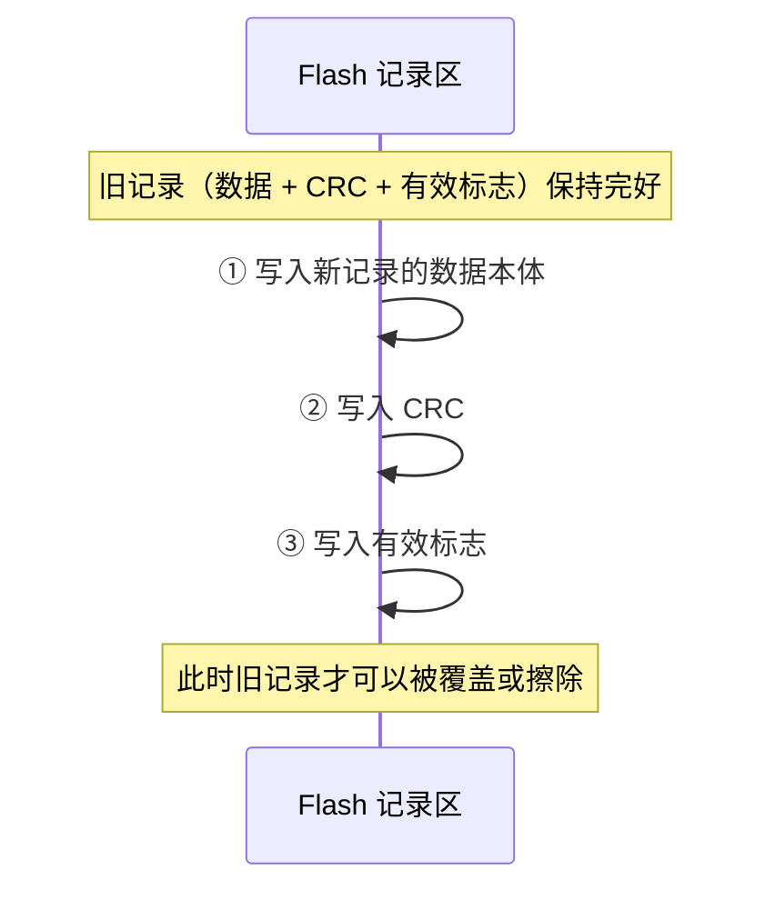

# 2.5 Flash 存储与参数管理

> **前置知识**：[2.3 通用外设](03-通用外设.md)
>
> **掌握标准**：能设计一套掉电安全、寿命可控的参数存储方案，并说清 Flash 读写擦的约束和磨损均衡的基本做法
>
> **对应岗位**：嵌入式软件工程师 · MCU 驱动/BSP 工程师 · 物联网工程师 · 汽车电子工程师
>
> **练手建议**：给你的项目做一个配置参数存储模块：支持写入、读取、恢复出厂设置，能通过串口修改参数，并且拔电重启后参数不丢

产品交付之后，用户会陆续提一类需求：设备要记住点东西。通信地址、波特率、校准系数、累计运行小时数、报警阈值——这些数据的共同点是，**掉电不能丢**。

程序的变量都在 RAM 里，一断电全没，所以这类数据必须存到非易失存储器。单片机上最常见的选择是片内 Flash，也就是放你程序代码的那块存储器。听起来很简单：存进去、读出来，完事。但真做起来，Flash 有三个反直觉的特性，踩坑的人基本都栽在这三条上。这一篇先把这三个特性讲透，再由它们推导出几种方案，最后落到"参数管理模块到底该怎么写"。

## 为什么参数不能放在 RAM 里

判断标准只有一条：**这份数据掉电后，能不能从别的地方重新推出来？**

推不出来的必须存：设备通信地址和波特率（丢了可能整条总线失联）、传感器校准系数（丢了读数全错，而且没法从别的数据反推出原来的标定值）、运行统计（保修和寿命预测的依据）、用户设定（报警阈值、工作模式）。

推得出来的不要存：屏幕当前显示哪个页面、这次开机的临时状态、缓存里的中间结果——上电重算一遍就行。**把它们写进 Flash 不只是浪费，还会消耗寿命，并引入"参数区和运行时状态混在一起"的维护负担。**

参数丢失的修复成本通常远高于开发成本。现场几百台设备因为参数区写坏，全部回到默认通信地址，需要工程师挨个上门重配——这一件事的代价，比当初多花两天把参数模块写扎实高得多。**参数存储不是"高级功能"，是产品的基本要求。**

## Flash 的三个基本特性

后面所有结论都是这三条的推论，先记住，剩下的都是推导。

### 特性一：写只能把 1 变成 0

编程（写）操作只能把 bit 从 1 变成 0，不能把 0 变回 1。想让 bit 回到 1，只有擦除这一条路，而擦除是整块进行的。

两个实用推论，后面都会用到。**第一，写之前不需要"先清零"**，因为擦除后的单元本来就是全 1（0xFF）。**第二，同一个地址连续写两次，结果是两次的按位与。** 先写 0x00 再写 0x12，得到的不是 0x12 而是 0x00。这看似是个坑，其实很有价值：一个 bit 只能从 1 单向变成 0，天然适合做"状态推进"的标记位——后面讲有效标志时你会看到它的用处。

### 特性二：擦除以扇区/页为单位

不能擦一个字节，最小单位是扇区或页，而且**扇区大小在不同芯片间差别极大**：有的芯片 1KB 一页，有的 2KB，有的系列不同区块从 16KB 到 128KB 不等，ESP 系列常见 4KB，外部 SPI Flash 一般是 4KB 扇区。**具体以数据手册为准，不要凭印象套。**

直接推论是：**改 1 个字节，最坏情况要擦掉几十 KB。**

所以动手前第一件事是查数据手册，确认三件事：扇区/页大小、编程粒度是按字节还是按半字/字、编程地址是否要求对齐。这几个数字决定了你方案的形态。

### 特性三：有擦写寿命

每个扇区的擦写次数有限，典型量级是每个扇区 1 万到 10 万次（**以数据手册为准**，不同工艺和系列差别不小）。数据手册会明确给出这个规格，通常叫擦写次数或耐久性。

这不是"用久了可能会坏"的模糊说法，而是一个算得出来的硬限制。一个参数每秒写一次、存在同一扇区里，一天就是八万六千多次，几天就报废。**凡是带"累计""计数""每次运行更新"字样的参数，都要优先考虑它的写入频率。**

三个特性合起来看：

| Flash 特性 | 直接后果 | 设计上的应对 |
|---|---|---|
| 写只能 1→0 | 改写必须先擦除 | 读-改-写流程，或追加式写入 |
| 擦除以扇区为单位 | 改 1 字节可能擦掉几十 KB | 参数集中存放，减少擦除次数 |
| 擦写寿命有限 | 高频写会写坏扇区 | 磨损均衡，写入合并 |

## 读-改-写：改一个字节到底发生了什么

假设参数区占一个扇区，里面放了二十个参数，现在要改其中一个字节。实际要做四步：把整个扇区读到 RAM，在 RAM 里改掉那个字节，擦除整个扇区，再把那几 KB 整个写回去。

前两步是内存操作，微秒级。第三步是核心：擦除一个扇区通常要几十毫秒（**以数据手册为准**，快的几毫秒，慢的几百毫秒）。第四步看数据量，几毫秒到几十毫秒。

三个必须正视的后果：

**耗时。** 大多数单片机的程序就跑在 Flash 上，擦除期间 CPU 无法取指令，只能停下来等（除非切到 RAM 里执行，或者让它被挂起）。表现到产品上就是：写参数时串口卡住、屏幕画面顿一下、控制环丢拍。做实时控制类项目时，这几十毫秒要专门安排。

**风险。** 擦除完成到写回完成之间如果掉电，这个扇区的数据全没了——既不是新值也不是旧值，而是全 0xFF。这正是"掉电安全"要解决的核心问题。

**寿命。** 改一个字节就是一次完整的擦写，参数改多少次，扇区就消耗多少次。

## 参数存储的几种方案

下面按"从简单到复杂、从寿命短到寿命长"排列。**不要一上来就选最复杂的那种，先看你的参数多久改一次。**

### 方案一：固定地址直存

在 Flash 里划一个扇区，参数结构体直接放进去，改参数就做一次读-改-写。代码最简单，几十行就能跑通，读参数开销也低。

**它什么时候是对的**：参数几乎不改，比如设备型号、序列号、硬件版本、出厂标定值——烧一次就不再动。这种情况下它最合适，不要为了"高级"上日志方案。

**它什么时候一定翻车**：有人把"运行时间统计""里程累计""已运行次数"这类每分钟甚至每秒都在变的数据，和配置参数塞进同一个扇区。几个月后扇区写坏，设备开始丢配置，而且现象是偶发的，现场很难查。

### 方案二：双备份 / 交替写入

准备两个扇区 A 和 B，第一次写 A，第二次写 B，第三次再写 A，交替进行。每份数据带版本号和校验值，读取时取版本号更大且校验通过的那一份。

它同时解决三件事。**掉电安全**：擦 A 的时候 B 是完整的，擦到一半掉电，下次启动读到 A 是全 0xFF（校验必然失败），用 B 就行。**寿命延长**：擦写分摊到两个扇区，寿命翻倍。**可持续升级**：可以先擦旧的那份再写新的，保证任何时刻至少有一份完整数据存在。

这是工业产品里最常见、性价比最高的方案。**参数每天改几十次以内，双备份基本就是这个问题的标准答案。**

### 方案三：追加式日志（append-only）

核心思想：**不擦除，每次改参数就把一条新记录追加到后面的空闲地址，写满了整个扇区再擦一次。**

寿命为什么长：一条记录假设 64 字节，2KB 扇区能放三十多条，也就是擦一次扇区能支撑三十多次参数写入，比方案一提高了几十倍。

掉电为什么最安全：追加写入是单向的，不破坏任何已有数据，最多让最后一条记录写了一半，前面的历史记录都完整。读的时候从后往前找第一条校验正确的记录，就是最新有效数据。

代价是：需要"当前写到哪了"的遍历逻辑，启动时要扫一遍，读取代价高于前两个方案；记录长度要固定或带长度字段；写满的判定和擦除时机要处理好。

这是嵌入式参数存储的主流做法，很多芯片厂商的 EEPROM 模拟库就是这么实现的。**频繁修改的参数、运行统计类数据，用它。**

### 方案四：外挂 EEPROM / FRAM

片内 Flash 不够用、或者擦写实在太频繁时，加一颗外部存储器。

EEPROM 通常是 I2C 或 SPI 接口，**可以按字节写，不需要整块擦除**，擦写寿命一般也比片内 Flash 高一个数量级（以数据手册为准）。FRAM（铁电存储器）写入次数极高、速度快，几乎可以像 RAM 一样写，做高频参数记录很合适，缺点是容量小、价格贵。

代价是加器件、加成本、加 PCB 面积、加驱动代码。**只在片内真的不够用时才考虑。** 一个实用的判断：参数修改频率在"每天几十次"这个量级时，片内 Flash 完全够用。

### 方案五：外部 Flash + 文件系统

要存的是图片、字库、音频、大批量日志、OTA 固件包，那就不是"参数区"的思路了，应该交给文件系统管理，见后文单列的一节。

| 方案 | 寿命 | 掉电安全 | 代码复杂度 | 适用场景 |
|---|---|---|---|---|
| 固定地址直存 | 差 | 差 | 极低 | 几乎不改的参数 |
| 双备份交替 | 中 | 好 | 低 | 一般配置参数（推荐默认） |
| 追加式日志 | 好 | 最好 | 中 | 频繁修改的参数、运行统计 |
| 外挂 EEPROM/FRAM | 很好 | 好 | 中 | 片内不够用、高频写 |
| 外部 Flash + 文件系统 | 好 | 取决于文件系统 | 高 | 大文件、日志、OTA |

## 磨损均衡：别老是擦同一块

磨损均衡（wear leveling）这个词听着唬人，思想很朴素：**不要反复擦同一块地址，把写入分散开。**

做参数管理时，你不需要实现通用磨损均衡算法，只需要对方案做一个判断：**它是"每次写都擦同一地址"，还是"擦写分散到多处"？** 前者在参数频繁修改时一定会出问题，后者才是可交付的设计。前面几个方案其实都自带磨损均衡：双备份把擦写分摊到两个扇区，追加式日志把擦写分摊到整个扇区的空间里。文件系统（LittleFS 等）会做更细的动态均衡——写入时挑擦写次数最少的块，自己写参数模块一般不必做到这个程度。

有一个容易反过来的点：**参数集中放在一个扇区，比分散到多个扇区更省寿命。** 因为一次擦除本来就要擦掉整个扇区，二十个参数放在同一扇区，改任何一个都只付一次擦除；分散到五个扇区，就是五倍消耗。所以"把参数堆在一起"和"磨损均衡"并不矛盾——均衡说的是不要把同一个地址反复擦，不是要把参数拆散。

## 掉电安全：要么新的，要么旧的

这是参数存储里最核心的工程问题，目标可以写成一句话：

> **任何时刻断电，重新上电后都必须能读出一份完整的、自洽的参数——要么是修改前的那份，要么是修改后的那份，绝不能是两者的混合体。**

基本手法是：**给每条记录加"校验 + 有效性标记"，并让标记的写入顺序反映数据的完整程度。**

一条记录的标准结构包含四部分：数据本体、CRC 校验值、版本号或序号、有效标志。写入分三步——**先写数据本体，再写 CRC，最后写有效标志**，这个顺序在任何情况下都不能变。

如果只写完数据本体、或者写完 CRC 就掉电，有效标志还没写，读取时判定为无效记录直接忽略，用上一条有效记录。如果写有效标志这一步掉到一半——只要有效标志是一个字节或一个半字，它的写入是原子的，不存在"写了一半"，要么有效要么无效。

这里正好用上了特性一：**有效标志用"从 1 变 0"的方式表示有效。** 擦除后是全 1（无效），写入标志只会往 0 的方向走，天然不会出现标志位被意外翻成有效的情况。

除顺序之外还有三条原则。**永远保留一份旧的有效数据，直到新的确认写入成功**——不要"先擦旧的再写新的"，中间掉电就是两边都没有了。**不要在同一次操作里既擦又写关键数据**——擦除和写入是两个易失窗口，叠在一起窗口变长，被掉电命中的概率也变大。**上电时做一次完整性检查**——启动流程里加一步，扫描参数区找最新的有效记录，找不到就加载默认值并置一个"参数已恢复默认"的标志位，或者点灯、向上位机上报。这一步代价很小，但能让你在现场一眼看出问题，而不是等客户投诉才发现。

## 数据校验：CRC 不是可选项

每条记录都要带 CRC，读出来第一件事是校验，校验不过就丢弃。这不是"更严谨"的加分项，是**底线**。

必须有校验的原因：Flash 单元随擦写次数增加会出现数据保持力下降，可能位翻转；掉电时写到一半的记录内容不确定；某些芯片在擦写期间复位，读回来可能是全 0 或随机值。

不校验的后果特别隐蔽：参数读出来是一个"看起来合理"的错值。比如波特率应该是 115200，读出来是个接近但不相等的数——程序拿去配置串口，能配、能通、偶发出错。这种问题在现场排查成本极高。

选什么校验：参数记录用 CRC-16 或 CRC-32 都够，差别只是几行代码和几十个时钟周期。为省事用累加和或异或校验的方案，**能挡住单字节错误，挡不住多位翻转，不建议用在关键参数上**。部分单片机带硬件 CRC 外设，用起来几乎不占 CPU。

校验失败时的降级策略，按可靠性从低到高排列：直接用默认值（最省事，但用户会莫名丢配置）；用上一份有效记录（双备份和日志方案天然支持，推荐）；用默认值并报警（置标志、点灯、向上位机上报）；连备份也坏了，只能默认值加报警。**涉及安全、金额、标定的关键参数，建议直接上第三条**，让维护人员知道发生了降级，而不是悄悄用默认值继续跑。

## 嵌入式文件系统：什么时候真的需要

前面讲的都是"参数"，规模是几十到几百字节。如果要存的是图片、字库、音频、大批量日志、OTA 固件包，那是几十 KB 到几 MB 的规模，就该交给文件系统了。出现下面这些需求时，说明该上文件系统：数据变长、条数不固定（日志）；需要按文件名访问、需要目录结构；需要断电不损坏；需要通过上位机读写。

几个常见选择的定位差异很大。**FatFS** 通用性最好，PC 能直接识别（挂载成 U 盘非常方便），资料和例程最多，但它不是为掉电安全设计的——**掉电时正好在写 FAT 表，可能整盘目录损坏**，适合"需要让 PC 读、可以接受偶尔损坏"的场景。**LittleFS** 专为嵌入式 Flash 设计，掉电安全、自带磨损均衡、资源占用小，代价是 PC 不能直接识别，导出需要专门工具——**新项目如果数据重要又要求掉电安全，优先选它**。**SPIFFS** 是更早的方案，在 ESP 生态里常见，但性能和碎片问题历史包袱较多，新项目一般直接上 LittleFS。

用文件系统有三个注意点。**第一，外部 SPI Flash 有自己的擦除块大小（常见 4KB）和自己的限制，用之前同样要查数据手册。** 第二，**分区要提前规划**：程序区、参数区、文件系统区、OTA 备份区各占多少，产品出货后就很难改了，要给文件系统区留足余量。第三，**磨损问题依然存在**：文件系统帮你均衡，但总写入量仍受 Flash 擦写寿命限制，日志类应用要限制写入频率——比如攒够一批再落盘，不要每条日志都写一次 Flash。

## OTP 区与选项字节

除了可反复擦写的 Flash，芯片里还有几块"只写一次"或者"配置属性"的区域。

**OTP（一次可编程）区**出厂后只能写一次，写完固定。常见用途：芯片唯一 ID（部分芯片的 UID 是出厂固化、只读的，用来做设备指纹或加密绑定）、出厂密钥和证书、生产批次号、一次性标定数据。

**选项字节（Option Bytes）** 是配置属性区，一般在编程器里修改，常见项目有读保护等级、写保护区域（哪些页不允许写或擦）、硬件看门狗使能、复位后的启动模式。

两个要格外小心的地方：**选项字节配错可能导致芯片无法下载程序甚至被锁死**，部分系列改读保护等级会触发整片擦除，某些低功耗单片机有经典的"锁芯片"问题，误操作后只能靠调试器擦全片恢复。**改之前先查清楚这颗芯片的行为，别在量产板上做试验。**

## 读保护与固件保护

产品做出来，就有人想抄。Flash 里的固件是可以被读出来的——用调试器连上 SWD 或 JTAG，读出来就是完整的程序二进制。做过防护和没做过，抄板成本差别很大。常见手段如下（这里要说句实话：**没有绝对安全的方案，目标只是提高抄板成本**）：

| 手段 | 强度 | 说明 |
|---|---|---|
| 读保护 | 中 | 挡住普通调试器读取，仍存在被绕过或降级的攻击面；改等级通常触发全片擦除 |
| 关闭调试口 | 中 | 生产后禁用 SWD/JTAG。代价是自己也没法再在线调试，要预留升级或恢复通道 |
| 唯一 ID 绑定 | 中 | 固件启动时校验芯片 ID，换芯片就不跑，能挡住直接复制二进制 |
| 固件加密运行 | 较高 | 存的是密文，运行前解密。实现复杂，密钥自身的保护又成了新问题 |
| 专用安全芯片 | 高 | 密钥存在独立安全器件里，成本和方案复杂度明显上升 |
| 把代码拆到多个器件 | 低 | 门槛很低，但能拖慢抄板的人 |

**现实中的判断**：多数消费类产品做到"读保护 + 唯一 ID 绑定"就够用了，因为抄的人多半会挑更省事的目标。**防护等级要匹配产品的价值和盗版损失**——花很高的成本保护一个卖得很便宜的东西，不划算。还有一个常被忽略的点：**生产环节的泄露往往比技术破解更常见**，固件文件、烧录脚本、工程源码的管理，比多加一层加密更值钱。

## 一个常见误区：EEPROM 没有寿命问题

"改用 EEPROM 吧，能按字节写，没有寿命问题"——前半句对，后半句是错的。

事实是：**EEPROM 的写寿命同样有限，只是通常比 Flash 高一个数量级**（具体以数据手册为准）。很多 EEPROM 标称每个地址可写百万次，听起来很多，但每秒写一次同一个地址，一天八万六千次，十几天就到上限了。而且 EEPROM 和 Flash 一样，**寿命是按地址算的**：写一百万个不同地址，和写同一个地址一百万次，对器件的消耗完全不同。所以"按字节写"省的只是擦除操作，并不解决磨损问题。

正确的心智模型是：**任何非易失存储器都有擦写寿命，区别只是数量和粒度。** 设计时问自己三个问题：这个数据多久写一次？一年总共写多少次？我选的存储器，这个地址能撑几年？三个问题答不上来，说明方案还没想清楚。

## 参数管理模块应该长什么样

前面讲原理，最后落到动手。一个够用的参数模块，对外至少要有这几个接口，命名随意，职责不能少：

| 接口 | 职责 | 注意点 |
|---|---|---|
| 初始化 / 加载 | 上电扫描存储区，把最新有效参数加载到 RAM | 校验失败时的降级逻辑放在这里 |
| 读取 | 从 RAM 缓存读，不访问 Flash | 读操作应该是零 Flash 开销 |
| 写入 / 保存 | 写一条新记录，或者标记需要提交 | 建议做写入合并，避免高频落盘 |
| 恢复出厂设置 | 写入一份默认参数记录 | 注意不是"擦掉"——擦掉后设备处于无参数状态 |
| 擦除全部 | 清空参数区 | 危险操作，建议加二次确认或专用命令 |
| 校验 / 自检 | 主动检查参数区完整性 | 可用于生产测试和现场诊断 |

两个设计要点值得强调。**参数在 RAM 里缓存一份**：所有读操作读 RAM 副本，只有写操作才碰 Flash，读参数的开销和读普通变量没区别，Flash 何时被写完全由你控制。**写入用"提交"而不是"实时落盘"**：用户在串口里连续改了五个参数，不该触发五次 Flash 擦写，用一个脏标志攒到一批、或者收到明确的保存命令时再落盘——这一个设计就能把 Flash 寿命消耗降低一个数量级。

### 参数结构变了怎么办

这不是"如果"，而是"什么时候"——产品一定会迭代，参数一定会增删改。三件事必须提前做。

**一、结构里带版本号。** 参数区存一个版本字段，读到旧版本数据就知道需要迁移。没有版本号，新固件读到旧参数只会当成乱码。

**二、写迁移逻辑。** 读到旧版本参数时按规则升级：新增的参数填默认值，删掉的参数丢弃，语义变了的参数按规则转换（比如原来存"档位序号"，现在改成"实际数值"，就要乘一个系数），类型变了的要显式转换。迁移完成后写回新版本，只迁移一次。

**三、迁移是单向的，并且要防降级。** 新固件的参数格式，旧固件读不了。如果产品支持固件回滚，回滚后读到的会是"未来版本"的参数——这时要么拒绝加载并用默认值，要么保留迁移前的原始副本。做 OTA 的产品必须把这一点想清楚。

**最容易踩的坑是结构体对齐。** 你在参数结构体中间插入一个字节，所有后续字段的偏移全变了，旧参数读出来全是错位数据。**参数结构体应该显式定长**——用固定宽度类型、手动补对齐填充，或者干脆序列化成字节流再存。不要直接把一个带对齐的结构体整体写进 Flash，这是新人几乎一定会踩、而且很难查的坑。

## 学习建议

1. **从数据手册开始，而不是从代码开始。** 打开手上这颗芯片的参考手册，找到 Flash 那一章，记下三个数字：扇区/页大小、编程粒度、擦写寿命。它们决定了你方案的上限。
2. **第一版就写方案一或方案二，别一上来做日志。** 固定地址直存和双备份都是几十行能跑通的，先用它们把"参数能存能读"做出来，再考虑复杂度。很多项目用双备份就够了。
3. **一定要做掉电测试，这是参数模块唯一有效的验收方式。** 在写参数过程中随机断电（可编程电源设定随机断电最好，没有就手动拔插），重复几十次，每次上电检查参数是不是"要么是旧的、要么是新的"。不做这个测试，你写的掉电安全逻辑只是"看起来对"。
4. **量一次实际的擦除耗时。** 数据手册给的是典型值，你要知道在你的芯片、你的工程配置下实际是多少毫秒。如果这段时间落在控制环的关键路径上，就需要专门安排。
5. **CRC 从第一版就加上。** 后补 CRC 意味着存储格式要改，牵动的地方比想象中多。

哪些可以略过：只做小项目的话，OTP、选项字节、读保护、文件系统这几节先看懂思路，用到时再细查。**但 Flash 的三个特性、读-改-写、CRC 与掉电安全这四块必须掌握，没有例外。**

## 小节总结

Flash 的三个特性——只能 1 变 0、擦除以扇区为单位、擦写寿命有限——是这一篇所有结论的源头。想改一个字节，就要付"读整块、擦整块、写整块"的代价：耗时几十毫秒、期间掉电就丢数据、并且消耗一次擦写寿命。理解了这个代价，参数存储的各种设计其实都在回答同一个问题：**怎么少付这个代价。**

方案选择上不要过度设计。参数几乎不改，固定地址直存就够了；一般配置参数，双备份交替是性价比最高的默认选择；参数频繁修改或数据量偏大，再上追加式日志。凡是频繁写的方案，一定自带磨损均衡——把擦写分散开，而不是反复擦同一个地址。外挂 EEPROM、FRAM 和文件系统都是"片内真的不够用"时的选项，不是默认选项。

掉电安全的核心，是让数据的完整性有明确的判定依据：每条记录带 CRC 和有效标志，先写数据、再写 CRC、最后写有效标志，同时永远保留一份旧的有效数据。这样任何时刻断电，上电后都能确定地读出一份自洽的参数。CRC 不是加分项而是底线——它挡住的不是"一眼就坏了"，而是"看起来合理的错值"，后者才是在现场最难查的问题。

最后两个务实的提醒。第一，EEPROM 不等于无限寿命，任何非易失存储都有擦写次数限制，设计时先把"多久写一次、一年写多少次"算清楚。第二，参数结构一定会变，版本号和迁移逻辑要提前留好位置，这比任何存储技巧都更能省掉将来的麻烦。

把这一篇落到一个具体模块上：读、写、恢复默认、擦除、校验，加一个串口修改参数的功能，再拔电重启验证参数不丢。做完它，你就具备了"让产品记住东西"的能力，这是从"能跑的程序"走到"能交付的产品"必须跨过的一步。

---

本章目录：[2. MCU 与体系结构](README.md) ｜ 总目录：[返回首页](../../README.md)
上一篇：[2.4 中断系统与低功耗](04-中断系统与低功耗.md) ｜ 下一篇：[3. 嵌入式软件工程](../03-嵌入式软件工程/README.md)
