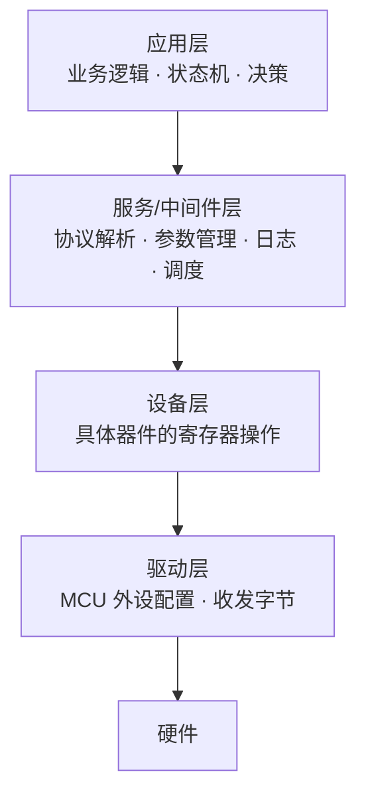

# 3.1 代码架构与分层设计

> **前置知识**：[1.1 C 语言（嵌入式视角）](../01-编程与软件基础/01-C语言（嵌入式视角）.md)
>
> **掌握标准**：能把一个几百行的 main 函数拆成有层次的模块，能用状态机组织复杂流程，并为自己的工程定义出清晰的接口边界
>
> **对应岗位**：嵌入式软件工程师 · MCU 驱动/BSP 工程师 · 汽车电子工程师 · 医疗设备软件工程师
>
> **练手建议**：翻出你以前写的"所有代码都在 main.c 里"的工程，按本篇的分层思路重构一遍，体会改一个功能需要动几个文件的变化

## 从"能跑"到"能改"

先看两个工程。功能完全一样：读传感器、算 PID、驱动电机、通过串口上报。

**工程甲**：一个 main.c，1200 行。所有初始化堆在 main 开头，主循环里有 800 行，中断函数里塞了 300 行业务逻辑。跑起来完全正常。

**工程乙**：`main.c` 只有 60 行，调用了四个模块的初始化，然后进主循环。`sensor.c`、`control.c`、`motor.c`、`protocol.c` 各司其职，靠头文件暴露的接口通信。

三个月后，需求变了：传感器要换型号。

在工程乙里，这件事的工作量是**改一个文件**——把 `sensor.c` 换掉，保证它对外提供的接口不变，其他模块一行都不用动。

在工程甲里，这件事的工作量是**在 1200 行里找出所有和这颗传感器有关的代码，逐个改，逐个测**。改的过程中很容易碰坏别的东西，而且你不敢确定自己找全了。

**这就是架构的全部意义：它决定了"改一个需求要动多少地方"。**

学生项目里，架构往往是最被忽略的一环——因为学生项目通常做完就结束了，不需要改。但在真实工作中，一个产品的代码要维护五年、十年，需求要变几十次。**能不能让每次改动都局限在一小块地方，是初级工程师和中级工程师之间最明显的区别。**

## 分层的核心思想

分层的本质只有一句话：**上层不关心下层是怎么实现的，只关心下层承诺了什么。**

拿"通过 SPI 读一颗温度传感器"举例：

| 层次 | 它知道什么 | 它不知道什么 |
|---|---|---|
| **应用层** | "当前温度是 25.3 度" | 数据是 SPI 读的还是 I2C 读的 |
| **设备层** | "读寄存器 0x06 能拿到温度" | SPI 的时钟极性该配成什么 |
| **驱动层** | "往 DR 寄存器写字节，等 TXE 标志" | 这颗芯片是温度传感器还是别的什么 |
| **硬件层** | 寄存器地址、时序 | 完全不知道 |

这四层里，**任何一层被替换，上面各层都不需要改**。传感器换成 I2C 版本，只改设备层；MCU 从 STM32 换成 GD32，只改驱动层（或者什么都不用改，如果用了厂商的 HAL）。

**关键约束是依赖方向必须单向向下**。如果驱动层反过来去调用应用层的函数，整个结构就塌了——你会得到一堆互相纠缠、无法单独测试、无法单独替换的代码，和"一个 1200 行的 main.c"在本质上没有区别。

**依赖只能从上往下**。这是一条铁律，违反了它，分层就名存实亡。

## 驱动层与设备层：最容易被合并、也最不该合并的两层

很多人的工程里，这两层是混在一起的。比如一个"读传感器"的函数里，既配了 I2C 的时序，又处理了传感器的寄存器地址和换算公式。

**为什么应该分开？**

- **I2C 的配置是 MCU 相关的**：换一颗 MCU，这段要重写。但传感器的寄存器地址和换算公式是器件相关的，换 MCU 时完全不用动。
- **传感器的协议是器件相关的**：换一颗传感器，这段要重写。但 I2C 的配置不用动。

混在一起的结果是：**换 MCU 或换传感器，你都得重写同一个函数。** 分开之后，任何一种变化都只需改一层。

具体怎么分：

- **驱动层**只提供"干活"的能力：初始化总线、发送若干字节、接收若干字节、返回成功或失败。**它不知道这些字节是什么意思。**
- **设备层**负责"理解"：往哪个寄存器写什么、读回来怎么解析、怎么换算成物理量。**它调用驱动层的收发接口，但不关心总线是怎么实现的。**

这个边界的判断标准很简单：**如果一段代码里同时出现了"寄存器地址"和"外设配置位"，那它越界了。**

## 服务层：被忽视但最有用的一层

在应用和设备之间，通常还要有一层服务层（或者叫中间件层），放这些内容：

- **协议解析**：把收上来的字节流变成结构化的消息（帧解析、粘包处理、CRC 校验）
- **参数管理**：从 Flash 读写配置、恢复默认值
- **日志系统**：分级输出、环形缓冲
- **调度/任务管理**：裸机上的时间片轮询，或者 RTOS 的任务封装
- **数据管理**：量程转换、单位统一、校准系数

这一层的价值在于：**它被很多个应用模块共用**。如果不把它单独抽出来，你会发现协议的粘包处理逻辑在三个地方各写了一遍，而且三个版本还不完全一样。

## 事件驱动：从"顺序执行"到"响应事件"

单片机的程序有两种基本形态。

**顺序执行**（也叫道过程式、时间片轮询）：主循环里按顺序做 A、B、C、D，每个都检查一下"该不该做"。简单直观，但代码一多就会变成几十个 if 判断排在一起，加一个新功能就要插一行，而且优先级完全体现在顺序上——**隐式且脆弱**。

**事件驱动**：程序不主动做事，而是等事件到来。事件可能是中断、消息、超时。每种事件对应一个处理函数。

事件驱动的核心好处是**解耦**：产生事件的一方和消费事件的一方互不认识。心跳超时的处理逻辑不需要知道是谁发的心跳，按键的处理逻辑不需要知道按键是在哪里被检测到的。

代价是**流程变得不直观**——你不能顺着代码从头读到尾就知道程序在干什么，得跳来跳去。所以事件驱动通常要和状态机配合使用，才能让逻辑保持可理解。

## 状态机：组织复杂流程的标准工具

当程序里开始出现"当前处于什么模式"这类判断时，状态机就该上场了。

### 什么情况下该用状态机

看两个信号：

- 代码里出现了**成组的、互相关联的** `if` 判断（比如 `if (mode == X && phase == Y)`）
- 你开始需要在某个流程的**中间暂停，去处理别的事，之后再回来继续**

典型的场景：通信协议解析（空闲 → 找帧头 → 收长度 → 收数据 → 校验 → 处理 → 回到空闲）、设备运行流程（自检 → 就绪 → 运行 → 报警 → 停机）、多模式的用户界面、按键的单击/双击/长按识别。

### 状态机是什么

**把所有可能的状态列出来，定义每个状态下"收到什么输入、做什么动作、跳到什么状态"。**

这三件事的组合叫**状态转移**。一个状态机就是一张状态转移表。

它的价值不在于"高级"，而在于**把散落在各处的隐式逻辑，变成一张可以检查的显式表格**。逻辑写对没写对，看表就行；两个状态之间少了转移路径，看表就能发现；加一个新状态，只需在表里加一行。

### 三种实现方式

| 方式 | 做法 | 适用 |
|---|---|---|
| **switch-case** | 外层 switch 判状态，内层判输入 | 状态和输入都不多时，最直观 |
| **状态转移表** | 用二维数组存"当前状态 + 输入 → 下一个状态" | 转移规则规整、状态较多时，改表不改代码 |
| **函数指针表** | 每个状态一个处理函数，用函数指针数组索引 | 每个状态的行为较复杂时，可读性最好 |

**新手建议从 switch-case 开始**，它最直观。等发现 switch 太长、或者转移规则开始重复时，再换后面两种。

### 状态机的常见坑

- **忘记处理未定义的状态或输入**。switch 里一定要有 default 分支，而且 default 里要做点什么（报警、回到安全状态），不要静默忽略。
- **状态爆炸**。当状态数量超过十来个，说明你可能需要拆成两个独立的状态机（比如"通信状态"和"设备状态"本来就是两件独立的事）。
- **转移条件散落各处**。如果状态的跳转条件写在三个不同的函数里，你就失去了状态机的最大好处。条件应该集中在状态机的处理函数里。
- **在状态机里做阻塞操作**。状态机的前提是"处理完一个事件就返回"，如果里面有个延时 100ms 的等待，整个状态机就卡住了。阻塞操作要拆成"发出去"和"超时检查"两步。

### 层次状态机（HSM）

当系统状态变多、且状态之间有明显的层次关系时，普通的有限状态机会出现大量重复逻辑。

举例：一个设备的"运行中"状态下面，其实还有"加速中""匀速中""减速中"三个子状态。如果不用层次结构，每个子状态都要各自处理"收到停止命令"这件事，代码重复三遍。

**层次状态机允许状态嵌套：子状态继承父状态的通用行为，只需要处理自己独有的逻辑。** 上面那个例子里，"收到停止命令"只需在父状态"运行中"处理一次，三个子状态自动继承。

层次状态机在复杂系统中非常有用（多模式设备、多层菜单），但初学阶段**了解它的存在就够了**——等你真的遇到普通状态机写不下去的情况，再回来深入。

## 模块边界的划分

分层的难点往往不在"分几层"，而在"这个函数该放哪一层"。

几条实用的判断规则：

- **高内聚**：一个模块内部的代码应该围绕同一件事。如果一个文件里既有 PID 计算又有 Flash 读写，它就不是一个模块，是两个。
- **低耦合**：两个模块之间的接口越窄越好。暴露的函数少、参数少、不共享全局变量，耦合就低。
- **数据和行为放在一起**：操作某个数据结构的函数，应该和这个数据结构定义在同一个模块里，而不是散落在各处操作它的内部字段。
- **按变化的原因划分**：会一起变化的东西放一起，不会一起变化的分开。这一条最实用——如果两个功能总是因为同一个需求而同时修改，它们就该合并；如果总是各自变化，就该分开。

## 接口设计的几个要点

模块之间靠接口通信，接口设计得好不好，直接决定这个架构能不能撑住。

- **谁调用谁负责**：调用方负责检查参数、处理返回值；被调方只负责完成自己的职责。不要两边都做一遍，也不要两边都不做。
- **错误怎么返回**：返回错误码（而不是靠全局变量或者"打印一句就算通知了"）。**每一个可能失败的函数都应该能被调用方知道它失败了。**
- **超时是必须的**：任何"等待外部响应"的接口都要有超时机制，否则一次异常就会让整个系统卡死。
- **不要暴露内部结构**：头文件里只放调用方需要的东西。内部用的变量和辅助函数放在 .c 文件里，用 static 限制作用域。
- **回调与注册**：需要"下层通知上层"时，不要直接调用上层的函数（那样会破坏单向依赖），而是提供一个注册接口，让上层把自己的函数注册进来。这是解耦最常用的手段。

## 全局变量的问题

**全局变量是架构的腐蚀剂。** 它让任何一段代码都能改任何数据，于是依赖关系变成了网状，无法分析、无法测试、无法并行开发。

完全不用全局变量在嵌入式里不现实（尤其资源紧张时）。但要有原则：

- 硬件寄存器、DMA 缓冲区这类"天然全局"的东西，可以全局
- 业务数据尽量放在模块内部，通过接口访问
- 如果一定要共享，明确**谁写、谁读**，并且写清楚并发保护方式（见 [2.4 中断系统与低功耗](../02-MCU与体系结构/04-中断系统与低功耗.md)）

## 不要为了架构而架构

这一节很重要，因为很多人学过架构之后会走向另一个极端。

**几个明确的反面信号：**

- 一个 200 行的功能，分了 6 个文件、8 层抽象，为了改一行代码要跳 10 个地方
- 大量"以后可能会用到"的抽象接口，实际上只有一个实现
- 明明是个一次性验证的小工具，却按产品级标准设计

**判断标准很简单：架构的收益是"未来改动更容易"，成本是"现在更复杂"。** 如果这个项目根本不会有未来（比如一周就丢掉的验证代码、临时测试脚本），那么简单直接就是最优解。

对学生项目和求职项目，一个折中的建议是：**核心逻辑（控制算法、协议解析、参数管理）认真分层，辅助部分（初始化、测试代码）可以随意。** 这样既能体现架构能力，又不会把时间浪费在过度设计上。

## 常见的几种架构形态

| 形态 | 结构 | 适合 |
|---|---|---|
| **前后台** | 主循环 + 中断 | 简单项目，功能少、实时性要求低 |
| **时间片轮询** | 主循环按固定节拍依次调用各任务 | 中等复杂度，任务都能快速执行完 |
| **事件驱动** | 事件队列 + 事件处理函数 | 事件来源多、需要解耦 |
| **分层架构** | 应用/服务/设备/驱动 | 几乎所有正式项目 |
| **消息队列 + 任务** | 基于 RTOS 的多任务协作 | 功能多、实时性要求高、有阻塞操作 |

**这几种不是互斥的**。一个真实项目通常是"分层 + 事件驱动 + 状态机"的组合，上了 RTOS 之后再变成"分层 + 任务 + 消息队列"。**先分层，再按需要引入事件和任务**——顺序反过来的话，你会得到一堆各自为政、无法复用的任务。

## 学习建议

1. **先动手重构一个旧工程**，而不是从零设计新工程。重构时你能直接体会到"改一处要动多少地方"的差异，这是最有说服力的学习方式。
2. **从"抽出一个驱动层"开始**。把你工程里所有直接操作寄存器的代码集中到一个文件，对外只暴露几个函数。这一步做完，架构的感觉就出来一半了。
3. **把状态机用在通信协议解析上**。这是最适合练手的场景，因为它天然是状态机，而且你能立刻看到效果——错包、粘包、半包的处理会变得非常清晰。
4. **不要一开始就追求完美的分层**。先分成三层（应用 / 设备 / 驱动），跑起来，再根据实际的痛处调整。**架构是演进出来的，不是一次设计出来的。**
5. **警惕"上帝文件"**。如果一个 .c 文件超过 1000 行，或者一个函数超过 200 行，几乎可以肯定它承担了太多职责。这是最值得优先重构的信号。
6. **面试价值**：代码架构是面试里区分"写过作业"和"做过项目"的关键问题。面试官问"你这个项目的代码结构是怎样的"，想听的不是"我用了什么框架"，而是**"我为什么要这样分，这样分带来了什么好处"**。

## 小节总结

代码架构解决的唯一问题是：**让以后的改动更容易。** 它在功能上没有任何贡献，但在维护成本上决定一切。

核心方法是分层：**上层只依赖下层承诺的接口，不关心下层的实现**，依赖方向必须单向向下。嵌入式里通常分成应用层、服务层、设备层、驱动层，其中**设备层和驱动层的分离**最容易被忽略也最值得做——它让"换 MCU"和"换器件"变成两件互不影响的事。

组织复杂流程的标准工具是状态机：**把隐式散落的 if 判断变成一张显式的状态转移表**。它让逻辑可以被检查、被讨论、被修改。层次状态机是它在复杂场景下的自然延伸，初学阶段知道即可。

最后两条判断：**全局变量是架构的腐蚀剂**，能用接口就别用它；**不要为了架构而架构**——架构的收益在未来，成本在当下，如果一个项目没有未来，简单直接就是最优解。

---

本章目录：[3. 嵌入式软件工程](README.md) ｜ 总目录：[返回首页](../../README.md)
上一篇：[3. 嵌入式软件工程](README.md) ｜ 下一篇：[3.2 构建系统与工具链](02-构建系统与工具链.md)
