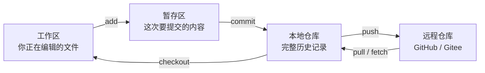

# 3.3 Git 与代码托管

> **前置知识**：无（但建议先有一个能跑的工程用来练习）
> **掌握标准**：能用 Git 管理你的嵌入式工程，能处理合并冲突，能写出让人看得懂的提交记录，并在代码托管平台上维护一个像样的项目主页
> **对应岗位**：全部嵌入式软件岗位（Git 是企业默认要求，不是加分项）
> **练手建议**：把你以前的项目（哪怕是一个点灯工程）用 Git 管理起来，写一份完整的 README，推到 GitHub 或 Gitee 上

## 为什么嵌入式也要用 Git

Git 是当前软件开发事实上的版本控制标准，对嵌入式同样适用。很多初学者一开始觉得 Git 是"搞大项目才需要的东西"，自己写个单片机程序似乎没必要。但只要你项目稍微大一点，或者代码需要反复修改，Git 的价值就会立刻体现出来。

最直接的作用就是：**代码改崩了可以回退**。你今天加了个新功能，结果把原来稳定的版本搞坏了，如果没有 Git，你可能只能靠复制粘贴的"final_v2_final_真正最终版"来管理版本——而这个梗之所以能流传，就是因为几乎每个人都这么干过，也都因此丢过东西。有了 Git，你只需要回到上一个稳定提交就行。

除此之外，Git 还能帮助你记录每次修改的原因、比较前后代码差异、管理不同功能分支，并在多人协作时把大家的改动整合到一起。**这四件事的价值，往往比"回退"本身更大**——因为回退是救火，而记录、对比、分支、协作是让火少烧几次。

## Git 的心智模型：四个区域

绝大多数人学 Git 卡住，不是因为命令难，而是因为脑子里没有那张图。先把这张图记住：

四个区域对应四类操作：

| 区域 | 里面是什么 | 相关命令 |
|---|---|---|
| **工作区** | 你此刻正在编辑的、还没被 Git 记录的改动 | status、diff |
| **暂存区** | 你打算放进下一次提交的改动 | add |
| **本地仓库** | 已经形成的提交历史，完全在你电脑上 | commit、log、branch |
| **远程仓库** | 别人也能看到的副本 | push、pull、fetch |

**为什么要有暂存区？**这是新手最大的困惑，也最容易被当成"多此一举"。答案是：现实中的改动几乎从来不是干净的。你本来只想改一个 bug，顺手又格式化了几行代码、注释掉一段调试打印、改了另一个文件的缩进。如果提交时只能"一次性全交"，你的历史就会被这些无关改动污染。

**暂存区的意义就是让你把一次提交裁成一个完整、可读、只做一件事的改动。**这个能力是"会不会用 Git"和"用得像不像样"的分界线。

## 命令的学习顺序

对嵌入式方向来说，Git 最值得优先掌握的内容并不需要太多，按下面三个阶段往上走就够了：

| 阶段 | 命令 | 目标 |
|---|---|---|
| **第一阶：能记录** | init、add、commit、log、diff、status、.gitignore | 能把自己的工程管起来，能看懂改了什么 |
| **第二阶：能分支** | branch、checkout、merge、rebase | 能同时推进几个功能，能在分支间来回切换 |
| **第三阶：能协作** | clone、push、pull、fetch | 能和别人的仓库交换代码 |

**掌握这个量，就已经够覆盖大多数学习和项目场景了。**不要去背完整的命令手册，那里面大半的内容你几年都用不上。

最好的学习方式不是背命令，而是直接拿自己的真实项目去用。比如把一个 STM32 工程、ESP32 工程或者上位机工具项目用 Git 管起来。**只有在你真正提交、回退、合并、冲突、修复的过程中，Git 才会从"命令集合"变成"真正的工程工具"。**看教程学 Git 和亲手把一次合并冲突解决掉，是两种完全不同的学习。

## .gitignore：嵌入式项目最容易漏的一步

对嵌入式项目来说，.gitignore 的重要性比一般软件项目还要高。原因很直接：**嵌入式项目的中间产物又多又大，而且还混着别人的代码和你的密钥。**

一个典型的嵌入式工程，下面这些都不该进仓库：

| 类别 | 典型内容 | 为什么要排除 |
|---|---|---|
| **编译产物** | .o、.elf、.hex、.bin、.axf、.map、.lst | 每次编译都能重新生成，体积大、差异噪声大 |
| **IDE 配置** | Keil 的工程用户文件、IAR 的 workspace、CubeMX 的生成文件、VS Code 的 .vscode | 是个人环境配置，换个人就不同，合并时冲突不断 |
| **调试产物** | 调试日志、波形导出、串口抓包文件 | 体积大且是一次性的 |
| **大体积固件** | 出厂镜像、备份固件、厂商给的库包 | 直接把仓库撑爆 |
| **密钥与证书** | 私钥、签名证书、云平台 token、WiFi 密码 | **一旦提交，等于永久泄露** |

**最后一条要单独强调：密钥一旦提交进 Git，就算你下一次提交删掉了，它依然躺在历史记录里**，任何人 clone 下来都能翻出来。正确做法是密钥文件从一开始就写进 .gitignore，用模板文件代替（比如放一个只含字段名不含真实值的配置模板）。如果已经提交了，唯一可靠的处理是**立刻作废并更换密钥**，而不是指望删掉那个提交。

**判断某个文件该不该进仓库，问一句话：这台机器坏了，我从仓库 clone 下来能不能重新生成它？**能生成的不进，不能生成的才进。

## 提交规范：三个月后能不能看懂

初学者最典型的提交信息是"update""fix""改了一下"。这三种写在当时看没问题，三个月后打开历史记录，等于什么都没写——因为你根本想不起来那次到底改了啥、为什么改。

一条好的提交信息，应该**说清"做了什么"和"为什么"**，例如：

| 差 | 好 |
|---|---|
| fix | 修复串口接收在波特率 115200 下偶发丢包的问题 |
| update | 把 ADC 采样从单次改为连续+DMA，降低 CPU 占用 |
| 改了一下 | 上电时关闭看门狗再初始化，避免初始化超时被复位 |

另外两条值得从第一天就建立的纪律：

- **一个提交只做一件事。**修 bug 的提交里不要顺手加新功能。理由是：当你需要回退或定位问题时，能把改动拆得越细，回退就越安全、定位就越快。
- **提交要勤。**不要攒一天甚至一周才提交一次。"等做完了再提交"的结果通常是：一顿大改之后想拆也拆不开了。

## 分支策略

分支解决的是"我想同时推进几件事，又不想互相干扰"。个人项目不需要复杂的模型，团队才需要。

- **个人项目的简单策略**：一条主分支保持随时能编译、能烧录的状态；要做新功能就开一个临时分支，做完合回去再删掉。**关键不是分支叫什么名字，而是主分支永远保持可用。**
- **团队协作的常见流程**：功能分支开发 → 提合并请求 → 代码评审 → 合入主分支。合并请求（Pull Request / Merge Request）的价值在于把"合并"变成一次有记录、有评审、能被回溯的工程动作，而不是一个人在本地悄悄完成的事。

**新人不必一上来就学 Flow 这类复杂模型。**先建立"主分支保持可用"这一条，就已经避开了绝大多数事故。

## 合并冲突不可怕

很多新手一看到冲突提示就慌，甚至干脆把整个工程重新拷贝一份——这是最差的做法，因为它把问题从"解决一处冲突"变成了"丢失一段历史"。

**冲突的本质非常简单：两个人（或两个分支）改了同一处，Git 不知道你想保留哪个，所以停下来问你。**它不是错误，只是 Git 在说"这里需要你做个判断"。

处理思路就三步：

1. **看清双方各改了什么。**冲突标记会把"你的版本"和"对方的版本"并列放在一起，先读懂两边各自的意图。
2. **手工决定保留哪些。**可能是取其一，也可能是把两者合并成新的写法——这才是冲突处理中最需要人的地方，也是 AI 最容易帮倒忙的地方。
3. **删掉冲突标记，编译验证，提交。**处理完冲突一定要重新编译一次，因为"能合上"不等于"能跑"。

一个降低冲突频率的实用建议：**提交前先拉取远程改动，不要攒着一堆本地改动去和别人合。**改动积压越久，冲突越大越难解。

## 回退的几种手段与危险程度

Git 提供了好几种"回到过去"的办法，但它们的危险程度完全不同，用错会真的丢代码：

| 手段 | 作用 | 危险程度 |
|---|---|---|
| **stash** | 把当前未提交的改动临时收起来，切分支后再拿出来 | 低，随便用 |
| **revert** | 生成一次新的提交，内容与之前某次提交相反 | 低，最安全的撤销方式 |
| **reset --soft** | 撤销提交，改动回到暂存区 | 较低，历史被改写 |
| **reset --mixed** | 撤销提交，改动回到工作区 | 中，历史被改写 |
| **reset --hard** | 撤销提交，**同时丢弃改动** | **高，未提交的改动会直接消失** |
| **reflog** | 记录 HEAD 的所有移动，能找回被 reset 掉的东西 | 这是救命用的，不是常规操作 |

三条最实用的判断：

- **只想撤销一次已推送的提交，用 revert，不要用 reset。**reset 会改写历史，别人拉取时会一团乱。
- **reset --hard 之前先 stash 或者确认改动已经提交。**这是最常见的"代码没了"事故来源。
- **万一真的搞丢了，先别慌，去看 reflog。**只要提交过（哪怕后来被 reset 掉），本地仓库里通常还留着记录，多数情况下能捞回来。**所以在没试过 reflog 之前，不要放弃你的代码。**

## 嵌入式特有的三个问题

这三个问题普通软件项目很少遇到，却是嵌入式新手最容易踩的：

**第一，二进制文件怎么管。**固件镜像、原理图、PCB 源文件、3D 模型，这些都是二进制。Git 的核心能力是"比较文本差异"，而二进制文件每次改动几乎都是整个文件重写——仓库体积会指数级膨胀，而且完全无法查看差异。

几种务实做法：小图标、小图片这类直接进仓库无妨；大的 PCB 源文件和 3D 模型，可以用支持大文件的方案（如 Git LFS），或者干脆只把导出的 PDF 和图片放进仓库、源文件另找地方归档；**固件镜像一律不进仓库**，它本来就该由源码重新编译产生。团队里常见的规范是：仓库里放设计输出（PDF、图片、Gerber），源文件放共享盘，仓库里只记录版本对应关系。

**第二，要不要把厂商 SDK 提交进去。**这是个见仁见智的问题，两种做法都有人用：提交进去的好处是"clone 下来就能编译"，不依赖外部下载；不提交的好处是仓库干净、体积小。**常见的折中做法是：只提交你真正用到的那部分厂商代码，并且单独放在一个目录下，明确标注来源和版本，绝不修改它。**最怕的是把整个厂商包塞进仓库还在里面直接改——升级 SDK 时会变成一场灾难。

**第三，密钥和证书绝对不要提交。**这一条在前面已经强调过，但对嵌入式尤其重要，因为嵌入式项目里遍布着 WiFi 密码、云平台密钥、签名证书、量产凭据。**这类东西一旦泄露，损失往往不是"重写代码"能弥补的。**

## 代码托管平台的选择

Git 本身只是版本控制工具，而 GitHub、Gitee、GitLab 这类平台则是让版本控制真正进入协作和项目管理层面的基础设施。它们不仅用来"放代码"，更承担了团队协作、任务跟踪、文档展示和项目维护的功能。

| 平台 | 特点 | 适合谁 |
|---|---|---|
| **GitHub** | 生态最大、开源项目最集中、招聘方最熟悉 | 想被看见、想做技术展示的人 |
| **Gitee** | 国内访问快，无需额外网络配置 | 网络受限、想快速上传的人 |
| **GitLab** | 可私有部署，企业内网常用 | 公司内部协作 |

对个人开发者来说，最常用的能力包括：创建仓库、克隆仓库、维护 README、上传项目、查看历史记录，以及通过 Issue 记录问题和待办事项。对团队开发来说，还会进一步涉及 Fork、合并请求、代码评审、项目看板、权限管理等流程。

这部分内容对嵌入式方向的读者很有价值，因为你以后无论是实验室协作、比赛组队、项目共建，还是找工作展示项目经历，都离不开代码托管平台。**尤其是 GitHub，它某种意义上已经不仅仅是代码仓库，更像是一张长期更新的技术名片。**一个整理清楚、文档完善、持续维护的 GitHub 仓库，往往比简历上的一句"做过某项目"更有说服力——因为简历可以写，仓库是编不出来的。

**在公司内网环境下，平台往往是固定的**（多为私有部署的 GitLab），你不需要纠结选哪个，只要能熟练使用一套就够，因为各家平台的基础操作大同小异。

## README 该写什么

README 编写是非常值得重视的一点。很多人代码能写、项目也能跑，但仓库一打开什么说明都没有，这样别人根本看不懂你做了什么——最可惜的是，**面试官通常只会花两分钟看你的仓库，看不懂就走了。**

一个好的 README 至少应该说明这几块：

| 部分 | 写什么 |
|---|---|
| **项目背景** | 这是什么、解决什么问题、为什么做它 |
| **功能介绍** | 具体能做什么，列点，不要含糊 |
| **硬件平台** | 用了哪颗芯片、什么开发板、外接了什么模块 |
| **目录结构** | 每个目录大概是干什么的 |
| **编译运行方法** | 怎么编译、怎么烧录、依赖什么工具（能让人复现出来） |
| **使用说明** | 上电后怎么操作、怎么看到效果 |
| **效果展示** | 照片、视频、波形截图——**这一项的说服力超过前面所有文字** |
| **许可证** | 别人能不能用、怎么用 |

**会写 README，其实就是会把项目讲清楚，这本身就是非常重要的工程能力。**而且它有一个隐藏好处：写 README 的过程会逼你重新审视自己的项目，很多设计上的模糊之处会在写文档时暴露出来。

## 开源许可证的常识

用别人的代码之前，先看它的许可证——这不是法律洁癖，而是实实在在的风险。

| 许可证 | 大致含义 | 商业项目里要注意什么 |
|---|---|---|
| **MIT** | 随便用、随便改，保留版权声明即可 | 最宽松，基本不用担心 |
| **Apache 2.0** | 和 MIT 类似，但额外包含专利授权条款 | 宽松，对商业友好，且专利风险更清楚 |
| **GPL** | 用了它，你的衍生作品也必须开源 | **商业闭源产品里要格外小心** |

需要记住的几条判断：

- **GPL 类许可证有"传染性"**，把它和你的闭源代码链接在一起，可能要求你公开全部源码。公司项目里引入这类库，通常是必须走法务确认的事。
- **"开源"不等于"可以随便用"**，许可证里写的条件就是条件。
- 公司项目里引入任何第三方代码，**先确认许可证、留好记录**，不要凭"我在网上找的"就用在产品里。这不是技术问题，但它会变成技术人的问题。

## 学习建议

1. **今天就把一个旧工程管起来**，哪怕只是点灯。用一个真实仓库去理解暂存区和分支，比看十篇教程都有用。
2. **前三周先只用第一阶命令**（add、commit、log、status、diff），把"记清楚每次改动"变成肌肉记忆，再学分支。
3. **从第一次提交开始就写清楚提交信息**，这是最难改也最值钱的习惯。三个月后的你会感谢现在的自己。
4. **.gitignore 尽量一次配好**，尤其别把密钥和编译产物交上去。**已经提交过密钥的话，第一时间去作废它。**
5. **冲突出现时不要绕开**，正面解决一次，这个恐惧就消失了。绕开的人会一直绕开，直到某天绕不过去。
6. **README 和提交记录是两件"求职性价比最高"的事**，它们让面试官在见到你之前就能判断你是不是个能做工程的人。

## 小节总结

Git 的定位不是"大项目才用的工具"，而是**任何需要反复修改的项目的默认工作方式**。这一篇里最该带走的不是命令列表，而是四个区域的心智模型——命令会忘，模型不会。

对嵌入式来说，.gitignore 的重要性和一般软件项目不在一个量级：编译产物、IDE 配置、大体积固件、密钥证书，这四类东西的处理方式，直接决定了你的仓库是一个能长期维护的工程，还是一个越用越乱的文件夹。

提交规范、分支策略、冲突处理，这三件事的共同点是：**它们都是在为"未来的自己"和"合作的别人"降低认知成本。**提交信息写得清楚，是给三个月后的自己看；主分支保持可用，是给同事看；冲突正面解决，是给整个项目看。

回退这件事要分清危险等级：revert 是常规操作，reset --hard 是危险操作，reflog 是救命操作。**先搞清哪个是哪个，再动手。**

最后一点值得说得直白些：代码托管平台和 README，是学生阶段投入产出比最高的一件"求职准备"。一个整理清楚、有说明、有效果展示的仓库，是你在简历之外唯一能拿出的实物证据。**而且这件事没有任何门槛——它只是需要你不偷懒。**

---

本章目录：[3. 嵌入式软件工程](README.md) ｜ 总目录：[返回首页](../../README.md)
上一篇：[3.2 构建系统与工具链](02-构建系统与工具链.md) ｜ 下一篇：[3.4 代码规范与静态分析](04-代码规范与静态分析.md)
