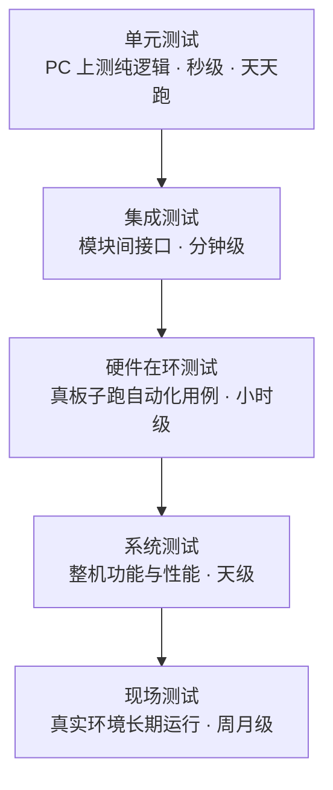

# 3.5 测试与验证

> **前置知识**：[3.6 调试方法论](06-调试方法论.md)（可先读本篇，遇到问题再回头看）
>
> **掌握标准**：能为嵌入式项目设计出可执行的测试方案，知道哪些能自动化、哪些必须上硬件测，并能把测试变成日常习惯而不是交付前的一次运动
>
> **对应岗位**：嵌入式软件工程师 · MCU 驱动/BSP 工程师 · 汽车电子工程师 · 医疗设备软件工程师
>
> **练手建议**：给你的一个算法模块（比如 PID 或滤波器）写一套能在 PC 上跑的单元测试，覆盖正常值、边界值和异常输入

## 先承认：嵌入式测试确实难

讨论方法之前，先把困难摆清楚，否则后面所有建议都会显得像站着说话。

嵌入式测试难在四件事上：

- **要有真实硬件。** 代码在 PC 上跑得再好，也不能证明它在板子上能跑。而板子可能只有一块，正焊在别人手上。
- **和时序强相关。** 很多问题只在特定的中断时机、特定的总线速率、特定的上电顺序下出现。你没法像纯软件那样随便构造一个"并发场景"。
- **故障难复现。** 现场跑三个月出一次的问题、低温下才出现的问题、电机启动瞬间才出现的问题——这类问题的复现成本极高。
- **观测手段有限。** 没有断点可用的时候（比如时序敏感代码被打断就失效），你只能靠串口打印，而串口本身又会改变时序。

**承认这些困难的意义在于：你不会因为"做不到完美的测试"就干脆不做。** 嵌入式的测试永远是在成本、覆盖面和可行性之间做取舍，重要的是知道自己放弃了什么。

## 分层测试策略

嵌入式测试不是一个动作，而是从便宜到昂贵、从快到慢的一叠层次。**原则是从最便宜的那一层开始：越便宜、越快的测试写得越多，因为它能天天跑。**

| 层次 | 测什么 | 怎么测 | 成本 |
|---|---|---|---|
| **单元测试** | 单个函数/模块的逻辑正确性 | 在 PC 上编译运行，输入已知量验证输出 | 极低 |
| **集成测试** | 模块之间的接口是否对接正确 | 在 PC 或板子上串起几个模块跑场景 | 低 |
| **硬件在环测试** | 真实硬件上的驱动与外设行为 | 板子接自动化脚本，反复执行用例并比对结果 | 中高 |
| **系统测试** | 整机的功能、性能、功耗 | 按需求逐条验证，含异常场景 | 高 |
| **现场测试** | 真实环境的长期稳定性 | 装到实际设备上跑数周到数月 | 最高 |

**大多数人的问题正好相反：真板子上的功能测试和"我自己试了试"做了不少，最便宜的单元测试和集成测试却一层都没有。** 而恰恰是这两层能低成本地挡掉大部分问题。

## 在 PC 上测嵌入式代码：最被低估的一招

这是整篇最值得带走的一个方法：**把算法和硬件访问解耦，纯逻辑部分拿到 PC 上测。**

很多人一听"嵌入式代码在 PC 上跑"就摇头，觉得跑不了。但实际上，一个工程里可能有 70% 的代码根本不碰硬件——滤波算法、PID 计算、协议解析、状态机、单位换算、数据校验、环形缓冲区。**这些代码没有任何理由必须绑在板子上测。**

具体做法就是把代码分成两层：

- **算法层（纯逻辑）**：输入是数据，输出是数据，不直接读写寄存器，不依赖任何硬件。
- **硬件访问层**：读写寄存器、操作外设、提供数据给算法层。

分好之后，算法的测试就变成了普通的 C 语言测试：在 PC 上用任何一个 C 单元测试框架编译运行，喂进正常值、边界值、异常输入，检查输出。**这套测试跑一遍只要几秒钟，你可以写完每一行代码就跑一次。**

**替换硬件访问用什么？用桩函数**，也就是用一个假的实现顶替真实实现，返回你指定的数据。比如真实的 HAL 读温度传感器返回当前温度，桩函数就按你设定的"模拟场景"返回 25 度、85 度、或者返回一个错误码。这样你就能在 PC 上测试"传感器返回异常值时，算法会不会做出危险动作"——**而这种场景在真硬件上你根本没法方便地构造。**

这个做法的性价比高到不成比例：投入是"把代码分层"（这件事本来就应该做，见 [3.1 代码架构与分层设计](01-代码架构与分层设计.md)），产出是一个秒级、天天可跑、能覆盖异常路径的测试体系。**如果你只打算从这一篇里学一件事，就学这个。**

## 硬件相关的测试怎么做

剩下那部分真正依赖硬件的测试，没法绕开，但只要方法得当，也不是什么玄学。

| 手段 | 用来测什么 |
|---|---|
| **信号注入** | 用信号发生器/模拟源给出已知输入，验证采集与处理链路的正确性 |
| **可调电源** | 把电压缓慢调低到临界点，测系统在电压边界附近的行为（很多复位问题在这暴露） |
| **高低温箱** | 温度边界下器件参数漂移、晶振频偏、电池性能变化 |
| **EMC 测试** | 抗干扰能力，以及自身对外辐射是否超限 |
| **振动与冲击测试** | 接插件松动、焊点开裂等机械可靠性 |

**这些设备大多数个人和学生团队没有，这很正常。** 可以做的替代是：

- **用可调电源代替高压高温测试**——只要几十到一两百元，却是最容易暴露问题的设备，尤其能测出"电源带不动"这类在实验室从来看不到的问题。
- **用热水袋和冰箱做粗略的温度测试**，虽然不精确，但能快速判断某个问题是不是温度相关的。**很多时候"是不是温度问题"这个判断，比精确的温标更重要。**
- **用电机、继电器、大功率负载做干扰源**，把板子放在旁边跑，观察是否异常复位。这是最廉价也最有效的抗干扰测试。

## 可靠性测试

功能测试回答"它能不能用"，可靠性测试回答"它能不能一直用"。后者才是产品交付的门槛。

| 测试 | 做什么 | 常暴露的问题 |
|---|---|---|
| **长时间跑机（拷机）** | 让设备连续运行数小时到数周 | 内存泄漏、计数器溢出、慢慢累积的漂移 |
| **反复上下电** | 快速、反复断电再上电，数百次以上 | 上电时序问题、Flash 写入被打断、初始化竞争 |
| **通信压力测试** | 用最快速率、最大数据量持续冲击总线 | 缓冲区溢出、丢包、中断处理不过来 |
| **断网断电测试** | 在通信中途、写 Flash 中途强行断电 | 数据损坏、参数区被写坏、设备起不来 |
| **极端环境测试** | 高温、低温、低压、强干扰 | 参数漂移、时序失配 |

**上下电测试这一项特别容易被跳过，也特别容易暴露问题。** 很多产品在实验室跑了三个月没问题，客户手里第一次断电就起不来——因为"写 Flash 中途断电"这个场景从来没人测过。而它几乎是必然会发生的，因为用户关电从来不看你的程序在做什么。

## 回归测试

**回归测试要回答的问题是："我改了 A 功能，会不会把本来好好的 B 功能弄坏了？"**

这个问题在嵌入式里比在纯软件里更严重，因为改动的副作用常常是间接的：改了一个定时器的分频，结果影响了依赖它的所有外设时序；加了一段代码，让栈使用量增加了 200 字节，在栈本来就不宽裕的板子上就溢出了。

做法很简单，但需要纪律：

- **把之前发现的问题和验证过的场景，都沉淀成可重复执行的测试用例**，哪怕只是一个清单。
- **每次发布前跑一遍**。回归测试的价值不在第一次跑，而在第 N 次跑——它保证你已经修好的东西没有悄悄坏掉。
- **测试要有记录**，不然"跑了"和"没跑"无法区分。

**回归测试的核心是"自动化程度"。** 能自动跑的测试会真的被跑；需要手工操作二十分钟的测试清单，一定会在忙的时候被跳过。所以哪怕只能自动化其中一小部分，也值得先做那一部分。

## 日志系统：留现场的具体做法

调试复杂系统时，养成写日志、留现场、记录版本、记录问题和修复过程的习惯非常重要。**一个工程师是否成熟，很多时候不是看他会多少技术，而是看他出了问题有没有清晰的排查路径。**

日志就是这条路径最基础的载体。但"加一堆 printf"和"一套日志系统"是完全不同的两件事：

| 要素 | 做法 | 解决什么问题 |
|---|---|---|
| **分级** | 错误、警告、信息、调试四档，编译时可整体关闭低级别 | 不用为了看一条信息而淹没在输出里 |
| **时间戳** | 每条日志带相对时间（如上电后多少毫秒） | 能还原事件顺序，这是排查时序问题的前提 |
| **模块标记** | 标明这条日志来自哪个模块 | 输出一多，就知道是谁在说话 |
| **环形缓冲** | 日志先写入内存中的环形区，再慢慢输出 | 解决"输出速度跟不上产生速度"和"卡住导致丢日志" |
| **异步输出** | 日志在中断或低优先级里刷出，不阻塞主逻辑 | **避免打印本身改变程序时序** |
| **关键状态记录** | 复位原因、最近一次状态切换、关键变量快照 | 死机或复位后，你还知道它临死前在做什么 |
| **崩溃现场保留** | 把出错时的关键信息存进 Flash，下次上电打出来 | 现场没有调试器，也能事后分析 |

**"留现场"是这里面最关键的一条思想。** 现场指的是"故障发生的那一刻，系统处于什么状态"。如果每次复位都把复位原因丢掉、把关键变量清零，那么每次故障你都只能从头猜；如果把它们保留下来，你下次接上串口就能看到——**这就是"靠猜"和"靠证据"的区别。**

另外两件必须记录的事：**版本**和**问题**。每条日志应该能对应到"哪个版本的固件"，每个发现的问题应该有记录（什么现象、怎么复现、改了哪里、验证结果）。**"改了但没记录"等于没改**——因为两周后你会忘记改了什么、为什么改，而同样的现象再来一次时，你没有任何依据判断这是新问题还是老问题复发。

## 测试用例怎么写

写测试用例最容易犯的错，是**只测正常流程**——输入合法数据，检查输出正确，然后就认为测完了。这是最常见的自欺欺人：**真实世界出问题的地方，绝大多数在正常流程之外。**

一个模块的测试用例，至少应该覆盖四类：

| 类别 | 举例 |
|---|---|
| **正常路径** | 输入范围内的典型值，验证基本功能 |
| **边界值** | 最小值、最大值、正好等于阈值、阈值上下各差一 |
| **异常输入** | 空指针、超范围、格式错误、校验失败、长度为 0 |
| **并发/时序场景** | 数据正在更新时被读取、中断在临界区触发、缓冲满时写入 |

**边界值是最容易出 bug 的地方，也是最便宜能测到的地方。** 差一错误、溢出、阈值判断写反，这些问题的共同点是：正常值全部通过，只有边界值会暴露。

**另一个实用原则：测试要能失败。** 如果一个测试用例无论代码怎么改都通过，那它就只是在浪费时间。写完测试后，可以故意把代码改坏一次，看看测试会不会报警——**不报警的测试等于没有测试。**

## 版本与问题追踪

测试和版本是绑在一起的：**一个测试结果如果不说明"测的是哪个版本"，这个结果就没有意义。**

三条纪律：

- **每个测试记录对应一个明确的固件版本**（用提交哈希或版本号标识），而不是"最新代码"。
- **每个发现的问题都要记录并闭环**：怎么发现的、怎么复现、影响范围、怎么修、修完谁验证的、验证的是哪个版本。
- **修复和验证要能被追溯**。理想状态下，从一个问题记录能一路查到修复它的提交和验证它的测试记录。

**为什么这条对学生项目也重要？** 因为在多人协作（比赛、实验室项目）里，最常见的一类混乱就是"这个问题修了没有？"——没人说得清，于是两个人重复去修同一个问题，或者都以为别人修了，结果交付的版本里还带着它。

## 一条诚实的底线

写完这么多方法，最后必须说清楚一件事：**完整的测试体系需要成本，小团队通常做不到全流程。**

建自动化测试环境、买高低温箱、搭硬件在环平台，这些投入对一个人或三五人的小团队来说往往是不现实的。**所以不要因为做不到完整体系就什么都不做**，也不必拿大公司的测试流程来要求自己。

但下面这三条底线，任何项目都负担得起：

1. **至少做单元测试**——把能解耦的纯逻辑拿到 PC 上测，覆盖正常值、边界值和异常输入。成本几乎只有"代码分层"这一件本来就应该做的事。
2. **至少做一次断电测试**——在写 Flash、写参数的时候强行断电，看设备能不能正常起来、数据有没有损坏。这一条能挡掉极其尴尬的一类现场故障。
3. **至少留一份日志**——带时间戳、带复位原因、带关键状态。它不解决任何问题，但它是你将来解决所有问题的前提。

**这三条不是"低配版测试"，而是投入产出比最高的三条。** 把这三条做扎实，你已经比大部分同等规模的团队做得好了；有余力再往上加自动化、加硬件在环、加环境测试。

## 学习建议

1. **先做第一件事：给一个算法模块写 PC 单元测试。** 这是本篇练手建议，也是整篇最高性价比的动作。做完你就会明白"原来嵌入式也能这么测"。
2. **把"能解耦就解耦"当成写代码时的习惯**，测试的可行性在架构阶段就决定了，事后想补往往要重构。
3. **测试用例照着四类写**（正常、边界、异常、并发），不要只写正常路径。写完故意改坏代码验证测试会报警。
4. **日志系统早点建**，哪怕只是分级加时间戳的简易版本。等出了问题再补，往往来不及。
5. **把发现过的每个问题都记下来**，形成自己的问题清单。**这份清单在你面试和做下一个项目时，比任何教程都有价值。**
6. **接受"测不完"这个现实**，然后守住那三条底线。追求完美测试的人常常一条都没做，守住底线的人反而走得远。

## 小节总结

嵌入式测试的核心矛盾是：**它必须上硬件验证，但最有效的测试手段恰恰是"先不上硬件"。** 把纯逻辑解耦出来在 PC 上测，是这篇里最被低估、投入产出比最高的一招——它便宜、快、能天天跑，而且能覆盖真硬件上难以构造的异常场景。

分层策略的意义在于让你知道"哪些该花钱、哪些不该"。单元测试和集成测试应该占你测试工作的大部分，硬件在环和系统测试靠自动化与清单来管，现场测试则代表了最后一道、也是最贵的一道防线。

可靠性测试和功能测试的区别值得反复提醒自己：**"能用"和"能一直用"之间，隔着拷机、上下电、压力、断电和极端环境。** 其中上下电和断电测试最容易掉以轻心，也最容易在客户现场暴露。

日志和问题追踪属于"平时看起来没用、出事时救命"的东西。留现场、记版本、记问题，这三件事本身不产生任何功能，但它们决定了一次故障是花两小时定位还是花两周猜。**"改了但没记录"等于没改"，"没有版本号的测试结果"等于没有结果。**

最后是一个态度问题：**测试不是交付前的一次运动，而是每天写代码时顺手做的事。** 完整的测试体系小团队负担不起，但单元测试、一次断电测试、一份日志这三条底线谁都能做到。做测试这件事，比的从来不是投入多少设备，而是有没有把它变成习惯。

---

本章目录：[3. 嵌入式软件工程](README.md) ｜ 总目录：[返回首页](../../README.md)
上一篇：[3.4 代码规范与静态分析](04-代码规范与静态分析.md) ｜ 下一篇：[3.6 调试方法论](06-调试方法论.md)
