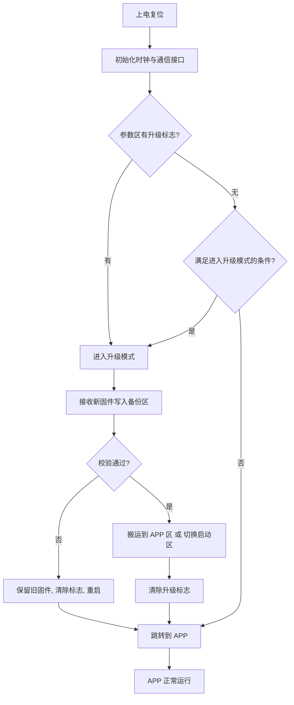

# 3.7 Bootloader 与 OTA 升级

> **前置知识**：[1.2 编译链接与内存布局](../01-编程与软件基础/02-编译链接与内存布局.md) · [2.5 Flash 存储与参数管理](../02-MCU与体系结构/05-Flash存储与参数管理.md) · [7.1 总线协议](../07-通信与物联网/01-总线协议.md)
> **掌握标准**：能给自己的项目设计一套分区方案，做出一个可用的 Bootloader，并说清双区备份、升级失败回滚、掉电保护分别解决了什么问题
> **对应岗位**：嵌入式软件工程师 · MCU 驱动/BSP 工程师 · 物联网工程师 · 汽车电子工程师
> **练手建议**：在一块你熟悉的最小系统板上实现一个最小可用的 Bootloader：上电先跑 Bootloader，通过串口接收新固件写入 APP 区，写完跳过去运行。不要求任何花哨功能，能跳转起来就算成功

## 一个必须解决的问题

设想你的产品已经卖出去一千台，装在客户现场。这时候你发现了一个 bug。

你有三个选择：

1. **派人上门**——成本可能比设备本身还高，偏远地区根本做不到。
2. **让客户把设备拆开、接上烧录器、刷固件**——客户不会，出了问题还要你负责。
3. **让设备自己通过网络或串口把新固件收下来并自动替换**——这是几乎所有现代产品都在做的事。

第三个选择就是 **OTA**（Over-The-Air，空中下载升级）。而支撑它的底层机制，叫 **Bootloader**。

**这一篇讲的是"产品出厂之后怎么改代码"**——这是学生项目和商业产品之间最明显的一道分界线之一。很多人的代码写得很漂亮，但一旦问"你这个东西卖出去了怎么升级"，就答不上来了。

## Bootloader 是什么

**Bootloader 是一段永远不变的程序，它住在 Flash 的最开头，负责决定"接下来运行谁"。**

它做的事可以总结成一句话：**上电后先由我运行，我看一眼有没有新固件要装，装完了再把控制权交给正式程序。**

而正式程序，通常叫 **APP**（应用固件）。

这套机制也叫 **IAP**（In-Application Programming，在应用中编程）——程序自己有能力改写自己的存储区。和它相对的是 **ICP**（在电路编程，就是拿烧录器怼上去刷）和 **ISP**（在系统编程，靠芯片出厂自带的 Boot ROM）。

| 方式 | 靠什么 | 用在哪 |
|---|---|---|
| ICP | 烧录器（ST-Link/J-Link）直连芯片 | 研发阶段、产线首刷 |
| ISP | 芯片内置的 Boot ROM + 厂商上位机 | 救砖、产线首刷 |
| **IAP** | 你自己写的 Bootloader | **产品出厂后的升级** |

**关键点**：芯片出厂自带的 Boot ROM（ISP）是不可改的，你能自定义的只有 IAP。所以"做 OTA"= "写一个自己的 Bootloader"。

## 第一步永远是：想清楚内存怎么分区

**分区方案没定好，后面全是返工。** 这是整个 Bootloader 设计里最重要的一个决定，也是最容易草率对待的一步。

最基础的两区方案：

| 区域 | 内容 | 说明 |
|---|---|---|
| **Bootloader 区** | 你的引导程序 | 从 Flash 起始地址开始，**永远不被擦写** |
| **APP 区** | 正式程序 | 紧跟在 Bootloader 后面，起始地址对齐到 Flash 页边界 |
| **参数区** | 升级标志、版本号、配置参数 | 至少占一个扇区，独立于上面两个区 |

**几个必须记住的约束**：

- **Bootloader 的起始地址是固定的（通常是 0x08000000）**，因为芯片上电后必然从这里取第一条指令。
- **APP 的起始地址必须对齐到 Flash 的扇区边界**。STM32 的扇区大小不一定是 1KB（F4 系列前几个扇区是 16KB，后面是 64KB 或 128KB），跨扇区写入会失败。这是新手最常踩的坑之一。
- **Bootloader 区要预留足够的空间**。别按当前大小刚好卡死，留 20%~30% 余量——你以后可能要加签名校验、加压缩解压、加双备份逻辑。
- **参数区要独立**。因为升级过程中 APP 区会被整个擦掉，放在 APP 里的标志位会一起没掉。

> **一个实用建议**：分区方案一旦上线就很难改了（改了意味着所有已售出设备的 Bootloader 都要换）。**所以第一次设计时就把双区备份的地址预留出来**，即使第一版不用——后面想加的时候，地址是现成的。

## Bootloader 的工作流程

上电之后，Bootloader 大致按这个顺序做判断：

这里有三个细节值得单独说：

**一、永远要有"回退到旧固件"的路径。** 图里 `校验通过?` 那一步的"否"分支不是可选项——没有它，一次失败的升级就能让设备变砖。

**二、进入升级模式需要触发条件。** 常见的有：参数区有升级标志（APP 主动设置，然后重启）、上电时某个引脚被拉低、上电后一段时间内收到特定命令（给上位机一个机会）、按键长按。**至少要有两条**，因为万一通信坏了，你还需要一个物理手段能进得去。

**三、升级模式必须能超时退出。** 如果进了升级模式但一直没收到数据，不能死等——超时后跳回 APP。否则一次误触发就会让设备卡死。

## 跳转到 APP：必须做对的三件事

这一步是所有 Bootloader 新手第一个卡住的地方。**代码看起来没问题，但一跳过去就死。**

跳转前必须做三件事：

**第一，关闭所有中断和外设。** Bootloader 里开着的定时器、串口中断，跳到 APP 之后它们仍然在跑，而 APP 的向量表和 Bootloader 不是同一个——中断一来就跳到错误的地址上。**最稳妥的做法是在跳转前调用 `__disable_irq()`，并关闭（或复位）所有用到的外设。**

**第二，重新设置栈指针（MSP）。** 因为 APP 的栈顶地址写在它的向量表第 0 项里，而这个值由 APP 的链接脚本决定，和 Bootloader 的不一样。跳转前要把 MSP 改成 APP 的栈顶。

**第三，重定位向量表（VTOR）。** 这是最关键的一条。Cortex-M 默认从中断向量表基址（Bootloader 的位置）取中断入口。APP 必须把 `SCB->VTOR` 改成自己的起始地址，否则**所有中断都会跳到 Bootloader 的向量表里**，症状是"主循环能跑，一进中断就死"。

> **这个坑极其经典**：现象是 LED 闪烁正常（说明主循环在跑），但串口一收数据就死（说明中断跳错了）。看到这个组合，第一反应就该是 VTOR。

三件事都做完，才能把控制权交出去。

## 升级数据从哪来

**Bootloader 本身不关心数据从哪来**——它只关心"收到完整的、正确的固件"。所以通信通道是可替换的，写一次升级逻辑，能用在多个场景：

| 通道 | 典型场景 | 注意点 |
|---|---|---|
| **串口（UART）** | 调试、产线、给客户配一个上位机工具 | 最简单，速度够用，是练手的首选 |
| **CAN** | 汽车、工业设备 | 需要自定义分包协议，注意总线负载 |
| **RS-485 / Modbus** | 工业现场 | 半双工，收发切换时序要处理好 |
| **以太网** | 工业网关 | 速度快，但协议栈复杂 |
| **无线模组（WiFi/4G/NB-IoT）** | 消费类、物联网设备 | 最贴近"OTA"的原意，也最不稳定 |
| **SD 卡 / U 盘** | 设备现场无网络时 | 免通信，插卡即可升级 |

**结论：先做串口版本**。把整套升级逻辑（分包、校验、重传、写入、跳转）在串口上跑通，再换通道只是把 `recv()` 换个实现，逻辑一模一样。

## 传输协议：比你想的更需要设计

很多人第一次做 OTA 时，以为"把 bin 文件分成若干包发过去就行"。实际会遇到这些问题：

- **丢包**：无线和 CAN 都会丢包，必须能检测到并重传。
- **乱序**：某些通道（尤其是网络）不保证顺序。
- **重复**：重传导致同一个包收到两次。
- **中途断开**：升级到 80% 时断线了怎么办。
- **进度反馈**：上位机需要知道升级到哪了。

所以一个能用的升级协议通常包含这些字段：

| 字段 | 作用 |
|---|---|
| **包序号** | 检测丢包、乱序、重复 |
| **数据长度** | 最后一包通常不满，需要知道实际长度 |
| **校验（CRC/checksum）** | 单包完整性，检测传输错误 |
| **总长度 / 总包数** | 判断是否收完 |
| **命令字** | 区分"开始升级""传输数据""结束升级""查询状态" |

**单包校验 + 整包校验，两个都要有。** 单包校验保证每个包没传错，整包校验（通常是固件整体的 CRC 或哈希）保证所有包拼起来是对的——因为存在"每个包都对但少了一包"的情况。

## 校验：最后一道防线

**固件写完之后必须校验，这是不可省略的一步。**

| 校验手段 | 强度 | 用在哪 |
|---|---|---|
| **校验和（累加和）** | 弱 | 快速判断，能查出大部分错误，但有碰撞可能 |
| **CRC32** | 中 | **最常用的选择**，能查出绝大多数错误，速度快，实现简单 |
| **哈希（SHA-256）** | 强 | 需要防篡改时使用 |
| **数字签名** | 最强 | **安全性要求高的场景必须用** |

**分清楚两种需求**：

- **防传输错误**：CRC32 就够了。它保证"固件在传输和写入过程中没有损坏"。
- **防恶意固件**：必须用**签名**。CRC 只检查"数据有没有坏"，不检查"这是不是我们的固件"——攻击者可以自己做一个固件、算一个正确的 CRC 烧进去。**要防止这个，必须用私钥签名 + 设备端公钥验签。**

后者对消费类产品常常被忽略，但对汽车、医疗、工业设备是硬要求。相关概念见 [7.5 安全与加密](../07-通信与物联网/05-安全与加密.md)。

**还有一个容易被忽略的校验**：写完 Flash 之后，**回读一遍**再校验。因为写入失败、Flash 坏块、电源不稳都可能导致"写进去了但内容是错的"。回读校验能抓到这类问题。

## 升级流程的完整闭环

一个可靠的升级流程，不是"收到固件 → 写入 → 跳转"这么简单，而是一个**带状态记录的闭环**：

1. **APP 收到升级命令**，确认要升级。
2. **APP 在参数区写下"升级标志"**（同时记录新固件的版本号和 CRC）。
3. **APP 复位**（或者跳回 Bootloader）。
4. **Bootloader 看到升级标志**，进入升级模式。
5. **接收固件**，写入**备份区**（不是直接覆盖 APP 区！）。
6. **校验**：CRC 对不对、签名对不对、版本号是否比当前新（防止降级攻击或误刷）。
7. **校验通过**：搬运到 APP 区，或者直接切换启动区。
8. **写"升级成功"标志**，清除升级标志，**复位**。
9. **Bootloader 重新启动**，发现没升级标志，跳转到新 APP。
10. **新 APP 起来后，做一次自检，然后确认升级成功**（这一步叫 confirm，见下）。

**第 10 步是很多人漏掉的**：如果新固件虽然在语法上完整，但一运行就死循环或者连不上网，设备就永久卡在了"看起来升级成功"的状态。**解决办法是"试用期"机制**：升级后先标记为"待确认"，只有新固件成功启动并主动确认之后，才把标志改成"确认"。如果连续几次启动都没等到确认，就自动回滚到旧固件。

## 双区备份与回滚

**这是 Bootloader 设计里最能体现功底的部分。**

最朴素的方案是"单区覆盖"：收到新固件，直接擦掉 APP 区，往里写。问题是——**写到一半掉电，设备就彻底变砖了**，因为旧固件已经被擦掉，新固件又不完整。

**双区方案（也叫 A/B 分区）解决的就是这个问题**：

| 方案 | 做法 | 优点 | 代价 |
|---|---|---|---|
| **单区** | 收到固件直接覆盖 APP 区 | 省 Flash | **掉电即变砖，不推荐** |
| **双区四步** | 先写备份区，校验通过后再搬运到 APP 区 | 掉电安全 | 搬运期间仍有短暂风险窗口 |
| **A/B 双区** | 两个完整的 APP 区，升级时写另一个，改一个"当前启动区"标志 | **完全无风险**，可直接回滚 | 需要双倍 Flash |
| **外部存储** | 固件先下到外部 Flash/SD 卡，再搬运 | 不占内部 Flash | 多一颗器件 |

**怎么选？**

- **Flash 充足（比如 512KB 以上）且对可靠性要求高** → A/B 双区。这是最干净的方案，升级失败只需改一下标志就回到旧版本。
- **Flash 紧张** → 双区四步。用搬运的方式省掉一个完整的 APP 区，但要在搬运过程中格外注意掉电保护。
- **Flash 极其紧张（比如 32KB）** → 只能单区 + 外部存储，或者考虑压缩固件再解压写入。

**记住一条底线：升级过程中任何时刻掉电，设备都必须还能启动到某个能用的状态。** 这是设计的验收标准，不是可选项。

## 掉电保护：真正考验设计的地方

上面所有方案的可靠性，最终都落到同一个问题上：**断电发生在第 3 毫秒的时候会怎样？**

设计方法：

1. **把"升级状态"存在独立扇区**，而不是存在 APP 里。每一步操作前先更新状态。
2. **状态机的每一步都设计成可恢复的**。比如状态是"正在写入备份区"，掉电重启后 Bootloader 看到这个状态，就知道"备份区可能是残缺的"，直接丢弃、回到旧 APP，而不是傻乎乎地继续。
3. **只有通过了完整校验，才认为新固件是有效的**。校验通过之前，绝对不碰 APP 区。
4. **跳转到 APP 之前，先确认 APP 区本身是有效的**（用存在参数区的 CRC 校验）。如果 APP 区坏了而备份区是好的，就尝试从备份区恢复。
5. **测试掉电**：在升级过程中反复随机断电，每次都要确认设备能恢复。**这个测试必须做，而且要在不同进度点各做几次。**

**第 5 条是最容易被跳过、也最应该做的**。很多人的 Bootloader 在实验室里完美运行，一到现场就变砖——因为它们从来没有在"升级到一半时断电"的情况下被验证过。

## 差分升级：省流量但不省事

固件动辄几百 KB 到几 MB，通过 NB-IoT 这类低带宽通道传输，流量费可能比设备还贵。**差分升级（差分升级包 / delta 升级）**的思路是：只传"新旧固件之间的差异"，设备端在本地把差异和旧固件合并出新固件。

| 优点 | 代价 |
|---|---|
| 升级包体积可缩小到原固件的 5%~20% | 需要版本一一对应，无法跨版本升级 |
| 省流量、省时间、省电 | 设备端需要额外的 RAM 或 Flash 来做合并 |
| | 合并算法本身有 bug 风险 |

**判断建议**：如果你的设备走的是 WiFi 或以太网，**不要做差分升级**——省下的流量不值得引入的复杂度。如果你的设备走 NB-IoT、LoRa 这类按流量计费的低速通道，差分才值得考虑。这是典型的"看起来高级但不一定划算"的技术。

## 生产环节：Bootloader 也用得上

Bootloader 不只用于现场升级，产线上同样有用：

- **产测固件与出厂固件的切换**：产线烧一个带完整测试功能的固件，测完通过 Bootloader 换回正式固件。
- **批量烧录**：通过 Bootloader + 上位机同时给多台设备刷固件，比一台台插烧录器快得多。
- **写入序列号、MAC 地址、校准参数**：这些"每台设备都不同"的信息，通常由产测工具通过 Bootloader 的接口写进参数区。
- **首刷**：产线的第一版固件仍然靠烧录器（ICP）写入，但后续全部走 Bootloader。

**所以 Bootloader 通常不只是"升级工具"，它还是产线的接口。** 做设计时把产线需求一起考虑进去，能省掉后面重新做一遍的麻烦。

## 新手最容易踩的坑

| 坑 | 后果 | 怎么避 |
|---|---|---|
| **忘记重定位 VTOR** | 主循环正常，一进中断就死 | 跳转前设置 `SCB->VTOR` |
| **忘记关中断** | 跳转后随机崩溃 | 跳转前关全局中断、复位外设 |
| **APP 起始地址没对齐扇区** | Flash 写入失败 | 查数据手册确认扇区大小 |
| **Bootloader 和 APP 的链接脚本没改** | APP 从 0x08000000 开始，把 Bootloader 覆盖了 | APP 工程必须改起始地址和大小 |
| **APP 中断向量表没改** | 同上，跳到错误的向量表 | 改 VTOR 或改链接脚本里的向量表偏移 |
| **直接覆盖 APP 区** | 升级中断电即变砖 | 用双区方案 |
| **不做整包校验** | 少收一包也照样启动，行为诡异 | 单包校验 + 整包 CRC 都要有 |
| **没有超时退出升级模式** | 一次误触发就卡死 | 升级模式加超时 |
| **升级后不确认** | 新固件启动即死，设备永久卡住 | 加"试用期 + 确认"机制 |
| **从不测试掉电** | 实验室完美，现场变砖 | 反复随机断电测试 |

## 学习建议

1. **先做最小可用版本**。在一块 STM32 上写一个只会做三件事的 Bootloader：延时几秒、通过串口收固件、跳转到 APP。不要一上来就做双区、签名、差分——那些都是在这三件事之上加的东西。
2. **重点体会那三件跳转前必须做的事**（关中断、设 MSP、设 VTOR）。亲手把 VTOR 那行删掉，观察现象，你会永久记住这个坑。
3. **把 APP 也改对**。很多人 Bootloader 写对了，但忘了改 APP 工程的链接脚本起始地址和向量表偏移，结果 APP 烧进去把 Bootloader 覆盖了，或者一进中断就死。这两处必须一起改。
4. **必须做掉电测试**。升级到 20%、50%、80% 时各断电几次，确认设备每次都能恢复。这是把"能用"变成"可靠"的分界线。
5. **最后再加可靠性机制**：版本号校验、回滚、试用期确认、签名。按这个顺序加，每加一个都对应一个具体的失败场景。
6. **不要一开始就做差分升级**。它的复杂度远超收益，除非你确实在低带宽通道上。
7. **面试价值**：Bootloader 是嵌入式面试的高频题，因为它同时考察 Flash 操作、启动流程、中断向量表、链接脚本、状态机设计和可靠性思维。**能完整讲清一套自己的升级方案，比会调十个外设更能证明能力。**

## 小节总结

Bootloader 解决的是"产品出厂之后怎么改代码"这个问题，而 OTA 是它在无线场景下的应用形态。它是学生项目和商业产品之间一道清晰的分界线。

核心内容可以拆成四层：**分区**（Bootloader 区、APP 区、参数区，APP 起始地址必须对齐扇区，参数区必须独立）；**跳转**（关中断、设 MSP、设 VTOR，三件事缺一不可，其中 VTOR 是最经典的坑）；**流程**（写标志 → 重启 → 收固件到备份区 → 校验 → 搬运 → 确认，每一步都要能从中断恢复）；**可靠性**（双区备份、掉电保护、试用期确认、可回滚）。

需要建立的几个判断：**校验是为了防传输错误，签名是为了防恶意固件，两者不能互相替代**；**单区覆盖能省 Flash 但会让设备有变砖风险，除非 Flash 极其紧张，否则不要用**；**差分升级看起来高级，只在低带宽通道上才划算**；**没有做过掉电测试的 Bootloader 等于没有验证过**。

最后一条建议：**把 Bootloader 当成一个可靠性问题来做，而不是一个功能问题。** 功能上"能升级"很简单，难的是"在任何意外情况下都不会变砖"——而后者才是这个技术真正的价值所在。

---

本章目录：[3. 嵌入式软件工程](README.md) ｜ 总目录：[返回首页](../../README.md)
上一篇：[3.6 调试方法论](06-调试方法论.md) ｜ 下一篇：[4.1 RTOS 概述与裸机局限](../04-实时操作系统/01-RTOS概述与裸机局限.md)
