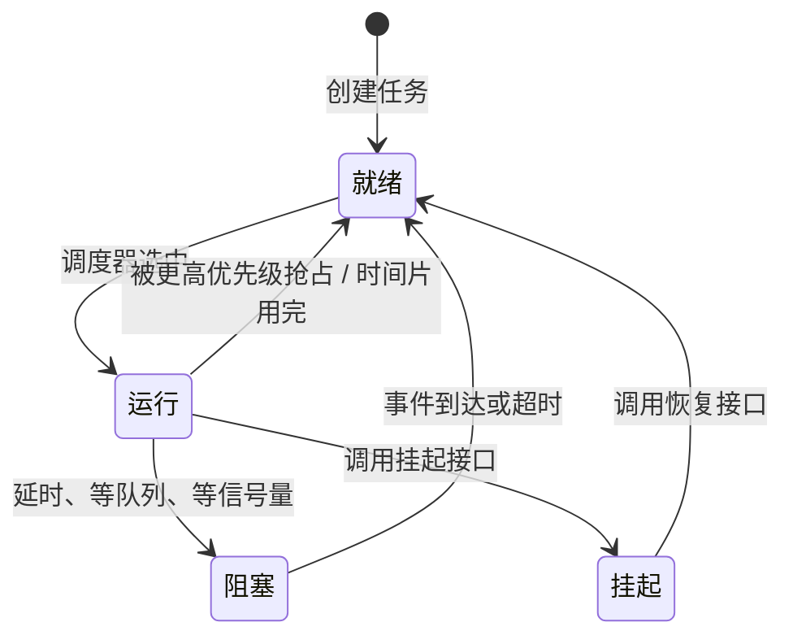

# 4.2 FreeRTOS

> **前置知识**：[4.1 RTOS 概述与裸机局限](01-RTOS概述与裸机局限.md)
>
> **掌握标准**：能独立用 FreeRTOS 搭起一个多任务工程，正确使用任务、队列、信号量、互斥锁，并能说清每种的适用场景
>
> **对应岗位**：嵌入式软件工程师 · 电机控制工程师 · 物联网工程师 · 汽车电子工程师
>
> **练手建议**：用 FreeRTOS 写一个三任务系统——一个任务采集 ADC、一个任务做数据处理、一个任务通过串口上报，三者之间用队列传递数据

## 为什么 FreeRTOS 是大多数人的第一站

FreeRTOS 是目前全球使用最广泛的嵌入式实时操作系统之一。它之所以能占到这样的位置，靠的不是功能最多，而是几件事同时成立：开源免费、内核精简、移植成熟、生态庞大。

对初学者来说，还有一条很现实的理由：**像 STM32F103 这种级别的单片机也能流畅运行它。** 你手上最便宜的那块开发板就够用，不用为了学 RTOS 先换硬件。

它的优势集中在三点。

**第一，内核小，学习门槛相对低。** 它不像 Linux 那样体系庞大，核心内容就集中在任务调度、同步通信和内存管理这三块。你要理解的概念不多，正好适合从"裸机思维"逐步过渡到"多任务系统思维"。

**第二，生态成熟，资料非常多。** 官方文档、STM32 教程、视频课程、各种开发板例程一应俱全。遇到问题基本都能搜到解决思路——这件事在真实工作里的价值，往往超过内核本身的设计优劣。

**第三，和 STM32 生态结合得很好。** CubeMX 可以直接勾选启用 FreeRTOS，并自动生成基础初始化代码。很多时候你不需要从零移植，只要理解生成出来的代码结构，然后在上面继续开发就行。

顺便说一句"可裁剪"：FreeRTOS 用配置文件（FreeRTOSConfig.h）把你不需要的功能整块关掉。不用队列就不编译队列，不用事件组就不编译事件组，最终固件里只会留下你声明要用的那部分。这是它能在几 KB RAM 的芯片上跑起来的关键。

## 任务：RTOS 里的基本单位

任务是 FreeRTOS 里最核心的概念。**一个任务就是一段永不返回的函数加上它自己的栈和上下文。** 创建、删除、挂起、恢复这几个操作要熟练，但更重要的是理解它们背后的运行规则。

### 任务函数的形态

任务函数有一个固定约定：**它必须是一个死循环，永远不返回。** 正常的写法是函数体里一个不带结束条件的循环，循环里做这个任务该做的事，遇到需要等待就调用延时或阻塞型 API 把 CPU 让出去。

如果任务函数真的返回了，内核会认为这是编程错误——返回意味着这个任务"结束"了，但任务没有"结束"这个状态，FreeRTOS 的处理是把它删除或触发断言。所以**任何写在循环外面的收尾代码都不会被执行**，这是新手常见的困惑。

### 优先级

每个任务创建时都要指定优先级。数值越大优先级越高（默认配置下），范围由 configMAX_PRIORITIES 决定。

关于优先级，有一条必须尽早建立的认知：**高优先级不等于一直跑，而是"只要它不就绪，低优先级任务就有机会"。** 所谓就绪，是指它当前不需要等待任何东西。一旦一个高优先级任务调用了延时、或者阻塞在一个空队列上，它就进入阻塞态，CPU 立刻交给下一个优先级最高的就绪任务。

这也是新手最容易翻车的地方：**把高优先级任务写成死循环且不加任何阻塞**，结果这个任务永远处于就绪态，内核永远不会把 CPU 让给别人，系统里其他任务全部跑不起来。现象是"创建了五个任务，只有一个在跑"，原因就是这个。

### 栈

FreeRTOS 里每个任务有独立的栈，大小在创建任务时指定。**它不是自动增长的**，给多少就是多少。栈里放的是局部变量、函数调用的返回地址、中断嵌套时的现场。栈给少了会溢出，溢出的后果见下一节和 4.4。

### 任务状态机

FreeRTOS 的任务在四个状态之间迁移，理解这张图，调度行为就不难推断了。

**就绪**是"万事俱备，只差 CPU"；**运行**是正在占用 CPU（单核上只有一个任务处于这个状态）；**阻塞**是有明确原因的等待，并且大多数阻塞都带超时；**挂起**是被人为冻结，不会因为没有超时而自己醒过来——这一点是挂起和阻塞最本质的区别，也是很多"任务莫名不跑了"的根因。

## 调度策略：抢占式与时间片轮转

FreeRTOS 默认是**优先级抢占式调度**：高优先级任务一旦就绪，会立即抢占正在运行的低优先级任务，不等当前任务让出 CPU。

如果多个同优先级任务同时处于就绪态，它们之间按**时间片轮转**执行，每个任务跑一个 tick 的时间再换下一个。时间片轮转只在同优先级之间生效，跨优先级永远是高者优先。

**为什么默认是抢占式？** 因为实时系统的核心诉求就是"关键事件要在确定的时间内被处理"。抢占式调度提供了这个保证：只要你把电机控制任务的优先级设得足够高，它就不会因为串口任务正在解析数据包而被拖延。

抢占式的代价是**切换开销和推理难度**。你以为两行代码之间不会被打断，实际上可能被抢占十几次。任何跨任务的共享数据，都必须用内核提供的机制保护，靠"我觉得这中间不会被打断"是靠不住的。

## 任务栈该给多少

这是新手最常见的故障来源，也是最有方法可循的一件事。

**先给一个保守的估计值，再用工具核实，不要一上来就调优。** 估算思路：

| 任务类型 | 大致区间 | 说明 |
|---|---|---|
| 只有简单变量、调用少量函数 | 128~256 字节 | 逻辑很轻的管理类任务 |
| 调用标准库（printf 类） | 512 字节以上 | 格式化输出极其吃栈 |
| 有较深函数调用或大局部数组 | 512~1024 字节 | 局部大数组能改成静态或全局就改 |
| 涉及浮点、协议解析、文件系统 | 1 KB 以上 | 这些库内部调用层次深 |

**核实方法是高水位线接口。** FreeRTOS 提供一个查询任务栈历史最小剩余量的接口，它记录的是这个任务从创建到现在，栈用得最狠的那一刻还剩多少。在任务跑了一遍完整业务流程之后去查这个值：

- 剩余量接近 0，说明栈快用完了，必须加大。
- 剩余量长期大于一半，可以考虑适当缩小，省下 RAM 给别的任务。

**还要打开栈溢出检测。** FreeRTOS 有一个编译期配置项用来开启栈溢出检查，通常有两个级别：一种是任务切换时检查栈指针是否越界，另一种是在任务栈的末尾填特征值、切换时检查这些值有没有被改写。开了之后，栈溢出会触发断言或钩子函数，你能第一时间知道是哪个任务出的问题——**不开的话，表现就是某个毫不相干的变量被改成了乱值。**

## 任务间通信的四种方式

系统里一旦有多个任务，就必然遇到两个问题：任务之间怎么交换数据？多个任务怎么安全访问同一个资源？这就是同步与通信机制要解决的事。

**这里有一条原则必须先立起来：能不用全局变量硬传数据，就尽量不要硬传。** 全局变量在多任务环境里是所有诡异 bug 的温床——你不知道它什么时候被谁改的，编译器优化还可能让它更糟。RTOS 已经提供了成熟的机制，用好这些工具，代码会更规范，问题也少得多。

### 队列：传递数据

队列是最常见的任务间通信方式，用于在任务之间传递结构化数据。典型用法是：串口接收任务把解析好的数据包投进队列，控制任务从队列里取出来处理。

队列自带三个好处：**数据是拷贝进出的**（不用操心缓冲区归属）、**投递和取出都是原子的**（不用额外加锁）、**可以在空队列上阻塞等待**（不用轮询浪费 CPU）。队列长度和单条数据大小都在创建时固定。

### 信号量：通知事件

信号量不传数据，只传"发生了一件事"。分成两种：

- **二值信号量**：只有 0 和 1，用于"事件到了，通知另一个任务"。中断里检测到按键按下，释放一个二值信号量，处理任务被唤醒。
- **计数信号量**：有多个计数，用于"某种资源有多个可用实例"，比如一个缓冲区池里有 5 块可用缓冲，也可以用来统计中断发生了多少次。

### 互斥量：保护共享资源

互斥量本质上也是一种锁，用来保证同一时刻只有一个任务能进入某段代码（临界区）。它和信号量最大的不同是**带优先级继承机制**，专门用于保护共享资源。

一条实践准则：**互斥量保护的临界区越短越好。** 拿锁、改一个变量、放锁，这才是互斥量的正确用法。拿着锁去调用耗时的操作，等于人为制造了一次长关中断，整个系统的实时性都会被拖垮。

### 事件组：等待多个事件

事件组管理一组事件标志位，可以让一个任务同时等待多个条件。比如"网络已连接""传感器初始化完成""电机允许启动"这三个条件，可以用不同的事件位表示，任务一次性等它们全部成立，或者等其中任意一个成立。

它和信号量的区别在于：信号量一次只能通知一件事，事件组一次可以通知一组，而且支持"等所有位"和"等任意位"两种等待方式。

### 补充：任务通知、流缓冲区和消息缓冲区

**任务通知**是 FreeRTOS 里很高效的一种轻量级通信方式，开销比队列和信号量更小，因为它直接写目标任务的控制块，不需要额外的队列结构。它适合一对一的场景，比如中断通知某个固定的处理任务。代价是一个任务只有一个通知值，没法多对一，也没法广播。实战中非常常用。

**流缓冲区和消息缓冲区**适合处理字节流或变长消息，比如串口数据流、不定长的协议报文。它们由一个写者、一个读者使用，属于比较实用的进阶内容，等到你需要在中断和任务之间搬大量数据时再回来看。

### 选择速查表

| 需求 | 用什么 | 为什么 |
|---|---|---|
| 把一批数据交给另一个任务 | 队列 | 传数据、自带阻塞等待、线程安全 |
| 从中断通知任务"有事件" | 二值信号量 / 任务通知 | 开销小，专为这种场景设计 |
| 保护一段共享资源 | 互斥量 | 带优先级继承，防优先级反转 |
| 等好几个条件都满足 | 事件组 | 位操作，一次等多个 |
| 统计事件发生次数、管理资源池 | 计数信号量 | 有计数能力 |
| 一等一的快速通知 | 任务通知 | 最快的通知方式 |
| 变长报文、字节流 | 消息缓冲区 / 流缓冲区 | 专门为不定长数据设计 |

## 二值信号量和互斥量的区别（必考）

这是面试里出现频率最高的 RTOS 问题之一，必须能讲清楚。

两者看起来都是"0 或 1 的开关"，但设计目的完全不同：

| 对比项 | 二值信号量 | 互斥量 |
|---|---|---|
| **用途** | 事件通知 | 资源保护 |
| **谁释放** | 通常由另一个任务或中断释放 | 必须由持有者自己释放 |
| **优先级继承** | 没有 | 有 |
| **典型场景** | 中断里释放，任务里等待 | 两个任务访问同一个串口/队列/全局结构 |

**关键差别在优先级继承。** 设想一个场景：低优先级任务 A 拿到了互斥量，正在改一个共享结构；此时高优先级任务 B 就绪，抢占了 A；B 也要这个互斥量，于是阻塞等待；这时中优先级任务 C 就绪了，因为 B 在阻塞、A 被抢占，C 反而跑起来了。结果是**高优先级的 B 被中优先级的 C 无限期地压住了**——这就是优先级反转。

优先级继承的解决办法是：当 B 去申请 A 持有的锁时，内核临时把 A 的优先级提升到和 B 一样高，让 A 尽快执行完并释放锁，等 A 释放后再恢复原优先级。这样 C 就没法插队了。

**而二值信号量没有这个机制。** 所以**用二值信号量去保护共享资源，就是在给自己埋优先级反转的雷**。二者不能混用：通知事件用二值信号量，保护资源用互斥量。

另外两条也常被问到：**互斥量不能在中断里使用**（中断不是任务，没有"持有者"的概念，也没法参与优先级继承）；**互斥量有递归版本**，允许同一个任务重复获取同一把锁（嵌套），但只允许持有者自己重复获取。

## 中断安全 API：为什么必须有 FromISR 版本

FreeRTOS 对"在中断里调用的 API"和"在任务里调用的 API"做了严格区分，很多函数都有带 FromISR 后缀的版本，比如队列发送的中断版本、任务通知的中断版本。

**为什么必须区分？** 三个原因：

1. **任务版 API 会在需要时触发任务切换。** 在任务上下文里这是正常的，但在中断里，切换只能发生在中断退出前，由中断退出时的汇编代码统一处理。中断里不能直接切换，否则压栈现场就乱了。
2. **中断里不能阻塞。** 任务版 API 大都带超时参数，用完可以等；中断服务程序必须尽快返回，不能等。
3. **内核需要知道"中断期间有没有更高优先级任务被唤醒"**。中断版 API 会把这件事记录在一个标志里，中断退出时检查这个标志，决定要不要切换。

**使用中断版 API 还有两条配对规则**：必要时要调用中断进入/退出相关的宏来告诉内核"我现在在中断里"；中断版 API 通常会通过一个参数回传"是否需要切换"，中断退出时要根据这个值决定是否触发切换。CubeMX 生成的代码里这些宏都放好了，但你要知道它们不是装饰。

**用错版本的后果很隐蔽**：不会编译报错，可能长时间都正常，只在特定时序下偶发崩溃或任务卡死。所以"中断里必须用中断安全版本"这条规则，要当成纪律来执行。

## 软件定时器

有些定时事件不需要单独开一个任务，比如超时检测、周期上报、心跳包。FreeRTOS 的软件定时器就是为这类需求准备的。

它的本质是：**由内核的定时器服务任务统一管理所有软件定时器。** 你注册一个回调函数和周期，时间到了服务任务自动调用你的回调。回调运行在服务任务的上下文里，不是中断上下文。

三点使用注意：

- **回调里不能阻塞、不能调用带超时的 API**，因为它是被服务任务调用的，一阻塞整个服务任务就停了，所有软件定时器全部失准。要干耗时的活，就在回调里发个队列或信号量，交给别的任务做。
- **它是一个任务，不是硬件定时器**，所以精度受 tick 和系统负载影响，不要拿它做微秒级时序。
- **相比为每个小功能新建一个任务，它更省资源**，任务栈只需要一份。

## 内存管理：heap_1 到 heap_5

FreeRTOS 提供了五种内存分配方案，学习时不需要一开始就死抠源码，但必须知道它们的区别和适用场景。

| 方案 | 能力 | 线程安全 | 适用场景 |
|---|---|---|---|
| **heap_1** | 只能分配，不能释放 | 是 | 任务和队列在启动阶段全部创建完、运行期不再动态申请的系统 |
| **heap_2** | 能分配能释放，但不合并碎片 | 是 | 已被 heap_4 取代，新项目不建议用 |
| **heap_3** | 直接调用标准库的内存分配接口 | 靠关调度器保证 | 一般不建议，标准库实现不可控 |
| **heap_4** | 能分配能释放，支持合并相邻空闲块 | 是 | **最常用**，通用性和稳定性平衡最好 |
| **heap_5** | 在 heap_4 基础上支持多段不连续内存区 | 是 | 内存分散在片内 SRAM、外部 SRAM 等不同区域的复杂布局 |

**为什么实际项目里最常见的是 heap_4？** 因为它同时具备"能释放"和"能合并碎片"两个能力，长期运行的系统中不会因为碎片累积而分配失败。新手阶段记住这一条就够用：**多数项目优先考虑 heap_4。**

**为什么不建议用 heap_3？** 因为它把分配交给标准库的实现，而这个实现的行为依赖具体工具链和编译选项，在嵌入式平台上体积和碎片表现都不可控，而且它靠挂起调度器来保证线程安全，代价比内核自带的方案更高。**你在 PC 上习惯的那套内存分配，在单片机上是没有质量保证的。**

还有一点比选哪种方案更重要的：**在 RTOS 里频繁动态申请和释放内存本身就是风险。** 碎片化、分配失败、性能抖动都由此而来。稳妥的做法是在系统启动阶段把队列、信号量、任务栈全部创建好，运行期不再申请；确实需要运行期分配的地方，用固定块内存池代替通用堆分配。这一点在 4.4 里有更详细的讨论。

顺带说一句：队列、信号量、任务栈这些对象既可以用动态方式创建（从堆上分配），也可以用静态方式创建（由你提供存储空间）。**对可靠性要求高的项目，静态创建是更好的选择**——编译期就能算出 RAM 占用，运行时不会有分配失败。

## 空闲任务与钩子函数

FreeRTOS 在调度器启动时会自动创建一个**空闲任务**，优先级最低。它的作用是：当所有其他任务都在阻塞时，总得有个任务占着 CPU，不能让调度器面临"无任务可运行"的境地。

空闲任务还有一个实际作用：**回收被删除任务的内存。** 你删除一个动态创建的任务时，它占用的内存不是立刻释放的，而是由空闲任务来回收。所以空闲任务必须有机会运行——如果你把所有任务都设成最高优先级并且全都不阻塞，空闲任务永远跑不了，被删任务的内存也永远回不来。

FreeRTOS 提供了两个空闲任务的钩子函数（在空闲任务每轮循环里被调用）：一个在每次循环时调用，一个在系统即将进入低功耗时调用。**后者是低功耗设计的常用入口**——系统没事干的时候在钩子里进睡眠，有事再唤醒。要注意钩子运行在空闲任务上下文，同样不能阻塞。

## tick 与配置取舍

FreeRTOS 的一切时间概念都建立在 **tick（系统节拍）** 上：延时是按 tick 算的，时间片是一个 tick，软件定时器的精度也是一个 tick。tick 频率由 configTICK_RATE_HZ 决定，常见取值是 100 Hz 和 1000 Hz。

| tick 频率 | 每 tick 时长 | 优点 | 代价 |
|---|---|---|---|
| 100 Hz | 10 毫秒 | 切换开销小，适合低功耗 | 延时和定时的分辨率只有 10 毫秒 |
| 1000 Hz | 1 毫秒 | 时间分辨率高，控制类任务友好 | 每秒多出几百次节拍中断，开销和功耗上升 |

**选择的依据是你的最小时间粒度需求。** 如果系统里最短的周期任务是 10 毫秒的控制环，tick 定 1000 Hz 就很合适；如果系统大部分时间在睡眠、只偶尔处理一下通信，100 Hz 甚至更低更省电。

**这里有一个低功耗的经典冲突**：tick 中断会把 CPU 从睡眠里周期性唤醒，tick 频率越高，睡眠被打断得越频繁，功耗越高。很多芯片支持无节拍模式或动态调整 tick，但这个话题已经超出入门范围，知道"高 tick 频率是有代价的"就够了。

## 一个标准的 FreeRTOS 工程长什么样

把前面这些拼起来，一个典型的项目结构是这样的：

- 一个任务负责串口接收，只做搬运，收到数据就投进队列；
- 一个任务负责协议解析和数据处理，阻塞在队列上等数据；
- 一个任务负责电机控制，高优先级、严格周期运行；
- 一个任务负责状态显示或上报，优先级最低；
- 数据通过队列传递，共享资源用互斥量保护，系统状态用事件组管理。

这就是非常标准的 RTOS 项目结构。相比裸机把所有逻辑塞进一个主循环，它的好处是：**任务职责更单一，模块边界更清晰，后续加功能时不容易把整个系统搞乱。**

再加一条中断的用法，这是从裸机过渡到 RTOS 最关键的习惯转变：

**中断里只做最少的事，真正耗时的处理放到任务里做。** 比如串口接收中断，不要直接把一整套协议解析做完，而是尽快把数据搬进缓冲区，然后通知解析任务去处理。这样既保证了中断响应速度，又让系统结构清晰。

## FreeRTOS 常见坑清单

下面这些是新手几乎一定会踩一遍的，先看一遍，出问题时回来对照。

| 坑 | 表现 | 正确做法 |
|---|---|---|
| 在中断里调用非中断安全 API | 偶发崩溃、任务莫名卡死 | 中断里一律用带 FromISR 后缀的版本 |
| 任务栈开太小 | 变量被篡改、莫名其妙跑飞 | 用高水位线接口核实，并开启栈溢出检测 |
| 临界区里做耗时操作 | 系统整体响应变慢、中断延迟变大 | 临界区只放必要的几行代码 |
| 高优先级任务不加阻塞 | 其他任务全部跑不起来 | 循环里必须有延时或阻塞点 |
| 忘了设优先级或全设成一样 | 关键任务得不到及时响应 | 按实时性需求明确分级 |
| 忘记打开 assertion 配置 | 用错 API 时静默失败 | 开发阶段务必开启，让错误立刻暴露 |
| 用二值信号量保护共享资源 | 偶发优先级反转、时序诡异 | 保护资源一律用互斥量 |
| 运行期频繁动态申请内存 | 随机时刻分配失败 | 启动阶段创建好，或改用内存池 |

**最后一条值得单独强调**：把 assertion 打开。FreeRTOS 有一系列检查项，打开之后，参数传错、在中断里调用了不允许的 API、栈溢出等情况都会立刻触发断言停在出错的地方。关掉它们，这些错误会变成"偶尔跑飞"，让你花几天时间去猜。**开发阶段全部打开，量产版本再按需裁剪。**

## 学习建议

建议的学习顺序是：**先点灯，再多任务，再通信，最后才碰内存管理。**

1. 用 CubeMX 建一个工程，开两个任务，一个闪灯一个串口打印，先确认调度真的在跑。
2. 把优先级改一改，观察现象——特别是把高优先级任务写成不阻塞的死循环，亲眼看一次"其他任务全饿死"，这个印象比看文档深得多。
3. 加上队列，做一个"生产任务投递、消费任务取出"的最小例子。
4. 加上互斥量，做两个任务抢同一个串口的例子。
5. 最后做那个三任务练手项目：ADC 采集 → 数据处理 → 串口上报，用队列串起来。

关于资料，推荐韦东山的 [FreeRTOS 入门与工程实践 —— 由浅入深带你学习 FreeRTOS](https://www.bilibili.com/video/BV1Jw411i7Fz)（12 小时多，基于 STM32、以实际项目为导向）。它讲得系统，但对刚从裸机转过来的人来说入门偏难，节奏快、信息密度大，容易一上来就被劝退。**建议先随便找一套轻量的入门教程把任务、队列、信号量跑通，做到能点灯、能在两个任务间传数据之后，再回来看韦东山这套**，这时候吸收效率会高很多。同一位作者的《[FreeRTOS 的内部机制](https://www.bilibili.com/video/BV1Ar4y1C7En)》偏原理，适合在能跑起来之后用来补"为什么"。

一个重要的提醒：**不要一上来就去啃内核源码。** 先把 API 用熟、把现象看明白，等你能预判"这段代码会怎么调度"的时候，再去看源码实现，那时候才看得懂它在做什么取舍。

## 小节总结

**FreeRTOS 的价值在于"够用且好获得"。** 它不追求功能全面，只把调度、同步、时间、内存这四件事做扎实，剩下的交给你自己组织。这也是它适合入门的原因——要理解的概念不多，但每一个都直通实时系统的核心。

**任务、队列、信号量、互斥量这四样，构成了绝大多数 FreeRTOS 工程的全部骨架。** 任务负责划分职责，队列负责传数据，信号量负责传事件，互斥量负责保护资源。把这四者用对，代码结构基本就不会出大问题；用错其中任何一个（尤其是拿二值信号量保护资源），埋下的都是难查的偶发故障。

**优先级设计是 FreeRTOS 工程里最需要动脑子的一步。** 优先级不是"重要性排序"，而是"响应时间要求排序"。同时要记住那条铁律：高优先级任务必须在循环里有明确的阻塞点，否则它会饿死整个系统——这是新手第一个也是最典型的一次翻车。

**栈和内存是故障的两大源头，而且都有一个共同特征：出问题的位置和现象的位置对不上。** 栈溢出表现为别的变量被篡改，内存碎片表现为随机时刻分配失败。对付它们的办法不是猜，而是提前用工具核实——高水位线、栈溢出检测、断言，全都开着。

最后，**中断的用法转变是这一章最需要刻意练习的地方**。中断只搬运和通知，处理逻辑交给任务，并且严格使用中断安全版本 API。这一条从第一天就做对，能省掉后面无数个通宵。

---

本章目录：[4. 实时操作系统](README.md) ｜ 总目录：[返回首页](../../README.md)
上一篇：[4.1 RTOS 概述与裸机局限](01-RTOS概述与裸机局限.md) ｜ 下一篇：[4.3 RT-Thread 与其他 RTOS](03-RT-Thread与其他RTOS.md)
