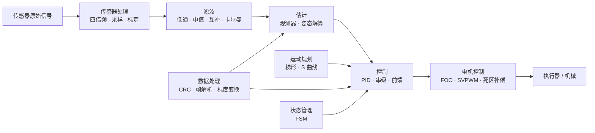

# 5.1 常见算法总览

> **前置知识**：[1.1 C 语言（嵌入式视角）](../01-编程与软件基础/01-C语言（嵌入式视角）.md) · [1.2 数据结构与算法](../01-编程与软件基础/02-数据结构与算法.md)
>
> **掌握标准**：知道嵌入式项目里会用到哪几类算法、各自解决什么问题，遇到具体问题时能判断该往哪个方向找答案
>
> **对应岗位**：电机控制工程师 · 嵌入式软件工程师 · 机器人工程师 · 无人机工程师
>
> **练手建议**：翻一遍自己做过的项目，把用到过的算法按本篇的分类表归一下类，找出自己完全空白的类别

## 算法不只有 PID

PID 几乎是所有电控项目里都绕不开的算法，行业里常被调侃"一瓶酒一包烟，一环 PID 调一天"。这句话一半是自嘲，一半是实情：PID 确实重要，但它远不是电控算法的全部。

广义上，算法是针对特定问题设计的一套计算步骤。放到嵌入式场景里，它可以是一段滤波公式、一个状态转移逻辑、一套运动学解算流程，甚至是一种数据校验方法。这个定义听起来平淡，但它指向一个很实际的结论：算法不是高不可攀的数学，而是解决问题的固定套路。

为什么值得把算法单独拎出来讲？因为在真实项目里，很多"硬件不行""参数怎么调都不对"的困境，根源既不在硬件也不在调参，而在于选错了算法，或者根本不知道还有更合适的算法存在。同样一个传感器抖动问题，有人换传感器、加电容、来回改 PID，最后发现一个滑动均值滤波就解决了；同样一个底盘走不直的问题，有人死磕 PID，其实是轮径参数标定错了。选择合适的算法，往往能用很小的代码量，解决靠硬件或蛮力调参难以解决的问题。

反过来这句话也要说全：算法不是万能的，更不是越高级越好。一个要花三周才能调稳的卡尔曼滤波器，如果一阶低通已经够用，那用低通就是更专业的决定。本章会反复出现同一个判断标准——**够用就好，复杂度必须能换来实际收益**。

## 八大类算法分类表

电控中的算法种类很多，按用途大致可以分为以下几个大类。

| 类别 | 常用算法 |
|------|----------|
| 控制算法 | PID（位置式/增量式/串级）、前馈补偿、斜坡函数、死区控制 |
| 滤波算法 | 卡尔曼滤波、互补滤波、滑动均值滤波、中值滤波、低通滤波、指数加权移动平均 |
| 运动规划 | 梯形速度曲线、S 曲线、贝塞尔曲线 |
| 运动学解算 | 底盘正逆解算、阿克曼模型、机械臂 DH 解算 |
| 电机控制 | FOC（磁场定向控制）、六步换相、SVPWM、死区补偿 |
| 传感器处理 | 编码器四倍频与测速、ADC 多通道采样与校准、传感器数据标定 |
| 状态管理 | 有限状态机（FSM）、层次状态机（HSM） |
| 数据处理 | CRC 校验、数据帧解析与粘包处理、标度变换 |

## 八类算法在系统里的位置

这八类不是并列的八个抽屉，它们在一条完整信号链上的位置和作用并不对等。

从这张图里能读出三件事：

**控制处在链路的末端。** 前面任何一环出了问题，最终都会以"控制不好"的形式暴露出来。这就是为什么调 PID 调不出来的时候要先往回查——很多时候问题在滤波、在标定、在数据解析，而不在控制本身。5.2 篇专门列了一张排查清单，讲的正是这件事。

**滤波和估计是两个不同的动作。** 滤波是"把噪声压掉"，估计是"从能测的量推出测不到的量"。前者不改变信息的含义，后者会引入模型假设。很多人把姿态解算叫作"滤波"，其实它更接近估计——用加速度计和陀螺仪推出姿态角，这个角你从来没直接测到过。

**数据处理和状态管理是横贯全系统的基础设施。** 它们不直接参与控制，但每一个环节都依赖它们。数据处理保证数据是"对的"，状态管理保证逻辑是"清楚的"。这两块做不好，其他算法再优秀也用不上。

## 每一类算法解决什么问题、在哪一篇讲

上表是"有什么"，这一节是"为什么需要它"和"在本教程的哪里能找到它"。八类算法分别对应八种典型的工程困境，对号入座比死记算法名字有用得多。

| 类别 | 解决什么问题 | 本教程位置 |
|------|--------------|------------|
| 控制算法 | 系统跟不上目标、有静差、有超调 | [5.2 控制算法](02-控制算法.md) |
| 滤波算法 | 传感器数据抖动、漂移、噪声大 | [5.3 滤波与姿态解算](03-滤波与姿态解算.md) |
| 运动规划 | 目标突变冲击机械结构、轨迹不平滑 | [5.4 运动规划与运动学](04-运动规划与运动学.md) |
| 运动学解算 | 想让底盘/关节按期望方向速度运动 | [5.4 运动规划与运动学](04-运动规划与运动学.md) |
| 电机控制 | 让电机转得平顺、高效、低噪、可控转矩 | [6.3 电机控制算法](../06-电机与执行器/03-电机控制算法.md) |
| 传感器处理 | 原始采样值不能直接当物理量用 | [6.4 位置与电流检测](../06-电机与执行器/04-位置与电流检测.md)（采样与标定）、[5.5 数据处理与校验](05-数据处理与校验.md)（标度变换） |
| 状态管理 | 多模式、多步骤的逻辑写成一团 if-else | [3.1 代码架构与分层设计](../03-嵌入式软件工程/01-代码架构与分层设计.md) |
| 数据处理 | 收到的数据是错的、粘的、单位不对的 | [5.5 数据处理与校验](05-数据处理与校验.md) |

几个需要特别点出来的关系：

**控制算法是本章的地基。** PID 及其配套手段（前馈、斜坡、死区）是所有闭环系统的最小可用工具集，后面滤波、规划、电机控制都会回到它。5.2 是全章优先级最高的一篇，务必先读懂。

**滤波算法解决"输入脏"，控制算法解决"输出不准"。** 这两类经常同时出现，但调试时要分清问题出在哪一环——把传感器噪声当成控制参数问题来调，是新手最常见的浪费时间的做法。

**运动规划与运动学解算分工不同。** 前者回答"怎么走得平滑"，后者回答"每个轮子/关节应该转到多少"。规划出来的轨迹是目标值，运动学负责把它翻译成执行器指令，谁也不能替代谁。

**电机控制、传感器处理、状态管理不在本章。** 它们的内容量足够各自成篇（电机在 [6.3 电机控制算法](../06-电机与执行器/03-电机控制算法.md)，采样与标定在 [6.4 位置与电流检测](../06-电机与执行器/04-位置与电流检测.md)，状态机在 [3.1 代码架构与分层设计](../03-嵌入式软件工程/01-代码架构与分层设计.md)）。本章的 5.1 只负责让你知道它们的坐标，看到"FOC""编码器四倍频""有限状态机"这些词时不至于陌生。

**数据处理是唯一一类"每个项目都会用到"的算法。** 只要你的设备要和外面通信，CRC、帧解析、标度变换就一定会出现，跟方向无关。走物联网或通信方向的话，5.5 是本章必读。

## 先建立算法意识

这一篇真正想让读者带走的，不是那张分类表，而是一种条件反射式的思维方式。

**算法意识的意思是：遇到问题时，先想想这属于哪一类问题，而不是直接开始改参数。** 拿到一个现象，试着从下面几个角度各问一遍：

- 是**控制**没做好吗？——目标跟不跟得上、有没有稳态误差、有没有振荡。
- 是**估计**的问题吗？——这个量我到底测到了没有，还是从别的量推算出来的？推算的模型准不准？
- 是**滤波**的问题吗？——数据本身抖不抖，滤波强度够不够或者过了头。
- 需要**补偿**吗？——有没有已知的、可以提前抵消的干扰或偏差（摩擦力、重力、死区、零漂）。
- 需要**规划**吗？——目标值是突变拍上去的，还是应该有一段平滑过渡。

这五个词——控制、估计、滤波、补偿、规划——覆盖了绝大多数电控问题的归因方向。养成先归因、再动手的习惯，能省下的时间远超多学两个算法。

## 算法该怎么学

**不要按目录啃。** 这是本篇最重要的一条建议。算法类教材和网课通常是按数学体系组织的，从头看到尾的结果往往是：看完了，但一个都不会用，而且忘得很快。嵌入式是工程学科，算法在这里的价值来自"解决了哪个具体问题"，脱离问题去学，记忆没有挂靠点。

**正确的姿势是"用到什么学什么"。** 项目需要哪类算法，就重点补哪一类。做电机闭环，把 PID 和编码器测速吃透；做姿态解算，把互补滤波和 EKF 吃透；做通信网关，把 CRC 和收包解析吃透。一次只学一类，学完立刻用在自己的项目上，这样效率和留存率都高得多。

**仿真是理解算法最有效的手段。** 算法难在"看不见"——你改一个参数，输出曲线怎么变、为什么变，光看代码是想不出来的。把算法在 MATLAB/Simulink 或 Python 里跑一遍，把输入输出画出来，对不懂的地方改参数试，理解速度会比看十篇推导快。工具上的准备见 [11.3 电路与系统仿真](../11-工具仪器与仿真/03-电路与系统仿真.md)。

## 一个诚实的提醒

算法覆盖面极广，从 PID 到粒子滤波、从 CRC 到 LDPC，中间隔着几门专业课。**目前也不存在一套真正适合所有人"从头看到尾就能学会"的通用课程。** 很多算法本身就偏理论，最终还是要靠仿真、代码实现和项目应用来真正理解。

所以不要因为"看不懂 EKF"而焦虑，也不要试图按顺序把所有算法学完——那是一条没有终点的路。更合理的作法是：先把常见算法用熟，遇到基础算法解决不了的问题时，再根据方向有针对性地深入。5.6 的那七类进阶算法，就是给你"以后遇到问题时去哪找"用的索引，现在只需要知道它们存在。

## 学习建议

- **先读 5.2，别一上来就冲卡尔曼。** 5.2 的实战密度最高、上手最快、回报最直接。把 PID 调明白，你对"闭环"这件事的理解就建立了，后面所有算法都建立在这个理解之上。
- **本篇不要精读，当索引读。** 分类表看两遍记住结构即可，具体内容在你做项目卡住时回来查。真正的学习发生在 5.2 到 5.5。
- **新手最容易踩的坑是"学而不练"。** 看十篇滤波文章，不如把一串真实传感器数据拿去做一次滑动均值和中值滤波的对比图。凡是能画出来的东西，就一定要画出来看。
- **可以先略过的部分**：5.6 全篇（选学）、5.4 里的机械臂 DH 解算（除非你确实要做机械臂）。
- **给自己建一张问题—算法对照表。** 项目里每遇到一次"用什么算法解决的问题"，就往表里记一条。半年后这张表比任何教材都贴合你的实际需求。

## 小节总结

算法是电控开发中从"能跑起来"走向"跑得更好"的关键一环。它并不只等于 PID，而是涵盖了控制、滤波、运动学、状态管理、数据处理等多个方面。很多时候，系统效果不好并不是硬件不行，而是算法和模型没有选对。

八类算法的划分不是为了显得完整，而是为了给你一套归因坐标。看到现象先归类，再去查对应的方法，比漫无目的地试参数高效得多。

对嵌入式开发者来说，最重要的不是一开始掌握多少高级算法，而是先建立基本的算法意识：遇到问题时，知道可以从控制、估计、滤波、补偿、规划这几个角度去思考。只要把常见算法用熟，在项目中不断积累，后续再接触更复杂的进阶算法时就会顺畅很多。

最后记住这一章反复强调的判断标准：算法服务于问题，复杂度要能换来收益。能用简单方案稳定解决问题的工程师，比会背十个高级算法的工程师更值钱。

---

本章目录：[5. 控制与算法](README.md) ｜ 总目录：[返回首页](../../README.md)
上一篇：[5. 控制与算法](README.md) ｜ 下一篇：[5.2 控制算法](02-控制算法.md)
