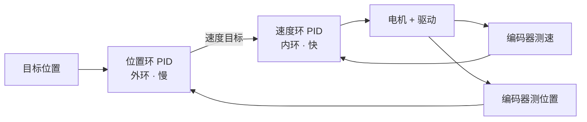

# 5.2 控制算法

> **前置知识**：[5.1 常见算法总览](01-常见算法总览.md) · [2.3 通用外设](../02-MCU与体系结构/03-通用外设.md)
> **掌握标准**：能独立实现并调好一套 PID，理解 P/I/D 各自的物理意义，知道什么时候需要串级、前馈、斜坡和死区
> **对应岗位**：电机控制工程师 · 机器人工程师 · 无人机工程师 · 汽车电子工程师
> **练手建议**：拿一个带编码器的直流电机，先只加 P 观察响应，再加 I 消除静差，最后加 D 抑制超调，把每一步的波形都记下来

## 控制算法决定了系统能不能稳、准、快

控制算法是电控的核心，它决定了系统能不能稳、准、快地达到目标状态。"稳"是不振荡、不发散，"准"是最终停在目标值上、没有稳态误差，"快"是响应及时、不拖泥带水。这三个要求经常互相矛盾，控制算法要做的就是在它们之间做取舍，而 PID 是这套取舍里最小、也最通用的工具集。

这一篇的写法是：先把 PID 的三种形式和每个参数的物理意义讲清楚，再往下讲工程实现中真正会咬人的细节（离散化、积分饱和、微分对象、采样周期），然后是调参手法，最后是前馈、斜坡、死区这三个"配角"——它们单独拿出来都不算控制算法，但缺了它们，PID 在很多场景里就是调不好。

## PID 的三个环节与三种形式

PID 是电控算法的入门必修课，也是工程中应用最广泛的基础控制算法。它的核心思路是根据目标值和实际值之间的误差，通过比例（P）、积分（I）、微分（D）三个环节来计算控制量，让系统尽快达到目标状态并保持稳定。

三个环节的物理意义必须记牢，这是后面一切调参判断的基础：

- **P（比例）决定响应速度。** 误差越大，输出越大。P 太小系统迟钝、跟不上；P 太大系统激烈、容易振荡。
- **I（积分）用来消除稳态误差。** 只要还有误差，积分项就会一直累积，直到误差被推到零。代价是引入滞后，I 太大会引起低频振荡。
- **D（微分）用来抑制超调和振荡。** 它看的是误差的变化趋势，误差变化越快、反向作用越强，相当于给系统加了阻尼。

PID 有几种常见的形式，选哪一种取决于你的执行器特性：

**位置式 PID** 直接输出控制量的绝对值，适用于大多数基础控制场景。它的计算式子是：输出 = Kp × 误差 + Ki × 误差累计和 + Kd × (本次误差 − 上次误差)。

**增量式 PID** 输出的是控制量的变化量，天然具有抗积分饱和的能力，在电机控制中用得更多。因为它每次只给出"在上一次输出基础上再加多少"，所以不存在"累计值越积越大"的问题；同时执行器故障或需要切换手动时，切换冲击也小。

**串级 PID** 则是在外环套内环，用两层 PID 分别控制不同变量，比如外环控制位置、内环控制速度，两层协同工作，控制效果比单环好很多。它的适用条件和内外环关系后面单独讲。

## 离散化实现要注意什么

教科书上的 PID 是连续域的，落到单片机上必须变成按固定周期执行的离散式子。这一步有四个坑。

**第一，误差累计要用积分项累加而非直接相乘。** 位置式的积分项是"Ki × 误差累计和"，这个累计和必须在每次计算后更新，而不是写成 Ki × 误差 × 时间——后者在单片机上容易变成浮点累乘，误差会以你没预期的方式放大。

**第二，采样周期必须是常数。** 离散 PID 的参数是在特定采样周期下调出来的，如果周期抖动（比如放在一个会被其他任务抢占的循环里执行），等效的积分和微分增益就跟着抖。周期不稳的 PID，调参时会表现得"今天调好了明天又不行"。

**第三，先做量纲统一。** 误差的单位可能是度、可能是毫米、可能是脉冲数，执行器的输出可能是占空比、可能是电流。Kp 的量纲实际上由这两者决定。调参时先把误差和执行器输出都换算成物理量，比直接对着原始整数调要清楚得多。

**第四，输出一定要限幅。** 下位机最终写到寄存器的值是有范围的（比如 PWM 占空比 0 到 100%），如果 PID 输出超了范围而不做限制，实际输出会削顶，积分项还在继续累积——这就是积分饱和。

## 积分饱和与抗饱和

积分饱和是 PID 在工程上最常见的失效模式，值得单独说清楚它的机理。

**现象**：系统启动时误差很大（比如电机从 0 要冲到 1000 rpm），积分项在误差被消除之前已经累积到非常大的值。等系统到达目标值附近时，这个巨大的积分量还在往外推，导致严重超调，然后又反向冲过头，来回振荡很长时间才能收敛。

**三种常见的解法**：

- **积分限幅**：给积分累计值设一个上下限，累到上限就不再增加。最直接，但上限值需要试。
- **积分分离**：误差大于某个阈值时干脆不积分，只用 PD；等误差进入小范围后才启用积分。这个方法对大阶跃特别有效，实现也简单。
- **输出限幅联动（反计算）**：当输出已经到达执行器上限时，不再累积积分。逻辑上是"既然饱和了，积分就别再添乱"。

工程上最省事的组合是"积分分离 + 积分限幅"，两个都是一行判断，收益很大。如果你的系统经常出现"启动超调大、稳定慢"，先查积分饱和，别急着降 Kp。

## 微分项为什么要对测量值微分

这是一个初学者几乎都会忽略、但在实机上后果很明显的细节。

**理论上的 PID 微分项是 d(误差)/dt。如果目标值发生阶跃跳变，误差也跟着跳变，理论上微分会得到一个冲激（无穷大），实际中会得到一个巨大的尖峰输出。** 结果是每次设定值改变，执行器就被打一鞭子，电机抖一下、舵机抽一下。

**解决办法是把微分项改成对测量值微分，也就是 -Kd × d(测量值)/dt，符号取反。** 这样做的效果是：设定值跳变时微分项毫无反应，只有被控量真的在变化时才产生阻尼作用。阻尼功能一点没少，却把"设定值阶跃引发冲击"这个毛病彻底去掉了。

**另一个必做的是给微分项加低通滤波。** 测量值里总有噪声，而微分是放大高频的运算——噪声越大，微分输出越脏。典型做法是先对测量值做一次一阶低通，再拿去微分。滤波强度不够时你会看到执行器高频抖动，那不是 PID 参数的问题，是微分把噪声放大后送进了执行器。

## 采样周期对 PID 效果的影响

采样周期不是随便定的，它同时影响三件事：

**一是稳定性。** 采样周期相对系统响应时间太长，等同于给控制回路加了很大延迟，相位裕度被吃掉，P 能加到的大小被显著压缩。经验上，采样频率至少要比系统的闭环带宽高一个数量级；做电流环这种快环时，周期往往是几十微秒级别，容不得拖延。

**二是微分的可用性。** 周期越长，相邻两次采样的差值里噪声占比越高，微分项越不可用。很多工程实现里如果周期偏长，宁可先砍掉 D。

**三是积分和微分的等效增益。** 你调出来的 Ki、Kd 数值只在当前周期下有效。要是后来把 PID 从 1 ms 周期挪到 5 ms 周期执行，参数必须重新标定，不能照搬。

实际开发中，**电流环、速度环、位置环的周期通常是不同的**，从内到外逐级变慢（比如电流环 50 微秒、速度环 1 毫秒、位置环 5 到 10 毫秒）。这个层级关系不是随便排的，它直接决定了串级控制能不能稳定。

## 调参：先理解物理意义，再谈手法

PID 调参是很多人的噩梦，但调参的关键不在于反复试数，而在于理解每个参数对应的物理意义。

调参的基本顺序是：**先把 P 调到系统能跟上目标值，再加 I 消除静差，最后加 D 平滑过渡。** 大多数场景按这个步骤来，都能调出一个可用的效果。每一步的具体观察点：

- **只加 P**：逐步加大，直到响应变快但还没有明显振荡。这时系统通常会有稳态误差，这是正常的。
- **加 I**：从小往大加，观察静差是否被消掉。加过头会看到低频的大幅摆动，或者响应出现明显的过冲后缓慢爬回。
- **加 D**：从小往大加，观察超调和振荡是否被压住。加过头会让系统变"木"，同时对噪声敏感，出现高频抖动。

除了这种逐步试凑，工程上还有两种更系统的调参手法：

**阶跃响应观察法**（也叫齐格勒—尼科尔斯时域法）：给系统一个阶跃输入，记录输出曲线，从曲线上读出延迟时间、时间常数和增益，再按经验公式算出 P、I、D 的初值。它的价值在于给出一个合理的起点，避免从零开始瞎试。

**临界比例度法**：先把 I 和 D 关掉，只加 P，一直加到系统出现等幅振荡，记下此时的 Kp（临界比例度）和振荡周期，再按经验公式折算三个参数。这个方法快，但要求系统允许你把它推到振荡边缘——真机上做有风险，慎用，最好先在仿真里跑一遍。

需要注意，这两种方法给出的都是"起点"而不是"终点"。经验公式假设的是典型对象，而你的机械结构、执行器、传感器都有各自的脾气，最终还是要靠观察波形微调。

## 串级 PID 与外环内环的带宽关系

**串级 PID 的适用条件很明确：被控系统里存在两个快慢差别明显的变量，且外环的那个变量由内环的变量积分或驱动而来。** 位置和速度就是最典型的一对——位置是速度的积分，速度环快、位置环慢。

它的结构是这样的：

串级比单环好的原因不难理解：内环先把"速度"这个变量管住，把负载变化、电压波动这些扰动在传到外环之前就吃掉大半，外环面对的系统因此变成一个更听话的对象，调起来容易得多。

**一条铁律：内环必须比外环快。** 具体说，内环的带宽（大致可以理解成它能跟上的变化速度）要比外环高，通常要求高 5 到 10 倍。实现手段有三条同时用：内环的采样周期更短、内环的参数调得更激进、外环的输出作为内环的设定值时必须做限幅。

**如果内环比外环还慢会怎样？** 外环以为自己发出速度指令后系统会立刻响应，实际上内环还在慢慢追，等效于外环回路里插入了一个大延迟。这时候你会看到外环怎么调都不稳，而且越是加大外环的 P 越糟。出现这种症状时，先回头检查内环的响应速度，而不是继续死磕外环参数。

外环给内环的设定值还要**做限幅**，防止外环在大误差时要求一个内环根本达不到的速度，这一点和抗积分饱和是配套的。

## 前馈补偿

前馈补偿不是一种独立的控制算法，而是和 PID 配合使用的策略。它的核心思路是"提前预判"——根据已知的模型或经验，直接给系统一个基础输出量，PID 只负责修正偏差部分。

比如电机控制中，如果知道匀速运行时需要固定的占空比，那就把这部分作为前馈直接输出，PID 只需要处理加速、减速和扰动带来的误差。前馈用得好，可以显著减少 PID 的调节负担，响应速度也会更快。

前馈和 PID 的分工可以这样理解：**PID 是事后纠错，前馈是事前预防。** PID 必须在误差出现之后才动作，所以永远有滞后；前馈不依赖误差，只要模型大致准，就能在误差产生之前把大部分输出给到位。工程上常见的组合是"重力前馈 + PID""摩擦力前馈 + PID""已知负载前馈 + PID"。

前馈的局限也要清楚：**它的效果取决于模型准不准。** 模型误差不会像 PID 那样被自动纠正，反而会变成一个新的偏差源。所以前馈的系数通常只给到理论值的七八成，剩下的留给 PID 兜底——这是一种很常见的、务实的做法。

## 斜坡函数

斜坡函数（Ramp）本质上是信号处理工具，而不是控制算法。它的作用是让一个突变的目标值变成平滑的线性过渡，避免阶跃信号直接冲击系统导致剧烈震荡。

比如电机从 0 rpm 加速到 1000 rpm，如果直接把目标值拍上去，系统会产生很大的超调；但如果用斜坡函数让目标值在一定时间内匀速上升，电机就会平稳加速，机械结构也不会受到冲击。斜坡函数在运动控制中非常常用，实现简单，效果明显。

实际用的时候有几点经验：**斜坡的斜率要根据机械能承受的加速度来定**，不是随便给个值；**上升和下降可以用不同的斜率**（有些机构的减速能力比加速能力弱）；**斜坡的输出要作为 PID 的目标值，而不是叠加在 PID 的输出上**，这一点搞反了会导致控制逻辑混乱。

## 死区控制

死区控制是指当误差小于一定阈值时，控制器不输出调节量，让系统保持当前状态不动。

这看起来好像是"故意不管了"，但其实在很多场景下非常有用。比如电机定位时，如果误差已经小到可以忽略的范围，PID 还在反复调节，就会导致电机频繁抖动。加一个死区之后，系统在误差够小时自动"收手"，既节省了能量，也避免了不必要的机械磨损。

死区阈值需要根据实际精度要求来设定，太大会影响控制精度，太小则起不到效果。几个实践经验：

- **死区通常作用在"是否更新输出"上，而不是把误差直接置零。** 后者会让控制量突然跳变，反而引入扰动。
- **进入死区和退出死区可以用不同阈值**（迟滞），避免在阈值边缘反复进出造成抖动。
- **死区和积分项要配合**：如果不做积分分离，死区里积分仍会累积，等误差再次变大时会突然释放，表现为"憋一会儿然后猛冲一下"。常见做法是死区期间冻结积分。

## 调不出来的时候先怀疑什么

PID 调不好的时候，绝大多数人的第一反应是继续换参数。但经验告诉我们，**调不出来的时候，问题通常在 PID 之外**。按这个顺序排查，能省下大量时间：

1. **机械间隙（回差）。** 齿轮箱、联轴器、同步带有间隙时，换向的瞬间执行器动了而负载没动，PID 看到的误差不降反升，于是继续加大输出，表现为换向时的"咔哒"和位置环怎么调都稳不住。这个问题的唯一解是改机械，调参救不了。
2. **传感器噪声。** 噪声大时 P 和 D 都不敢加大，系统只能又慢又软。先去处理信号（见 [5.3 滤波与姿态解算](03-滤波与姿态解算.md)），再回来调参。
3. **采样延迟与执行延迟。** 包括采样周期本身过长、通信链路延迟、驱动器内部的处理延迟。延迟会系统性地吃掉相位裕度，让系统在参数并不激进时就振荡。用示波器看一眼指令和实际响应的时间差，很容易确认。
4. **执行器饱和。** 输出已经顶到上限了，再怎么加参数都没用，而且会引发积分饱和。先确认执行器有没有余量，没有余量就应该换执行器或改传动比，而不是继续调参。
5. **目标值本身就是阶跃。** 有些"调不好"其实是"不该给阶跃"，加个斜坡函数问题就消失了。

把这五条当成一个检查清单，遇到"怎么调都不对"时逐条过一遍。多数情况下，答案在第一条或第二条。

## 学习建议

- **动手顺序不能颠倒**：先只加 P，再只加 I（保留 P），最后加 D。一次只改一个环节，并且每次都把波形记下来。同时改三个参数然后分辨哪个起了作用，是新手最常犯的错误。
- **没有波形就没有调参。** 必须要有办法看到目标值和实际值的曲线（上位机工具、串口绘图、示波器都行）。靠"感觉好像稳了"调出来的参数，换一个工况就崩。
- **先在仿真里试，再上真机。** 尤其临界比例度法这种把系统推到振荡边缘的操作，真机上做容易烧驱动。
- **别急着上高级算法。** 如果 PID 加前馈能解决的问题你上了 MPC，那多半是把问题复杂化了。本章 5.6 的进阶算法是"以后遇到问题时再查"的。
- **可以先把 D 放一放。** 很多速度环只跑 PI 就能满足需求。D 在噪声大的系统里收益可能为负，不用因为它叫"PID"就非得用上。

## 小节总结

PID 的价值不在于数学有多深，而在于它用三个物理意义清晰的参数，覆盖了绝大多数闭环控制需求。理解 P 管速度、I 管静差、D 管阻尼，比记住任何一组"万能参数"都重要。

工程上真正容易翻车的，不是 PID 本身，而是它周边的实现细节：积分饱和、微分对象选错、采样周期不稳、输出不限幅。这些细节的共同特点是——在仿真里看不出来，一上真机就出问题，而且症状往往被误判成"参数没调好"。本篇用很大篇幅讲它们，就是希望读者在遇到问题时能想到这一层。

串级控制是从"能控"到"控得好"的第一步跃迁。它的门槛不在公式，而在对内外环带宽关系的理解，以及愿意先去把内环调快、再回头调外环的耐心。

前馈、斜坡、死区这三个配角，本质上都是在给 PID 减负或者给机械留余地。它们实现简单、收益明显，是性价比最高的工程手段，值得在项目里优先用上。

最后一句话：调参调不出来的时候，先怀疑机械、传感器、延迟和饱和，而不是继续换数字。这句话在这一篇里出现了不止一次，因为它是控制工程师最实用的一条经验。

---

本章目录：[5. 控制与算法](README.md) ｜ 总目录：[返回首页](../../README.md)
上一篇：[5.1 常见算法总览](01-常见算法总览.md) ｜ 下一篇：[5.3 滤波与姿态解算](03-滤波与姿态解算.md)
