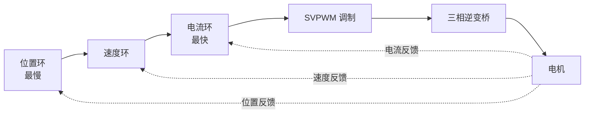

# 6.3 电机控制算法

> **前置知识**：[6.1 电机基础与选型](01-电机基础与选型.md) · [6.2 电机驱动电路](02-电机驱动电路.md) · [5.2 控制算法](../05-控制与算法/02-控制算法.md)
> **掌握标准**：能说清六步换相和 FOC 的区别与各自适用场景，能解释坐标变换在做什么，能独立搭起一套电流环加速度环的 FOC 并调通
> **对应岗位**：电机控制工程师 · 机器人工程师 · 无人机工程师 · 汽车电子工程师 · 工业伺服工程师
> **练手建议**：找一块带 FOC 支持的驱动板，先只跑通速度环，再逐步加电流环、位置环——每加一环都记录电流和速度波形，对比效果差异

## 电机控制的三个台阶

电机控制这件事，可以分成三个难度台阶：

**第一级：能转。** 给电就转，不在乎转得怎么样。有刷电机接上电源就能做到，无刷电机需要一点换相逻辑。

**第二级：转得稳、转得准。** 要求给定的速度或者位置能被精确执行，负载变化时也不能跑偏。这一步开始需要闭环控制、需要好的传感器、需要 PID 调参。

**第三级：转得高效、转得平顺、转得便宜。** 同样的性能用更少的电、更小的噪声、更便宜的器件。这一步就需要 FOC、SVPWM、无感观测器这些进阶技术。

**三级之间的技术差距很大**，但很多人的学习是跳着走的——直接上 FOC，结果连电流环为什么要闭环都说不清楚。这一篇会按台阶的顺序讲。

## 为什么无刷电机需要"换相"

有刷电机的换相靠**机械换向器**：电刷和换向片在转动中自动切换电流方向，让转子始终受到同方向的转矩。这是免费的，代价是磨损、噪声和寿命。

无刷电机把永磁体放到了转子上，绕组放在定子上，没有机械换向器。**于是必须由控制器根据转子的当前位置，决定此刻该给哪一相通电、电流朝哪个方向流。** 这件事就叫**换相**。

所以无刷电机控制的核心问题就变成了两个：

1. **知道转子现在在哪**（位置检测）
2. **据此决定给哪几相通电、通多少**（换相策略）

第二个问题的答案，就是六步换相和 FOC 的分野。

## 六步换相：简单够用的起点

**六步换相（也叫梯形波控制、方波控制）是无刷直流电机最经典的驱动方式。**

它的做法：把整个电气周期分成六个阶段，每个阶段**导通两相、关断一相**，按固定顺序依次切换。所以叫"六步"。

需要的位置信息很粗——只要知道"当前在六个扇区中的哪一个"就够了。因此用**三个霍尔传感器**就能满足，甚至可以通过检测未导通相的反电动势过零点来实现**无感**（不需要霍尔）。

| 优点 | 缺点 |
|---|---|
| 实现简单，算力要求极低 | 电流波形是方波，不是正弦 |
| 只需要粗略的位置信息（三个霍尔或反电动势过零） | **转矩脉动大**，低速时尤其明显 |
| 成本低，几毛钱的 MCU 就能做 | 噪声和振动比 FOC 大 |
| 对位置误差不敏感，鲁棒性好 | 效率低于 FOC |

**什么时候六步换相就够了？** 风扇、水泵、普通的电动工具、低端电动车、简单的云台。这些场景不在乎转矩脉动，也不需要极致的静音和效率。

**一个务实的判断**：如果你的项目对噪声、低速平顺性、效率没有苛刻要求，**六步换相能用就先用它**。它让你在一个下午就能让电机转起来，而 FOC 可能要一两周。先把项目跑通，需要时再升级。

## FOC：把交流问题变成直流问题

FOC（Field-Oriented Control，磁场定向控制）是目前高性能电机控制的主流方案。

**它要解决的核心问题是**：三相电流是随时间变化的正弦量，而且是三个互相耦合的量。直接对这样的量做 PI 控制，会因为它们是交流量而产生稳态误差——PI 控制器擅长处理直流量，处理交流量力不从心。

FOC 的思路非常巧妙：**做两次坐标变换，把三相正弦电流变成两个直流量，然后像控制直流电机一样控制它们。**

### 第一步：Clarke 变换（三相 → 两相静止）

三相电流 Ia、Ib、Ic 满足一个约束（三相之和为零，对于星形接法），所以实际上只有两个独立变量。Clarke 变换把这三个量降成两个：**α 和 β**，它们构成一个静止的二维坐标系。

这一步没有改变"交流"的本质，只是把三个数变成了两个数。

### 第二步：Park 变换（静止 → 旋转）

这是 FOC 的关键一步。αβ 坐标系是静止的，而转子在转。Park 变换把 αβ 坐标系**旋转到与转子同步的位置**，得到 **d 轴和 q 轴**。

- **d 轴**（direct，直轴）：对准转子磁场方向
- **q 轴**（quadrature，交轴）：垂直于磁场方向

**在 dq 坐标系下，原本随时间变化的正弦电流变成了恒定的直流量。** 而且这两个量有非常清晰的物理意义：

| 分量 | 物理意义 | 控制目标 |
|---|---|---|
| **q 轴电流** | 产生转矩 | 决定电机出多大力 |
| **d 轴电流** | 产生磁场 | 对于表贴式永磁电机，通常控制为 0（不浪费电流去励磁） |

**于是控制问题被彻底简化了**：用两个 PI 控制器分别把 id 和 iq 控到目标值，就能精确控制转矩。这就是 FOC 的全部精髓。

**一句话总结 FOC 的价值**：它把"控制一个三相交流系统"变成了"控制两个直流变量"，从而让经典控制理论可以直接用上。

### 完整的控制环路

一套典型的 FOC 系统是三层嵌套的结构：

**带宽关系是一条必须记住的设计原则：内环必须比外环快得多**（工程上通常要求内环带宽是外环的 5~10 倍）。否则外环还没调好，内环就已经跟不上了，两级控制器会互相干扰，怎么调都调不好。

按速度排序：**电流环最快**（通常几 kHz 到几十 kHz 的更新率），**速度环次之**（几百 Hz 到几 kHz），**位置环最慢**。

**调试顺序也必须按这个顺序**：先把电流环调好并锁定参数，再调速度环，最后调位置环。**跳过前面直接调后面是最常见的浪费时间的方式。**

### SVPWM：把 dq 电压变成开关信号

电流环算出来的结果是"应该加多大的 dq 电压"。但逆变器只能做一件事：**开关**。所以需要一个调制环节，把电压指令变成六个开关管的开关时序。

**空间矢量脉宽调制（SVPWM）** 是 FOC 里最常用的调制方式。它的做法是：把逆变器的八种开关状态对应到八个电压矢量，用相邻两个矢量和零矢量按时间加权，合成出想要的电压矢量。需要判断当前指令落在哪个扇区，再计算各矢量的作用时间。

相比传统的 SPWM（正弦脉宽调制），SVPWM 能**更充分地利用母线电压**——同样母线电压下能输出的最大基波电压高约 15%（典型值，具体取决于调制方式）。谐波也更小。

**新手最容易的误解**：SVPWM 不是一个"可选的高级功能"，而是 FOC 的组成部分。没有调制环节，电流环的输出电压就落不到电机上。

### 电流采样：必须在正确的时刻做

这是 FOC 实现里最容易被忽略、也最容易出错的细节。

**三相电流是连续变化的，但采样只能在某个瞬间进行**。如果在错误的时刻采样，采到的值就代表不了这个控制周期的平均电流，结果就是控制效果差、电流波形畸变、甚至系统不稳定。

常见的正确做法是**让 ADC 采样与 PWM 同步**——在 PWM 计数的特定时刻（通常是计数器下溢或中点）触发 ADC 采样。这个时刻电流最稳定、开关噪声最小。实现上通常用定时器的触发信号去启动 ADC，用注入组或专门的同步机制来保证时间对齐。

**另一个相关问题**：死区时间会扭曲实际输出的电压，尤其在低速小电流的时候。所以要做**死区补偿**——根据电流方向，对输出电压指令做一个补偿量，抵消死区的影响。不做补偿的后果是低速时电流波形畸变、转矩脉动增大。

## 有感与无感

前面一直在说"要知道转子位置"。这件事有两类做法：

**有感**：直接测。用霍尔传感器（粗略，适合六步换相）、增量式编码器（精确）、绝对式编码器（精确且上电就知道位置）、旋转变压器（耐恶劣环境，汽车常用）。

**无感**：不测，推算。通过测量电压和电流，用**观测器**估计转子位置。

无感的吸引力很直接：**省掉传感器、省掉线束、降低成本、提高可靠性**（传感器和线束是电机系统里最容易坏的部件之一）。所以它在消费级和工业级应用里越来越普遍。

**无感的两大难点**：

- **低速和零速时反电动势太小**，信噪比极低，观测器算不准。所以无感 FOC 通常需要一个**开环强拖启动**过程——先按预设的斜坡把电机"带"到一定转速，再切到闭环。这个切换点的处理是无感控制的主要技术门槛之一。
- **启动瞬间不知道转子在哪**，可能反向启动。有些方案会先注入一个高频信号探测初始位置。

**常用的观测器**（进阶内容，知道各自定位即可）：

| 观测器 | 特点 | 适用 |
|---|---|---|
| **反电动势过零检测** | 最简单 | 六步换相的无感方案 |
| **滑模观测器** | 鲁棒性强，对参数误差不敏感 | 无感 FOC 的主流方案之一 |
| **龙伯格观测器** | 经典线性观测器，实现简单 | 中高速段 |
| **高频注入** | 利用凸极效应，能工作在零速 | 需要零速大转矩启动的场合 |
| **扩展卡尔曼滤波** | 精度高，但计算量大 | 算力充裕的高端应用 |

## 有刷电机和步进电机的控制

不是所有电机都需要 FOC。为了完整，简单提一下另外两类：

**有刷直流电机的控制就是调电压**。用 PWM 调占空比即可，配合电流采样做过流保护，配合编码器做速度/位置闭环。有刷电机的闭环控制和 FOC 的思路一样（串级 PID），但省掉了坐标变换和换相，简单得多。**学电机控制，从有刷电机入手是最快的路径。**

**步进电机的控制是发脉冲**。驱动器负责电流控制，MCU 只负责产生脉冲和方向信号，再加上加减速曲线。详见 [6.5 舵机与步进电机](05-舵机与步进电机.md)。

## 你的芯片跑得动 FOC 吗

这是选型时最实际的问题。FOC 对硬件有明确要求：

| 需求 | 说明 |
|---|---|
| **算力** | 每个 PWM 周期要完成 Clarke、Park、两个 PI、反 Park、SVPWM 的计算，通常要求主频在几十 MHz 以上 |
| **浮点单元（FPU）** | 有 FPU 的 Cortex-M4F/M7 会让 FOC 轻松很多；没有 FPU 就要用定点数，开发难度和调试成本都上一个台阶 |
| **ADC** | 至少能同时采两相电流（或一相 + 母线），支持与定时器同步触发，采样速度要够 |
| **高级定时器** | 至少一个能输出三对互补 PWM、带死区插入、并能触发 ADC |
| **运放与比较器** | 电流采样需要运放，过流保护用比较器最快 |

**一个实用的经验判断**：Cortex-M3 级别的芯片用定点数可以做 FOC 但很吃力；M4F 是入门门槛；M7 或专用电机控制芯片做起来就很从容。

## 调参顺序：这一节最实用

FOC 的调试最忌讳"一上来就调速度环"。正确的顺序是：

1. **先确认硬件没问题**。给一个固定的 dq 电压（开环），看电流波形是不是正常的三相正弦。如果波形不对，先回去查驱动电路和采样电路，别调算法。
2. **调电流环**。给 iq 一个阶跃指令，观察实际电流的响应。先加 P 到响应够快但不振荡，再加 I 消除静差。**电流环调好后，一般就不再动了。**
3. **标定编码器/观测器**。确认电角度和实际转子位置的对应关系正确。**电角度标定错了，后面怎么调都白费。**
4. **调速度环**。给定速度阶跃，观察速度响应。速度环的输出是 iq 指令，所以它天然会被电流限幅保护。
5. **调位置环**（如果用得上）。位置环的输出是速度指令。
6. **最后做各种边界测试**：突加负载、正反转切换、高速、低速、快速启停。

**每一步都单独调、单独验证**。发现不好调时，先怀疑前一级——速度环调不好，八成是电流环没调好或者电角度标定不准。

## 常见故障与排查

| 现象 | 可能原因 |
|---|---|
| **上电就过流** | 死区不够导致直通、电流采样偏置错误、电角度标定错误 |
| **电机抖动、嗡嗡响不转** | 相序接错、电角度偏差大、电流环参数不对 |
| **低速不平顺、有顿挫** | 死区未补偿、电流采样时刻不对、编码器分辨率不够、观测器低速性能差 |
| **高速失步或失控** | 观测器跟不上、控制周期太长、母线电压不够 |
| **发热严重** | 电流环有静差导致持续大电流、id 不为零（在做无用功）、开关损耗大 |
| **噪声大** | PWM 频率太低（在听觉范围内）、六步换相的固有脉动、机械共振 |
| **负载一变就崩** | 速度环参数太激进、没有限流、没有抗积分饱和 |

**一个很有用的排查习惯**：把 iq、id、速度、位置这几条曲线同时画出来（通过串口或调试器实时上传）。**FOC 的问题几乎都能从波形上看出来**——id 一直在抖说明坐标变换有问题，iq 有周期性波动说明电角度不准，速度有稳态误差说明积分项没起作用。

## 学习建议

1. **从有刷电机开始**。有刷电机的速度/位置闭环是 FOC 的简化版，没有坐标变换、没有换相，能让你先把"串级 PID"这件事搞清楚。
2. **再学六步换相**。它让你理解"无刷电机为什么要换相"这个核心问题。用三个霍尔或者反电动势过零做一个能转的方案，半天就能成。
3. **最后上 FOC**。但**不要自己从零写**——第一次用现成的库（厂商的电机库或开放源代码的 FOC 库），先把整个流程跑通、把波形看明白。理解了之后再考虑自己实现。
4. **坐标变换一定要自己推一遍**。不需要推导得多严谨，但要理解"为什么旋转坐标系下电流是直流量"。**没理解这一步，FOC 就永远是黑箱。**
5. **先把电流环调好再动别的**。这是最多人违反的一条。电流环不稳，后面所有调参都是徒劳。
6. **波形是你最好的老师**。示波器看电流波形、用串口上传 dq 和速度曲线。**FOC 调不好的人，几乎都是不看波形只看现象的人。**
7. **算力评估先行**。如果你的芯片没有 FPU，先在项目开始前决定用定点实现还是换芯片，不要做到一半才发现算不过来。
8. **面试验收点**：电机控制岗位几乎必问 FOC。能讲清"为什么做坐标变换""d 轴和 q 轴分别控制什么""电流环和速度环的带宽关系""无感低速为什么难"，基本就能过关。

## 小节总结

无刷电机控制的核心问题是**换相**——必须知道转子在哪，才能决定给哪一相通电。对这个问题的不同回答，区分出了两条技术路线。

**六步换相**是简单够用的起点：只需要粗略的位置信息，算力要求极低，代价是转矩脉动大。**FOC** 是高性能方案：通过 Clarke 和 Park 两次坐标变换，把三相交流电流变成 dq 两个直流量，从而让经典 PI 控制可以直接使用。**这是 FOC 的全部精髓——把交流问题转化为直流问题。**

FOC 的工程实现有三个容易被忽略的关键点：**SVPWM 不是可选项而是组成部分**；**电流采样必须与 PWM 同步**，否则采到的值没有意义；**死区必须补偿**，否则低速时波形畸变。三层控制环路的带宽必须满足内环远快于外环的关系，调试也必须按电流环 → 速度环 → 位置环的顺序进行。

最后两条判断：**芯片选型要先于算法设计**，没有 FPU 的芯片做 FOC 会让开发难度上一个台阶；**波形是 FOC 调试中最重要的证据**，不看波形只改参数是最典型的浪费时间。

---

本章目录：[6. 电机与执行器](README.md) ｜ 总目录：[返回首页](../../README.md)
上一篇：[6.2 电机驱动电路](02-电机驱动电路.md) ｜ 下一篇：[6.4 位置与电流检测](04-位置与电流检测.md)
