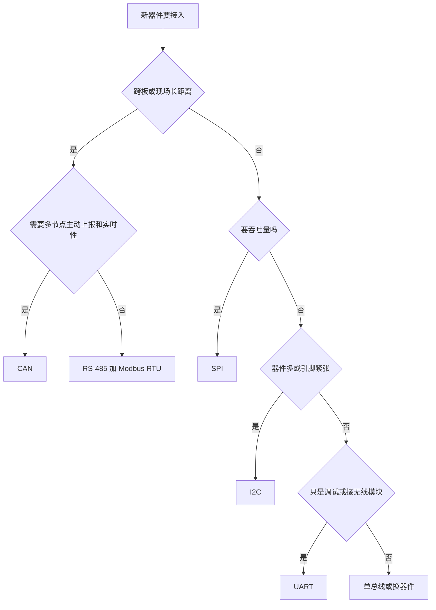

# 7.1 总线协议

> **前置知识**：[2.3 通用外设](../02-MCU与体系结构/03-通用外设.md)
> **掌握标准**：能说清 UART、I2C、SPI、CAN、RS-485 的物理层与协议层差异，拿到一个新器件时能判断该用哪种总线、怎么接、怎么配
> **对应岗位**：嵌入式软件工程师 · MCU 驱动/BSP 工程师 · 电机控制工程师 · 汽车电子工程师 · 物联网工程师
> **练手建议**：用逻辑分析仪分别抓一次 I2C 和 SPI 的通信波形，对照数据手册的时序图逐段确认——这是掌握总线最快的路径

单片机本身只是"会干活的脑子"，它和传感器、执行器、显示屏、上位机、其他设备之间的所有配合，最终都要落到总线上。总线协议大致分三类：板级与现场总线（本篇）、网络通信协议（7.2）、无线通信模块（7.3）。这一篇只讲第一类——那些用几根线把芯片和外设连起来的东西。

学总线最容易走偏的路，是背协议名和参数表。真正有用的核心不是背名字，而是学会看时序图、看数据手册、看通信帧格式。所有总线本质上都在规定同一件事：**谁先说、什么时候说、怎么说、说完之后怎么确认**。把这套逻辑看懂了，后面不管面对什么没见过的模块，上手都会快很多。

## 先把四个基本问题问清楚

任何一个总线，用下面四个坐标描述一遍，你就能大致判断它的脾气。

**同步还是异步。** 同步通信有独立的时钟线（I2C 的 SCL、SPI 的 SCLK），什么时候采样由时钟说了算。异步通信没有时钟线（UART），双方只能事先约定"一位占多长时间"，靠各自的计时器对齐。异步省了一根线，代价是**双方的时间基准必须足够准**——这就是波特率误差为什么是个要命的问题。

**全双工、半双工还是单工。** 全双工指收发可以同时进行（SPI、UART）；半双工指同一时刻只能有一个方向在传（I2C、RS-485、单总线）；单工指只能单向（WS2812 这类灯带的数据线）。半双工必须解决"谁占用线路"的问题，这就引出了仲裁和方向控制。

**主从还是多主。** 主从结构里，主机发起一切通信，从机只能应答（I2C、SPI 基本如此）。多主结构允许总线上任何一个节点发起通信，冲突时靠仲裁解决（CAN）。主从简单好调，多主灵活但协议复杂得多。

**单端还是差分。** 单端信号用一根线对地线的电压表示逻辑（UART、I2C、SPI 都是），简单但怕干扰、传不远。差分信号用两根线之间的电压差表示逻辑（CAN、RS-485），外部干扰同时耦合到两根线上，相减之后被抵消，抗干扰和传输距离都强得多。**"要传得远、环境要脏"这两件事一旦出现，答案基本就是差分总线。**

## 六种总线的定位

| 协议 | 典型应用 | 特点 |
|---|---|---|
| USART / UART | 调试串口打印、无线模块 AT 指令通信 | 简单、通用、最适合入门 |
| One-Wire / 单总线 | DHT11、WS2812 灯带等 | 线少，但时序要求高 |
| I2C | MPU6050、AHT20、BMP280 等传感器 | 接线少，适合多设备挂载 |
| SPI | TFT 显示屏、Flash、W5500 以太网模块 | 速度快，适合高速外设 |
| CAN | 多节点通信、电机驱动器通信 | 抗干扰强，适合工业场景 |
| RS-485 | 工业长距离多机通信 | 传输远、稳定性好 |

这张表不是用来背的，而是用来建立第一印象：**板上低速多器件想省线就用 I2C，板上高速就用 SPI，跨板跨机柜就用差分总线。**

## UART：最该先学，也最容易被低估

USART（通用同步异步收发器，日常说的串口）是最常用、最基础、最值得优先掌握的通信方式。它最核心的用途只有两个：一是当调试串口，把程序运行状态打印出来，帮你排查问题；二是当外设通信通道，和蓝牙模块、WiFi 模块、4G 模块、语音模块交换数据。很多无线模块底层都支持 AT 指令，所谓"AT 指令开发"本质上就是通过串口把命令发给模块、再读回结果——**AT 指令学不好，几乎都不是协议问题，是串口收发框架没写好。**

### 异步的代价

UART 没有时钟线，双方靠"约定的速率 + 各自的计时器"对齐。这带来三个后果：

第一，**波特率必须严格一致**。差得多了直接收不到，差得少了会偶发误码——每一位都错一点点，累积到第 8、9 位时已经偏出采样窗口。一般要求误差控制在 2% 以内，长帧、高波特率时还要更严。如果两边都用不准的内部振荡器，两个误差叠加就可能越界，这就是"内部时钟跑 115200 偶尔出错、换外部晶振就好了"的原因。

第二，**必须有起始位和停止位**。接收方靠"从空闲的高电平拉低一位"的起始位对时，之后按约定的位宽依次采样数据位，最后用停止位确认这一帧结束。

第三，**空闲时线路是高电平**。波特率、数据位（一般 8 位）、停止位（一般 1 位）、校验位（一般无）必须两边完全一样，这组参数常写成"115200, 8, N, 1"。**新手遇到的第一个"收不到数据"，十有八九就是这组参数不一致。**

### 共地是前提

单端信号的本质是"一根线相对地线的电压"，所以 UART 能工作的前提是**两块板子共地**。不共地时两边对"0 伏"的定义都不同，现象是乱码、时好时坏、或者一动电机就中断。

有人觉得"只接 TX、RX 也能通"——那是因为两块板子已经通过 USB 线或电源间接共地了。真做隔离设计时，要么老老实实共地，要么彻底用光耦或数字隔离器把信号隔开。**最忌讳"半隔离"：信号隔离了，地还连着。**

### TTL、RS-232、RS-485 只是电气层不同

把 RS-232、RS-485 当成和 UART 并列的"另一种协议"是个常见误解。**UART 是协议层（帧怎么组织），TTL / RS-232 / RS-485 是电气层（电平怎么表示）**。TTL 电平板内直连，3.3 伏或 5 伏表示逻辑，距离不超过几十厘米；RS-232 用正负十几伏的负逻辑，抗干扰比 TTL 强但仍是单端；RS-485 用差分传输，距离和抗干扰能力大幅提升。所以"我用的是 RS-485 通信"这句话不完整：**上面跑的帧格式（比如 Modbus RTU）和 UART 是同一套，只是下面换了电气层。**

### 流控

收发速度不匹配时需要流控。硬流控用额外的 RTS/CTS 两根线做握手，可靠但费线；软流控用 XON/XOFF 特殊字符在数据流里传递暂停指令，省线但会干扰二进制数据。**嵌入式里更实际的做法是不用流控，改用加大缓冲区、在应用层做应答和重发。**

### 收一整帧数据才是真需求

串口要重点掌握波特率、起始位、数据位、停止位、校验位这些基本概念，还要熟悉**中断接收、DMA 接收、空闲中断、环形缓冲区**这些实战技巧。

刚开始可以先实现最简单的收发：一个字节一个字节地收，靠中断塞进缓冲区。随后升级成"DMA 接收 + 空闲中断"——DMA 负责把数据默默搬进内存、不占 CPU，空闲中断在"总线静默超过一个字节时间"时告诉你一帧收完了，这时去取 DMA 已经搬进来的长度。再往后加双缓冲区和字符串解析，就能应对不停到来的数据流。

因为真正的项目里，串口很少只是"发一个字节看灯亮不亮"，更多时候是要稳定接收一整帧数据并解析出有意义的信息。模块返回的往往不是单个字节，而是一整段字符串或者帧数据。**这套"DMA + 空闲中断 + 环形缓冲区 + 异步解析"的框架，是这一章里投入产出比最高的东西**，搭好一次，后面接 WiFi、蓝牙、4G、LoRa 全都能复用。

### 串口不通时按这个顺序查

1. **TX/RX 是不是接反了。** 一方的 TX 要接另一方的 RX。这是第一大原因，对调一下就能验证。
2. **两边是不是共地。** 只接信号线不接地，短距离可能勉强能用，稍微一动就出问题。
3. **波特率和帧格式是否一致。** 115200 和 9600 混用、8N1 和 7E1 混用，现象都是乱码或什么都没有。
4. **电平是否匹配。** 3.3 伏的单片机接 5 伏器件的输出可能打坏引脚；反过来 5 伏器件收 3.3 伏信号可能认不出高电平。这不是配错寄存器，是硬件层面根本不通。
5. **数据是不是被接收逻辑截断了。** 溢出、缓冲区太小、没处理空闲中断，看起来都像"丢包"。

**这个排查顺序本身就是能力：先看接线，再看电气，最后才看代码。**

## 单总线：线少，时序狠

单总线协议最大的特点是接线少，但时序要求严格。DHT11 这类温湿度传感器、WS2812 灯带都属于这一类思路：表面简单，实际上对时序控制要求极高，特别适合训练你对波形和延时的理解。

这类协议需要你掌握**微秒级延时、GPIO 输入输出方向切换、时序判断和波形采样**。它们虽然只有一根数据线，但传输数据靠的是高低电平持续时间的长短——WS2812 用一段高电平的长短区分 0 和 1，DHT11 用高电平持续的时间区分 0 和 1。这不是"写几个串口函数"能解决的，而是要对电平时序有相当准确的把控。

WS2812 这类灯带很适合入门练手：既有趣，又能直观看到效果，同时非常容易暴露时序问题——延时差一点，颜色就乱、灯就闪，或者只有第一颗亮。能把这类协议调通，说明你已经开始具备对"时间"和"波形"的基本控制能力。配合逻辑分析仪或者示波器观察波形，理解会非常快。

**一个现实的提醒**：单总线通常靠软件延时卡时序，一旦开了中断、跑了 RTOS，或者主频没配对，延时就不准了。项目里更稳的做法是用定时器 PWM + DMA 去"硬生成"波形。

## I2C：两根线挂一堆器件

I2C 是非常常见的低速总线，特别适合小型传感器和外设。MPU6050、AHT20、BMP280、OLED 显示屏、EEPROM 这些模块都大量使用 I2C。它只需要两根线：SCL（时钟）和 SDA（数据），接线简单，同一条总线上还能挂很多设备。

### 寻址、起始和停止

I2C 靠**地址**区分器件。主机发起通信时先发起始信号（SCL 为高时把 SDA 拉低），再发 7 位从机地址，最后一位表示读还是写，然后等从机回应答。从机认出自己的地址就把 SDA 拉低表示 ACK；没人应答则是 NACK，说明这个地址上没人在听。通信结束时主机发停止信号（SCL 为高时把 SDA 拉高）。除起止之外的所有数据传输，都要求 **SDA 只能在 SCL 为低时变化，SCL 为高时 SDA 必须稳定**——这是 I2C 最根本的一条规则，也是看波形时最该先确认的事。

除了常见的 7 位地址还有 10 位地址，用于地址空间不够的场合，实际项目里 7 位够用，知道有这回事即可。

**地址是新手第一大坑。** 很多数据手册给的是"8 位地址"（把读写位算进去了），而代码库里常用 7 位地址，两个数字差一倍，写进去自然没反应。判断方法很简单：手册写 0xD0，那多半是含读写位的 8 位写法，实际 7 位地址是 0x68。

### 为什么必须开漏加上拉

I2C 的 SCL 和 SDA 都是**开漏输出**，只能主动拉低，不能主动拉高，高电平靠外部**上拉电阻**拉起来。这个设计不是偷懒，而是为了让多个器件能安全地挂在同一根线上：任何器件想拉低就拉低，不会被别的高电平顶住而短路；只要有一个器件拉低整条线就是低——这种"线与"特性正是应答位和总线仲裁能工作的基础。

所以**没有上拉电阻的 I2C 一定不工作**。很多模块板上自带上拉，直接接线就能用；但用裸芯片自己搭电路时忘了加上拉，波形就会"怎么也拉不高"或者上升沿塌得不成样子。

### 上拉电阻怎么选

上拉电阻夹在两个约束之间：**太大**，高电平上升太慢（上升时间由电阻和总线电容共同决定，器件越多、走线越长电容越大），波形变成圆弧，接收方可能认不出高电平，表现为"多加一个器件就不通了"；**太小**，器件拉低时的灌电流可能超出手册上限，总线空闲时也一直在耗电，电池设备尤其在意。

经验做法是**先按 4.7k 起步**，上升沿太慢就往下调到 2.2k 或 1k，还是不行就说明总线电容太大或线太长，该考虑降速、拆分总线或者换方案。要精确取值时去翻手册里的总线电容上限和器件灌电流能力，不要凭感觉。

### 时钟拉伸和总线仲裁

**时钟拉伸**：从机来不及处理时，可以在 SCL 为低期间一直把它拉低不放，主机看到时钟不动就知道要等。这是从机的流控机制，日常用不到，但调试低功耗传感器时会遇到"唤醒后第一次读取特别慢"这类现象。**注意不是所有主机外设都支持时钟拉伸**，选型时要确认。

**总线仲裁**：多主结构中两个主机同时发数据，谁先把线拉低谁赢——发高电平的一方发现"线是低的，和我想发的不一样"，就主动退出，等总线空闲再重试，**数据不会丢**。这就是仲裁"非破坏性"的含义。实际项目很少真的用多主 I2C，但理解它能帮你看懂为什么 I2C 规定 SDA 在高电平期间必须稳定。

### 按寄存器读写外设的思维

I2C 特别适合练习"按寄存器读写外设"。很多传感器用法都差不多：先向某个寄存器写配置，再从某个寄存器读数据，最后把原始值换算成物理量——比如读加速度计，拿到的是两个字节的原始整数，还要按量程换算成重力加速度单位。

这个过程会强迫你认真看数据手册，也会让你逐步形成**"按寄存器思维"理解外设**的习惯，对后面写各种驱动都非常有帮助。**能读懂"哪个寄存器控制什么、读出来怎么换算"，比会调用现成的库重要得多。**

### I2C 不通时按这个顺序查

新手在 I2C 上出问题，往往不是因为代码写得太差，而是下面这几条：**地址写错**（尤其是 7 位 / 8 位混用）；**没有上拉电阻**或上拉太弱；**从机没有回 ACK**（器件没上电、复位脚没放开、地址不对，或者被上一条通信卡住了）；**总线线太长**、接插件接触不良。

还有一种是**总线被拉死**：某次通信中途主机复位（按了复位键、程序跑飞重启），从机还以为自己在传数据、继续拉着 SDA 不放，这时总线上什么都动不了。**救援办法是手动给它发 9 个时钟脉冲**把从机的状态机冲完，再补一个停止信号；也有芯片提供总线恢复功能。这个问题一旦在量产设备上发生，现场用户只能断电——所以不少产品会在启动时先做一次总线状态检查。

## SPI：快，但代价是引脚和模式

SPI 是一种速度较快的同步串行通信协议，常用于对速度要求较高的外设，比如 TFT 彩屏、Flash 存储芯片、SD 卡、W5500 以太网模块。它的典型信号包括 SCLK（时钟）、MOSI（主机发、从机收）、MISO（主机收、从机发）和 CS（片选），特点是速度快、通信灵活、全双工，缺点是接线比 I2C 多，配置也更讲究。

### CPOL 和 CPHA：最容易配错的地方

SPI 必须掌握 CPOL 和 CPHA，也就是常说的 SPI 模式。**CPOL（时钟极性）** 决定时钟空闲时是高还是低；**CPHA（时钟相位）** 决定数据在时钟的哪一个边沿被采样——第一个还是第二个。两者组合出四种模式（习惯叫 Mode 0 到 Mode 3），**从机的模式是芯片定死的，主机必须配成一样**。

这就是为什么很多 SPI 设备"明明接线没错就是不工作"，问题往往不在硬件，而在模式配错、片选时序不对，或者时钟频率太高导致波形失真。一个很好用的技巧是：**用逻辑分析仪看波形，确认数据线在哪个边沿是稳定的**，稳定在哪个边沿就该在哪个边沿采样，反推出模式。数据手册的时序图通常会直接标出采样边沿。

### 片选和菊花链

SPI 总线没有地址机制，**片选就是它的"地址"**：主机同时只拉低一个片选，被选中的芯片才响应，其他芯片的 MISO 处于高阻，不会干扰总线。这带来一个结构性限制：**每多一个从机就多一根片选线**。接五个 SPI 器件要占 3 根公共线加 5 根片选，共 8 个引脚，而 I2C 只要 2 个。这是选型时最需要考虑的一点。

如果从机是同类器件（比如多片 Flash），还有个省引脚的技巧叫**菊花链**：数据从主机流向第一片，第一片的输出接第二片的输入，依次串下去再回到主机，片选共用一根。缺点是数据必须依次穿过所有芯片，时序和软件处理都更麻烦。**除非引脚实在不够或者芯片本身支持，否则不要主动选它。**

片选还有两个常见的坑：**片选拉低到第一个时钟之间要有间隔**，太快芯片还没被唤醒；**片选拉高前要确认数据发完**，发送缓冲区没空就抬片选，最后一个字节会被截断。这类问题在低速率下看不出来，一提高时钟就暴露。

### 和 I2C 的选型对比

| 维度 | I2C | SPI |
|---|---|---|
| 线数 | 2 根（SCL、SDA） | 3 根公共线 + 每从机 1 根片选 |
| 速率 | 标准 100k、快速 400k，更高速率也在用 | 几 MHz 到几十 MHz |
| 多从机 | 靠地址，挂几十个也不加线 | 靠片选，每个从机都要一根线 |
| 双工 | 半双工 | 全双工 |
| 应答 | 有 ACK/NACK，能判断器件在不在 | 没有应答，只能靠回读数据自己判断 |
| 典型场景 | 传感器、EEPROM、小 OLED | 屏幕、Flash、SD 卡、以太网模块 |

一句话判断：**低速、器件多、引脚紧张选 I2C；要吞吐量、要实时、器件少选 SPI。**

### SPI 不通时按这个顺序查

SPI 很适合培养工程调试能力——它一旦出问题，表面现象可能很多，但根源常常是模式、时序、片选、速率这几个基础问题：**模式对不对**（CPOL/CPHA 是否和数据手册一致）；**片选有没有拉对**、时序够不够；**时钟太快**导致波形失真（杜邦线长、接触不良时尤其明显，先降频试）；**MOSI/MISO 有没有接反**（I 和 O 是站在主机角度说的，接错很常见）；**回读的数据有没有意义**，比如读 Flash 的 ID，拿到 ID 说明链路通了。

学会 SPI 之后，你对时钟、数据采样边沿和总线时序的理解会明显提升。

## CAN：多节点系统的正确答案

CAN（控制器局域网）是工业和汽车电子中非常重要的协议，电机控制、机器人底盘、工业控制系统都会用到。它最大的优势是抗干扰能力强、支持多节点通信，而且有优先级仲裁机制，所以在复杂系统里非常稳定。

### 为什么汽车和工业都选它

CAN 用两根差分线（CAN_H 和 CAN_L）传数据，天然抗共模干扰；一条总线能挂几十个节点，每个节点都能主动发消息；冲突时不靠"撞了重来"，而是按优先级仲裁，高优先级的消息**一次都不会被打断**；每个节点都在监听自己发出去的内容，发现和自己发的不一样就知道出错了，立刻发错误帧让所有人丢弃这条消息，然后自动重传。

**它把"可靠性"做进了协议本身**，而不是丢给应用层去补。这是它和 UART、RS-485 最本质的差别。想往电机控制、机器人、工业通信方向走，CAN 基本属于必学内容。

### 报文 ID 就是优先级

CAN 的每一帧都带一个 ID，它不只是"谁发的"，**它直接决定优先级：ID 数值越小优先级越高**。

机制是：总线空闲时是隐性电平（逻辑 1），任何节点发显性位（逻辑 0）就会覆盖它。仲裁时所有要发消息的节点同时从 ID 最高位开始发，发隐性的节点发现线上是显性，就知道有更高优先级在争，立刻退出。ID 小的消息显性位靠前，所以能一路赢到底。

这一点在设计里很关键：**哪些消息"必须准时到"，就给它们小 ID。** 急停、故障报警用小 ID，普通的温度上报用大 ID。

### 帧类型

**标准帧**用 11 位 ID，**扩展帧**用 29 位 ID，两者可以共存于同一条总线，选哪种通常由上层协议决定（比如 CANopen 一般用标准帧）。**数据帧**携带数据，**远程帧**不带数据、只用来请求对方发某个 ID 的数据（实际项目用得很少，知道有这回事即可）。**错误帧**在检测到错误时发出，通知全网"刚才那条不算"。

**总线关闭（Bus Off）** 是节点级的故障状态：一个节点自己错得太频繁（错误计数超阈值）时，协议强制它离线、停止收发，避免它把整条总线拖垮。

### 位定时与采样点

CAN 把每一位的时间分成同步段、相位段 1、相位段 2，**采样点位置一般建议放在整位的 75% 到 87.5% 之间**。这套东西听起来理论，但影响很直接：一条总线上所有节点的波特率参数最好一致，至少采样点要接近；差得太远，长线、大延迟的场景就会偶发错误，而且很难查——因为它取决于线长、节点数和终端电阻，现象是"时好时坏"。

**新手不必一上来就啃位定时计算**，先用厂商工具算出的推荐值把总线跑通，等真遇到"长线偶尔报错"再回来研究。

### 终端电阻为什么必需

CAN 总线两端各需要一个终端电阻（通常 120 欧姆）做阻抗匹配。没有它，信号会在末端反射，波形出现振荡和过冲，现象是"短距离、低速能通，一长一快就大量错误"。两个实际要点：**只在最远的两个端点各接一个，中间节点不要接**；断电状态下量 CAN_H 和 CAN_L 之间的电阻，两个终端电阻并联应该读到大约 60 欧姆——**这是现场排查最快的一招**，读数不对就说明终端电阻有问题，或者你量的不是这条总线的两端。

### CAN FD 改了什么

CAN FD 是传统 CAN 的升级版，主要改了两件事：**数据段可以变速**（仲裁段仍用较低速率保证可靠，数据段切到高得多的速率），以及**单帧最多带 64 字节数据**（传统 CAN 只有 8 字节）。代价是收发器、控制器和测试设备都要支持，不是软件改一下就能升级的。做新项目时值得考虑，做老平台维护时基本不用动。

### CAN 出问题怎么定位

核心手段之一是**读错误计数器和错误状态**。每个节点的控制器都维护发送/接收错误计数，计数在涨说明线上确实有错误，涨到一定程度进入被动错误，再涨就总线关闭。先判断是哪种情况：**只有一个节点几乎不动、其他正常**，多半是这个节点自己的问题，看它的控制器状态、供电和收发器；**全网都收不到**，八成是物理层——终端电阻缺失或接错、A/B 线接反、线太长、共地不良；**偶发错误**，怀疑干扰、位定时参数不匹配、地环路。

CAN 不是一个适合"点亮一下"就结束的协议，而是越学越能体现工程价值的协议。终端电阻、标准帧与扩展帧、数据帧与远程帧、仲裁机制、错误帧、总线关闭，每一条在实战里都有对应的故障现象。

## RS-485 与 Modbus RTU

RS-485 更像是一种**物理层接口标准**，实际项目中常和 Modbus RTU 搭配使用，特别适合工业现场的长距离、多设备通信，比如 PLC、变频器、传感器采集、远程仪表。它的最大特点是传输距离远、抗干扰能力强、支持多节点，通常以半双工方式工作。

### 半双工的收发切换：最容易踩的时序坑

RS-485 只有一对差分线，收发不能同时进行，需要一个方向控制引脚（常叫 DE/RE）来切换。**时序上有两个坑**：**发之前**，使能发送后收发器要一点时间才稳定，立刻塞数据进去可能把前几个字节吃掉，稳妥做法是切换后等一小段时间再发；**发之后**，必须等最后一个字节真正发完（发送移位寄存器空了）才能切回收，切早了最后一个字节会被截断——现象是"CRC 总是错，而且错得莫名其妙"。所以判断"发完没"要看发送完成标志，而不是看"数据写进寄存器没"。

这个坑在多机轮询时尤其致命：一条总线上几十台设备轮流应答，只要切换时序偶尔出问题，就表现为"偶发校验错、重发就对了"，查起来非常费劲。

### Modbus RTU 的帧

Modbus RTU 的一帧非常朴素：**从机地址 + 功能码 + 数据 + CRC 校验**。RTU 模式靠"总线静默超过约 3.5 个字符时间"判定一帧结束，所以**帧与帧之间必须留出间隔**，发得太密会让接收方把两帧糊成一帧。它简单到几乎没有学习成本，也正因为简单，几乎所有工控设备都支持它。

### 和 CAN 的取舍

| 维度 | RS-485 + Modbus RTU | CAN |
|---|---|---|
| 拓扑 | 主从轮询，从机不能主动上报 | 多主，任何节点都能主动发 |
| 实时性 | 差，轮询周期决定响应速度 | 好，靠优先级仲裁保证关键消息 |
| 错误处理 | 靠 CRC 和重试，坏帧没有全网通知 | 协议自带错误帧、自动重传 |
| 硬件成本 | 低，收发器便宜 | 略高 |
| 生态 | 工控设备几乎全支持 | 汽车、机器人、电机驱动为主 |
| 适合 | 采集类、测控类、设备联网 | 运动控制、多节点实时系统 |

判断很简单：**要"能主动上报、要实时、要可靠"选 CAN；要"便宜、通用、对接现成设备"选 RS-485。** 两者都是差分总线，物理层的排查思路相通。

### RS-485 不通时按这个顺序查

RS-485 很多问题并不复杂，但很容易踩坑：**A/B 接反**（不同厂商对 A/B 的定义有时相反，接反了收不到但一般不会烧）、**没有共地**、**终端电阻没加或加错位置**、**方向控制没处理好**。这些问题看上去像软件问题，实际是接线和物理层设计问题，所以一定要养成"**先看硬件，再看软件**"的习惯。用示波器同时抓 A/B 两根线，一眼就能看出是根本没发、还是发出来被破坏了。

## 顺带认识：LIN 与 I2S

**LIN（局域互联网络）** 是汽车里的低速子网协议，一根线、主从结构、速率不高，用来连车窗、雨刮、座椅这类对实时性要求不高的车身电气件。它的存在是为了替代更贵的 CAN：**能用一个便宜方案搞定的事情，不必都挂到 CAN 上。** 汽车电子方向会碰到，其他方向知道即可。

**I2S（集成电路内置音频总线）** 虽然名字和 I2C 很像，但完全是另一回事，专门传数字音频，一般有三根信号线：位时钟、左右声道时钟、数据线。特点是数据连续、时序严格，不关心"寄存器读写"。做音频、语音模块、麦克风阵列时会用到。

## 选型判断表

拿到一个新器件，先看数据手册支持哪些接口，再用下面这组问题做排除。

| 维度 | UART | I2C | SPI | CAN | RS-485 |
|---|---|---|---|---|---|
| 距离 | 板内到几米 | 板内几十厘米 | 板内 | 几十米到上千米（随速率） | 可达上千米（随速率） |
| 速率 | kbps 到 Mbps | 100k 到几 M | 几 M 到几十 M | 通常 125k 到 1M | 通常几十 k 到几百 k |
| 节点数 | 点对点为主 | 靠地址，很多 | 靠片选，一般几个 | 多主，几十个 | 多机，几十个 |
| 抗干扰 | 弱（单端） | 弱（单端） | 弱（单端） | 强（差分） | 强（差分） |
| 引脚数 | 2 | 2 | 3 + 每从机 1 | 2 | 2（+方向控制） |
| 硬件成本 | 极低 | 低 | 低 | 中 | 低 |
| 典型场景 | 调试、模块通信 | 传感器、EEPROM | 屏幕、Flash、SD | 汽车、电机、机器人 | 工控、仪表、PLC |

## 共通的坑

**信号完整性。** 走线长、线材差、接插件松、和强电走在一起，都会让波形变形，表现为"低速能用、高速不行""短距离能用、长距离不行""实验室能用、现场不行"。**降速永远是最有效的第一招**，它把裕量还给你了。

**地回路。** 两个设备各自接地、又用一根长信号线连起来时，两点的地电位差会形成电流回路耦合进信号，轻则通信不稳，重则烧接口。对策是共地、加隔离（光耦或数字隔离器），或者用差分总线。

**总线长度和速率是一对反比关系。** 速率越高，每一位的时间越短，允许的信号延迟和反射时间就越少，能拉的长度就越短。手册上的"最远 1200 米"几乎总是在最低速率下的数字。想要又长又快，得换介质而不是硬扛。

**上拉和终端匹配。** I2C 靠上拉，CAN 和 RS-485 靠终端电阻。这两个小元件是"通"和"不通"的分界线——**排查一条不通的总线时，量一下静态电平或电阻，往往比看半天代码有效。**

## 学习建议

通讯协议这一章，不建议停留在"知道有哪些协议"的层面，而要真正掌握"怎么用"。最好的方式是：**协议 + 实物 + 调试工具一起学**。

建议的顺序是：**先学 USART**，它既是最常用的通信方式，也是调试其他所有无线模块的基础，串口不通后面什么都做不了；**再学 I2C 和 SPI**，这两个协议最能锻炼你对时序图和底层驱动开发的理解，也是"按寄存器读写外设"这套思维的主要训练场；**然后学 CAN 和 RS-485**，它们让你接触到工业级的稳定性和多机通信逻辑，是从"做小玩具"到"做产品"的分水岭。

另外要提前说明：**通讯协议覆盖面很广，目前也没有一套能从头到尾完整覆盖全部协议的优质教学视频合集。** 大多数人也不会把所有协议系统学完，而是根据项目需要逐步补——学到哪一块就针对性地查那一块，这才是更现实、也更高效的方式。

工具方面建议准备**串口调试助手、逻辑分析仪、示波器、万用表**。**逻辑分析仪尤其值得推荐**：价格不高，但对看串口、I2C、SPI 的时序特别有帮助，很多"代码看起来没问题但通信失败"的情况，抓一次波形就能定位到是起始位错了还是应答位没收到。示波器则用来查模拟层面的问题——逻辑分析仪只能看高低电平，示波器能看真实电压波形，两者不能互相替代。

## 小节总结

总线协议是嵌入式里少数"学一次、用一辈子"的东西。工作几年之后真正天天在用的还是这几个：串口打印、I2C 读传感器、SPI 驱动屏幕和 Flash、CAN 或 RS-485 连现场设备。**它们不会过时，只会换名字。**

这一篇最重要的不是记住哪个协议有几位数据，而是建立三个判断能力：看到器件知道该选哪种总线；连上不通知道按什么顺序查；看到波形知道它哪里不对。这三个能力的来源是同一个——**看过足够多的真实时序**，所以逻辑分析仪的钱不要省。

入门阶段先把 USART、I2C、SPI 学扎实，重点掌握时序图、寄存器读写、数据解析和调试方法，再逐步学 CAN、RS-485 这些更偏工程应用的协议。**顺序不要颠倒**：串口没写稳就去碰 CAN，你会分不清是自己的接收框架有问题还是总线有问题。

如果你接触无线模块较多，建议尽早建立一套稳定的串口收发框架：**DMA 接收 + 空闲中断 + 环形缓冲区 + 异步解析**。这套东西一旦搭起来，后面接任何模块（WiFi、蓝牙还是 4G）都会轻松很多。它的价值不在于省了几行代码，而在于**把一类反复出现的坑一次性解决掉**。

最后，方向不同侧重点也不同：想在工业控制和机器人方向深耕，CAN 和 RS-485 的总线稳定性设计是硬功夫；想做物联网，这一篇是入场券，真正决定你能走多远的是 7.2 讲的网络与应用层协议。至于 7.3 里的无线模块怎么挑，记住按距离、功耗、带宽这三个维度权衡就够了。**但无论走哪条路，串口都是那条你绕不开的起点。**

---

本章目录：[7. 通信与物联网](README.md) ｜ 总目录：[返回首页](../../README.md)
上一篇：[6.5 模块化的执行器](../06-电机与执行器/05-模块化的执行器.md) ｜ 下一篇：[7.2 网络与应用层协议](02-网络与应用层协议.md)
