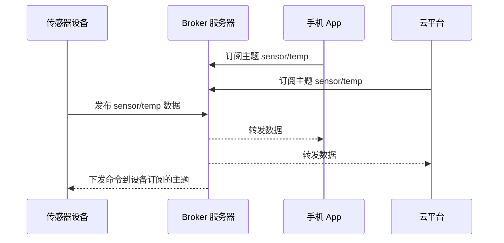

# 7.2 网络与应用层协议

> **前置知识**：[7.1 总线协议](01-总线协议.md) · [1.3 计算机组成与操作系统原理](../01-编程与软件基础/03-计算机组成与操作系统原理.md)
>
> **掌握标准**：能说清 TCP/IP 分层和常用应用层协议的差异，能根据项目需求在 MQTT / HTTP / CoAP / Modbus TCP 之间做出选择
>
> **对应岗位**：物联网工程师 · 通信与物联网工程师 · 汽车电子工程师 · 边缘网关工程师
>
> **练手建议**：用一块联网的开发板，把同一份传感器数据分别通过 HTTP 和 MQTT 发出去，对比代码复杂度、流量和实时性

7.1 解决的是"单片机能和外设说话"，这一篇解决的是"设备能接入互联网"。中间隔着的这一步，是很多嵌入式工程师的职业分水岭：会调串口的人很多，能把一个设备从传感器一路做到云端、并且在断网、掉线、丢包的情况下还能稳住的，才是物联网岗位真正要的人。

网络这块最容易学的，是把协议名和特性列成表背下来；最难也最有价值的，是理解**每个协议为什么被设计成这样**。所以这一篇从分层讲起，再落到 MQTT 和 Modbus 这两个大概率会用一辈子的协议上。

## 为什么通信要分层

网络通信的复杂度高到没人能一次想清楚，所以工程上的通用做法是**分工**：把整件事切成几层，每层只解决一个问题，并且只对上下相邻的层负责。这就是分层模型存在的唯一理由。描述这套分工最常用的是 TCP/IP 四层模型（教学时也常讲成五层或对应 OSI 七层，理解职责即可，不必纠结层数）：

| 层 | 管什么 | 这一层里的东西 |
|---|---|---|
| 应用层 | 数据的业务含义 | MQTT、HTTP、CoAP、Modbus、自定义协议 |
| 传输层 | 端到端的可靠性和复用 | TCP、UDP |
| 网络层 | 数据包怎么从一台主机走到另一台 | IP、ICMP |
| 网络接口层 | 数据怎么在这一段物理链路上跑 | 以太网、WiFi、4G、CAN |

> **说明**：CAN 被列在这里，是按分层视角看的——它承担的确实是"数据在这一段链路上怎么跑"的职责（CAN 上跑 IP 的方案也存在）。但在工业现场，CAN 绝大多数时候**不跑 IP**，而是当一条现场总线直接用，所以 [7.1 总线协议](01-总线协议.md) 把它和 I2C、SPI 放在一起讲。两处并不矛盾，只是一篇按"它在分层模型里算哪一层"归类，另一篇按"它是不是一条现场总线"归类。

分层的具体体现是**封装和解封装**：你发一条消息，应用层加上自己的头部交给传输层，传输层加头交给网络层，网络层加头交给链路层，链路层加上帧头校验发出去；对方收到后一层层剥开，把数据交给对应的上层。**每一层只关心自己的头部，看不见也不需要看见别人的头部内容。** 理解了这一点，很多困惑就解开了：为什么 MQTT 报文抓包能看到、内容却看不懂？因为你在链路层看到的是一堆层层嵌套的头部。为什么换个物理介质（网线换 WiFi 换 4G），上层 MQTT 代码一行都不用改？因为**下三层换了，上两层完全不用知道**。

## MAC、IP、端口：三个地址各管什么

初学者最容易混淆的是"同一个东西为什么有三个地址"，其实它们的职责完全不同：**MAC 地址**是网卡的物理地址，出厂烧死，管的是"这一段链路里，这一帧发给哪块网卡"，只在同一个局域网内有效；**IP 地址**是逻辑地址，由网络分配，管的是"整个互联网上，这个包最终去哪台主机"，设备换网络就会换 IP；**端口号**不是地址，而是**同一台主机上的编号**，管的是"这台主机收到数据后交给哪个程序处理"——一台设备上可以同时跑 MQTT 客户端、HTTP 服务和调试工具，靠端口区分。

所以一条数据的完整旅程是：先按 IP 找到主机，再按端口找到进程，最后在这段链路里按 MAC 找到网卡。**调试时的判断逻辑也来自这个分工**：连不上服务器，先 ping 通不通（IP 层）、再看端口通不通（传输层）、最后才看协议报文对不对（应用层），顺序反了就是在浪费时间。另外，IP 和端口的一对组合叫 **Socket（套接字）**，它是编程时最常打交道的抽象——一个 Socket 就是"一条和某个远端地址之间的通道"。

## 子网与网关的直觉理解

**子网掩码**的作用是告诉设备："哪些 IP 和我在同一个局域网里、可以直接喊话；哪些不在、得请人转交。"掩码把 IP 分成网络部分和主机部分，网络部分相同的就是同网段的邻居。**网关**就是那个"转交的人"，通常就是路由器地址：设备发现目标 IP 不在自己网段，就把数据包发给网关，由网关继续往外送。

这个模型的实际价值在于排查，按四步走：**能不能 ping 通同网段的其他设备**（不通说明链路层或本地网络配置有问题，比如网线、WiFi 连接、IP 冲突）；**能不能 ping 通网关**（不通说明设备根本没接进网络）；**能不能 ping 通外网 IP**（不通说明路由或运营商那头有问题）；**能 ping 通 IP 但域名解析不了**（说明 DNS 配置有问题——这是嵌入式设备很常见的坑，静态 IP 和网关都配好了，就是忘了配 DNS）。**很多"设备连不上云平台"的问题，用这四步走一遍就知道该怪谁。**

## TCP 与 UDP：可靠性的代价

传输层只有两个主角，它们的差别值得单独讲清楚，因为它决定了上层的一切。

**TCP 是面向连接的可靠传输。** 通信前要三次握手建立连接，数据要编号、要确认、丢了要重传、乱了要重排、发太快了要降速。**对应用层来说，它提供的是一条"看起来没有丢包、没有乱序"的字节流**——你往里写，对方按顺序读，中间的事它都替你扛了。**UDP 是无连接的不可靠传输。** 不握手、不确认、不重传、不排序，发出去就不管，到没到、什么时候到、顺序对不对，全靠应用层自己处理。

| 维度 | TCP | UDP |
|---|---|---|
| 连接 | 需要建立和维护 | 无连接 |
| 可靠性 | 协议保证（重传、排序、去重） | 不保证 |
| 时延 | 有握手、重传带来的抖动 | 低而稳定 |
| 开销 | 头部大，还要维护连接状态 | 头部小，几乎没有状态 |
| 内存占用 | 高（收发缓冲区、连接结构） | 低 |
| 广播/组播 | 不支持 | 支持 |
| 典型应用 | HTTP、MQTT、Modbus TCP | DNS、音视频、设备发现、CoAP |

**什么时候该用 UDP？** 三个判断：**丢一两个包无所谓、但晚到就没意义了**（实时音频、视频、高频传感器流）；**要广播或组播**（局域网上"谁在？"这类设备发现）；**设备资源极其紧张，连维持连接的内存都舍不得**。除此之外**默认选 TCP**，因为绝大多数业务怕的是丢数据，不是晚几十毫秒。

还有一个容易被忽略的点：**UDP 不是"不可靠"的借口，区别是"可靠性由谁负责"**——TCP 把它做进协议里（代价是协议栈复杂、内存占用大、断线要重连），UDP 把它留给应用层（代价是你得自己写确认、重传、超时）。在嵌入式里，**当连接本身很脆弱（比如移动网络）时，自己控制重传策略有时反而比 TCP 的黑盒重传更省电、更可控**——这正是 CoAP 选择 UDP 的原因。

## 应用层协议对比

应用层协议的选择，本质上是问"我的数据是什么形态、对端是谁、约束是什么"。先把主流选项摆开：

| 协议 | 传输层 | 模型 | 开销 | 适用场景 |
|---|---|---|---|---|
| HTTP / HTTPS | TCP / TLS | 请求-响应 | 大（文本头部） | 调现成 API、配置查询、低频上报 |
| MQTT | TCP / TLS | 发布-订阅 | 小（二进制头部，最小十几字节） | 设备上云、数据上报、远程控制 |
| CoAP | UDP / DTLS | 请求-响应（类 HTTP） | 极小 | 极低功耗、极弱网络、受限设备 |
| Modbus TCP | TCP | 请求-响应（主从） | 小 | 工业设备联网、PLC 对接 |
| WebSocket | TCP / TLS | 全双工长连接 | 小（握手后头部很轻） | 网页实时监控、远程控制界面 |
| 自定义 TCP | TCP | 自己定 | 可控 | 两端都是自己的设备、要求特殊 |

几个判断要点值得单独说。**HTTP 和 MQTT 的差别不是"谁更先进"，而是"谁更合适"**：HTTP 是"我问你答"，客户端主动发起；MQTT 是"订阅了就会收到"，服务器主动推给你。设备只上报数据时两者都能干，但**要接收云端下发的指令时，HTTP 得靠轮询，MQTT 天然就能收到**——这一条通常就决定了选择。

**CoAP 是为"极限受限"设计的**：跑在 UDP 上，报文极小，还定义了观察模式（订阅资源变化）和设备发现，用在电池要撑几年、网络又差又贵的场景很合适。但它的生态和工具链远不如 MQTT 成熟，**不是做低功耗就别用它**。

**自定义协议不是洪水猛兽，但要有理由。** 如果两端都是你自己的设备、且对帧大小或实时性有特殊要求，自己定一个简单帧格式往往比套 MQTT 更轻、更可控。判断标准是：**是不是真的省下来了什么**（流量、代码、内存、依赖），而不是"我觉得这样更简单"。

## MQTT：物联网最主流的协议

MQTT 采用**发布/订阅模型**，不是传统的"你发我收"模式。它的中间站了一个 **Broker（消息代理）**：设备（Client）把数据**发布（Publish）** 到某个**主题（Topic）** 上发给 Broker，其他客户端**订阅（Subscribe）** 这个主题，Broker 负责把消息转发给所有订阅者。

这套模型带来的好处很直接：**发布者不知道也不关心谁在收，订阅者不知道也不关心谁在发**。加一个新客户端的显示页面，不需要改动设备端任何代码；加一种新数据，也不影响已有订阅者。这就是它比 HTTP 更适合传感器数据上报、远程控制、设备状态同步的根本原因。

### Topic 和通配符

Topic 是用斜杠分层的字符串，比如 设备ID/房间/温度。它不要求事先创建，发布和订阅时临时用就行，所以非常灵活。两个通配符一定要会：**加号（+）匹配一层**，**井号（#）匹配后面所有层**——订阅 房间1/+/温度 能收到所有房间1下不同设备位置的温度，订阅 房间1/# 能收到房间1下所有层级的所有消息。**发布时不能用通配符**，只能订阅时用。两条经验：**Topic 结构要在项目一开始就设计好**（后面改会牵动所有端），**不要用井号订阅整个系统**（流量和性能都会失控，也没有安全边界）。

### QoS：三个等级，三种代价

- **QoS 0（最多一次）**：发出去就不管，不确认不重发。可能丢，但最快最省，适合丢一两个点无所谓的周期性数据。
- **QoS 1（至少一次）**：收到要确认，没收到就重发。**保证不丢，但可能重复**——确认包本身可能丢，发送方会重发。**应用必须能处理重复数据**（比如带时间戳去重），否则重复计数会让统计全错。
- **QoS 2（恰好一次）**：用四次握手保证不丢不重。最可靠，但交互最多、开销最大、Broker 要维护更多状态。

选法很明确：**默认用 QoS 1**，配合应用层幂等处理；周期性、丢了也无所谓的数据用 QoS 0；**QoS 2 用得很少**，除非业务真的不能容忍重复且没法自己去做去重（比如计费）。还要注意 **QoS 是逐段协商的**：发布端到 Broker 是一个等级，Broker 到订阅端是另一个等级，最终的实际保证是两者中较低的那个。

### 保留消息、遗嘱消息、心跳保活

**保留消息（Retained）**：发布时带保留标志，Broker 会保存这个 Topic 的最后一条消息，之后**任何新订阅者一订阅就立刻收到它**，不用等下一次发布。用在"设备当前状态"这类场景非常合适——新上线的监控页面一打开就能看到当前值，而不是空白等半天。

**遗嘱消息（Will）**：客户端连接时就告诉 Broker"如果我异常断开，请替我发布这条消息"。设备突然掉电、断网、被拔线时，Broker 会替你发出这条"我离线了"，订阅方就能及时知道。**这是设备在线状态管理的关键机制**，没有它你只能靠超时猜测设备还在不在。

**心跳保活（Keep Alive）**：连接时约定一个时间间隔（比如 60 秒），客户端在这个时间内至少要跟 Broker 交互一次（发心跳或发数据）。超过约 1.5 倍时间没有任何交互，Broker 就判定客户端已死并触发遗嘱消息。**心跳间隔要按网络情况设**：太短，弱网下频繁掉线重连还费电；太长，掉线要很久才发现。

**遗嘱消息和心跳是同一条时间线上的两个动作**，这一点常被误解：遗嘱并不是"不用等心跳超时"的捷径，它发布的时刻就是心跳超时（或平台检测到连接异常）的那一刻。它买到的是**一条由设备自己指定的、可以按设备区分的通知主题**，而不是更早的发现时间——想让掉线被更早发现，唯一的办法是把心跳间隔设小。

### 一条典型的物联网链路

实际项目里最常见的流程是这样一条链：**STM32 通过串口和 WiFi 模块通信，WiFi 模块连接路由器，设备再接入 MQTT 服务器，向某个 Topic 上报数据，云平台或手机端订阅并显示这些数据，用户再通过云端下发控制指令，设备接收后执行动作。** 这是很多物联网项目的标准结构，学会它之后，很多实际产品的框架你都会觉得很熟悉。注意它的每一段都用到了前面讲过的东西：STM32 和 WiFi 模块之间是 7.1 讲的串口加 AT 指令，模块到路由器是无线链路（7.3），设备到云端是 MQTT（这一篇），而整条链路的稳定性和安全性是 7.4、7.5 的主题。**如果想走物联网方向，MQTT 基本属于必须认真掌握的协议。**

## HTTP 在嵌入式里的定位

HTTP 是最常见的网络协议之一，特点是结构清晰、调试方便、生态成熟，几乎所有互联网平台都支持。它采用请求—响应的通信模型，适合做 API 调用、设备配置查询、数据上传、网页接口交互。**它的优势是对端现成**：要对接第三方的天气 API、地图服务或公司已有的后台，对方八成只提供 HTTP 接口，这种情况下 HTTP 不是选择，是唯一答案。

**它的劣势是开销大**：每次请求都带一堆文本形式的头部（Host、User-Agent、Content-Type 之类的字段），一次几字节的数据可能配几百字节的头部；而且它是无状态、短连接的，**每次上报都要重新建立连接或至少一次往返**，功耗和时延都高。所以判断很清晰：**只是偶尔上报一次数据、查询一次状态，HTTP 很方便；需要持续实时通信或云端主动下发指令，就该用 MQTT 或 WebSocket。** 用 HTTP 轮询来实现"实时控制"是新人常见的设计错误——响应慢、流量大、服务器压力大，三个问题一起出现。HTTPS 就是在 HTTP 下面套一层 TLS 加密，上面特点不变，只是多了加密握手和计算开销；涉及密钥、账号、用户数据的场合必须用 HTTPS，具体取舍见 7.5。

## WebSocket

WebSocket 可以理解为在 HTTP 基础上建立起来的一种持续双向通信机制：先发一个 HTTP 请求做"协议升级"握手，成功后这条 TCP 连接就变成全双工通道，**双方随时都能主动发消息，不用每次重新请求**。它特别适合"实时感"强的应用场景，比如设备状态面板、在线数据曲线、远程控制界面——网页端要实时显示数据、或者网页控制设备时希望响应尽量快，WebSocket 会非常好用。

它和 MQTT 的分工通常是这样的：**设备侧用 MQTT**（省流量、能过弱网），**浏览器侧用 WebSocket**（浏览器原生支持，不用装 MQTT 客户端库），**两者中间由服务器或云平台对接转换**。理解了这一点，就不必纠结"该用哪个"——它们经常同时出现在同一个系统里。

## Modbus：工业最主流的协议

Modbus 是工业现场的事实标准：简单、开放、免费，几十年来几乎所有工控设备都支持。7.1 提到的 Modbus RTU 是它的串口版本，跑在以太网上就是 **Modbus TCP**。

| 维度 | Modbus RTU | Modbus TCP |
|---|---|---|
| 物理层 | RS-485（也有 RS-232） | 以太网 |
| 帧边界 | 靠总线静默时间（约 3.5 字符）判断 | 靠 TCP 长度字段，不需要静默 |
| 地址 | 从机地址，一字节 | 用 IP 区分设备，另有单元标识符兼容旧逻辑 |
| 校验 | CRC16 | 由以太网和 TCP 保证，不再用 CRC |
| 组网 | 一条总线串多台，一台一台轮询 | 交换机星型，可并发访问不同设备 |
| 典型场景 | 现场仪表、变频器、传感器 | PLC、网关、上位机接入 |

**同一个上层模型，换了下层承载，这就是分层的价值。** 学会 RTU 之后再学 TCP，其实只要改掉帧头尾和校验部分。

### 寄存器模型：四种数据

Modbus 把所有数据抽象成四张表，理解这四张表是理解 Modbus 的关键：

| 名称 | 类型 | 读写 | 典型用途 |
|---|---|---|---|
| 线圈 | 位 | 可读可写 | 开关量输出（继电器、指示灯） |
| 离散输入 | 位 | 只读 | 开关量输入（限位、按钮状态） |
| 保持寄存器 | 16 位 | 可读可写 | 参数设置、目标值 |
| 输入寄存器 | 16 位 | 只读 | 实时测量值（温度、电压、转速） |

这个模型的好处是**极致简单**：不管底下是什么设备，上位机看到的永远是"读哪一段寄存器、写哪一段寄存器"，设备厂家在手册里给出寄存器地址表，照着读写就行。**最容易踩的坑是地址偏移**：手册写"温度在 40001"，实际报文里的起始地址可能是 0 而不是 40001——不同厂家、不同软件对地址的标注有 0 基和 1 基两种。**读不到数据时，先怀疑地址差了一个。**

### 功能码

功能码就是"要干什么"的编号，常用的几个必须记住：**01** 读线圈、**02** 读离散输入、**03** 读保持寄存器（用得最多）、**04** 读输入寄存器、**05** 写单个线圈、**06** 写单个寄存器、**16** 写多个寄存器。

**你不需要背全部功能码**，常用的就这几个。真正要会的是：收到响应后先看功能码——如果返回的功能码最高位是 1（也就是原功能码加上 0x80），说明这是个**异常响应**，后面跟的那个字节是异常码，告诉你"地址不存在""数据不合法"还是"设备忙"。**这个判断能让你的调试从"没反应"直接变成"为什么没反应"。**

**为什么它简单却经久不衰？** Modbus 没有任何先进的地方：没有压缩、没有加密、没有优先级、没有自动重传，可靠性全靠上层重试。但它赢在三点：**语义极简**（就四张表和几个功能码）、**实现极便宜**（一个 8 位单片机就能做从机）、**足够开放**（谁都能实现，谁都愿意实现）。工程上常常是这样：**"先进"的方案活不下来，"够用且便宜"的方案活成了标准。**

## Socket 编程的基本流程

如果你用的模块或平台提供了协议栈（LwIP、Linux、带联网能力的 RTOS），最底层的编程接口通常就是 Socket。**服务端**的顺序是：创建 Socket → 绑定地址和端口 → 开始监听 → 接受客户端连接（这里会阻塞直到有客户端来）→ 收发数据 → 关闭。**客户端**的顺序是：创建 Socket → 连接服务器 → 收发数据 → 关闭。服务端多了绑定和监听，因为它是"等着别人来"的那一方；客户端直接连就行，因为对方的地址端口是它知道的。

**阻塞和非阻塞的差别**是嵌入式里最需要留意的：**阻塞模式**下接收函数会在没数据时一直卡住，整个线程都动不了，裸机上这么写程序就废了；**非阻塞模式**下函数立刻返回，告诉你"没数据"或"发不出去"，你需要自己轮询或配合事件机制。实际项目的标准做法是后一种：**非阻塞 Socket + select/poll 这类事件机制（或在 RTOS 里用一个专门的网络任务）**，这样等待网络的同时还能处理按键、电机、串口等其他事情。**如果你发现程序"一联网就卡死"，九成是用了阻塞 Socket。**

## 汽车电子的专用协议

上面讲的都是通用协议。汽车电子在 CAN 之上又定义了一整套应用层协议，这是相关岗位的面试重点。

### UDS 诊断

**UDS（统一诊断服务）** 解决的是"怎么和 ECU 对话"的问题。保养时插在方向盘下面那个 OBD 接口上读故障码，走的就是它。它的核心概念有三个。

**诊断服务**：UDS 定义了几十种服务，每个服务用一个编号，请求和响应都有固定格式。常用的几类包括读取和清除故障码、读取数据流（实时读取某个信号的值）、读写 ECU 里的参数、刷写固件、控制某个执行器动作（产线上用来测试）。**你不需要背全部服务号**，但要理解这个模式：诊断仪发"服务号 + 参数"，ECU 回"服务号 + 结果"或"否定响应"。

**会话（Session）**：ECU 平时处于默认会话，只能做最基本的事情；要执行刷写、标定这类敏感操作必须先切到编程会话或扩展会话。**这是权限分级的设计**，防止误操作把 ECU 弄坏。**安全访问（Security Access）**：进入敏感会话前，ECU 先给一个随机数（种子），诊断仪用密钥算法算出应答发回去，对了才放行。**这是典型的挑战-响应鉴权**，用途是防止第三方随便刷写。要提醒的是：**绝大多数这类算法都是"防君子不防小人"**，真正要防篡改得靠安全启动一类的机制（见 7.5）。

### CANopen

CANopen 是建立在 CAN 之上的应用层协议，广泛用于电机驱动、运动控制和工业自动化。**对象字典**是它的核心思想：设备内部所有参数、状态、配置，都用一个 16 位索引加一个 8 位子索引编址，形成一张统一的表。**任何设备，你看对象字典就知道它有什么、能配什么**——这是它比"各家自定义 CAN 报文"高明的地方。

数据交换分两种，这个划分是理解 CANopen 的关键：**PDO（过程数据对象）** 用于实时数据，直接映射到对象字典里的几个条目，一帧发出就是几个变量的值，不带多余信息，**效率极高但没有确认**，适合周期性传位置、速度、状态；**SDO（服务数据对象）** 用于配置和访问任意对象字典条目，有请求有应答，可靠但慢，还能分段传输大数据，适合上电时读设备信息、改参数。**PDO 快但不保证送达，SDO 慢但可靠**——用哪个取决于数据是"周期刷新、丢一帧没事"还是"必须配对、不能出错"。

**网络管理（NMT）** 负责节点的状态控制：谁该启动、谁该停止、谁掉线了。CANopen 节点有初始化、预操作、操作、停止这几个状态，上电后先处于预操作（能配参数、不能收发 PDO），配置完再切到操作状态开始跑实时数据。**理解这个状态机，能解释很多"上电后前几秒不动、之后就好了"的现象。**

### AUTOSAR 的分层思想

AUTOSAR 是汽车行业的软件架构标准，它的价值在于**思想**而不只是规范，因为它把"分层解耦"做到了极致：**应用层**只写业务逻辑，不碰任何硬件；**运行时环境（RTE）** 负责应用层和下层之间的通信，屏蔽"这个信号走 CAN 还是走以太网"的差别；**基础软件层**里，通信协议栈、诊断、存储、操作系统各管一块，互相之间通过标准接口连接。

它解决的问题是：**同一个应用代码，换一个 ECU、换一个芯片、换一条总线，不用重写**，主机厂和供应商可以各自开发，最后拼在一起。对嵌入式工程师的实际意义是：**分层和解耦的能力，是汽车电子里最值钱的技能之一**。你在小项目里写的"驱动里直接塞业务逻辑"，在车规项目里是过不了评审的。理解这套划分，能帮你写出更好维护的代码，哪怕你根本不用 AUTOSAR。

## 协议选型判断

遇到新项目时按顺序问自己：**对端是谁？**（第三方平台只给 HTTP 接口就用 HTTP，对接工控设备多半是 Modbus，两端都是自己的设备才有自由选择的空间）；**谁主动？**（只有设备上报，HTTP 也能凑合；需要云端随时下发指令，选 MQTT 或 WebSocket）；**多长时间发一次、一次多大？**（一天几次几百字节，HTTP 完全够；每秒都在发，MQTT 的固定连接更省；极小数据加极低功耗，考虑 CoAP）；**实时性要求多高？**（要毫秒级响应，TCP 类的长连接才有意义）；**有电源吗？**（电池设备要算每一次连接的代价，长连接的保活心跳也在耗电）；**网络稳不稳？**（移动网络、弱网下，长连接的掉线重连逻辑是必须自己设计的东西）。

把这六个问题的答案写下来，选型基本就确定了。**先写答案再选协议，不要先选协议再找理由。**

## 自定义协议的设计原则

如果确实需要自己定协议（两端都是自己的设备，标准协议太重太慢），下面几条是踩过坑总结出来的。

**帧结构要有明确的边界。** 让接收方能判断"这一帧从哪开始、到哪结束"，常见做法是固定帧头、长度字段或固定长度。**没有边界定义是自定义协议的第一大坑**，表现是"数据错位、解析出乱七八糟的值"，因为你把上一帧的尾巴当成了这一帧的开头。

**必须有校验。** 最常用的是 CRC，也可以用简单的累加和。**没有校验的协议，等于把数据正确性的判断交给了运气**，尤其在长距离、有干扰的场合。

**带上版本号。** 产品固件会升级，协议迟早要改，**在帧头里留一个版本字段**，将来新老设备混用时你会感谢自己。没有版本号，一次协议改动就意味着所有设备必须同时升级，这在现实中做不到。

**考虑扩展性。** 留保留字段、用类型加长度的结构（而不是写死偏移）、支持未知字段跳过。**判断标准是：加一个新字段，老设备能不能继续工作。**

**错误处理要定义清楚。** 收到坏帧怎么办（丢弃并等下一帧）、对方没回应怎么办（超时重发几次后放弃并上报）、重发如何避免重复执行（加序号去重）。**这些问题不在协议里定义清楚，就会以"偶发死机""偶尔重复执行"的形式在生产现场还给你。**

**最后：能不自研就不自研。** 上面每一条都要花时间和测试去验证，而标准协议这些坑别人已经替你踩过了，**只有在标准协议明确不适用时，才自己定。**

## 学习建议

网络协议这一块，**最大的误区是"读懂了协议就以为自己会了"**。MQTT 的原理半小时就能讲明白，但让它在一块真实开发板上跑起来、断网能自动重连、数据能对得上、跑一周不掉线，是另一回事。所以建议的顺序是**先打通链路，再优化细节**。

1. **先让设备能上网**：用一块 ESP32 或者单片机加 WiFi 模块，连上路由器，能 ping 通网关、能连上外网。这一步卡住的人比想象中多，问题往往在 IP、网关、DNS、WiFi 认证方式这些基础配置上。
2. **再用 HTTP 发一次数据**：用最原始的方式往一个公开的测试服务发一条请求，看到返回，你就理解了"请求-响应"是什么意思。
3. **然后换成 MQTT**：找一个公共 Broker，或者在本机搭一个，把同一份数据发上去，用桌面客户端订阅下来看到。这一步的对比会让你真正理解两种模型的不同，也是本篇开头的练手建议。
4. **最后才处理工程问题**：断线重连、心跳、QoS 选择、离线缓存、时间同步，这些在 7.4 讲云平台接入时会展开。

关于学习顺序，还有一句在这里同样适用的话：**通讯协议覆盖面很广，目前也没有一套能从头到尾完整覆盖全部协议的优质教学视频合集。** 大多数人不会把所有协议系统学完，而是根据项目需要逐步补——想走物联网方向，重点放在串口收发、AT 指令、MQTT 协议和数据解析上；想走工业控制或机器人方向，就要更重视 CAN、RS-485 和总线稳定性设计。学到哪一块就针对性地查那一块，这才是更现实、也更高效的方式。

## 小节总结

网络协议这一篇的核心，不是记住每个协议的特性，而是**理解每一层在替上一层的谁承担代价**。TCP 把可靠性做进协议，代价是内存、时延和重连逻辑；MQTT 把"谁来收"这件事交给 Broker，代价是多了一个必须部署和维护的服务器；HTTP 简单通用，代价是每次通信的固定开销和"只能由客户端发起"。**看到"代价"两个字，选型就不会只凭感觉。**

MQTT 是这一篇最该掌握的协议。它的四个机制各自对应一个真实的工程需求：**QoS 等级决定可靠性和开销的取舍，遗嘱和心跳决定"设备掉线了系统多久能知道"，保留消息决定"新上线的客户端能不能立刻看到状态"**。这四个概念理解透了，你做的物联网项目就自然有了抗异常的骨架。

Modbus 和 7.1 讲的 CAN、RS-485 一样，是工业方向的基本功。它的价值不在于技术先进，而在于它证明了**工程世界里"简单、便宜、够用"往往比"先进"活得更久**。理解它的四张表和功能码，你就具备了对接到绝大多数工控设备的能力。

汽车电子的内容（UDS、CANopen、AUTOSAR）值得单独投入，因为它们是这个行业的"行话"：**UDS 教你诊断和安全访问的分级思路，CANopen 教你 PDO 与 SDO 这种"效率与可靠性分开处理"的设计，AUTOSAR 教你把分层解耦做成架构。** 这三样东西即使以后不做汽车，也是很好的工程训练。

最后还是要落到动手上。**这一篇的知识几乎不可能只靠读学会**——链路的每一段（串口、AT 指令、无线、TCP、MQTT）都可能出错，而排查这些问题的能力，只能从一次次"连不上、查出来、修好"的过程里长出来。**找一块能联网的板子，把数据真正发到云上，这一篇才算学完。**

---

本章目录：[7. 通信与物联网](README.md) ｜ 总目录：[返回首页](../../README.md)
上一篇：[7.1 总线协议](01-总线协议.md) ｜ 下一篇：[7.3 无线通信模块](03-无线通信模块.md)
