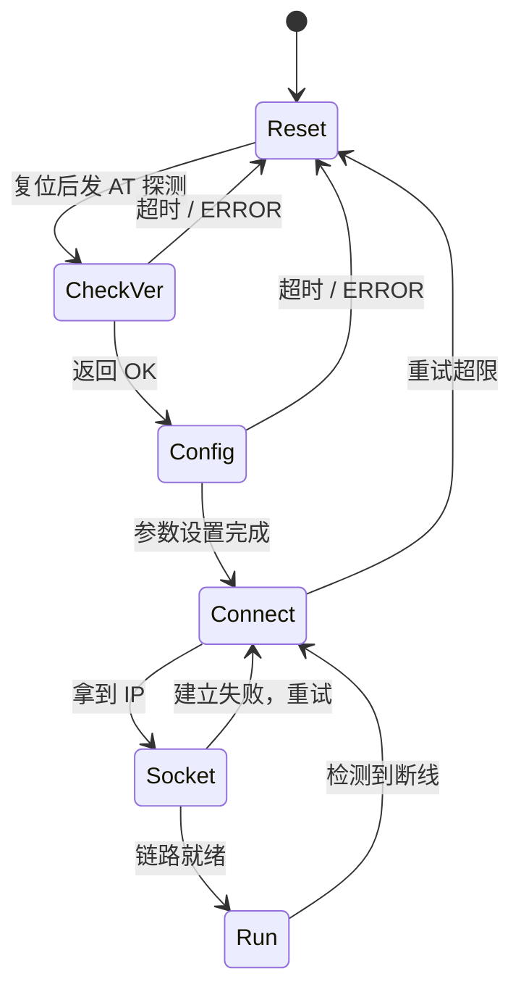

# 7.3 无线通信模块

> **前置知识**：[7.1 总线协议](01-总线协议.md)
> **掌握标准**：能根据项目的距离、带宽、功耗、成本需求选出合适的无线方案，并说清 AT 指令开发模式的全部流程和常见故障
> **对应岗位**：物联网工程师 · 嵌入式软件工程师 · 通信与物联网工程师 · 消费电子工程师
> **练手建议**：用一块 ESP32 或一个 WiFi 模组，实现设备上电自动连网、断线自动重连、定时上报数据到服务器——"能自动重连"才算完成

有线通信只要线接对了，基本就能通。无线不是——它把一个"确定"的问题变成了"概率"问题：距离、遮挡、干扰、电源、天线，任何一项不到位，你看到的现象都是"连不上"三个字。所以这一篇讲的重点不是协议栈原理（那是模组厂商该操心的事），而是**怎么选、怎么接、怎么让它在真实环境里稳定跑下去**。

## 选型：先问四个问题，再谈技术

新人选无线方案最容易犯的错，是从"哪个技术先进"入手。正确的顺序是反过来问四个问题：

1. **有没有电源？** 有市电、能一直插着，WiFi 和 4G 随便挑；如果是纽扣电池要撑几年，WiFi 和 4G 基本直接出局。
2. **有没有网络覆盖？** 有路由器就有 WiFi；没路由器但运营商有信号，可以考虑 NB-IoT 或 4G；两者都没有（偏远农田、地下管网、野外设备），只能自建 LoRa 或 Sub-1G 网络。
3. **数据量多大、多久发一次？** 一天发几十字节的传感器数据，和每秒传一路视频，是两种完全不同的技术。
4. **能接受多少成本？** 模组成本、网关成本、运营商资费、认证成本，四项都要算。NB-IoT 和 4G 的模组本身不算贵，但每台设备每年都要交资费，量大了这笔钱比模组贵得多。

这四个问题答完，方案基本只剩一两个了。下面这张表是用来做最后确认的，不是用来从头挑的。

| 方案 | 典型距离（量级） | 带宽（量级） | 功耗 | 需网关 | 需运营商资费 | 组网能力 | 单点成本 |
|---|---|---|---|---|---|---|---|
| WiFi | 室内几十米 | 高，Mbps 级 | 高 | 需要路由器 | 否 | 星型，受路由器带机量限制 | 低 |
| 蓝牙 / BLE | 几米到十几米 | 中低 | 低 | 通常不需要 | 否 | 点对点或星型，节点少 | 低 |
| Zigbee | 室内几十米，可中继延伸 | 低 | 低 | 需要 | 否 | Mesh，可带较多节点 | 中 |
| LoRa | 郊区数公里，城区数百米 | 极低，kbps 级 | 极低 | 需要自建 | 否 | 星型，一个网关带大量节点 | 中 |
| NB-IoT | 依托运营商覆盖 | 极低 | 极低 | 不需要，直连基站 | 需要 | 星型，依附运营商 | 中 |
| 4G Cat.1 / Cat.4 | 依托运营商覆盖 | 中到高 | 高 | 不需要 | 需要 | 星型 | 中到高 |
| 5G | 依托运营商覆盖 | 很高 | 高 | 不需要 | 需要 | 星型 | 高 |
| Sub-1G 私有协议 | 几十米到几百米 | 低 | 低 | 需要自建接收端 | 否 | 星型或自定义 | 低 |

**表里的所有距离、速率、价格都只能当量级参考，具体以数据手册和实际测试为准。** 厂商标称的"传输距离 1 公里"，是在开阔无遮挡、天线理想、速率开到最低的条件下测出来的；你把它放进钢筋水泥的写字楼，或者塞进一个金属机柜，实际能用的距离可能只剩几十米。**永远在自己的现场环境实测，不要照抄数据手册。**

## 各方案的实际定位

选型表只能看个大概，真正决定成败的是"这个技术在这个场景里合不合适"。下面逐个说清楚它们的适用边界，以及**什么时候不该用**。

**WiFi** 适合有市电、有路由器的场景：智能插座、摄像头、家电联网、实验室数据采集。不该用在电池设备上——WiFi 的保持连接功耗和发射功耗都很高，一颗纽扣电池撑不了几天。另外家用路由器带机量有限（通常几十台），几十上百个节点的场景不适合直接用 WiFi 直连一个路由器。

**蓝牙 / BLE（低功耗蓝牙）** 适合和手机配对的短距离场景：手环、体重秤、蓝牙耳机、设备参数配置。不该用在需要远距离或大量节点的场合。BLE 的点对点与星型拓扑决定了它做不了大规模组网；蓝牙 Mesh 能做，但生态和调试体验不如 Zigbee 成熟。

**Zigbee** 适合需要自组网、低功耗、多节点的场景：智能家居、楼宇照明、传感器网络。不该用在需要高带宽的场合（传图传视频不行），也不适合不愿意增加网关成本的产品——Zigbee 设备几乎都要一个网关才能上云。

**LoRa** 适合低功耗、低数据量、自建网络、覆盖范围大的场景：农田墒情、水表电表、园区抄表、环境监测。不该用在需要实时响应或大数据量的场合。LoRa 的速率极低，一次发送可能要几百毫秒到几秒（取决于扩频因子），而且在国内使用要遵守无线电管理规定，具体频段和发射功率按当地法规执行。

**NB-IoT（窄带物联网）** 适合低频、小数据量、电池供电、依附运营商覆盖的场景：智能水表、气表、井盖监测、消防栓监测。不该用在需要实时响应或频繁交互的场合。NB-IoT 的时延大，一次上行可能要几秒，下行更慢；业务如果要求"按下按钮立刻响应"，NB-IoT 会让你失望。它天生适合"上报型"业务，不适合"被呼叫型"业务。

**4G Cat.1 / Cat.4** 适合需要一定带宽、要实时双向通信、设备有电源的场景：车联网、共享设备、工业网关、视频回传（Cat.4 更合适）。不该用在纯电池供电的低功耗场景——Cat.1 的功耗已经比传统 4G 低很多，但仍远高于 NB-IoT；也不适合量极大、对每台每年资费敏感的产品。

**5G** 适合对带宽和时延要求极高的场景：工业现场的高可靠低时延通信、AGV、远程控制。不该用在绝大多数普通物联网项目上。5G 模组贵、功耗高、资费高，用一个 5G 模组传几字节的温湿度，是典型的过度设计。

**Sub-1G 私有协议** 适合自建小网络、需要穿透和绕射能力、不想交资费、成本敏感的场景：无线遥控、无线门铃、工业遥控器、部分抄表。不该用在需要互联互通或标准化协议的场合。私有协议意味着两端都是你自己的东西，跟第三方设备通不了，抗干扰和组网能力也要自己解决。

## 模组开发的三种模式

拿到一个无线模组，写代码的方式有三种，投入产出比差别很大。

**AT 指令模式**——主控单片机通过串口（UART）给模组发 AT 命令，模组自己完成协议栈、联网、收发。优点是开发门槛低，不需要懂协议栈；缺点是速度慢（每条命令一来一回）、稳定性依赖模组固件、状态机写起来复杂。**这是嵌入式里最主流的做法**，也是这一篇的重点。

**透传模式**——模组自动把串口收到的数据原样转成网络数据发出去，反过来也一样。对单片机来说，它就像一根"虚拟的串口线"。优点是极简，几乎不用改代码就能把有线设备变成无线设备；缺点是不可控——你看不到连接状态、不知道数据到没到、出了问题难排查。适合快速验证，不适合要求高的量产项目。

**自带协议栈二次开发（SoC 模式）**——直接在模组芯片上写应用代码，比如用 ESP32 直接开发，省掉一颗主控单片机。优点是省一颗芯片、成本低、体积小；缺点是要学一套新的开发平台和 API，换方案时迁移成本高。产品量大、成本敏感时值得，做原型验证时不值得。

选择建议：**先 AT，后 SoC**。除非产品对成本或体积有硬要求，否则 AT 模式是投入产出比最高的选择。透传模式可以拿来快速验证"这条路走不走得通"，但不要把它当成最终方案。

## AT 指令开发的完整流程

### 上电初始化序列

顺序大致是：硬件复位（拉低 RESET 脚，或者发复位命令）→ 查版本（确认模组活着、固件对不对）→ 关闭回显（否则你发什么它回什么，解析会乱）→ 设置工作模式（Station 还是 AP、透传还是命令模式）→ 配置参数（WiFi 的 SSID 和密码，或者蜂窝网的 APN、服务器地址和端口）→ 连接网络 → 建立 socket → 进入数据收发。

**每一步都要等它返回 OK 或预期结果再走下一步**，不能靠固定的延时往前冲。这一条是 AT 开发里最重要的纪律。

### 为什么必须写成状态机

新人最常见的写法是"初始化函数里连续写十几条发送命令，每条后面加一段延时"。这种写法在实验室能跑通，到现场必挂。

原因很简单：模组是一个**独立的、可能不按你预期响应的小系统**。它会返回 ERROR，会返回 busy，会不响应，会因为信号差卡在某一步几十秒。如果你用延时硬推，结果就是网络还没连上你就开始发数据，一切看起来都在跑，但一条数据都没到服务器。

正确做法是把初始化写成一个状态机：每个状态做一件事、发一条命令、等一个响应、带一个超时。超时就重试，重试若干次还不行就退回上一个状态或者整体重来。

**"发命令—等响应—超时重试"这十二个字，是 AT 开发的全部核心。** 剩下的都是细节。

### 超时、重试与重连

- 每条 AT 命令都要有超时。普通命令常见取值几百毫秒到几秒，具体看命令类型，以数据手册为准。
- 连接类操作（连 WiFi、注网、连服务器）超时要给足，几秒到几十秒都正常，给短了会误判成失败。
- 重试要有上限。无限重试会让状态机永远卡在一个状态里，看起来"程序没死"，实际上什么也没干。
- 断线检测靠三种信号：模组主动上报的断开提示、心跳超时、发送失败。三种都要处理，只靠一种会漏。

### 心跳保活

TCP 连接长时间没有数据往来，中间的路由器、NAT、运营商网关会把连接悄悄回收——你以为还连着，其实早就断了。所以要定期发心跳包。心跳间隔是个权衡：太短费电、费流量；太长则掉线发现不及时。云端一般会要求一个心跳周期，按它的要求来。

### 数据怎么解析

**绝对不能用"发完命令延时 500 毫秒，然后把缓冲区读出来"这种方式解析模组返回。** 模组返回的时间不确定：信号好时 10 毫秒就回，信号差时 500 毫秒还没回完。用固定延时读，早晚会读到半截数据，然后解析出一个莫名其妙的结果。

正确做法是用帧边界：AT 的响应和主动上报基本都是以 `\r\n` 结尾的文本行，先按 `\r\n` 切分成一行一行，再逐行判断这一行是 OK、是 ERROR、还是数据上报。这和 [7.1 总线协议](01-总线协议.md) 里讲的串口收包是同一个思路——**先切帧，再解析，不要猜时间**。

### 常见故障与排查

**连不上**：按这个顺序查——信号强度（RSSI 是不是太低）、天线有没有接或接错（IPEX 座没插、天线焊反）、参数对不对（SSID、密码、APN、频段）、SIM 卡有没有问题（欠费、没激活、卡座接触不良、贴片卡焊反）、供电够不够（见下面专门的一节）。这五条能覆盖绝大多数"连不上"。

**连上了但发不出数据**：socket 有没有真的建立（AT 命令返回 OK 只代表模组接受了指令，不代表连上了服务器）、服务器地址和端口对不对、服务器有没有开防火墙或安全组、有没有被云端因为长时间没心跳踢掉、数据格式对不对（很多平台要求 JSON 或特定物模型格式）。

**偶发死机或重启**：这一类最难查，因为现象随机。三个常见原因——电源带不动（占大多数）、模组发热（尤其是一直在搜网或信号差的时候）、串口丢数据（波特率太高、线太长、没有流控）。**如果你手上没有示波器，这一类问题基本查不出来**，因为你需要看到电源在发射瞬间的跌落。

## 电源设计：模组稳定性的关键

单独把这一节拎出来，是因为这是新手最难定位、也最容易被忽略的一类问题。

无线模组在**发射瞬间**的电流是脉冲式的：平时待机可能只有几毫安到几十毫安，一发射就冲到几百毫安，蜂窝模组甚至可能到安培级（具体峰值以数据手册为准，不同方案差别很大）。这个脉冲非常短，万用表根本看不到——万用表显示的是平均电流，你看到"才 50 毫安，供电肯定够"，实际上那一瞬间电压已经跌到模组的最低工作电压以下了。

电源没给够的典型症状，就是前面说的那一类"偶发"故障：莫名连不上、连上了发一条数据就重启、信号弱的时候特别容易死机。**它不表现为"一上电就不工作"，而表现为"大部分时候正常，偶尔抽风"**，所以极难定位。

解决办法有几条：

- 电源芯片的**持续输出能力**要按模组的发射峰值留余量，不能只按平均电流选型。
- 模组电源脚旁边要放**大容量储能电容**（几百微法级别，具体按数据手册的参考设计），有的模组还要求并一个小陶瓷电容滤高频。
- 走线要短、要粗，模组电源脚到电容的距离越短越好。
- 调试时用**带电流显示的稳压电源**供电，盯着电流表看发射瞬间的跳变——这是判断供电够不够最直接的方法。
- 电池供电时还要考虑电池的**内阻和放电能力**，有些纽扣电池或小容量锂电根本提供不了发射峰值电流。

**记住一句话：无线模组的一切"玄学问题"，先怀疑电源。**

## 天线与射频的基本常识

天线是无线链路里最容易被当成"配件"、实际上最影响效果的一环。

**常见天线类型**：PCB 板载天线（成本最低，直接画在板子上，效果受布局影响极大）、陶瓷天线（体积小，适合空间紧张的产品，增益一般）、外置天线（效果最好，但占体积、有装配成本）、IPEX 座（可以外接天线，也方便做认证时灵活更换，但座子很脆弱，插拔有寿命）。

**为什么天线周围要净空**：天线靠电磁场辐射工作，周围任何导体都会改变它的场分布，把本该辐射出去的能量吸走或反射回去。所以数据手册都会画一个"禁止铺铜、禁止走线、禁止放元件"的净空区，**这个区域必须严格遵守**。把它当成"建议"的产品，最后都会遇到"通信距离只有别人一半"的问题。

**为什么不能靠近金属和电池**：金属会屏蔽和反射，电池本身也是一块导体加电解液。产品结构设计时，天线位置要避开金属外壳、屏蔽罩、大块电池、液晶背光板。很多"实验室能用、装进外壳就不行"的案例，都是结构把天线挡住了。

**RSSI 怎么看**：RSSI 是接收信号强度指示，单位一般用 dBm，是负值，**越接近 0 越好**。粗略的量级判断是：-50 dBm 左右算很近、信号很好；-70 dBm 左右算正常可用；-85 dBm 以下开始不稳定，掉线率明显上升；接近 -100 dBm 基本就没法用了。不同方案的门限差别很大，这只是通用量级参考，**具体以你用的模组数据手册和现场实测为准**。除了 RSSI 还要看信噪比——信号强度够但噪声大，一样连不上。

**模组布局的基本要求**：远离电源电路（尤其是 DC-DC 开关电源，它是很强的干扰源）、远离晶振（时钟信号会串扰）、远离高速信号线（USB、以太网、SPI 高速时钟）、天线净空区下方不要铺地。这些要求模组的数据手册和硬件设计指南里都会写，**照着参考设计做比自己发挥靠谱得多**。

## 功耗与低功耗通信

如果是电池设备，无线通信几乎一定是最大的耗电来源，没有之一。降低功耗的核心思路是**让它尽量少醒着**。

要区分两种功耗：

- **连接保持的功耗**：设备"在线但不发数据"时消耗的功率。不同技术差别巨大——WiFi 保持连接可能需要几十毫安，BLE 广播可能只有微安级，NB-IoT 在省电模式下也能低到微安级。
- **发送瞬间的功耗**：发一次数据消耗的能量。这个值是"功率 × 时间"，所以**发得快反而可能更省电**：同样的数据量，高带宽短时间发完，比低带宽长时间拖着更省。

**心跳间隔直接决定电池寿命**，因为它决定了设备多久要醒一次、醒着多久。举个量级上的例子：一个设备每 10 秒醒一次保持连接，和每小时醒一次，电池寿命可能差几十倍。这不是"优化"问题，而是"能不能做"的问题。

常用省电手段：

- **加长上报间隔**：最简单也最有效。很多场景根本不需要秒级数据。
- **批量上报**：本地攒够一批数据再一次性发出去，比每条都单独发省得多——因为每次发送的固定开销（唤醒、建连、握手）远大于数据本身的能耗。
- **用 PSM / eDRX**（NB-IoT 的两个省电特性）：PSM 让设备在空闲时进入极低功耗休眠，eDRX 拉长寻呼周期。代价是设备"被呼叫"的响应变慢——这和前面说的"NB-IoT 不适合被呼叫型业务"是同一件事。
- **低功耗待机 + 唤醒发送**：平时让单片机进 Stop 或 Standby 模式，模组断电或深睡，定时器或外部事件唤醒后再连网发送。这是最通用的做法，代价是每次发送都要重新建连，所以"批量上报"就变得更关键。

一个现实的提醒：**低功耗是系统工程，不是把单片机设成低功耗模式就完事的**。要实测整机的平均电流（用带电流记录功能的电源或电流表长时间记录），才能算清楚电池能撑多久。**算出来的寿命通常比预期短很多**——因为唤醒时的短暂大电流峰值会大幅拉高平均值。

## 协议与安全的简要提醒

无线通信的数据是**发在空气里的**，任何人用合适的设备都能收到。这和有线通信有本质区别：有线要接触到线才能窃听，无线只要在覆盖范围内就行。

**明文传输的风险**：如果设备直接发明文（比如裸 TCP 或裸 UDP），同频段的任何人都能抓到你的数据。用 MQTT 或 HTTP 时至少要走 TLS，让它把数据加密。

**TLS 对资源的要求**：TLS 握手涉及非对称加密运算，对单片机的内存和算力都有要求。资源紧张的单片机跑完整的 TLS 会很吃力，通常的做法是：选带硬件加密加速的芯片、用裁剪过的轻量 TLS 实现（比如把 mbedTLS 配置裁剪到最小）、或者把安全交给模组（有些模组内置 TLS，AT 命令就能开）。

**设备认证与一机一密**：不要所有设备共用一个密码或密钥——一台设备被破解，全部设备都不安全。正确做法是每台设备有唯一的密钥或证书（一机一密），云端能识别并单独吊销某一台。生产时怎么把密钥烧进每台设备，是这个环节最容易出工程问题的部分。

安全是很大的话题，[7.5 安全与加密](05-安全与加密.md) 会展开讲。这里只需要建立一个意识：**无线通信必须在设计之初就把安全考虑进去，事后补是补不上的**。

## 学习建议

1. **先按选型四问确定方案，再动手。** 选错了技术，后面所有努力都是在给错误的方向打工。如果不确定，先用最便宜的方式验证：一块 ESP32 或一个 WiFi 模组，几十块钱就能把整条链路跑通。
2. **AT 命令先在电脑上敲一遍。** 用 USB 转串口接模组，手动发命令走一遍完整流程，看每一步的真实返回。这一步花半小时，能省掉后面几天的瞎猜——因为你从此知道"正常的返回长什么样"。
3. **先写状态机，再写业务。** 串口收发框架（DMA 接收加空闲中断加环形缓冲区加帧解析）搭好之后，再做连接管理、重连、心跳。顺序反了就会一直在改底层。
4. **把"断线重连"当成必做项，不是加分项。** 练手建议里之所以强调"能自动重连才算完成"，是因为实验室里不重连也能跑通，现场不重连就是废品。测试方法很简单：把路由器断电再上电，或者把天线拔掉再插上，看设备能不能自己恢复。
5. **电源和天线不要"以后再优化"。** 这两项是硬件层面的，改板子要花钱花时间。第一版打样时按参考设计做对，比后面改板便宜得多。
6. **可以略过的部分**：如果你是软件方向，射频原理、天线仿真、匹配网络这些只看结论就行（净空区要留、不要靠近金属），不必深究。反过来说，AT 状态机、断线重连、电源余量这三件事，不管什么方向都要掌握。

## 小节总结

无线选型的第一问不是"哪个技术先进"，而是"有没有电源、有没有网络覆盖、数据量多大、能接受多少成本"。这四个问题答完，可选的技术通常只剩一两个。**数据手册上的距离和速率都只能当量级参考，真实环境下的差距可能有一个数量级，必须现场实测。**

模组开发以 AT 指令模式为主流：单片机通过串口发命令，模组负责协议栈。它的核心不是"记住多少条命令"，而是**"发命令—等响应—超时重试"的状态机思维**。用延时硬推的初始化代码在实验室能跑，在现场必挂——因为模组会失败、会不响应、会返回 ERROR，而你的代码必须能处理这些情况。

AT 开发里最值得投入的三件事：用帧边界而不是固定延时解析模组返回；把断线检测和自动重连做成标配；把电源和天线一次做对。前两件是软件功夫，第三件是硬件功夫，缺任何一件，产品到了现场都会出问题。

关于电源，要记住一个反直觉的事实：**无线模组最难的故障不是"不工作"，而是"偶尔不工作"**。发射瞬间的电流峰值用万用表根本看不出来，而它恰恰是"偶发死机""莫名重连"最常见的根因。给模组留足电源余量和储能电容，比反复改代码更能解决问题。

最后，无线通信是把数据发在空气里的，安全性必须从设计之初就考虑——一机一密、走 TLS、能远程吊销。这一篇讲的是"怎么连上、怎么连稳"，连上之后的事（云平台接入、安全与加密）在接下来的两篇里。

---

本章目录：[7. 通信与物联网](README.md) ｜ 总目录：[返回首页](../../README.md)
上一篇：[7.2 网络与应用层协议](02-网络与应用层协议.md) ｜ 下一篇：[7.4 云平台接入](04-云平台接入.md)
