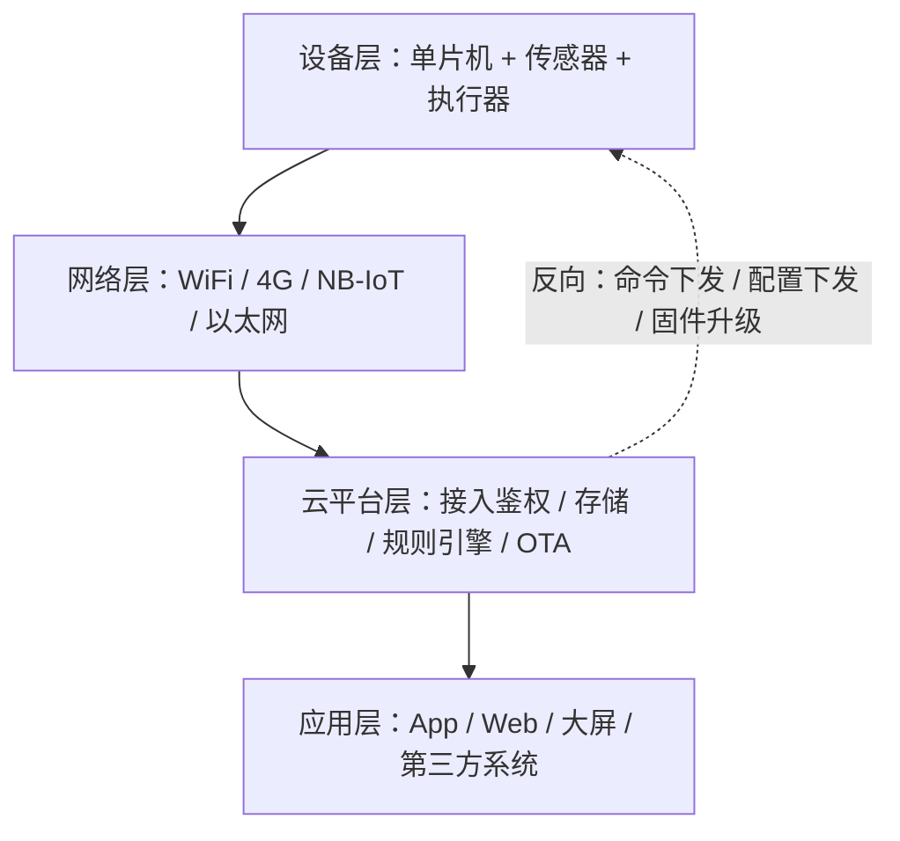

# 7.4 云平台接入

> **前置知识**：[7.2 网络与应用层协议](02-网络与应用层协议.md) · [7.3 无线通信模块](03-无线通信模块.md)
> **掌握标准**：能独立把一台设备接入云平台，实现数据上报、命令下发、设备在线状态管理，并能说清设备端需要做哪些可靠性设计
> **对应岗位**：物联网工程师 · 通信与物联网工程师 · 嵌入式软件工程师 · 边缘网关工程师
> **练手建议**：用一个 ESP32 或 4G 模组，把温湿度数据通过 MQTT 上报到一个云平台（阿里云 IoT、OneNET、EMQX 自建都行），并在平台上做出一条能自动重连、离线可缓存的数据曲线

## 云平台在系统里处于什么位置

前面几篇讲的是"设备怎么把数据送出去"（总线、无线模组、MQTT 报文）。这一篇讲的是数据送到哪里、由谁保存、谁来看、谁来下发指令。

一个典型的物联网系统是四层结构：

这张图里，**云平台是唯一一个"哪一层都绕不开"的东西**。设备要它鉴权，应用要它取数，运营要它出报表。所以嵌入式工程师哪怕不写后端，也必须理解平台的模型——因为设备的代码是围绕平台的规则写的。

一个常见的误解是"云平台 = 一个存数据的数据库"。差得远。数据存储只是它最不起眼的一个功能。

## 平台到底提供了什么

把平台的能力拆开看，其实就六件事：

| 能力 | 解决什么问题 | 设备端要配合什么 |
|---|---|---|
| 设备接入与鉴权 | 怎么证明"这台设备真的是你家的" | 保存好密钥，用约定的方式签名 |
| 数据存储与转发 | 数据存哪、给谁看 | 按约定格式上报 |
| 规则引擎 | 数据到了之后自动做点什么 | 触发条件由平台配置，设备无感 |
| 远程配置 | 改参数不用升级固件 | 实现配置的下发与持久化 |
| OTA 升级 | 批量给设备换固件 | 见 [3.7 Bootloader 与 OTA 升级](../03-嵌入式软件工程/07-Bootloader与OTA升级.md) |
| 可视化 | 给人看的数据曲线和报表 | 上报的数据要按时序组织好 |

**对设备端工程师来说，真正天天打交道的是前两项和第五项**，规则引擎和可视化基本是别人的活。但面试的时候这六项都要能说得出来——尤其是"平台不只是存数据"，这句话能立刻区分出你是真做过项目还是看过几篇文章。

## 该不该自己从零搭服务器

直接给结论：**绝大多数项目不该自己从零搭。**

理由很实在。用现成平台，一个下午就能让设备上线看到数据曲线；自己搭一套，你要处理的是：并发连接的接入层、设备鉴权、时序数据的高效写入与查询、断线重连时的消息可靠性、服务器的监控和运维、以及将来被攻击时的安全加固。这些每一样都是专门的工作量，**而你的项目价值往往不在这里**。

但必须诚实指出另一面：**平台会有锁定**。

- 设备端的接入代码（鉴权方式、主题格式、物模型定义）是平台私有的，换平台要重写；
- 历史数据导出后格式往往对不上，迁移成本高；
- 平台的计费方式、限流策略、免费额度随时可能变；
- 平台下线或停止维护时，你的设备就成了砖头。

所以判断标准是这样的：**原型和中小规模项目，用现成平台，快就是一切；如果项目生命周期长（五年以上）、设备量大、或者数据本身是核心资产，就要在选型时认真评估迁移成本**，至少把设备端的接入层抽象成一层薄薄的适配代码，让换平台时改的是一层而不是全部。不要为了"看起来自主可控"去自建，也不要为了"快"把长期成本全押在一个平台上。

## 平台的几种类型

市面上能选的方案大致分三类。下面提到的平台名称**仅作类型举例，不作为推荐**——具体选哪家要看你的网络环境、成本预算和团队技术栈，这里只讲各自适合什么。

| 类型 | 代表 | 适合场景 | 主要代价 |
|---|---|---|---|
| 公有云 IoT 平台 | 阿里云 IoT、腾讯云 IoT、华为云、OneNET、AWS IoT | 快速出原型、中小规模商用 | 平台锁定、按量计费、定制能力受限 |
| 开源自建 | EMQX + 时序数据库（如 TDengine、InfluxDB）+ 自己的业务服务 | 数据敏感、需要深度定制、设备量中等 | 需要运维能力，故障要自己兜 |
| 轻量方案 | 直接 MQTT 到一个自己写的小服务 | 内网、小规模、教学、私有部署 | 所有可靠性机制都要自己实现 |

选择的经验法则：**设备数在一千台以内、团队没有专职运维，优先公有云平台；数据不能出内网（如工业现场、医疗），走开源自建；只是想把数据存下来自己看，轻量方案就够，别上平台。**

要特别提醒一句：公有云平台之间差异比看起来大得多。有的平台强制要求用物模型，有的允许你自由发主题；有的按消息条数计费，有的按连接数和流量计费。**选型时先把计费方式和限流策略看清楚**，很多项目上线后才发现消息太频繁，账单比硬件还贵。

## 设备接入的五个核心概念

这部分是本篇最重要的内容。这五个概念搞懂了，接任何平台都是同一套思路换名字。

### 一机一密与设备三元组

平台要确认"连上来的设备是合法的"，最常用的办法是给每台设备一组唯一凭证。常见的叫法是三元组：

- **ProductKey（产品标识）**：同一款产品的设备共用，标识"你是哪个型号"；
- **DeviceName（设备名）**：同一产品内唯一，标识"你是哪一台"；
- **DeviceSecret（设备密钥）**：每台设备独有的一串密钥，**必须严格保密**。

拿到这三个值之后，设备不是把密钥直接发出去，而是用它算出一个签名（通常是 HMAC，具体算法见 [7.5 安全与加密](05-安全与加密.md)），把签名和身份信息一起发上去，平台用同样的密钥验算一遍。这样即使报文被截获，攻击者也拿不到密钥本身。

**为什么必须一机一密**：如果所有设备共用一套密钥，那么只要拆开任意一台设备把密钥读出来，整个产品线的设备就全部可以被伪造，而且**你连是哪台设备泄露的都查不出来**。一机一密的价值不只是安全，还在于可追溯——出问题时能精确定位到单台设备并单独吊销。

产线上怎么把这三元组写进每台设备？常见的做法是在产测环节用治具通过串口写入，写进单片机的内部 Flash 独立区域或外挂的安全存储芯片，写完后置一个"已烧录"标志位防止重复写入。这套流程和 [12.5 生产交付与 BOM 管理](../12-工程素养与交付/05-生产交付与BOM管理.md) 里讲的产测治具是同一件事——**三元组写入是所有物联网产品产线上必须有的工位，不能靠工人手输**。

### 设备影子

**这是云平台提供的能力里最实用的一个，没有之一。** 问题是这样产生的：你想远程打开设备上的继电器。设备现在恰好离线（4G 信号不好、或者设备在深度睡眠）。这条命令该怎么办？直接丢掉，用户会投诉"我点了没反应"；一直等着，那平台要维护一个"待发命令队列"，谁来做、存多久、设备一直不上线又怎么办？

设备影子的做法是：**在云端为每台设备维护一份 JSON 文档，记录它"应该是什么状态"和"最后一次上报是什么状态"。**

设备在线时，App 改影子 → 平台推送消息给设备 → 设备执行 → 上报新的状态 → 影子更新。设备离线时，App 照样可以改影子里期望的值，**平台帮你存着，等设备下次上线时主动把这份期望状态发给它**，设备执行完再回报。

设备端要做的配合其实很简单：上线后第一条消息就去拉取一次完整的影子，和本地状态对比，把不一致的地方补齐。这个"上线先对账"的动作叫做状态同步，看起来笨，但它把"命令丢失"这个棘手的问题变成了一个幂等操作——**不管丢了多少次命令，只要最后同步一次，状态就一定是对的。**

这也是为什么影子特别适合两类场景：弱网环境（NB-IoT、LoRa 这种三天上线一次的），和带本地自动控制的设备（比如温控器自己也会开关，云端必须知道最终状态）。

### 物模型

物模型（TSL，Thing Specification Language）做的事情是：**把设备的能力用结构化的方式描述出来，让云端和 App 不用理解设备内部细节。** 它把设备能力分成三种：

- **属性（Property）**：设备的状态数据，可读可写。比如"当前温度"、"开关状态"、"目标温度"。
- **事件（Event）**：设备主动上报的一次性信息，通常带告警含义。比如"高温告警"、"设备重启"。
- **服务（Service）**：设备能被调用执行的动作，可带输入参数。比如"重启设备"、"校准传感器"。

好处是什么？想象一下没有物模型的开发方式：App 收到一串十六进制数据，得自己知道第 3 个字节是温度、第 4 个字节是湿度、单位是 0.1 度——**每换一款设备，App 就要改一次**。有了物模型之后，App 收到的是"温度 = 25.3"，单位和含义都由平台根据物模型定义解析好了，换设备只要换一份物模型定义，App 一行不用改。

还有一个常被忽略的好处：**物模型是设备和平台之间的接口契约**。定义好之后，硬件、固件、App、后端、测试五方可以并行开发，不用等对方的代码。

对嵌入式工程师来说，要理解物模型**不是让你去实现它的解析**——绝大多数平台提供 SDK，你只要按它的接口填数据就行。真正需要你参与的是**物模型怎么定义**：哪些量走属性、哪些走事件、上报周期多长。这个设计做糟了，后面加功能会很痛苦。

### 主题与权限

MQTT 的主题（Topic）是分层的字符串，比如 productKey/deviceName/user/update 这种形式。云平台用主题做两件事：**路由消息**和**划安全边界**。关键规则是：**设备只能发布和订阅自己被授权的主题。** 一台设备通常被允许发布自己的上报主题、订阅自己的下发主题，别的主题它碰都不许碰。

这条规则为什么重要？如果没有这个限制，任何一台被破解的设备都可以订阅"所有设备的重启命令"主题，然后伪造出一次全厂设备重启——**一台设备失守就变成整个产品线失守**。而对设备端工程师来说，这意味着一件事：**不要图省事把所有设备都放到同一个主题上。** 我见过不少偷懒的设计，为了省事让所有设备订阅同一个广播主题，结果既没法做单机控制，又留下了巨大的安全口子。

### 在线与离线

平台判断设备在不在线，靠的是 MQTT 的心跳（Keep Alive）。设备在约定时间内没有任何报文，平台就认为它掉线，并断开连接。

这个机制里有一个**设备端必须注意的细节**：MQTT 的 Keep Alive 是"客户端承诺的最大静默时间"，如果你把心跳设成 60 秒，就必须保证任何时候都有报文发出。但单片机在做长时间阻塞操作（比如 Flash 擦除、大块数据采集）时，主循环可能几十秒没空跑 MQTT 任务，结果**平台判定你掉线了，而你自己还不知道**，直到下一次发送失败才反应过来。这就是典型的"看起来在线实际掉线"——上报数据总是断断续续，但设备没报错。

另一个机制是**遗嘱消息（LWT，Last Will and Testament）**：设备在连接时预先告诉平台"如果我非正常断开，请帮我发一条消息到某个主题"。这样设备掉线时，平台能立刻代为发一条"设备离线"的告警，而不是等心跳超时。用于故障告警的设备一定要配遗嘱消息——它能让你的告警提前几十秒到几分钟。

## 设备端必须做的可靠性设计

这一节是实践重点。**平台侧的功能是平台给的，设备侧的可靠性得你自己写**，而恰恰是这部分决定了项目能不能上线。

### 连接管理：不要死循环猛连

最糟的写法是"while(1) { 连接; }"——连不上就立刻重试，一秒试几十次。后果是：如果服务器出故障，几百台设备会在同一秒发起重连，**把刚刚恢复的服务器再次打挂**，形成雪崩；对电池设备来说，还会把电白白烧掉。

正确做法是**指数退避**：第一次失败等 1 秒，第二次等 2 秒，然后 4 秒、8 秒，一直涨到一个上限（比如 60 秒或 5 分钟），之后维持在上限不断重试。如果加上一点随机抖动（比如在 60 秒基础上随机加减 10 秒），可以避免大量设备同时重连。

还要注意"连上了"和"能用了"是两回事。TCP 连上只说明网络通，MQTT 还需要完成鉴权握手（CONNACK）才算真正可用。**代码里要区分这两个状态**，否则会出现"以为自己在线上，其实一直在发没人收的消息"。

### 数据上报：定时、变化还是事件触发

| 策略 | 适合什么 | 代价 |
|---|---|---|
| 定时上报 | 缓变量，如温湿度、电量 | 无变化时也在费流量 |
| 变化上报 | 突变量，如开关状态、门磁 | 需要设死区，否则噪声引起抖动上报 |
| 事件触发上报 | 告警、异常、按键 | 平时没数据，平台无法判断设备是否活着 |

实践中**最常用的是定时上报打底 + 事件上报补充**：定时上报保证平台始终知道设备在线、数据连续；异常发生时立刻补一条事件。纯变化上报看起来很省，但平台那头会出现长段的空白，做曲线的人会来问你"设备是不是坏了"。

上报频率要和业务匹配，而不是和你的技术能力匹配。经验值：**电池供电设备以分钟到小时为周期，市电供电设备可以到秒级**。频率定高一点很容易，改低却往往会牵动业务需求，所以宁可一开始就订得保守些。

### 命令下发：ack、过期与幂等

下发的命令必须处理三件事：

**第一，回复 ack。** 平台不知道你的命令执行成功没有，需要设备回一条确认。忽略 ack 的后果是平台上命令永远显示"执行中"，运维没法判断。ack 里最好带上执行结果（成功/失败/为什么失败），而不是简单回一个"收到"。

**第二，命令过期。** 一条"立刻开启水泵"的命令，如果因为网络问题在半小时后才送达，还应该执行吗？大概率不该。所以命令里要带时间戳，**设备执行前先判断这条命令是不是已经过期**，过期就丢弃并回报"已过期"。这个逻辑不加的话，弱网环境里会出现设备执行一堆无意义的陈旧命令。

**第三，幂等。** 网络不可靠，同一条命令可能被重复投递（尤其是带重传机制的 QoS 1 模式）。如果命令是"加 1"，执行两次就错了。做法是给每条命令一个唯一 ID，**设备记录最近处理过的命令 ID，遇到重复 ID 直接返回上次的结果而不再执行**。这是分布式系统里的通用套路，嵌入式设备上同样适用。

### 离线缓存：真实项目的必备功能

**这个功能在真实项目里几乎必备，但在教程和课设里几乎从不出现。** 场景很常见：设备装在信号不好的地下室，一天要断几次网。断网期间采到的数据怎么办？如果直接丢弃，你的数据曲线会是一个个窟窿；如果只留在内存里，一掉电就全没了。

正确做法是**断网期间把数据写进本地非易失存储，恢复连接后补传**。存储介质看数据量：几条几十条用单片机的内部 Flash 模拟 EEPROM 就够；几百上千条要用外挂的 SPI Flash 或 FRAM；数据量再大就要考虑本地文件系统。有几个坑必须提前决定：

- **缓存满了怎么办**。这是必须回答的问题，没有"不会满"这种选项。两种策略：丢弃最旧的（保留最近的数据，曲线连续，但会丢掉早期异常）、丢弃最新的（保住历史，但新数据进不来）。**物联网场景通常选丢弃最旧的**，因为"最近发生了什么"比"三个月前发生了什么"更重要。但如果你的业务是"异常必须留存"，那就反过来——**这个决定要让业务方拍板，不要自己默认**。
- **补传会引发流量尖峰**。断网一天攒了两千条，一恢复连接就集中发出去，可能触发平台的限流。所以补传要限速，比如每秒发几条，或者边补传边上报实时数据。
- **补传的数据时间戳怎么打**。必须用数据产生的时间，不能用补传的时间——否则曲线画出来全是错的。这就引出了下一个问题。

### 时间同步

**单片机的本地时间是不可靠的。** 便宜的晶振一天能差几十秒，没有后备电池的设备断电后时间直接归零。如果你用本地时间给数据打时间戳，设备运行一个月后，数据的时间轴就完全错乱了。

做法是从外部取时间：平台通常提供时间同步接口（上线时返回一次服务器时间），也可以集成 NTP 客户端。要注意两点：

**第一，时区。** 内部统一用 UTC 存储和传输，只在显示给用户时才转成本地时间。混用本地时间是多地部署项目里最常见的 bug 来源。

**第二，时间格式。** 上报用 Unix 时间戳（一个整数，表示 1970 年以来的秒数或毫秒数）是最稳妥的，因为它没有格式歧义、比较排序都方便、也不受时区影响。用"2026-09-14 10:30:00"这种字符串格式看着直观，但解析麻烦且容易在时区上出错。另外建议**设备记录一个"时间是否已同步"的标志位**，没同步之前采集的数据要特殊标记，避免污染历史曲线。

### 日志与远程诊断

设备装在客户现场之后，你不可能每次都跑过去插串口看打印。**把关键日志上报到平台，往往是远程排查问题的唯一手段。**

但也不能什么都报——日志流量会迅速吃掉你的流量预算，也会把平台的消息配额刷爆。做法是分级：

- **正常运行时只上报事件和异常**，不上报流程日志；
- **需要一个远程可开的调试开关**：平时关着，出问题时从平台下发一条命令让某台设备打开详细日志，排查完再关。这个开关的实现成本很低，但没有它的时候，排查一个现场问题可能要出差一次——**这是投入产出比极高的一项设计，建议所有联网产品都做。**

### 远程配置

参数从云端下发，而不是写死在固件里。**它最大的价值是避免"为了改一个参数就升级固件"。** 典型的可远程配置项有上报周期、采集阈值、目标温度、是否使能某项功能。

实现上要注意两点：**配置必须持久化**（存进 Flash，重启后不丢），**配置必须有版本号**（防止旧配置覆盖新配置，也便于排查"这台设备的参数是谁改的"）。

要提醒的是：**不是所有参数都适合远程配置。** 影响安全边界或者容易把人搞糊涂的（比如改鉴权密钥、改通信协议），走配置的风险可能比升级固件还大。远程配置适合调优型参数，不适合结构性变更。

## 平台侧要知道的事

这部分你不需要会写，但要知道它存在，面试也常问。**数据存储**：平台通常用时序数据库存上报数据，用关系型数据库存设备档案和配置。时序数据库的特点是**按时间写入快、按时间范围查询快、但改数据很慢**——这解释了为什么平台上的数据一般不允许修改，只能追加。**规则引擎**则负责把数据自动转发出去，典型用法是"温度超过 60 度就发一条告警"、"把数据同步一份到客户自己的数据库"、"设备上报到 A 主题就转发到 B 设备"。规则引擎让很多需求不用写代码就能实现，是平台里被低估的能力。

**告警与可视化**：通常是给运维和客户看的展示层，设备端工程师参与不多，但**上报数据的字段名和单位要在最开始就定好**，否则后期改一次要动很多东西。

**消息队列与削峰**：这是面试里比较能体现深度的一个点。为什么平台不适合处理高频上报？因为每条消息都要经过鉴权、解析、存储、可能还要触发规则——当几万台设备同时高频上报时，平台的处理能力是有限的。所以平台会做**限流**（超过配额就拒绝或降级），内部会用消息队列把瞬时洪峰缓一缓，再按自己的节奏消费。**理解了这一层，你就明白为什么设备端不能无脑高频上报**——那不只是费流量，而是会触发平台的保护机制，让你的整批设备被限流。

## 学习建议

1. **先用平台自带的调试工具跑通最小闭环。** 几乎所有平台都有网页版的设备模拟器，能在浏览器里模拟一台设备上线、发一条数据、收一条命令。**先在这里把"设备上线 + 一条数据上报"跑通**，把鉴权参数、主题格式、数据格式都摸清楚。这一步不写一行代码，但它能帮你排除掉绝大部分"到底是网络问题还是代码问题"的困惑。
2. **再在设备端写代码复现同样的流程。** 用平台的 SDK 或者自己拼 MQTT 报文都行。这一步的目标是**在平台上看到和步骤 1 完全一样的结果**。跑通之后，你就掌握了接入的主干。
3. **然后加可靠性：重连、离线缓存、ack。** 这一步才是真正的工程量，也是和"课设水平"拉开差距的地方。建议的验证方式很土但很有效：**把路由器拔掉五分钟再插上**，看设备能不能自己恢复、离线期间的数据有没有补上来。
4. **最后做小规模压测：连续跑几天。** 看会不会掉线、会不会内存泄漏（连续跑几天内存占用是不是一直在涨）、缓存满了行为是否符合预期、重连次数是不是异常多。**这一条几乎没人做，但它是区分"能演示"和"能交付"的分水岭。**

新手最容易踩的几个坑，提前说：

- **只在自己电脑上测过。** 家里的 WiFi 和你实际部署环境的网络完全是两回事，一定要在真实的弱网环境测一次。
- **密钥硬编码在代码里然后提交到 Git。** 一旦仓库公开，你的整个产品线就暴露了。至少要做到密钥不进版本库。
- **不做 ack 就上线。** 平台上命令全是"执行中"，运维没法用。
- **忽略时间同步。** 数据曲线在一周后开始错乱，而你会先怀疑是平台的问题。

哪些可以略过：如果你只是做课设或者验证想法，**平台侧的存储、规则引擎、可视化完全可以不碰**，用平台默认配置就行。把精力全部放在设备端的可靠性上，那一部分的收获才是跟着你走的。另外，如果你不做物联网方向，这一篇了解个大概就够，面试问到时能说清"三元组、影子、物模型"这三个词是干什么的，就已经超过大多数候选人了。

## 小节总结

**云平台的核心价值不是"存数据"，而是把设备接入、鉴权、状态同步、远程升级这些通用但麻烦的事情标准化了。** 理解这一点，你才知道自己该写什么、不该写什么——设备端的代码是围绕平台的模型写的，不是重新实现平台的功能。

设备接入的五个概念里，**设备影子是最值得花时间理解的一个**，因为它解决了物联网最本质的矛盾：设备不一定在线，但云端和用户希望它"随时可达"。影子的思路——把期望状态存在云端，等设备上线自行对账——把"命令可能丢失"这个不可控问题，转化成了"状态同步"这个幂等操作。这个思路在弱网设备上是救命的设计。

**平台侧的功能是平台给的，设备侧的可靠性得你自己写。** 重连的指数退避、命令的 ack 与幂等、离线缓存与补传、时间同步、远程日志开关——这些在教程和课设里很少出现，却是真实项目上线前的必修项。它们不增加任何"技术含量"，但缺了任何一项，项目就会在客户现场出问题。

选型上要诚实：**用现成平台是为了快，但要认下锁定的代价**，并且尽可能把接入层抽象出来，降低将来的迁移成本。这个权衡没有标准答案，取决于项目的生命周期和数据的重要性。

最后，**云平台接入的能力没法靠读文档获得**，它必须经历"调试工具跑通 → 设备端复现 → 加可靠性 → 连续跑几天"这四步。第三步和第四步才是真正决定你会不会做的部分，也是绝大多数人止步的地方。

---

本章目录：[7. 通信与物联网](README.md) ｜ 总目录：[返回首页](../../README.md)
上一篇：[7.3 无线通信模块](03-无线通信模块.md) ｜ 下一篇：[7.5 安全与加密](05-安全与加密.md)
