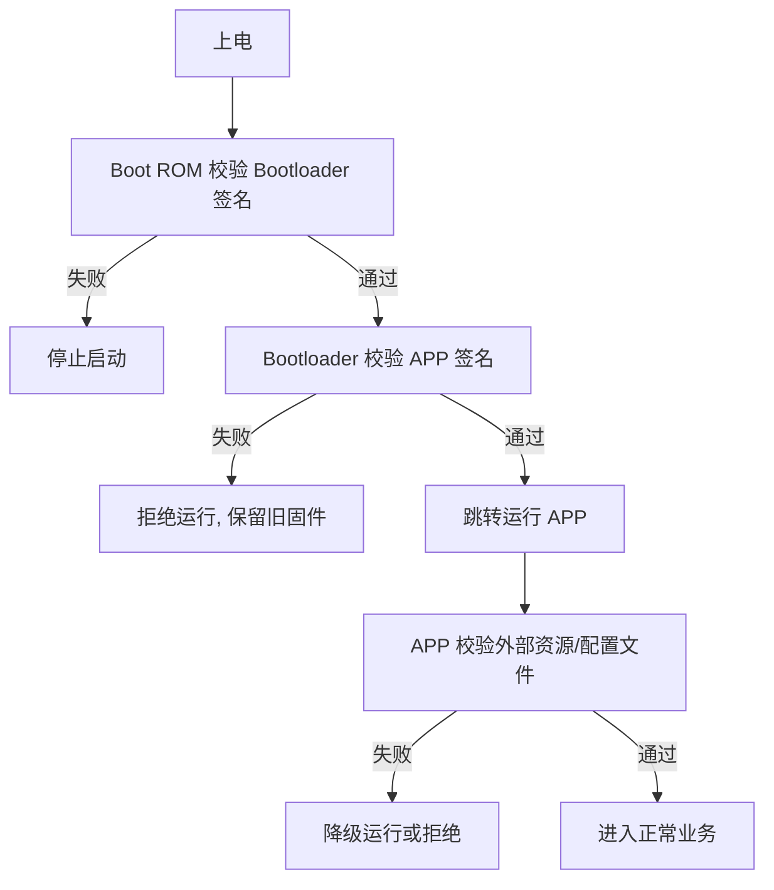

# 7.5 安全与加密

> **前置知识**：[7.2 网络与应用层协议](02-网络与应用层协议.md) · [3.7 Bootloader 与 OTA 升级](../03-嵌入式软件工程/07-Bootloader与OTA升级.md)
>
> **掌握标准**：能识别嵌入式产品的主要安全风险，知道哈希、对称加密、非对称加密、签名各自解决什么问题，并能为一台设备设计出基本的安全方案
>
> **对应岗位**：物联网工程师 · 汽车电子工程师 · 通信与物联网工程师 · 嵌入式软件工程师
>
> **练手建议**：给你的设备加上两条最基础的安全措施——固件带 CRC + 签名校验才允许升级，以及设备与服务器之间用 TLS 通信，然后思考"这样真的够安全吗"

## 先看几个真实会发生的场景

安全这个话题最容易讲成抽象名词：保密性、完整性、可用性，三个词摆出来，读者点头，合上文档，什么也没带走。所以先不讲概念，先看几件具体会发生的事——这些在行业里都真实发生过，不是危言耸听。

**固件被抄走。** 产品做出来了，卖得不错。竞品买一台回去，把 Flash 读出来，直接烧到自己的板子上。硬件抄一版、固件原样用，成本比你低，价格比你低。你花半年做的算法和标定数据，一夜之间变成别人的。这是国内消费类电子最常见的损失方式，也是最难维权的一种。

**固件被篡改。** 攻击者把固件读出来，改几行代码再刷回去。改什么呢？把它变成网络攻击的跳板：让设备去攻击某个服务器、去挖矿、或者作为进入内网的入口。最后被追责的是你的品牌，因为流量确实是从"你的设备"发出去的。

**通信被窃听。** 家用摄像头是最典型的例子。设备和 App、云平台之间如果走明文 HTTP，同一个网络里任何人抓一次包就能看到视频流。更糟的是有些设备的登录口令也是明文传的——那连抓包工具都不用，看一眼日志就拿到了。这就是为什么"这个摄像头半夜自己转头"能成为新闻。

**设备被仿冒接入平台。** 你的云平台认设备 ID 上报数据，只要有 ID 就能连。攻击者伪造一批设备往平台灌垃圾数据，把真实曲线淹掉，或者直接冲垮你的存储和计费。在共享设备、电表、充电桩这类"数据就是钱"的场景里，这是实打实的损失。

**密钥被提取。** 前面几条都建立在"攻击者拿不到密钥"这个前提上。但把设备拆开、用编程器读出 Flash，密钥往往就在里面明文躺着。

**一批设备共用同一个密钥。** 这是最严重也最常见的一种。图省事，全部设备出厂烧同一个密钥、同一张证书。结果是：**泄露一台等于泄露全部**。攻击者从市面上随便买一台拆开，就拿到了整条产品线的通行证——能解密所有设备的通信，能签出可以通过验签的固件。行业里真实发生过这类事故，波及几十万台设备，唯一的补救办法是召回，或者推一套全新的密钥体系；而推新密钥体系又需要旧密钥把新密钥安全地送下去——如果旧密钥已经泄露，这条退路也没有了。

**最后这六个场景有一个共同点：它们都不是"能不能做到"的问题，而是"成本够不够低"的问题。** 安全工作的本质，是让攻击者的成本高过他能获得的收益。

## 四个必须分清的概念

后面所有方案，都是这四个东西的组合。先把它们各自解决什么问题分清楚，比记住任何算法细节都重要。

| 概念 | 一句话 | 解决什么问题 | 常见算法 |
|---|---|---|---|
| **哈希（散列）** | 任意长度数据 → 固定长度指纹 | 完整性校验、口令存储 | SHA-256 |
| **对称加密** | 加密和解密用同一把密钥 | 加密大量数据 | AES |
| **非对称加密** | 公钥加密、私钥解密 | 密钥分发 | RSA、ECC |
| **数字签名** | 私钥签名、公钥验签 | 来源可信、不可抵赖 | RSA、ECDSA |
| **消息认证码** | 共享密钥 + 消息 → 认证码 | 双方都有密钥时的快速认证 | HMAC-SHA256 |

**哈希（散列）** 有两个必须记住的特性：**单向**（从指纹反推不出原文）和**抗碰撞**（找不到两段不同的数据产生同一个指纹）。它不加密任何东西，只回答"这段数据有没有被动过"。用途是完整性校验和口令存储——存口令时存哈希而不是明文，这样数据库泄露了也拿不到口令。安全强度上：**MD5 和 SHA-1 已经不适合任何安全用途**（碰撞已被实际构造出来），SHA-256 是目前的主流选择。

**对称加密**的代表是 AES（Advanced Encryption Standard，高级加密标准），密钥长度 128/192/256 位。它很快，适合加密大量数据，嵌入式上也有硬件加速可用。它唯一的痛点是：**两边的密钥怎么安全地送过去**。这就是"密钥分发问题"，也是非对称加密存在的全部理由。

**非对称加密**的代表是 RSA 和 ECC（Elliptic Curve Cryptography，椭圆曲线密码）。一对密钥：公钥可以公开，私钥自己留着。它能解决密钥分发，但运算慢、密钥长。**嵌入式中 ECC 更受欢迎**：256 位的 ECC 强度大致相当于 3072 位的 RSA，密钥短、运算量小、握手流量也小，对单片机的 RAM 和 Flash 都友好得多。

**数字签名**是把非对称加密反过来用：私钥签名、公钥验签。它解决的不是保密，而是"**这段数据是不是可信来源发的，且中途没被改过**"。**这是固件升级防篡改的核心手段**，本篇后面会反复用到。

**消息认证码（HMAC）** 用一把双方共享的密钥对消息做认证，比签名快得多，适合双方本来就都有密钥的场景。它不提供"不可抵赖"——因为两边都知道密钥，谁都能造出这个认证码。

一句话对应关系：**哈希管"有没有被改"，对称加密管"别被看到"，非对称加密管"密钥怎么给"，签名管"这是谁发的"，HMAC 是双方都有密钥时的廉价版签名。**

## 落到嵌入式：六个具体问题

概念讲完了，下面才是这一篇真正有用的部分——这些概念在设备上分别对应什么问题。

### 固件升级：为什么只做 CRC 不够

很多人的 OTA 只做了 CRC 校验，然后觉得"已经安全了"。**这是错的。**

CRC 是干什么用的？它防的是传输错误——数据在串口或网络上被干扰翻转了一位。它是**公开的、无密钥的**算法，任何改了固件的人都能重新算一遍 CRC 填进去，照样通过校验。所以攻击者刷一个自己的固件进你的设备，和你刷一个正常固件，对 CRC 来说没有任何区别。

**要防篡改，必须用签名。** 流程是：设备端预置公钥，服务器用对应私钥给固件签名，设备下载完固件后先验签，通过才允许搬运到 APP 区或跳转运行。攻击者改了固件但没有私钥，就签不出能通过验签的固件——他只能拿到公钥，而公钥推不出私钥。

几个几乎一定会踩的坑：

- **公钥必须烧在设备里，绝不能由服务器下发**。如果公钥是升级时从服务器拿的，攻击者只要自己搭一个服务器下发自己的公钥和固件，整套机制就失效了。
- **签的是固件的哈希，不是整个固件**。RSA 对几 MB 的数据做运算不可接受，先算 SHA-256，再对这段固定长度的哈希签名。
- **验签要放在 Bootloader 里做**。如果放在 APP 里做，APP 本身已经被写进去了，验签失败也没有意义。
- **要防回滚**。设备记住当前固件版本号，拒绝比它低的版本。否则攻击者可以把你修好的漏洞版本重新刷回去。
- **签名只能验"可信"，不能验"完整传输"**。所以 CRC 该留还是留着——两者解决的问题不同，不是二选一。

### 通信加密：优先 TLS，但要知道它贵在哪

只要设备联网，**优先用 TLS（Transport Layer Security，传输层安全协议）**，不要自己搭一套加密方案。HTTP 换 HTTPS，MQTT 换 8883 端口的 MQTTS，CoAP 走 DTLS（TLS 的 UDP 版本）。理由很直接：TLS 里包含了握手、密钥协商、身份认证、防重放这一整套已经被反复攻击过的东西，你自己设计的方案几乎不可能覆盖这些。

但 TLS 在嵌入式上确实有代价，主要是三块：

| 代价 | 量级 | 说明 |
|---|---|---|
| Flash | 约 30~60 KB | mbedTLS 配置裁剪后，不同套件差别很大 |
| RAM | 握手峰值约 10~30 KB | **这是最容易卡住的一项**，握手比数据传输时占用大得多 |
| 运算时间 | 几百毫秒到数秒 | 握手阶段的非对称运算，软件实现的 RSA 尤其慢 |

**什么时候可以接受，什么时候要换轻量方案**：RAM 有 64 KB 以上、有硬件加密加速、或者用 ECC 证书的，正常上 TLS 没问题。如果单片机只有 20~30 KB RAM，TLS 会把你的内存吃得所剩无几，这时可以考虑预共享密钥（PSK）方案——双方预先烧入同一把密钥，省掉整套非对称握手，代价是失去了"一台泄露不影响其他设备"这个性质，也无法做前向保密。还有一类场景干脆不做加密，只做消息认证（HMAC），因为数据本身不敏感，只需要防伪造。

**判断标准是数据和被窃听的后果**：一个路灯的亮度数据，不值得为它上 TLS；一个摄像头的视频流，值得。不要不假思索地给所有设备套上 TLS，也不要因为"省内存"把该加密的通道开成明文。

### 设备身份：一机一密的密钥从哪来

"一机一密"是目标——每台设备的密钥不同，泄露一台不影响其他设备。实现路径有三条，强度和成本差别很大：

| 方案 | 怎么做的 | 强度 | 成本 |
|---|---|---|---|
| 产线烧录 | 出厂时逐台写入唯一密钥/证书 | 中，取决于产线管理 | 低 |
| 安全芯片 | 密钥在专用芯片内生成和存储 | 高 | 每台增加数元到数十元 |
| 唯一 ID + 派生 | 用芯片唯一 ID 加主密钥派生出设备密钥 | 低 | 最低 |

**产线烧录**的弱点是密钥在产线流程里明文存在过——工装、脚本、日志、临时文件都可能泄露。它靠的是流程管理，不是技术保证。

**芯片唯一 ID + 派生**看起来最优雅，但要认清它的本质：芯片的唯一 ID 通常是**可读**的，整套方案的安全性**完全押在那把主密钥和派生算法上**。主密钥泄露，全线沦陷。所以这是"看起来一机一密，实际上是单点"，只适合低价值场景。

**安全芯片**的强度来自"密钥根本不出芯片"：密钥在芯片内生成，签名和解密在芯片内完成，对外只给出结果。拆开设备用编程器读，读到的也只是加密后的存储，不是密钥本身。

### 密钥和敏感参数怎么存

密钥拿到了，接下来是存哪。这一步的常见错误比想象的密集。

**明文存在内部 Flash 里**是最普遍的做法，也是被读出固件后最先失守的环节。配合开启读保护能挡住大部分"顺手一试"的攻击者，但挡不住有心人。

**外部 Flash 上的密钥等于公开的**。板子上挂的那颗 SPI Flash，焊下来用编程器读，比读单片机内部 Flash 容易得多，甚至可以直接用飞线在线读。**任何放在外部 Flash 上的密钥、证书、口令，都要当成已经泄露来对待。**

**不要用"异或一个固定值"当加密。** 这是嵌入式里流传很广的做法，但它不是加密，只是混淆——密钥和算法都可能在固件里找到，找到了就解开了。要做就做真正的加密，或者干脆不用外部存储。

**不要用片内 Flash 当"保险箱"。** 有些单片机提供加密存储区或受保护的选项字节，这些是有价值的，但要读清楚数据手册里的保护边界：保护的是哪一段、什么条件下会被解除、解除后数据是否自动擦除。不同芯片的实现差别很大，**不能想当然地以为"放了就读不到"**。

**产线残余是另一种泄露。** 首件调试时的临时固件、测试脚本里的密钥、工装电脑上的日志文件，都是真实泄露过的地方。密钥管理不只是代码问题。

### 安全芯片与安全元件

安全元件（SE，Secure Element）是一颗专门用来放密钥、做密码运算的芯片。它通常带防拆设计、屏蔽层、侧信道防护（防止通过功耗和电磁泄漏反推密钥），有的还能在被拆开时自动擦除密钥。

**值不值得用，看产品价值**：支付终端、车规、门锁、电表这些"密钥泄露后果严重"的设备值得；一个几十块钱的智能插座，加上几块钱的安全芯片可能就吃掉大部分毛利，需要权衡。选型时要看它支持哪些算法、接口是 I2C 还是 SPI、是否有通过认证的型号——**具体型号和价格随市场波动，这里只给判断维度，不下结论**。

### 安全启动：这是一条链，不是一道门

安全启动（Secure Boot）的思路是：**从 Bootloader 开始，逐级验签，保证设备只运行可信固件。**

**关键认识：这是链条，最薄弱的一环决定整体强度。** 如果 Bootloader 本身可以被随意重刷（比如调试口没关、读保护没开），那么第一级的验证就形同虚设，后面做得再漂亮也没用。同理，如果 APP 会去加载外部 Flash 里的资源文件却不校验，攻击者改那个文件就够了。设计安全启动时，要顺着这条链从头到尾走一遍，找那个"谁都能改"的点。

### 调试接口保护：提高门槛，而不是杜绝

常见的几招：开启 Flash 读保护（RDP）、禁用或熔断 SWD/JTAG 调试口、加密启动（固件在 Flash 里以密文存放）。

**这里必须诚实说清楚一件事：在物理接触设备的前提下，没有绝对安全。**

读保护有已知的绕过方法，去封装、故障注入、电压毛刺、时钟干扰都是真实存在的手段；熔断的调试口理论上不可恢复，但代价是你自己也没法返修和调试，量产后一个批次出问题就只能报废。所以这些措施的目标是**提高攻击者的成本**，不是"杜绝"。一个需要上万元设备和数天工作量的攻击，对大多数消费类产品来说已经足够劝退了；但对高价值设备，它只是及格线。

## 五条设计原则

这五条比任何具体算法都重要，因为它们决定你会不会犯方向性错误。

**第一，不要自己发明密码算法。** 自研算法几乎必然有漏洞，而且你不会有第二个专家来审它。用 AES、用 ECC、用 TLS，把它们用对，就已经超过了市面上相当一部分产品。

**第二，不要硬编码密钥在代码里。** 固件被读出来密钥就没了；而且换密钥要走一次发版流程，等于泄露了也没法快速止血。密钥应该在产线注入、或者由安全芯片生成。

**第三，密钥要能更新。** 设备出厂后要服役十年，十年里密钥泄露几乎是必然会发生的事。设计初就要留一条"服务器下发新密钥、设备安全接收并替换"的通道。**这一条最容易被忽略，也最贵**——上线之后再补，意味着已售出的设备都补不了。

**第四，纵深防御。** 不要指望某一道防线挡住所有攻击，要有多层：调试口关掉、固件签名、通信加密、平台侧设备鉴权。任何一层被突破时不至于全局崩溃。

**第五，最小权限。** 设备只给它需要的权限。能上报数据的设备不该有下发控制指令的能力；能访问一个接口的密钥不该能访问全部接口。这一条在云平台侧同样适用。

## 现实约束：按产品价值分级

讲完原则，必须讲约束。**嵌入式安全和桌面/服务器安全最大的区别，是资源永远不够。**

资源和安全直接冲突：算力要留给业务逻辑，RAM 要留给协议栈，功耗要留给电池寿命，成本要留给毛利。很多便宜的单片机根本没有硬件加密加速，软件实现 AES 和 RSA 会慢到影响产品体验。安全还会显著增加开发和测试成本——密钥管理流程、产线工装改造、安全测试，这些都不是写代码能解决的。

所以现实的做法是**按产品价值分级**，而不是一刀切：

| 产品级别 | 例子 | 建议的安全基线 |
|---|---|---|
| 玩具/教学 | 电子积木、实验板 | CRC 校验足够，不必上加密 |
| 一般消费类 | 智能插座、氛围灯 | 固件签名 + TLS + 一机一密（产线烧录） |
| 涉及隐私 | 摄像头、智能门锁 | 上一档 + 安全芯片 + 安全启动 + 关闭调试口 |
| 涉及人身安全/支付 | 车规、医疗、电表、支付终端 | 完整方案 + 安全认证 + 第三方评估 |

**"够用就行"在玩具级产品上是合理判断，在摄像头和门锁上就是事故。** 分级的意义不是让你偷懒，而是让你把有限的安全预算花在真正需要的地方。

## 方案自检：五个问题

设计完方案之后，用这五个问题过一遍，能筛掉大部分低级错误。它们不需要任何密码学知识，只需要你顺着攻击者的思路走一遍。

**第一问：攻击者拿到一台设备拆开，能读到什么？** 密钥是明文躺在 Flash 里，还是在安全芯片里？调试口关了吗？读保护开了吗？如果答案让你不安，说明这一层还有工作要做。

**第二问：密钥泄露一台，会影响多少台？** 如果答案是"全部"，那就回到一机一密那一节重新设计。这是投入产出比最高的一项改动。

**第三问：升级包被人换了，设备会接受吗？** 只做 CRC 就一定会接受。要做签名，而且公钥必须在设备里而不是服务器上。

**第四问：数据被窃听了，后果是什么？** 如果后果轻微（比如路灯亮度），不做加密是合理判断；如果是视频、口令、位置，就必须加密。**这个判断要写进设计文档，而不是默认"先不加密，以后再说"。**

**第五问：密钥泄露之后，有补救途径吗？** 能不能在不下架、不召回的前提下把新密钥送下去？如果这条通道不存在，那你现在就是"泄露即终局"。

## 学习建议

**先建立概念框架，别一上来就啃算法。** 把"哈希管完整性、对称管保密、非对称管分发、签名管来源"这四条对应关系记牢，后面看到任何方案都能对号入座。至于 SHA-256 内部怎么压缩、椭圆曲线上的点怎么运算，除非你做密码方向，否则**可以完全略过**。

**第二步动手做一次全流程。** 用 openssl 生成一对密钥，用私钥给一个文件签名，再用公钥验签，然后故意改动文件里的一个字节，看验签是怎么失败的。这一圈走下来，签名到底保证了什么，比读十页书都清楚。这一步只需要一台电脑，成本为零，强烈建议先做。

**第三步在单片机上实现固件验签。** 把上一步的公钥嵌进 Bootloader，接收固件后先算哈希再验签，通过了才搬运。这一步会真正让你体会到嵌入式安全的约束——验签需要多少 RAM、软件 ECC 要跑多久、Flash 放不放得下。

**第四步再学 TLS 移植。** 用 mbedTLS 在你的平台上跑通一次 HTTPS 请求，记录下 Flash 和 RAM 的增量、握手耗时。这个数据比任何资料里的说法都可信，也是你以后做选型的依据。

**新手最容易踩的三个坑**：① 把加密和签名混为一谈，以为"数据加密了就不会被篡改"（加密的过程本身也可能被重放和篡改）；② 以为上了 TLS 就万事大吉，忽略了设备身份和固件这一层；③ 密钥写死在头文件里提交进了 Git。第三个坑几乎每个团队都犯过一次。

## 小节总结

**嵌入式安全首先是一个"成本博弈"问题，不是"技术能力"问题。** 攻击者不会因为你的方案精妙而放弃，只会因为攻击成本高过收益而放弃。理解这一点，你就不容易陷入两个极端：要么觉得"我这个破设备没人看得上"，要么觉得"做不到绝对安全就干脆不做"。

**四个基础概念要能条件反射式地对应**：哈希管完整性、对称加密管保密、非对称加密管密钥分发、签名管来源可信。**固件升级必须用签名，CRC 只防传输错误，这是本篇最重要的一句结论**——它直接决定了你的设备会不会被人刷成肉鸡。

**一机一密是底线思维。** "全产品线共用一把密钥"这种事故之所以反复发生，不是因为工程师不懂密码学，而是因为批量烧不同密钥需要改产线和工装流程，短期看很麻烦。**但它是那种"省三天、赔三年"的决策**，第一次设计时就应该定下来。

**必须接受"物理接触即失守"这个前提。** 读保护、熔断调试口、加密启动都是提高门槛的手段，不是绝对屏障。承认这一点之后，你的设计目标才清晰：让攻击者需要付出的代价，高过他所能获得的收益。

**最后是分级。** 资源、成本、功耗和安全永远在拉扯，分级的价值在于让你把安全投入放在对的地方。玩具级产品只做基础校验是合理的，涉及隐私、人身安全、支付的设备做完整方案是必须的——**在错误的级别上省钱，才是真正的浪费。**

---

本章目录：[7. 通信与物联网](README.md) ｜ 总目录：[返回首页](../../README.md)
上一篇：[7.4 云平台接入](04-云平台接入.md) ｜ 下一篇：[7.6 协议栈与中间件](06-协议栈与中间件.md)
