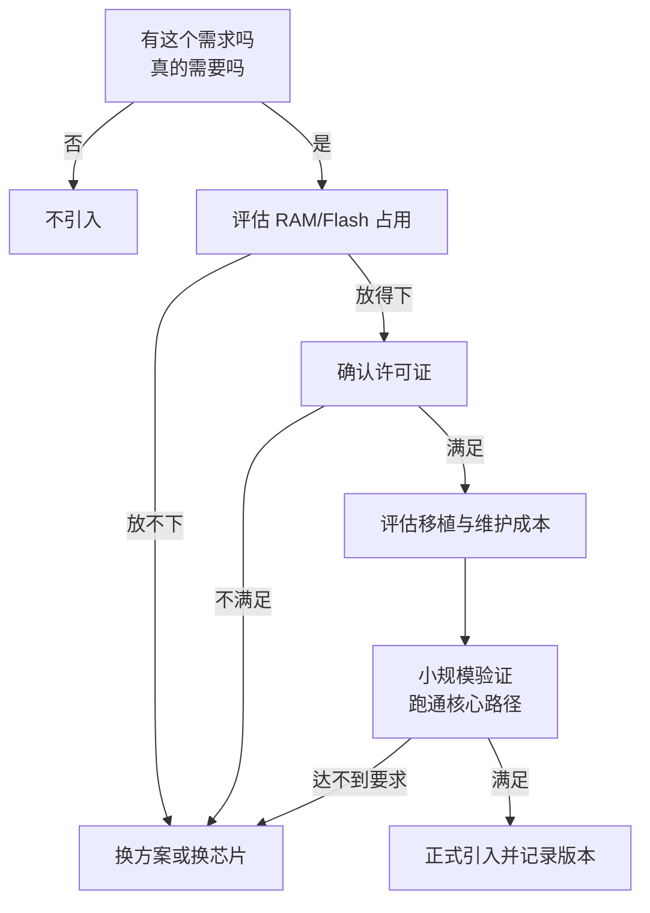

# 7.6 协议栈与中间件

> **前置知识**：[7.1 总线协议](01-总线协议.md) · [7.2 网络与应用层协议](02-网络与应用层协议.md)
>
> **掌握标准**：知道哪些轮子不该自己造、该用哪个现成协议栈，并能判断引入一个中间件会带来多少 RAM/Flash/复杂度成本
>
> **对应岗位**：物联网工程师 · 通信与物联网工程师 · 嵌入式 Linux 应用工程师 · 嵌入式软件工程师
>
> **练手建议**：在单片机上移植 lwIP 或 FreeRTOS-Plus-TCP，跑通一个 TCP echo 服务，并记录它占用了多少 RAM 和 Flash

## 能不自研就不自研，但要知道每个轮子有多重

协议栈和中间件的本质，是**别人已经踩过坑的代码**。

TCP 的重传、乱序、窗口协商，USB 的枚举和描述符，Flash 的磨损均衡和掉电保护——这些东西不是"想清楚就能写对"的，它们的正确性来自大量极端场景的反复打磨。你花两个月写出来的一个"能用"的 TCP 实现，大概率在丢包率稍高一点的网络里就会挂死，而 lwIP 在同样场景下已经跑了二十年。

所以第一条判断是：**能用现成的就用现成的**。凡是 RFC 里规定过、有成熟开源实现的协议，自己从头写基本都是浪费生命。

但代价也是真实的，而且经常被新手低估：

| 代价 | 具体表现 |
|---|---|
| RAM / Flash 占用 | 引入一个协议栈可能直接吃掉一半的内存预算，甚至编译不过 |
| 许可证 | 有些库商用要付费，有些开源库的许可证对闭源产品有额外要求，这条必须在选型阶段确认，不能等项目做完 |
| 移植工作量 | 需要适配你的网卡、Flash、时钟、内存分配器，有的库移植层有几百行 |
| 学习成本 | API 会用只是第一步，配置项怎么调、内存池设多大，才是真正花时间的部分 |
| 可调试性 | 出问题时你得看得懂它的代码，否则只能靠猜 |

由此得到一条务实的原则：**先评估资源占用，再决定用不用。**

这一条听起来平淡，但它能挡掉很多灾难。**在一个只有 32KB Flash 的单片机上塞 TCP/IP 是不现实的**——不是"性能差一点"，而是根本放不下。同理，一个只有几 KB RAM 的低端芯片上跑图形框架，也属于选型阶段就该否掉的方案。

下面按"它解决什么问题 / 典型选择 / 资源量级 / 什么时候不该用"四件事，把常见的几类中间件过一遍。文中出现的库名**仅作类型举例**，不代表唯一或最佳选择。

## 一、TCP/IP 协议栈

**什么时候需要在单片机上跑 TCP/IP**：接了以太网 PHY 或 WiFi 模块、需要标准的 socket 式接口、要同时维持多个连接（比如既连服务器又开本地 Web 配置页）。如果只是通过串口发几个字节给上位机，那完全不需要 TCP/IP。

**主流选择**（仅作类型举例）：lwIP 是绝对的多数派，可裁剪、资料多、几乎所有带以太网的 MCU 厂商都提供它的移植；FreeRTOS-Plus-TCP 和 FreeRTOS 配套，配置风格统一，用了 FreeRTOS 的项目可以直接沿用；ThreadX 的 NetX / NetX Duo 稳定性和认证资质更好——ThreadX 在 2020 年随 Azure RTOS 开源、2024 年起由 Eclipse 基金会维护，现在是 **MIT 许可、源码公开、商用免费**，自身也已通过 IEC 61508 / ISO 26262 等功能安全认证（认证证书通常要成为基金会成员才能拿到）；真正属于"**商业授权、需要付费**"的是 VxWorks、QNX 那一档，选型前务必确认授权方式；此外不少厂商在自家 SDK 里塞了一个轻量栈，功能有限但和芯片配套得最好。

**资源量级**：lwIP 的占用跨度极大，从几十 KB 到几百 KB 都可能——它取决于你开了哪些功能、缓冲区池设多大、用了哪套 API。**具体数字以实际配置和编译结果为准**，任何文档里给的固定值都不要直接采信。可靠的估算方法是：拿一个最小可跑通工程，改配置、编译、看 map 文件，然后按业务需求逐步加功能，每加一项记录一次增量。

**lwIP 的三种 API 模式**，这是理解 lwIP 资源特性的关键：

| 模式 | 风格 | 资源占用 | 适用场景 |
|---|---|---|---|
| RAW | 回调式，事件驱动 | 最低，不需要额外任务和信号量 | 资源紧张、连接数少 |
| Netconn | 顺序式接口，基于 RTOS 封装 | 中等，每个连接需要任务/邮箱 | 有 RTOS、想写顺序逻辑 |
| Socket | 最接近 Linux | 最高，封装层最厚 | 从 Linux 移植代码、资源宽裕 |

**为什么资源紧张时用 RAW**：Netconn 和 Socket 每开一个连接就要消耗任务栈和同步对象，而 RAW 模式直接在协议栈的回调里处理数据，不需要为每个连接付出这部分开销。代价是代码变成一堆回调函数，逻辑不直观。**这不是风格偏好问题，而是能不能在芯片上跑起来的问题**——RAM 只剩几 KB 时，Socket 模式基本没得选。

**什么时候不该用 TCP/IP**：只需要点对点传输时，自定义一个带帧头、长度、校验的简单协议往往更简单、更省资源，也更好调；带宽需求超过单片机能力时（比如要传视频流），该做的是换方案——加一颗跑 Linux 的芯片，而不是在单片机里继续优化协议栈。

## 二、USB 协议栈

USB 在数据手册上看起来只是几根线，但它大概是所有外设里**最"协议重于硬件"** 的一个。枚举过程、描述符表、端点配置、主机与设备角色区分，任何一环写错，表现都是"插上去电脑没反应"，而且没有明显的错误提示。

常见设备类（仅作类型举例）：

| 设备类 | 用途 | 典型场景 |
|---|---|---|
| CDC | 虚拟串口 | 用 USB 口当串口调试，省掉一颗 USB 转串口芯片 |
| HID | 人机接口 | 键盘、鼠标、自定义设备免驱通信 |
| MSC | 大容量存储 | 设备当 U 盘，导出日志和数据文件 |
| DFU | 固件升级 | 不用拆机就能刷固件 |

常见方案是芯片厂商 SDK 自带的 USB 设备库（ST、NXP 等都有）、跨平台的开源实现（TinyUSB、CherryUSB），以及带 USB 外设的芯片自带的底层驱动。**注意**：很多单片机只提供 USB 设备控制器，想做 USB 主机（比如读 U 盘）需要额外条件，选型时务必看清数据手册里写的是 Device、Host 还是 OTG。

**USB 为什么比自己想的复杂**：它有一套严格的主从模型和描述符机制，你不仅要写业务逻辑，还要按规范描述设备的身份和能力。**比较务实的做法是先从 CDC 类跑通一次完整流程**——枚举能过、上位机认得出、数据能双向传，然后再去改描述符做自定义设备。跳过这一步直接做 MSC，多半会卡在枚举阶段查不出原因。

## 三、文件系统

**什么时候需要**：要存日志、图片、配置、历史数据记录，且希望能在电脑上直接读、或者希望文件能按名字管理时。**如果只是存几十字节的参数，用裸的 Flash 读写加校验就够了**——Flash 存储与参数管理的内容见 [2.5 Flash 存储与参数管理](../02-MCU与体系结构/05-Flash存储与参数管理.md)。

典型选择（仅作类型举例）：FatFS 优点是通用，卡拔下来插电脑就能读；LittleFS 主打掉电安全，专为 Flash 设计，带磨损均衡和掉电恢复；SPIFFS 曾经很流行，但功能和健壮性都不如 LittleFS，新项目已经逐渐不再选它。

**关键判断是"掉电安全 vs 通用性"**：

- 数据要交给用户、要在 PC 上读 → 通用性优先，FatFS 更合适。
- 给**单片机内部的 Flash** 做文件系统 → 优先考虑掉电安全。设备随时可能被拔电，一次写坏导致整个文件系统打不开，是现场最常见的故障之一。

**资源与扇区大小的影响**：文件系统的 RAM 占用主要来自扇区缓存和目录操作，块大小配得越大，缓存要求越高。更隐蔽的是 **FAT 在小容量上的浪费**——它的簇大小对小分区来说偏大，存一堆小文件时空间利用率很低。LittleFS 虽然也有块大小的约束，但它在这类场景下通常更划算。所有具体数值同样**以实际配置和编译结果为准**。

## 四、图形与显示中间件

主流选择（仅作类型举例）：LVGL 是目前最主流的开源嵌入式图形库，功能全、控件多、社区活跃；emWin 是商业库，配套工具成熟；TouchGFX 和 ST 的芯片绑定较紧，配合硬件加速体验好。

**资源占用与刷屏性能**是评价图形中间件的两个核心指标。占用方面，光是一个基础窗口加上几个控件，RAM 消耗就可能相当可观，还要额外准备一块显示缓冲区。刷屏性能取决于三个因素：你用的是什么接口（SPI 屏和 RGB 并口屏差距明显）、有没有 DMA 搬运、芯片有没有 2D 图形加速单元。**开了 DMA 之后能不能真正省下 CPU，还要看你的缓冲区是不是双缓冲、刷屏时有没有撕裂。**

**什么时候不该上图形框架**：界面简单、控件不超过十来个、状态变化不频繁时，用自己写的状态机加局部刷屏往往更快、更省、更好控制。**图形框架的价值在于复杂界面的开发和维护效率**，如果你的界面复杂度撑不起这份开销，引入它只是给自己增加一个需要学习和调试的依赖。

## 五、电机控制与算法库

厂商提供的电机控制库（例如 ST 的 MC SDK 这类，仅作类型举例）定位很明确：**能用，但要理解原理才能调参**。

这类库通常带配置工具，可以生成一套能转起来的工程，新手很容易产生"电机控制就这么回事"的错觉。但真正的工作量在后面：转速环和电流环的参数怎么整定、观测器在不同转速下怎么切换、启动时的强拖策略怎么选——**这些问题库不会替你回答，因为它不知道你的电机参数和应用场景**。把库当成"参考实现 + 起点"，而不是"黑盒解决方案"，是正确的心态。

CMSIS-DSP 是 ARM 官方的数字信号处理库，把 FFT、FIR/IIR 滤波、矩阵运算这些常见运算做了优化实现。它的价值在于**在 Cortex-M4/M7 这类带硬件加速指令的内核上，能自动用上 SIMD 指令和浮点单元**，比手写的通用 C 代码快得多。这也是为什么选型时"有没有 FPU""是不是 M4 以上"会影响算法方案——同一段滤波代码，在有硬件浮点和没有的芯片上，性能差距可能是数量级的。

**什么时候不该用**：算法简单、数据量小的时候（比如偶尔算一次平均值），引入 DSP 库只是徒增依赖。库的价值随运算量增长而增长。

## 六、调试与日志中间件

**日志框架**解决的问题是：printf 满天飞、串口被占死、调试信息影响实时性。它通常提供分级（debug/info/warn/error）、环形缓冲、异步输出（日志写进缓冲区，由低优先级任务慢慢发）、以及可开关的编译期裁剪。

**SEGGER RTT** 是调试期非常好用的工具（仅作类型举例）：它通过调试器的内存访问通道输出日志，**不占用串口、速度远高于串口、也不需要额外引脚**。代价是必须有调试器连着，产品出厂后就不能用了。

**什么时候该上日志框架**：项目有多个模块、需要按等级过滤、或者日志本身会影响实时性时。**什么时候 printf 就够**：单文件小项目、只是临时看几个变量，直接用 printf 或一个自己写的简易宏更省事。**不要为了"规范"给一个几百行的程序套上一整套日志框架**，那是典型的过度设计。

## 七、RTOS 之上的通用组件

RTOS 解决的是任务调度和同步，但真实项目里还会反复出现几类需求，于是有了对应的组件（以下均仅作类型举例）：

| 组件 | 解决什么 | 引入前先想清楚 |
|---|---|---|
| 命令行（CLI）框架 | 通过串口敲命令调试、改参数 | 是否需要交互式调试，还是打印日志就够 |
| 参数管理 | 配置项的存储、默认值、版本迁移 | 配置项是否超过几十个，少的话直接存结构体 |
| 状态机框架 | 把复杂的状态跳转规范化 | 状态是否真的复杂，简单流程用 switch 更直白 |
| 事件总线 | 模块之间解耦通信 | 是否真需要解耦，直接调用往往更清晰 |

**组件化带来的好处是复用和解耦，风险是"过度设计"**。一个常见现象是：项目前期为了"架构漂亮"引入一堆组件，后期每个组件都要学、都要调、都要维护，出了问题还要跨好几个组件去排查。**判断标准很简单：这个组件解决的问题，在你的项目里是否真实存在、且发生频率足够高。** 答案是否，就不要引入。

## 引入中间件的通用评估清单

决定用某个协议栈或中间件之前，把这七条过一遍。**这份清单的价值在于把"事后才发现"变成"事前就确认"。**

1. **RAM 占用**——分静态占用和动态峰值两部分看。动态峰值往往才是爆内存的元凶，要看它在最坏情况下（连接最多、缓冲最满）会申请多少。
2. **Flash 占用**——包括库代码和你自己的适配层，别忘了编译器优化等级会显著改变这个数字。
3. **许可证**——商用是否受限、是否需要开源你的代码、是否需要付费。**这条必须在选型阶段确认，不能等产品要发布了才发现。**
4. **移植工作量**——依赖哪些硬件资源（定时器、DMA、网卡、Flash），有没有现成的移植层，厂商是否已经适配过你的芯片。
5. **社区活跃度与维护状态**——最后更新时间、issue 响应情况、有没有人在用。**一个两年没更新的库，出了问题只能自己扛。**
6. **出问题时你能调试到什么程度**——代码可读吗，有没有文档，能不能单步进去看。看不懂的库，等于把项目的一部分控制权交了出去。
7. **它会不会成为你未来的技术债**——升级路径清不清晰，会不会哪天发现它不支持你要加的新功能，而替换成本又高到不敢动。

判断流程大致是这样：

## 一个诚实的提醒

新手容易犯两个方向相反的错。

**一是"什么都自己写"。** 觉得用库"不算本事"，于是自己撸一套协议、自己写文件系统、自己搞个简易 GUI。结果是浪费几个月，写出来的东西在真实场景里频繁出问题，而且因为是自己写的，反而更舍不得换掉。**这是最贵的错误**——时间成本高，成果质量还差。

**二是"什么都用库"。** 项目里堆了十几个组件，每个都能跑，但没人说得清它们各自在干什么。一旦出现异常（内存慢慢变少、偶尔丢一包数据、死机后查不到线索），**因为每一层都是黑盒，排查范围无限大**，只能靠猜和试。项目看起来功能齐全，实际上完全不可维护。

**正确姿势是：知道每个轮子大概怎么实现的，然后在它的基础上用。**

具体来说——用 lwIP 之前，先搞清楚 TCP 握手、重传、滑动窗口是怎么回事；用文件系统之前，先知道 Flash 的擦写粒度和掉电会带来什么后果；用图形库之前，先明白刷屏的本质是把像素搬到屏幕上。**这些理解不需要你写出同等质量的实现，但它们决定了你在库出问题、性能不达标、或者需求变化时，是能解决问题，还是只能换库。**

对一个求职者来说，面试里能说清"为什么选这个协议栈、它的资源占用大概在什么量级、遇到过什么问题怎么解决的"，比简历上写"熟悉 lwIP"有说服力得多。

## 学习建议

1. **先动手移植一次，再谈选型。** 把 lwIP 在一个带以太网的板子上跑通，哪怕只是 ping 通和一个 echo 服务，你会对"协议栈占多少资源"建立实感。**没有亲手量过的人，对资源占用的估计通常偏差很大。**
2. **每引入一个中间件，记录三个数字：RAM 增量、Flash 增量、移植花了多久。** 这份记录是你以后做选型判断的资本，也是面试时能讲的具体材料。
3. **从最小的配置开始，按需增加。** 一次性打开所有功能，出了问题你不知道是哪一项导致的。**先跑通最小路径，再逐项加功能，每加一项验证一次**，这个节奏能省下大量调试时间。
4. **优先选厂商已经适配过的方案。** 芯片厂商 SDK 里带的移植层，能省掉你几天甚至几周的适配工作。**"大家都用这个"本身就是重要的选型依据。**
5. **不要一上来就啃协议栈源码。** 正确的顺序是用起来、遇到具体问题、带着问题去看相关的那一部分实现。**通读源码是很低效的学习方式**，除非你确定要长期维护它。
6. **USB、文件系统、图形库这三类，除非项目必须，可以晚点学。** 它们是"需要时再学"的类型，语法和配置都不难，难的是踩坑经验。反过来说，也**不要因为面试可能问到就去深挖它们的内部实现**。

## 小节总结

协议栈和中间件是"别人已经踩过坑的代码"，绝大多数情况下，自己重造轮子的产出远低于成本。但要记住硬币的另一面：**每一个中间件都有重量**——RAM、Flash、许可证、移植工作量、维护成本，以及你为它付出的学习时间。**先评估资源，再决定用不用**，是这一篇里最该带走的一句话。

评估一份中间件，核心是七个问题：RAM 占多少（静态占用和动态峰值要分开看）、Flash 占多少、许可证是否允许商用、移植要做多少事、社区是否活跃、出问题你能调试到什么程度、它会不会变成技术债。**其中许可证和动态内存峰值最容易被忽略，也最容易在项目后期造成麻烦。** 清单里任何一条答不上来，都说明你还没准备好引入它。

lwIP 的三种 API、文件系统的掉电安全、图形库的刷屏开销、电机库的调参依赖——这些具体的知识点背后是同一个判断逻辑：**资源量级决定方案可行性，理解深度决定你能否驾驭它**。TCP 协议栈不是"高级"就一定要上，GUI 框架也不是"专业"就必须用，简单需求配简单方案，往往工程质量更高。

"什么都自己写"和"什么都用库"是两个相反但同样危险的极端。前者浪费大量时间造出劣质轮子，后者把项目变成黑盒堆砌、出问题无法定位。**正确的姿态是站在中间：知道每个轮子大概怎么实现的，然后在它的基础上用。**

最后一点关于学习节奏的建议：这一篇提到的中间件不必一次学完。**用到哪个学哪个，学到哪个记录一次资源占用**——三年下来，你会拥有一份比任何文档都贴合实际的经验台账，这才是嵌入式工程师真正值钱的部分。

---

本章目录：[7. 通信与物联网](README.md) ｜ 总目录：[返回首页](../../README.md)
上一篇：[7.5 安全与加密](05-安全与加密.md) ｜ 下一篇：[8. 嵌入式 Linux](../08-嵌入式Linux/README.md)
