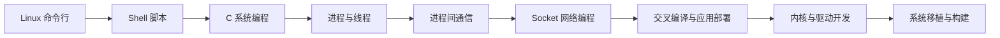

# 8.1 学习路线与环境

> **前置知识**：[4.1 RTOS 概述与裸机局限](../04-实时操作系统/01-RTOS概述与裸机局限.md) · [1.3 计算机组成与操作系统原理](../01-编程与软件基础/03-计算机组成与操作系统原理.md)
>
> **掌握标准**：能说清楚嵌入式 Linux 和单片机开发的本质差别，装好一台 Ubuntu 或 WSL 环境，命令行日常操作不用查手册，并知道后面每一阶段该学什么、不该急着学什么。
>
> **对应岗位**：嵌入式 Linux 应用开发工程师 · 嵌入式软件工程师（Linux 方向） · 物联网网关开发
>
> **练手建议**：装一台 Ubuntu 虚拟机（或开启 WSL2），把文件管理、权限、进程管理、网络这四类命令各练 20 遍，做到不查文档也能完成"找到一个大文件、看它属于谁、杀掉占用它的进程"这套动作。

## 先说清楚：这和前面学的东西差别有多大

在嵌入式的进阶之路上，嵌入式 Linux 就像一座绕不开、又极具挑战的高山。它和 RTOS 存在本质区别，甚至可以说是一个全新的知识体系。

写这一章的作者当年啃了整整一年，才勉强把系统环境摸顺，更别提后来的嵌入式应用开发。正因为当年踩了太多坑、虚度了太多时间，才更希望把路线写清楚——**如果后来的人能借着这些经验避开走过的弯路，能达到的高度说不定会远超前者。** 这也是本章唯一想强调的写作动机。

RTOS 更像是"给单片机加了一个高级的任务调度器"：任务、队列、信号量、优先级，就在裸机的基础上多了一层调度。而 Linux 是完整的通用操作系统，拥有进程管理、虚拟内存、文件系统、权限管理、网络协议栈、驱动模型等一整套庞大机制。除了通用的进程与线程思维可以复用之外，几乎一切都要从头学起。

差别来自一个硬件事实：**跑 Linux 的芯片有 MMU（内存管理单元，负责把虚拟地址翻译成物理地址）。** 有 MMU，才有虚拟内存、才有"每个进程独立的地址空间"、才有用户态和内核态的隔离。单片机通常没有 MMU（Cortex-M 系列就是典型），所以任务跑在同一个地址空间里，谁踩了谁的栈都得靠人查；而 Linux 上一个进程崩了，操作系统把它清掉就完了，其他进程毫无感觉。这一条差别，衍生出了后面所有的开发方式差异。

| 维度 | 单片机 / RTOS | 嵌入式 Linux |
|---|---|---|
| 地址空间 | 全局一份，无 MMU | 每进程独立虚拟地址空间 |
| 权限 | 无用户态/内核态之分 | 用户态与内核态严格隔离 |
| 硬件访问 | 直接读写寄存器、调 HAL 库 | 通过设备节点和系统调用间接访问 |
| 开发工具 | Keil、CubeMX 图形化一键编译 | 命令行、GCC、Makefile、SSH、GDB |
| 驱动来源 | 厂商统一的外设库 | 无统一驱动库，自研硬件常要自己写或改 |
| 程序形态 | 一个固件烧进去就跑 | 系统 + 多个进程 + 服务，动态加载 |
| 崩溃后果 | 整机跑飞，需要复位 | 通常只是一个进程退出 |

在单片机里，我们习惯直接操作寄存器，或者调用 HAL 库去控制 GPIO、I2C、SPI、UART 这些外设。但在 Linux 中，**硬件绝不会轻易暴露给应用层**。Linux 的核心哲学是"一切皆文件"：所有的硬件设备最终都会被抽象成设备节点，应用程序必须通过文件系统接口和系统调用，才能间接地访问硬件。这个抽象层是 Linux 稳定性的来源，也是从单片机转过来的人最先感受到的"隔了一层"。

## 从单片机转过来，第一个难点不是技术

对刚从单片机或 RTOS 转过来的人来说，Linux 开发的第一个难点甚至不是技术本身，而是**适应环境的阵痛**。

习惯了 Windows 图形化操作的人，突然被扔进黑乎乎的命令行界面往往会无所适从，你需要花足够的时间去熟悉一堆基础命令。而刚熬过这段适应期，你曾经无比熟悉的图形化开发利器——Keil——在 Linux 下就完全失效了。取而代之的是 SSH、GCC、Makefile、交叉编译这一套全新的开发工具链和工作流。

等环境配置终于搞定，你才有资格开始面对那些动辄几十个小时、难度极高的嵌入式 Linux 入门教程。

这整个过程不是夸张，而是几乎每个转过来的人都要走一遍的路。**心里有准备，就不会在第二周怀疑自己选错了方向。**

## 为什么前期学的东西和"嵌入式"三个字关系不大

这是本篇最需要先讲透的一点：**嵌入式 Linux 开发的重点，前期在 Linux，而不在"嵌入式"。**

在你真正接触到硬件之前，要学的很多内容和普通的服务器端 Linux 开发并没有本质区别。命令行、文件系统、进程线程、网络通信、Makefile、GDB、交叉编译——这些都属于 Linux 开发的通用基础，不会因为前面加了"嵌入式"三个字就自动变简单。你在上面花的时间，本质上是在学一门操作系统，而不是在学嵌入式。

这也是单片机或 RTOS 背景的人最容易踩的坑：总以为"嵌入式 Linux"也应该像学 STM32 一样，一上来就接板子、点灯、串口打印、驱动外设。实际情况恰恰相反。**在嵌入式 Linux 的前期学习阶段，甚至可以完全没有硬件实物参与**——一台电脑、一个 Ubuntu 虚拟机或者 WSL 环境，就足够把最关键的基础部分学起来。

换句话说，前面那套"学习第一步先点亮一颗 LED"的嵌入式思维，在这里并不适用。对于 Linux 学习来说，点亮一颗 LED 往往已经不是起点任务，而是学到中期、开始接触驱动和设备树之后才会真正去做的事情。

作者当初学 Linux 就吃过这个亏：一直没理清学习路线，又有些急于求成，一上来就想直接折腾硬件、点亮 LED。结果发现整个过程远比想象中复杂——不会命令行、不会交叉编译、不会内核模块、不会设备树、看不懂驱动框架，最后被劝退不止一次。后来花了很长时间，才慢慢把学习顺序理清楚。

所以这里非常想强调一句：**一定一定要按路线走。** Linux 不是不能学，而是如果一开始学习顺序错了，就很容易在高难度内容面前晕头转向，最后不是学不会，而是先被复杂度劝退。

## 完整的技能树与学习顺序

推荐的教学视频：韦东山的[《韦东山手把手教你嵌入式 Linux 快速入门到精通》](https://www.bilibili.com/video/BV1w4411B7a4)（截至写作时有 121 个分 P、约 34 小时，基于 i.MX6ULL，覆盖应用开发与驱动开发）。配合一份成体系的视频先把路线走顺，比自己在网上零散地捡教程效率高得多。**注意它的体量**：这条路线本身就是以"月"为单位的，不要指望靠刷视频刷完，边看边在板子上做才是正路。

整体的推进顺序是这样一条链：

前六步全部是应用层，也是大多数人的第一份 Linux 工作真正用到的内容。第七步开始才真正开始"碰板子"，最后两步是难度最高的驱动与系统移植。这个顺序不是建议，是硬性的依赖关系——命令行不熟就看不懂 Shell，不会多进程就想不通 IPC，不懂 Socket 就没法做设备联网，不熟悉应用层就根本读不懂驱动为什么要那样设计接口；而没把驱动开发走通，系统移植时会看不懂内核启动时那些驱动是怎么被加载起来的。

## 开发环境搭建

**装一个 Linux，这是不可跳过的一步。** 具体有三种方案：

| 方案 | 优点 | 缺点 | 适合谁 |
|---|---|---|---|
| 虚拟机（VMware / VirtualBox） | 装坏了大不了删掉重来，隔离干净 | 占内存，文件互传要配共享文件夹 | 新手首选，强烈推荐 |
| WSL2 | 启动快，和 Windows 文件互通方便 | 网络和串口设备直通相对绕 | 已有 Windows 主力机、要兼顾其他工作 |
| 双系统 | 性能最好，能直接用硬件 | 装坏了影响日常使用，切换麻烦 | 已经用顺手了的老手 |

**为什么推荐 Ubuntu**：绝大多数芯片厂商的 SDK、官方文档、社区问答都以 Ubuntu 为默认环境，遇到问题时能搜到的答案最多。发行版之间的差异（包管理器、目录结构）对新手来说是纯粹的额外成本，没必要在这里折腾。

**串口调试**：开发板调试的命根子。板子上的调试串口（通常是 UART）会打印从 U-Boot 到内核再到用户态的完整启动日志，看不到串口输出，后面所有问题都无从查起。Linux 下用 Minicom 或 Picocom 作为串口终端，替代 Windows 上的 XCOM、SSCOM 这类工具。第一次连不上，优先查三件事：TX/RX 是否接反、两边是否共地、波特率是否一致（多数板子默认 115200）。

**网络共享与文件传输**：开发板和 PC 之间必须能通网。常用三件套——NFS（网络文件系统，把 PC 上的目录挂到开发板上，改完代码不用重新烧写就能直接运行，开发阶段效率极高）、TFTP（简单文件传输，用来在 U-Boot 里下载内核和镜像）、以及 SSH/SCP（登录开发板、传文件）。这三样配好之前不要急着往下学，否则每改一行代码都要重新烧一次卡。

## 先学会用，再去理解

在正式进入嵌入式 Linux 开发之前，你首先需要会用 Linux。这里的"会用"不是指会点桌面图标，而是能熟练使用命令行完成文件管理、编译运行、网络连接、进程查看和问题排查。

命令行是地基。地基不牢，后面每一步都要付利息。

| 类别 | 常用命令 |
|---|---|
| 文件操作 | ls、cd、cp、mv、rm、mkdir、find、tree |
| 文本处理 | cat、grep、sed、awk、vim 或 nano |
| 权限管理 | chmod、chown、sudo |
| 进程管理 | ps、top、htop、kill、后台运行符 |
| 网络工具 | ping、ifconfig 或 ip、ssh、scp、wget、curl |
| 包管理 | apt install、apt update（Ubuntu / Debian 系） |
| 压缩解压 | tar、zip、unzip |

建议在自己电脑上的 Ubuntu 虚拟机里日常练手，不要只看教程。看教程会产生"我会了"的错觉，真正卡住你的永远是那些教程没写的小坑，比如权限不够、路径写错、进程杀不掉。

所谓"熟练"，标准可以定得很具体：给你一个目录，你能在几分钟内找出最大的文件、看清它属于哪个用户、改掉它的权限、把它打包传走；给你一个卡住的程序，你能查出它在哪个系统调用上阻塞、把它的日志找出来。这两件事做得到，命令行这一关就算过了。

还有一个容易被低估的点：**在 Linux 里，几乎所有东西都是文本。** 配置是文本、日志是文本、设备信息是文本（挂在 /proc 和 /sys 下面）、内核启动过程也是文本。这意味着你排查问题的核心能力，是"找到正确的文件，然后用文本工具把它读出来"。这也是为什么 grep、sed、awk 这些文本处理命令被单列一类——它们不是运维专用的花活，而是你每天都要用的查错工具。

## 开发工具链：替代 Keil 的那一套

从 Windows 图形化工作流切到 Linux，最直观的冲击就是"我熟悉的那个 Keil 没了"。取而代之的是一整套命令行工具链：

| 工具 | 用途 |
|---|---|
| VS Code + Remote-SSH | 远程连接开发板或虚拟机，接近本地开发的体验 |
| GCC / arm-linux-gnueabihf-gcc | C/C++ 编译器与交叉编译器 |
| GDB / GDB Server | 调试器 |
| Make / CMake | 构建工具 |
| Minicom / Picocom | 串口终端，替代 XCOM |

刚上手会觉得"什么都要自己敲"，但用熟之后你会发现它更透明——每一步在做什么、链接了哪些库、生成了什么文件，都在你眼皮底下。这比"点一下按钮然后祈祷"更接近真实工程。

## 开发板类型与选型

不要一开始就买最贵最全的板子。选型要看你现在的目的：

| 类型 | 典型形态 | 定位 | 适合 |
|---|---|---|---|
| 树莓派类 | 树莓派等单板计算机 | 社区资料极多，跑的是标准发行版，学应用层和 Python 生态非常舒服 | 入门学应用层、做视觉原型 |
| 国产 SoC 开发板 | 各家国产处理器厂商的官方板 | 资料以厂商 SDK 为主，最贴近真实工业项目的开发方式 | 想走嵌入式岗位、要学驱动和移植 |
| 工业核心板 + 底板 | 核心板加自研底板的形态 | 直接就是产品形态，硬件设计和软件移植都要参与 | 已经有一定基础、做实际项目 |

对求职而言，**第二类最重要**。树莓派上你学到的是通用的 Linux 使用能力，但面试官问的往往是"你用过哪家的 SDK、怎么改的设备树、怎么裁的内核"——这些只有在国产 SoC 开发板上才练得到。树莓派适合当第一台，但不能是唯一一台。

价格随市场波动很大，这里只给量级参考：入门级国产 SoC 开发板通常几百元，带屏幕和摄像头的套装会更贵一些。别在选型上纠结太久，先上手比选对更重要。

## 岗位分布：应用岗与驱动岗

这个方向的岗位大致分两层，门槛和前景的差距必须诚实地说清楚。

**应用层开发岗**：写设备控制程序、通信程序、数据采集服务、网关程序、上位机后台服务。这是需求量最大的一层，本科应届生可以够得着，核心要求是 C 语言扎实、熟悉系统编程和网络编程、会用交叉编译。很多人第一份 Linux 工作就是这一层。

**驱动与系统移植岗**：写和改内核驱动、适配设备树、裁剪内核、构建根文件系统。门槛明显更高——**这一层通常要求 3 年以上经验，或者硕士起点**，因为它需要你能读懂大量内核源码，出了问题没人能替你兜底（驱动写错是能让整机 panic 的）。相应地，这一层的薪资天花板和不可替代性也更高。

一个务实的路径是：先做一两年应用层，把整个系统的运转方式摸熟，再往驱动层转。这条路比"一毕业就冲驱动"要现实得多。

## 学习建议

**不要跳过命令行直接学驱动。** 这是最常见也最致命的学习顺序错误。驱动开发调试要靠串口日志、靠文件系统里的设备节点、靠 Shell 脚本反复加载卸载模块，这些全都是命令行的活儿。命令行不熟的人做驱动，会有一半时间耗在"我该怎么看这个信息"上。

**前期不要买板子，买了才是浪费。** 一台电脑加 Ubuntu 虚拟机，可以支撑你走完命令行、Shell、C 系统编程、进程线程、IPC、Socket 这几大步，周期大概几个月。这段时间里买板子除了吃灰没有别的作用。等到了交叉编译这一步，再买也不迟。

**遇到报错先读报错。** 从图形化 IDE 过来的人习惯性忽略编译输出，但在 Linux 下报错信息就是文档。权限不够、库找不到、设备节点不存在，报错里都写着。

**区分"必须熟练"和"知道有这个东西就行"。** 命令行、GCC 编译流程、Makefile、进程与网络编程属于前者；而 CMake、systemd 的复杂配置、Yocto 这类构建系统，先知道它们是干什么的，用到再深入。

**不要被社区里"三个月精通嵌入式 Linux"的说法带跑。** 这个体系的正常学习周期是数个月到一年以上，而且大部分时间是花在动手和排错上，不是在读书上。

## 小节总结

嵌入式 Linux 和单片机开发的差别，根子在 MMU 和内核。有 MMU 才有进程隔离和用户态/内核态，才有"一切皆文件"的抽象，也才有后面那一整套完全不同的开发方式。它不是"单片机加个调度器"，而是把单片机里由你自己负责的一大堆事情（内存管理、任务隔离、文件组织、网络协议栈）交给了操作系统。

前期学的东西和"嵌入式"关系不大，这是正常的，不是路线跑偏。命令行、Shell、系统编程、网络编程这些是 Linux 的通用基础，也是应用层岗位的主要工作内容。到了驱动和系统移植阶段才真正开始和硬件强耦合。理解这一点，你就不会因为"学了两个月还没点灯"而怀疑自己。

环境搭建要一次做扎实。串口、SSH、NFS、TFTP 这些东西第一次配的时候很烦，但它们是你后面所有调试工作的基础设施。配好之后，改代码、传文件、看日志才能形成流畅的循环；配不好，每改一行代码都要重新烧写，学习效率会被砍掉一大半。

岗位选择上要对自己的位置有清醒认识。应用层岗位需求大、门槛适中、应届可入；驱动和系统移植门槛高、要求经验或学历，但天花板也高。合理的做法是先站上应用层这个平台，再往深处走，而不是一上来就挑战最难的部分。

最后，嵌入式 Linux 是一个需要长期投入的方向，不可能几周学会。但它的回报是实打实的——现在很多机器人、智能设备、边缘计算设备都采用"Linux 主控负责通信与决策、单片机负责实时控制"的结构，不会 Linux，很多完整系统你就参与不进去。选择了嵌入式这条路，Linux 迟早是要面对的。

---

本章目录：[8. 嵌入式 Linux](README.md) ｜ 总目录：[返回首页](../../README.md)
上一篇：[8. 嵌入式 Linux](README.md) ｜ 下一篇：[8.2 应用层开发](02-应用层开发.md)
