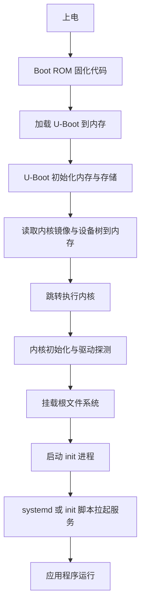

# 8.4 系统移植与构建

> **前置知识**：[8.3 驱动开发](03-驱动开发.md) · [3.7 Bootloader 与 OTA 升级](../03-嵌入式软件工程/07-Bootloader与OTA升级.md)
>
> **掌握标准**：能说清楚一块开发板从上电到应用服务跑起来，中间经过了哪几个阶段、每个阶段由谁负责；能用厂商 SDK 独立完成一次"改设备树、重编内核、重新打包镜像、烧到板子上、从串口看到启动日志"的完整流程，并在启动卡住时判断出卡在哪一段。
>
> **对应岗位**：BSP 工程师 · 嵌入式系统工程师 · 芯片原厂软件工程师
>
> **练手建议**：拿一块有完整 SDK 的开发板，把它的内核配置打开，试着关掉一个你确定用不到的功能（比如某类文件系统），重新编译并烧写，对比内核镜像大小和启动时间的变化。

## 嵌入式 Linux 系统的四件套

一块能跑起来的嵌入式 Linux 板子，其软件部分由四样东西组成。理解这四样各自负责什么，是理解整个启动流程的基础：

| 组成 | 是什么 | 负责什么 |
|---|---|---|
| Bootloader | 上电后最先运行的程序 | 初始化最基础的硬件（内存、时钟），把内核和文件系统搬到内存里，把控制权交给内核 |
| 内核 | 操作系统的本体 | 进程调度、内存管理、文件系统、网络协议栈、驱动 |
| 设备树 | 硬件的文字描述 | 告诉内核这块板子上有哪些硬件、挂在哪、怎么配置 |
| 根文件系统 | 运行起来之后看到的目录树 | 提供所有可执行程序、库、配置文件、以及运行时需要的目录结构 |

四样东西缺一不可，而且它们之间有严格的先后和依赖关系：Bootloader 要先能初始化内存，内核才能被解压到内存里运行；内核要先能挂载根文件系统，才能找到 init 程序并启动用户态；设备树必须和内核、硬件三者一致，否则驱动找不到自己的设备。

**系统移植是嵌入式 Linux 中更底层的方向，通常由 BSP 工程师负责。** 对于做应用层和普通驱动开发的人来说，一般直接使用芯片厂商提供的 SDK 和镜像即可，不需要从零移植。但了解启动流程有助于排查系统级问题——很多"应用跑不起来"的故障，根因其实在系统层。

## U-Boot

U-Boot 是这个领域事实上的标准 Bootloader。**为什么需要它？** 因为内核自己没办法把自己从存储设备里搬进内存——CPU 上电后能执行的只有固化在芯片里的一小段代码，它不知道怎么读 SD 卡、不知道怎么初始化 DDR、更不知道怎么通过网络下载镜像。这些活必须由一个"先跑起来的小程序"来做，这就是 Bootloader。

U-Boot 的工作大致是三步：初始化内存和必要的时钟、把内核镜像和设备树从存储介质读到内存、设置好启动参数并把控制权交出去。此外它还提供了一个命令行环境，这在开发和救砖时极其重要。

**环境变量**是 U-Boot 的配置核心，它决定了"从哪启动、怎么启动"。常见的几类是启动参数（传递给内核的命令行参数，比如控制台用哪个串口、根文件系统在哪里、以什么方式挂载）和启动命令序列（上电后自动执行的一串操作）。**排错时最常用的手段就是在启动时打断自动启动、进入命令行，手动修改环境变量试一次**——比如怀疑根文件系统参数写错，就现场改一个再启动，不用重新烧写。

**常用命令**也就那几类：查看和修改环境变量、从各种介质读取文件到内存（网络、存储、串口）、把内存里的内容写到存储设备上、以及启动内核。真正需要死记的不多，但要在卡住的时候知道"我可以用哪条命令验证一下我怀疑的那个环节"。

还有一个容易忽略的点：**环境变量本身存在设备的存储介质里**，所以它会被保留、也会被写坏。开发阶段反复改参数，出现"改乱了启动不了"是家常便饭，这时候要知道怎么把环境变量恢复成默认值。**U-Boot 命令行是设备变砖之后最后一道能用的救援入口**——只要 U-Boot 还能进命令行，你就还能通过网络或存储重新写镜像；如果 U-Boot 都起不来，那就只能靠芯片的底层下载模式了。这是 Bootloader 这类程序最大的实用价值之一。

## 内核配置与编译

内核是高度可配置的，编译之前必须选好要哪些功能，这个过程通过 make menuconfig 完成（图形化配置界面），内核的裁剪也是在这里做的。

| 概念 | 作用 |
|---|---|
| defconfig | 一份内核配置的默认模板，通常由芯片厂商随 SDK 提供，是编译的起点 |
| menuconfig | 图形化的配置界面，用来逐项开关内核功能 |
| 编译产物 | 内核镜像（按平台不同格式不同）和设备树二进制文件 |
| 驱动模块编译 | 根据内核版本和源码树编译 .ko 文件 |

**裁剪的意义在哪？** 两个直接收益：**体积**和**启动时间**。内核里关掉不用的驱动、文件系统、网络协议，镜像会明显变小，而更小的镜像意味着 Bootloader 读它更快、内核解压更快、初始化更少的东西。这两者在嵌入式项目里都是硬指标——存储空间有限，很多设备的启动时间要求也不允许"先跑四十秒再说"。

**但裁剪不是越多越好。** 关掉某个功能之后如果发现系统启动不起来，排查成本很高；而且后期要加新功能时又要重新配置重新编译。务实的做法是：先用厂商的 defconfig 跑通，再一个一个关掉你确实清楚自己在关什么的东西。**不要凭感觉批量关。**

**启动参数配置**是一类独立的坑，它决定内核启动后的行为：控制台输出到哪个串口（这个配错了你会以为板子彻底不启动，因为串口一片空白）、根文件系统在哪里（从哪块存储的哪个分区、还是通过网络挂载）、以及初始化的方式。**很多"启动卡住"的问题，根因只是这几个参数里的一个写错了。**

## 根文件系统的构建

根文件系统（rootfs）是内核挂载后看到的那个目录树，里面有 init 程序、Shell、各种工具和库。构建方式有三种主流选择，定位差别很大：

| 方案 | 定位 | 优点 | 缺点 |
|---|---|---|---|
| BusyBox | 精简的命令行工具集合 | 极小、极简单，自己手工搭 rootfs 时的基础 | 需要自己组织目录结构和启动脚本，工具也不全 |
| Buildroot | 完整的构建系统 | 配置简单直接，一条命令构建出工具链、内核和 rootfs | 功能相对朴素，做复杂发行版式的定制会比较吃力 |
| Yocto | 发行版级构建框架 | 强大、可定制性极高，能管理庞大的软件包和版本 | 学习曲线非常陡，构建慢，上手成本高 |

**诚实地说：大多数项目用 Buildroot 就够了。** 如果你的需求是"给一块板子做一个能跑起来、带常用工具和几个自研程序的系统"，Buildroot 几个小时就能上手，改配置也直观。Yocto 的价值在于需要长期维护、软件包数量庞大、还要做版本和补丁管理的产品级项目——那种场景下它的复杂度是必要代价，但对个人和小团队来说往往得不偿失。**选构建系统之前，先想清楚你要维护几年、有多少人参与。**

**根文件系统里最关键的其实是那个 init。** 内核挂载完根文件系统之后，会去执行第一个用户态程序（通常叫 init），之后所有的服务、终端、应用，都是从它这里派生出来的。init 挂了，系统就等于没起来。所以 rootfs 做出来之后，第一件要验证的事不是"工具全不全"，而是"init 能不能正常跑、能不能给我一个可用的 Shell"。

**BusyBox 是这个领域里一个很聪明的设计**：它把几百个常用命令（ls、cp、grep、sh 等等）实现在同一个可执行文件里，通过不同的名字（软链接）调用到不同的功能。这样一个不到一兆的程序就能提供一个基本完整的命令行环境，极大压缩了 rootfs 的体积。手工搭 rootfs 时几乎必然用 BusyBox；用 Buildroot 时它也是默认选项。代价是它实现的是"精简版"工具，某些命令的高级选项不支持，遇到"这个选项怎么不认"的时候要想到这一层。

根文件系统还有一类内容容易被忽略：**各种配置文件和设备节点**。网络配置、服务配置、以及 /dev 下面的设备节点（现在通常由内核配合一个叫 devtmpfs 的机制自动生成）。这些东西的位置和权限不对，会出现"程序明明能跑但行为不对"的怪现象。

## 交叉工具链的获取与选择

工具链是"在 PC 上编译出目标平台程序"的那套编译器加库。获取方式有三种：

- **厂商 SDK 自带**：最省事、最不容易出问题，因为它和各版本的内核、库是配套的。**优先用这个。**
- **发行版仓库或第三方预编译工具链**：安装方便，适合学习和通用程序开发，但和厂商 SDK 的库版本可能不一致。
- **自己构建**：用 Buildroot 或 Yocto 构建出的工具链，和你的 rootfs 是严格配套的，代价是构建时间长。

选择的判断标准很简单：**工具链的库版本必须和你开发板上运行的库版本对得上。** 对不上的典型症状是程序能在 PC 上编译通过，到板子上运行时报符号找不到或版本不匹配。这也是为什么"用厂商 SDK 自带的工具链"是最稳妥的默认选择。

## 存储分区与镜像布局

嵌入式设备上的存储（eMMC、NAND、SD 卡）通常会被分成几个区，每个区放一样东西。典型的分法是：第一个区放 Bootloader，第二个区放内核和设备树，第三个区放根文件系统，可能还有第四个区用来放用户数据或者做备份（A/B 双分区，升级时写另一个分区，失败还能回滚）。

**分区表是很多"启动失败"问题的隐形来源。** 分区偏移量、大小、格式，这些信息要和镜像文件严格对应上。改了分区表却没重新生成镜像、或者镜像烧到了错误的偏移位置，表现都是"某个阶段起不来"。排查这类问题时，第一件事是确认"我以为它在那个位置"和"它实际在那个位置"是不是同一件事。

分区布局也直接决定了升级方案能不能做。**想做可靠的升级，就必须提前在分区表上留好空间**——比如做 A/B 双分区，就需要两份根文件系统的空间。这个决定在做第一版硬件和镜像时就要定下来，等到产品上线再改，代价会大得多。

## 启动流程全链条

把整个链路串起来看，一块板子上电之后发生的事是这样的：

这里面每一段都是独立的排错单元。**串口日志是唯一能贯穿始终的线索**——它会把每个阶段的输出都打出来，所以"启动到哪一步没了"就是你的第一个判断依据。上电后完全没有输出，说明问题在 Boot ROM 到 U-Boot 这一段；U-Boot 有输出但内核没起来，问题在镜像读取或内核本身；内核起来了但停在挂载根文件系统，问题在存储分区或挂载参数；一路起来但卡在服务启动，问题就回到应用层了。

## 烧录方式

镜像做好了要写进板子，几种方式各有适用场景：

| 方式 | 特点 | 适用 |
|---|---|---|
| SD 卡 | 在 PC 上把镜像写进卡，插上就能跑 | 开发阶段首选，迭代最快 |
| USB | 通过 USB 直连烧写，常见于量产的下载模式 | 板子没有可插拔存储时 |
| 网络 | 通过网口从 PC 下载镜像到内存直接运行，或写入存储 | 频繁迭代内核时效率最高，不用反复插拔 |
| 量产工具 | 厂商提供的批量烧写工具 | 产线批量生产，能同时烧多块板子 |

开发阶段推荐"网络启动加 SD 卡"的组合：内核通过 TFTP 直接从 PC 下载到内存运行（改一次内核几秒钟就能验证），根文件系统通过 NFS 挂在 PC 上（改代码不用重新打包），定型之后再用 SD 卡做完整镜像。这套流程能让你的调试循环从"每次几分钟"压缩到"每次几秒钟"。

## 系统裁剪与启动优化

如果设备的启动时间要几十秒，通常是"把所有能开的东西都开了"的结果。常见的优化思路：

- **精简服务**：只保留真正要用的服务，去掉多余的日志、打印、管理功能；
- **并行启动**：把互不依赖的服务并行拉起，而不是一个等一个；
- **延迟加载**：把不影响主功能的驱动和服务放到后台、等主功能起来之后再加载；
- **关掉内核里不需要的调试和功能**：调试选项、没用的文件系统、用不到的网络协议；
- **优化内核等待**：有些驱动初始化时会做固定时长的等待或探测，可以按硬件实际情况缩短。

**从几十秒压到几秒在嵌入式项目里是常见且现实的。** 但要注意，这些优化建立在"你已经理解每一块在做什么"的前提上。在不理解的情况下盲目关服务，最大的风险是系统在某个特定场景下才出问题，而你在测试时完全没发现。

## 移植过程中最常卡住的地方

这一节的每一条，都是从"板子跑不起来"倒推出来的高频原因。

**内存参数不对。** 内存的大小、时序、位宽这些参数如果配错，表现是内核刚启动就崩，或者只认出很小一部分内存。这是最底层的问题，改法通常在 U-Boot 或者厂商的初始化配置里。

**设备树不匹配。** 用了和板子硬件版本不对应的设备树文件，表现是某些外设完全不工作、或者内核在某一步报错停下来。特别注意硬件有多个版本时，设备树也要跟着版本走。

**根文件系统挂不上。** 内核起来了，但报"找不到根文件系统"。要查的有四件事：参数里写的分区对不对、分区是不是真的被烧进了内容、文件系统格式和内核支持的是不是一致、以及挂载参数写没写对。

**串口完全没有输出。** 这是最让人绝望的情况，因为你连日志都拿不到。分段定位的思路是：先确认串口线本身没问题（TX/RX 有没有接反、共地了没有、波特率和终端设置对不对）——**这三条能解决大半问题**；确认线没问题之后，再考虑是不是 U-Boot 根本没被正确加载（存储介质里的镜像损坏、启动介质选择跳线不对），或者启动模式设置不对。必要时要靠更底层的工具（比如芯片的下载模式和厂商的上位机软件）来看 Boot ROM 有没有工作。

**启动日志里出现大量莫名报错。** 别被吓到，先筛出错误级别的信息，再按时间顺序看第一处异常。内核启动过程中很多报错是"某个可选功能没启用"，不影响系统运行。

**驱动模块加载不上。** 系统起来了，但某个功能就是没有，日志里能看到模块加载失败。回到 8.3 里讲过的那两条：模块和内核对不对得上版本、模块文件有没有在正确的位置。**注意模块文件必须放在 rootfs 的对应目录下**，它和内核是分开存放的，做 rootfs 时漏拷模块目录，是新手很常见的失误。

排查这些问题有一个共同的方法：**一次只怀疑一处，并且用一条命令去证实或证伪它。** 不要同时改三个参数然后看结果，那样即使系统起来了你也不知道是哪个改动起了作用，下一次遇到同样的问题你还是不会。

## 学习建议

**不要从零开始移植。** 这一篇最实际的建议是：直接用厂商 SDK 和镜像，先把系统跑起来、跑通应用，再回头理解每个组件。从零做 U-Boot 移植、从零构建 rootfs，是 BSP 工程师的活，对应用和驱动开发者来说是纯粹的自我损耗。

**但要会一次完整的"改—编—烧—看"。** 哪怕不理解每个配置项的含义，也要完整走过一遍：改一处设备树、重新编译内核、打包镜像、烧到板子、从串口看日志确认改动生效。走通这一次，你后面所有系统层的改动都有了方法。

**先把串口日志读到滚瓜烂熟。** 这是你最有力的排查工具，没有之一。找一次启动失败的机会（可以故意写错一个参数），仔细看日志停在哪里、每一段输出的最后一行是什么。有过这个经验，你以后就不会在"启动不了"面前束手无策。

**构建系统选一个学透，不要都学。** Buildroot 和 Yocto 二选一，个人学习建议 Buildroot。搞清楚它的配置怎么改、包怎么加、产物在哪，比泛泛了解三个构建系统的概念有用得多。

**不要一开始就搞启动优化。** 先把系统跑起来、功能跑通，最后才做启动时间优化。顺序反了会发现优化完之后功能又出问题，来回返工。

**这一篇的内容，等你真的需要时再回来细读。** 它更像一份排错手册而不是必读教材——没有实际项目需求时，硬啃 U-Boot 的命令和内核配置项，记忆效果很差。

## 小节总结

系统移植是这个方向里最"底层"的一篇，但它的价值不在于让你成为 BSP 工程师，而在于让你对整个系统有一个完整的心理模型。知道内核之前还有 Bootloader、知道设备树是从外部传给内核的、知道根文件系统是内核挂载出来的——有了这个模型，你遇到系统级故障时才有判断的方向，而不是只会盯着自己的应用代码看。

四件套之间的关系可以用一句话概括：Bootloader 准备场地，内核搭建舞台，设备树告诉内核场地是什么样，根文件系统提供演员和道具。任何一环出问题，表现都是"系统起不来"，但排查位置完全不同。这个"表现相同、原因不同"的特点，正是分层排查思路之所以重要的原因。

Buildroot 和 Yocto 的选择是个典型的"过度设计陷阱"。技术上更强的方案不一定更适合你的项目，构建系统这类基础设施尤其如此——它的复杂度会长期摊在你每一次改动上。**大多数项目用 Buildroot 就够，这是一条务实的判断，不是能力不足的妥协。**

排错时要养成"分段定位"的习惯。启动流程天然是一段一段的，每一段都有自己的输入输出和失败表现。从这个角度说，串口日志是你的坐标系——有了它，你永远知道自己站在哪一段；没有它，一切排查都是猜。

最后，这一篇的内容适合"用到再学"。你不需要在开始学 Linux 的第一天就弄懂 U-Boot 的每个命令，但你应该知道自己需要时该去哪里找答案、该验证哪一个环节。**先会用，再会改，最后再考虑从零搭建。**

---

本章目录：[8. 嵌入式 Linux](README.md) ｜ 总目录：[返回首页](../../README.md)
上一篇：[8.3 驱动开发](03-驱动开发.md) ｜ 下一篇：[8.5 实时 Linux 与性能调优](05-实时Linux与性能调优.md)
