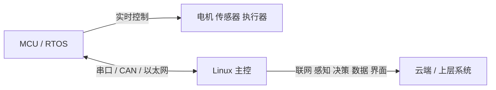

# 8.5 实时 Linux 与性能调优

> **前置知识**：[8.2 应用层开发](02-应用层开发.md) · [4.1 RTOS 概述与裸机局限](../04-实时操作系统/01-RTOS概述与裸机局限.md)
> **掌握标准**：能说清楚标准 Linux 为什么不是硬实时、延迟从哪里来；能在板子上用工具测出实际的最坏延迟，判断它是否满足你的控制周期要求；如果不能满足，能给出三种可选方案并说明各自的代价。
> **对应岗位**：机器人软件工程师 · 运动控制算法工程师 · 边缘计算系统工程师
> **练手建议**：在开发板上跑一个周期性任务，用高精度时钟记录每次循环的抖动，跑十分钟，看最坏值和平均值差多少。这个数字就是你这块板子的真实实时能力，比任何规格书都可信。

## 先纠正一个误解

**标准 Linux 不是硬实时系统。** 这句话值得在最前面说清楚，因为它是后面所有内容的地基。

Linux 的内核调度设计目标，是**吞吐量和公平性**，而不是**确定性延迟**。它希望让所有任务都得到合理的 CPU 时间、让整机单位时间处理尽可能多的活儿，这个目标下"某个任务偶尔晚几毫秒"是可以接受的代价。而实时系统追求的是另一件事：**每一次任务都必须在截止时间前完成**，晚 1 毫秒和晚 100 毫秒一样，都是失败。这两个目标在根本上是冲突的。

所以当你把一个 1 毫秒周期的控制回路放到标准 Linux 上跑，偶尔出现几次十几毫秒的延迟，不是你的代码有问题，而是这个系统本来就不承诺这件事。**软件实时（soft realtime）意味着"通常是快的"，硬实时意味着"总是准时的"**，这两者的差别在控制系统里是致命的。

| 维度 | 标准 Linux | 硬实时系统（RTOS） |
|---|---|---|
| 设计目标 | 吞吐量、公平性 | 确定性延迟 |
| 延迟特性 | 平均很低，最坏值不可控 | 最坏值有明确上界 |
| 延迟量级 | 通常几十微秒到几百微秒，最坏可达毫秒到几十毫秒 | 通常微秒级，且有保证 |
| 调度 | 优先级加公平调度、CFS | 严格优先级抢占 |
| 后果 | 偶尔延迟超标 | 超标有明确上限，可验证 |

## 延迟从哪里来

Linux 上的延迟来源有好几类，理解它们才能知道该往哪个方向优化。

**内核不可抢占区。** 内核里有些代码段执行时不允许被抢占（比如持有自旋锁的那段），这段时间里即使有更高优先级的任务准备好运行，也得等着。内核里的这类区域越多、越长，最坏延迟就越大。这是标准 Linux 延迟最大的来源。

**中断处理。** 硬件中断会打断当前正在执行的一切，包括你的实时任务。标准内核里，中断处理是直接在内核上下文里跑的，处理耗时越长，对被中断的任务影响越大。

**中断屏蔽。** 某些代码会临时关掉中断，这期间硬件事件会排队等着，关中断的时间直接加到延迟上。

**内存管理。** 缺页异常是延迟的隐形杀手。程序访问到一块还没真正分配物理页的内存时，内核要停下来去分配、可能还要换出别的页。这个动作可能耗时几百微秒甚至更长，而且**它发生在你的代码中间，你完全无法预测什么时候会触发**。这是为什么实时程序要做内存锁定。

**调度延迟。** 即使一切顺利，从"高优先级任务就绪"到"它真正开始执行"，中间还有调度器决策、上下文切换的开销。

## 三种实时方案及其代价

如果你确实需要一个接近硬实时的 Linux，有三条路。

**方案一：PREEMPT_RT 补丁。** 这是最主流的一条，思路是把内核改造成"处处可抢占"：把中断处理线程化、把自旋锁替换成可睡眠的锁、消除大部分不可抢占区域。效果是延迟从毫秒级降到几十微秒级。它的好消息是**部分改动已经进入内核主线**，这条路得到了长期支持，不再是"打补丁的野路子"。代价是：吞吐量会下降（可抢占换来的是性能损失），需要重编内核，而且仍然提供的是"低延迟"而不是严格的硬实时保证——它能把最坏延迟压得很低，但没有数学意义上的上界。

**方案二：双内核方案（Xenomai、RTAI）。** 思路是让一个极小的实时内核和 Linux 共存，实时任务跑在实时内核上，Linux 作为一个"最低优先级的任务"在旁边跑。这样实时延迟可以做到个位数微秒，比 PREEMPT_RT 更低。代价也很明显：**复杂得多**。实时任务不能直接用 Linux 的驱动和系统调用（因为那会切到 Linux 域），需要学习专门的实时 API，开发和调试难度都上一个台阶，社区和资料也远不如 PREEMPT_RT 丰富。

**方案三：不用 Linux 做实时。** 这不是逃避，而是很多时候最正确的工程判断——后面单独说。

| 方案 | 典型延迟 | 复杂度 | 适合 |
|---|---|---|---|
| 标准 Linux | 最坏可达毫秒到几十毫秒 | 低 | 对延迟不敏感的通信、管理、数据处理 |
| PREEMPT_RT | 几十微秒级 | 中 | 需要低延迟但可以接受极小概率超时的场景 |
| 双内核 | 个位数微秒 | 高 | 真正需要硬实时的场合，且有足够工程投入 |
| MCU / RTOS 协处理 | 微秒级且有保证 | 中（架构上） | 运动控制、电流环、安全相关的实时任务 |

## 具体的调优手段

如果你已经在 Linux 上，这几个手段值得了解：

**中断线程化**：把中断处理变成普通内核线程，这样它们可以被优先级调度、可以被抢占，不再无差别地打断实时任务。PREEMPT_RT 会默认这么做，但在标准内核上也可以对特定中断手动配置。

**CPU 隔离**：通过 isolcpus 这类内核参数，把某几个 CPU 核从调度器的一般负载均衡中隔离出来，只跑你指定的实时任务。这是效果最直接的手段之一——**让实时任务独占一个核，避免和其他任务抢**。代价是那个核的算力不能被其他任务使用。

**优先级继承**：解决优先级反转问题。经典的场景是低优先级任务持有一把锁，高优先级任务在等这把锁，结果中优先级的任务先跑了，导致高优先级任务的等待时间被无限拉长。优先级继承让持锁的低优先级任务临时继承等待者的优先级，把它自己提到能尽快执行完并释放锁的位置。写实时程序时，用到的锁必须支持这个机制。

**内存锁定**：把程序用到的内存全部锁定在物理内存里，禁止被换出，避免运行时触发缺页异常导致的不可预测停顿。实时程序上线之前，这一步几乎是必做的——**你不做这一步，前面所有的延迟优化都可能被一次缺页打断**。

**减少动态内存分配**：运行时的 malloc 和 free 行为不可预测（可能触发内核分配、可能加锁、可能有内存碎片）。实时任务应该在初始化阶段就把内存准备好，运行期只用预分配的缓冲区。

**实时线程的优先级和调度策略**：把实时任务设成实时调度策略并给定合理优先级，是让它能抢占普通任务的前提。但优先级不要乱给——所有任务都设成最高优先级，等于没有优先级。

## 性能调优的方法论

这一节比具体工具有价值得多。**性能问题最常见的失败模式，是凭直觉优化错了地方。**

正确的顺序是：

1. **先定义指标。** 你说的"慢"到底是启动慢、响应慢、还是吞吐不够？是平均值问题还是最坏值问题？指标不清楚，后面的优化没有验收标准。
2. **先测量，拿基线。** 在优化之前记录当前的真实数据。没有基线，你无法判断优化有没有效果，甚至会以为改了就有用。
3. **定位瓶颈在哪一层。** 是 CPU 算不过来、内存不够、IO 卡住、还是锁竞争？不同层次的病因，药方完全不同，而且能互相伪装——IO 等待会表现成 CPU 空闲但程序很慢，锁竞争会表现成 CPU 很高但吞吐上不去。
4. **一次只改一个变量。** 同时改三处然后发现变快了，你并不知道是哪一处起了作用。
5. **改完再测，和基线对比。** 有效就留下，无效就回退。**没效果就果断回退，不要因为"改了挺久"就留着。**

**不要凭感觉优化**，还有一个更实际的理由：嵌入式设备的资源是有限的，你为了解决问题多占的内存和 CPU，会变成别人新的问题。

## 常用性能工具

| 工具 | 看什么 |
|---|---|
| top / htop | 整体 CPU 和内存占用，哪个进程在吃资源 |
| vmstat | 系统级统计：内存、换页、上下文切换、IO 等待 |
| iostat | 存储设备的读写量和 IO 压力 |
| perf | 采样分析 CPU 热点，找出时间花在哪个函数上 |
| ftrace | 内核自带的跟踪框架，能看调度延迟、中断、函数调用 |
| 火焰图 | 把 perf 采集的调用栈数据可视化，一眼看出哪个调用链最耗时 |

**火焰图的思路值得理解**：横轴是采样占比（越宽的调用链占用 CPU 越多），纵轴是调用栈深度。它最大的价值是让你看到"我以为的瓶颈"和"实际的瓶颈"差多远——很多人优化了半天自己写的循环，结果发现时间全花在一个库调用的字符串处理上。

**测延迟要用专门的方法。** 上面这些工具看的是平均值和整体趋势，而实时问题关心的是**最坏值**。你需要的是周期性记录时间戳并统计抖动的工具（ftrace 的调度延迟跟踪、以及专门的实时延迟测试工具）。跑得越久越有说服力——一个跑十分钟看不出问题的系统，可能在跑八小时后出现一次几十毫秒的卡顿。

## 启动时间优化

启动时间在很多产品里是硬指标（车载、消费电子、工业设备都可能有要求），优化思路和性能调优一致，但更依赖系统层的理解：

- **精简服务**：只保留必须的，去掉多余的日志和管理功能；
- **并行启动**：把互不依赖的服务同时拉起（systemd 本身支持依赖关系描述，配好了就能并行）；
- **延迟加载**：把不影响主功能的服务和驱动挪到主界面出现之后再加载；
- **内核优化**：关掉不用的驱动和功能，缩短内核里的固定等待；
- **优化存储读取**：镜像更小、读取方式更快，启动自然更快。

**启动时间从几十秒压到几秒是常见且现实的**，具体能压到多少取决于系统复杂度和硬件。但要注意，这些优化建立在你理解每一块在做什么的前提上——盲目关服务最大的风险是"某个特定场景下的功能没了，而你的测试没覆盖到"。

## 一个重要的架构判断

这一节是整篇最想传达的东西。

**很多系统的最优解不是"把实时任务塞进 Linux"，而是让 Linux 和 MCU 分工。** 典型结构是：

在这个架构里，**MCU 负责实时控制**（电机电流环、位置环、安全逻辑、硬实时的采样），**Linux 负责管理和联网**（路径规划、视觉处理、网络通信、人机界面、数据上报）。两边通过串口、CAN 或以太网交换指令和状态。

为什么这往往是最优解？因为：

- **各取所长。** 实时部分用 RTOS 天生就该做这件事，微秒级的确定性是它的基本能力，不需要和 Linux 的可抢占性斗争；而 Linux 的生态、网络、算力是 MCU 给不了的。
- **风险隔离。** 实时控制不依赖 Linux 的稳定性。Linux 崩了、重启了，电机仍然能被安全地停下来——这在产品上是很强的安全保障。
- **开发成本低得多。** 你不用为了达到硬实时去啃双内核方案，也不需要担心某个内核配置改动的副作用。**用架构解决问题，比用工程手段硬扛要便宜得多。**

**什么时候该考虑 Linux 上的实时方案？** 如果你的实时任务和 Linux 上的其他功能耦合极紧（比如视觉推理的结果要直接参与控制、且延迟要求不高），或者加上一块 MCU 在成本和体积上不可接受，那么 PREEMPT_RT 是一个合理的选择。但如果你的实时要求是"微秒级、不能有一次超标"，答案通常是加一块 MCU。

## 学习建议

**先测出你板子的真实延迟，再谈要不要做实时。** 很多人一上来就研究 PREEMPT_RT 怎么打补丁，结果测一下发现自己根本不需要。花半天时间跑一个延迟测试，拿到真实数字（平均值和最坏值），这个数据决定你后面所有的技术选型。

**不要指望标准 Linux 干硬实时的活。** 即使你做了所有优化，最坏延迟依然没有上界。涉及安全、涉及高精度运动控制的部分，就要用该用的手段，不要抱侥幸心理——现场跑几个月才出一次问题的bug，是最难处理的。

**架构判断优先于技术方案。** "Linux 管通信、MCU 管控制"这个结构，在机器人、工业设备、智能硬件里出现频率极高，它不是一个妥协方案，而是很多成熟产品的主动选择。理解它，你在做系统设计时就有了一个强有力的默认选项。

**性能调优先从测量开始，这一条要变成肌肉记忆。** 每次想动手优化之前，先问自己：我怎么知道瓶颈在这里？如果答不上来，就先测量。这个习惯能帮你省下大量的无效工作时间。

**工具用一个学透。** perf 加火焰图是最通用的组合，能把大部分 CPU 相关的问题定位到函数级。ftrace 是内核层的利器，等你开始关心调度和中断延迟时再深入。

**启动优化是系统工程，不是技巧堆砌。** 它考验的是你对整个系统的理解程度——哪些服务真的需要、哪些可以延后、哪些依赖关系其实没必要。做这件事之前，先把启动日志完整看一遍，很多时候答案就在那里。

**这一篇是选学内容。** 不做实时相关项目的话，知道"Linux 不是硬实时"和"Linux 加 MCU 是常见架构"这两条判断就够了，具体的调优手段用到再学。

## 小节总结

标准 Linux 不是硬实时，这不是缺陷而是设计取向的必然结果。它优化的是吞吐和公平，代价是最坏延迟不可控。理解这一点之后，你就不该再问"怎么让 Linux 变实时"，而该问"我这个任务到底需要多实时、值不值得为此付出代价"。**大部分所谓的实时需求，在认真测量之后都会发现是伪需求。**

延迟的四大来源里，内核不可抢占区和缺页异常是最容易被忽略、也最影响最坏值的两个。前者需要内核改造才能解决，后者只要做好内存锁定就能消除一大半。这也说明了一个规律：**实时性问题往往不在于算法快不快，而在于系统里有多少"不可预测的停顿"。**

三种实时方案的选择，本质上是"延迟指标"和"工程复杂度"之间的权衡。PREEMPT_RT 是性价比最高的低延迟方案，双内核能给你更低的延迟但要付出可观的复杂度，而加一块 MCU 在很多场景下反而是最简单、最可靠的路。**不要因为"我学了 Linux，就什么都用 Linux 做"**，这是新技术上手时最常见的思维陷阱。

性能调优的方法论只有一句话：**先测量，再优化。** 这听起来像常识，但实际工作中绝大多数优化尝试都是凭感觉做的。拿到基线、定位层次、一次改一个变量、无效就回退，这四步能让你在性能问题上保持清醒，也能避免"优化了半天发现改错了地方"。

最后，"Linux 管通信和决策、MCU 管实时控制"这个异构架构，是这一篇最值得带走的东西。它把 Linux 的生态优势和 RTOS 的实时能力放在各自最合适的位置上，用架构解决了单靠软件手段很难解决的问题。很多系统的最优解就在这里，而不是在 PREEMPT_RT 的补丁里。

---

本章目录：[8. 嵌入式 Linux](README.md) ｜ 总目录：[返回首页](../../README.md)
上一篇：[8.4 系统移植与构建](04-系统移植与构建.md) ｜ 下一篇：[8.6 视觉与多媒体](06-视觉与多媒体.md)
