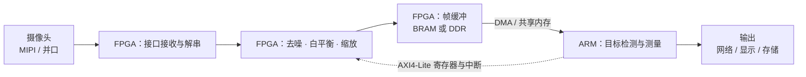

# 9.3 接口 IP 与软硬协同

> **前置知识**：[9.1 Verilog 与 RTL 设计](01-Verilog与RTL设计.md) · [9.2 时序分析与跨时钟域](02-时序分析与跨时钟域.md) · [2.3 通用外设](../02-MCU与体系结构/03-通用外设.md)
>
> **掌握标准**：知道 FPGA 项目里哪些部分该自己写、哪些该用 IP 核，能说清 AXI 总线的作用和 ARM+FPGA 异构架构的分工
>
> **对应岗位**：FPGA 工程师 · 数字逻辑工程师 · 芯片验证工程师 · 异构计算工程师 · 高端仪器工程师
>
> **练手建议**：在一个 FPGA 工程里调用一个厂商提供的 IP 核（比如 FIFO 或 BRAM），再把它的接口接到你自己写的模块上，体会"接口不匹配"是怎么调试的

## 不要自己造轮子：IP 核的定位

先说一个数字：在一个成熟的 FPGA 项目里，**你自己写的 RTL 可能只占整个工程的 20% 到 30%**，剩下的都是 IP 核。

IP 核（Intellectual Property Core）就是**预先设计好、验证过、可以直接拿来做积木的功能模块**。你在 9.1 里学的"写模块、例化模块"，本质上就是在做 IP 复用；厂商做的只是把这件事推到了更复杂的层次——他们给你一个 DDR 控制器、一个以太网 MAC、一个 PCIe 硬核，你不需要知道里面怎么实现，接上就能用。

为什么这件事在 FPGA 里比在软件里更极端？因为**硬件模块一旦做错，代价比软件高得多**：软件 bug 发个补丁就行，硬件设计的问题意味着重新综合、重新实现、重新验证，一个 DDR 控制器的训练逻辑要几百页规范才说得清。所以这个行业的通行做法是：**通用的、复杂的、有严格时序要求的东西，一律买现成的。**

### 三种 IP

| 类型 | 形态 | 特点 |
|---|---|---|
| **软核（Soft Core）** | RTL 源码或网表，由工具综合到你的器件里 | 可移植、可改参数、可读源码（取决于授权）；性能受器件影响；占用你的逻辑资源 |
| **硬核（Hard Core）** | 芯片里固化好的专用电路 | 性能最好、不占通用逻辑资源；只能在特定器件上用，不可改 |
| **固核（Firm Core）** | 介于两者之间，通常是网表加布局约束 | 性能比软核稳定，可移植性比硬核好一些 |

要理解这三者的区别，最好的例子是同一个功能在不同器件上的不同形态：**乘法器**在低端 FPGA 上是软核（用一堆 LUT 搭出来的），在中高端 FPGA 上是硬核（芯片里真的有一个 DSP 乘法单元）；**PLL/MMCM**（时钟管理单元）几乎总是硬核；**BRAM**（块状存储器）也是硬核，你写 `reg [7:0] mem [0:1023]` 时，工具会自动判断能不能用 BRAM 实现——能就用硬核，不能就用触发器拼。

**同一个功能，硬核和软核的性能差距可能是一个数量级。** 所以看器件选型时，DSP 块数量、BRAM 容量、时钟管理单元数量这几个参数，比"逻辑单元总数"更能说明这颗芯片适合干什么。

### 什么时候用 IP，什么时候自己写

| 情况 | 选择 | 理由 |
|---|---|---|
| 通用且复杂（DDR 控制器、PCIe、以太网 MAC、USB） | **用 IP** | 规范几百页，自己写等于重造半年 |
| 有时序硬要求（高速收发、MIPI） | **用 IP** | 需要用到芯片的专用硬件资源，自己写碰不到 |
| 厂商已经提供且验证过的接口 IP | **优先用** | 验证成本已经被人付过了，这是最划算的一类 |
| 简单的逻辑（计数器、状态机、格式转换） | **自己写** | 调 IP 参数花的时间比自己写还长 |
| 需要精确控制时序、流水线级的逻辑 | **自己写** | IP 是黑箱，你插不进自己的流水线节拍 |
| 你的逻辑和它紧耦合、数据流每拍都要处理 | **自己写** | IP 的接口节奏未必和你的数据流对得上 |
| 只是为了"用一下高级功能" | **先别用** | 不理解的 IP 会变成查不出的 bug |

**一条实用的经验**：调 IP 的参数、读它的手册、把它接进你的设计，这些时间加起来经常不比手写一个简单模块少。所以"该用 IP"的判断标准不是"这个东西难不难"，而是 **"它是不是通用的、以及它有没有现成的、被验证过的实现"**。常见的 IP 类别大致是这几类：时钟管理（PLL/MMCM）、存储（FIFO/BRAM）、算术（乘法器/累加器/DSP 块）、接口（UART/SPI/I2C/以太网/PCIe/DDR）、调试（内嵌逻辑分析仪）。

### 用 IP 的代价，要诚实说

IP 不是白拿的，四条代价必须提前知道：

- **许可证限制**。很多高速接口 IP 需要单独授权、按次或按年收费，有些还绑定具体器件型号。教学板或免费工具里能用的 IP，换成量产器件可能就要额外买。
- **可移植性差**。换了厂商（比如从 Vivado 转到 Quartus），大部分 IP 都得重做一遍。这不是小事——**IP 依赖是你被某个厂商锁定的主要原因**。
- **黑箱，出问题难查**。你只能看到接口，看不到内部。所以一旦现象出现在 IP 边界上，你分不清是它的问题还是你的问题，只能靠看波形和读手册猜。
- **版本兼容**。工具升级之后，老工程里的 IP 可能要求你升级它的核，升级之后行为有变化是常见的事。

### 厂商生态的差异

两大生态：**AMD/Xilinx 的 Vivado** 和 **Intel/Altera 的 Quartus**（9.1 里已经讨论过入门选择）。这里的差别不只是工具好不好用，更关键是**IP 库和参考设计的丰富程度**。

国产 FPGA（紫光同创的 PDS、安路的 TD、高云的 GOWIN EDA 等）在中低端器件上已经可用，性价比不错，工具链也在快速补齐。但要说清楚：**差距最大的地方恰恰就是 IP 生态**——不是芯片做不出来，而是那些复杂的接口 IP、参考设计、应用笔记、社区问答的积累，需要很长时间。做信创、军工、通信设备这类方向值得关注；入门阶段还是建议从两大厂起步，理由和 9.1 一致：你需要的是"遇到问题搜得到答案"。

## AXI 总线：ARM 与 FPGA 的公共语言

**为什么需要一个总线标准？** 因为一个 FPGA 系统里，你的模块要和厂商的 IP 对接，厂商的 IP 之间也要互相对接，而它们由不同的团队在不同年份写成。如果每个人都按自己的喜好定义接口（有的用两根线握手，有的用四根，有的地址先给有的数据先给），集成阶段就会变成地狱。**总线标准的作用就是把这些"接口的自由"收走，换成一份所有人都遵守的合同。**

AXI 就是这份合同。它是 ARM 的 AMBA 规范里最重要的一部分，也是今天 ARM 生态里事实上的片上总线标准——**只要你在做 ARM+FPGA 的项目，你和总线的交道基本都是 AXI。**

### 三个变体，各管一段

| 变体 | 有无地址 | 有无突发 | 典型用途 |
|---|---|---|---|
| **AXI4** | 有（内存映射） | 有，支持长突发 | 大批量内存访问：DDR、大缓冲区搬运 |
| **AXI4-Lite** | 有（内存映射） | 无，一次一个数据 | 控制通路：读写寄存器、配置参数 |
| **AXI4-Stream** | 无 | 无（是连续流） | 数据通路：视频、音频、信号处理、滤波器链 |

理解这三者的区别，抓住一句话就够了：**AXI4-Lite 是"我来看看你那个寄存器里是什么"，AXI4-Stream 是"数据来了你就往下传"，AXI4 是介于两者之间的"我要从这里搬一大块数据到那里"。**

**一个实用的判断**：做 ARM+FPGA 项目时，控制寄存器一律用 AXI4-Lite，大数据流一律用 AXI4-Stream，大批量内存访问才用 AXI4。绝大多数项目里，前两者能覆盖 90% 的需求。很多新手一上来就想把所有东西都挂在 AXI4 上，结果是复杂度暴涨而收益为零。

### 握手机制：AXI 最核心也最容易写错的地方

AXI 所有数据传输都靠两根线完成：**VALID**（发送方说"我的数据有效"）和 **READY**（接收方说"我能收"）。传输发生在**同一个时钟沿上 VALID 和 READY 同时为高的那一刻**。

规则本身很短，但新手几乎一定会在其中两条上栽跟头：

- **VALID 一旦拉高，在握手完成之前绝对不能撤销。** 这是硬性规定。写代码时不小心写成"发一拍发现对方没 READY 就收回来"，仿真可能看着凑合，实际系统里会丢数据或者死锁。
- **VALID 不许依赖 READY 才拉高。** 如果发送方想"等他 READY 了我再给 VALID"，而接收方想"等他 VALID 了我再给 READY"，两边就永远互相等着——这就是**死锁**。规则是：发送方该发就发，接收方的 READY 可以先给、也可以后给，**只有 READY 允许等 VALID，反过来不行**。
- 数据必须在 VALID 拉高的那一刻就是有效的，不能在握手那一刻才变化。

**为什么这套机制被设计得这么严格？** 因为它要能对接任意两个互不认识的模块：一边可能快一边可能慢，可能中间隔着一个时钟域，可能是突发中间插进来的。**用"VALID 不许撤销、VALID 不等 READY"这两条约束，就能保证任何一方都不会因为对方的行为而卡死。** 记住这两条，AXI 的报错你能看懂的会多一大半。

### 通道分离与突发传输

AXI 的另一大特点是**读写通道完全独立**：写操作有自己的地址通道、数据通道和响应通道，读操作有自己的地址通道和数据通道，五条通道各走各的。这意味着**读和写可以同时进行**，不用排队，这是 AXI 高性能的来源之一。

**突发传输**（burst）解决的是另一个效率问题：以前访问内存要"给一个地址、传一个数据、再给一个地址、再传一个数据"，地址占掉的总线带宽很可观。突发允许你一次给出起始地址和长度，然后连续传多个数据，地址开销被摊薄了。这就是为什么做大批量搬运要用 AXI4 而不是 AXI4-Lite。

顺带说清 AXI 和其他总线的关系：**APB** 是最简单、最慢的片上总线，没有流水线，一次只做一个传输，专门用来挂 UART、SPI、GPIO 这类低速外设；**AHB** 介于 APB 和 AXI 之间。现代 SoC 的结构通常是：高性能主设备挂在 AXI 上，通过一个 AXI-to-APB 桥把一堆低速外设挂到 APB 上。**看到 APB，就知道这里不会有什么带宽需求；看到 AXI4，就知道这里在搬大数据。**

## 软硬协同：ARM + FPGA 的异构架构

**这种架构为什么流行**，答案就是一句话：**两边各干自己最擅长的事。** ARM 擅长做判断、跑协议栈、管文件系统和网络，但它做实时并行计算很吃力；FPGA 擅长并行、时序确定，但它做分支判断、跑协议栈非常痛苦。把它们放在一起，就能同时拿到软件的灵活和硬件的实时。

### 分工原则

| 放 FPGA | 放 ARM |
|---|---|
| 流水线式的逐拍处理（滤波、插值、编解码的每一级） | 决策与状态管理（什么时候启动、异常怎么处理） |
| 需要严格确定时延的操作 | 协议栈（TCP/IP、USB、文件系统） |
| 天然可并行、可以同时算很多路的计算 | 需要复杂分支和查表的逻辑 |
| 与外部器件的高速接口时序 | 人机交互、上位机通信、日志与升级 |
| 数据通路上的搬运和中转 | 算法流程的调度与参数下发 |

**这条分工线的本质是"结构的差异"**：FPGA 擅长对每一拍的数据做同样的事（这就是流水线），ARM 擅长"这次走这条路、下次走那条路"。凡是数据一进来就必须立刻按固定节奏处理的，放 FPGA；凡是"看情况决定做什么"的，放 ARM。**判断的时候不要比"哪个算得快"**——比算力的话结论经常是反的，因为 ARM 主频高得多。要比的是**时延是不是确定的、是不是需要真正并行**。

### 四种通信方式

| 方式 | 实现 | 适合 | 注意 |
|---|---|---|---|
| **寄存器映射** | 一侧挂 AXI4-Lite 从机接口，另一侧读写寄存器 | 控制、状态、参数下发 | 最简单可靠，但吞吐低，不适合搬数据 |
| **共享内存** | 双方约定一块内存区域的地址和格式 | 大批量数据、命令队列 | 必须处理 Cache 一致性和同步（谁写、谁读、什么时候读） |
| **DMA** | FPGA 作为总线主设备直接读写 DDR | 高速数据流 | 几乎不占 CPU，但要管好描述符和中断 |
| **中断** | FPGA 拉一根线通知 ARM | 事件通知 | 中断里只做最少的事，细节留给任务处理 |

一个典型的组合是：**用 AXI4-Lite 下发参数和读状态，用 DMA 搬数据，用中断通知完成。** 这三件事分别对应"控制、数据、事件"，配齐之后就是一个完整的协同框架，大多数项目都是这个结构。

### Cache 一致性：异构架构里最隐蔽的坑

这一节值得单独讲，因为它是 ARM+FPGA 项目里最经典、也最让人抓狂的问题。

背景是两个事实放在一起：

- ARM 侧有 Cache。CPU 写的数可能**还留在 Cache 里没落到内存**，CPU 读的数可能**是从 Cache 里拿的旧值**。
- FPGA（通过 DMA）直接访问内存，它**完全不知道 Cache 的存在**。

于是会发生两种错：

- ARM 算出结果、写了一块缓冲区，然后通知 FPGA 把这块数据取走。FPGA 去内存里读，读到的还是**旧数据**——因为 ARM 的写还在 Cache 里。
- FPGA 往缓冲区里写入了新数据，然后拉中断通知 ARM。ARM 去读，读到的是**Cache 里的旧副本**——因为 Cache 不知道内存已经变了。

这两种错的表现有个共同点：**大部分时候是对的，偶尔错，而且不好复现。** 它取决于 Cache 的行为、编译器的布局、代码的执行顺序，甚至取决于你是否刚好碰上了替换。第一次遇到的人通常会在 FPGA 侧查很久，最后发现是 CPU 侧的缓存问题。

**解决思路有三种，按项目复杂度选：**

1. **把共享区域配置成非缓存（或写通）**。在 MMU 里把这块内存的属性设成不可缓存，CPU 每次访问都直接落到内存上。**这是异构项目里最省心、最常用的做法**，代价是 CPU 访问会慢一些。用在控制寄存器和 DMA 缓冲区上，几乎总是划算的。
2. **手工做 Cache 维护**：发送数据之前把 Cache 里这块区域**清出去**（写回内存），接收数据之前把它**失效掉**（丢掉旧副本）。这种方式性能好，但**每一个数据交互点都必须写对，漏一处就是一个偶发 bug**。
3. **由驱动封装**，让上层不用管。这是产品级代码的做法：把"清 Cache / 失效 Cache"藏进 DMA 传输接口里，上层只管调用。

**关键认识是：这件事不是"知道原理就行"，而是要形成条件反射——只要有一块内存同时被 CPU 和 DMA（或 FPGA）访问，就在脑子里问一句"Cache 那边处理了吗"。** 这条规则和 RTOS 里"共享变量要保护"是同一类纪律，只是更隐蔽，因为没有编译错误、没有告警、复现还困难。

### Zynq / SoC FPGA 这类器件

前面说的架构有两种实现方式：**两颗独立芯片**（一颗 ARM 芯片加一颗 FPGA，通过外部总线连），或者**一颗芯片里同时有 ARM 和 FPGA**。后者的代表就是 AMD/Xilinx 的 Zynq 系列和 Intel 的 SoC FPGA——芯片里分了两个部分：**PS（处理系统，就是 ARM 核及其外设）和 PL（可编程逻辑，就是 FPGA 部分）**，两者之间用片内的 AXI 互联。

它的好处很实际：带宽高、延迟低、功耗和板子面积都小，而且两者的连接是芯片内建的，不用你去操心外部总线的信号完整性。所以现在做这类系统，主流选择就是 SoC FPGA 而不是两颗芯片。**对你来说，需要理解的关键点没变**：PS 和 PL 的关系仍然是"ARM 加 FPGA"，分工原则和通信方式完全一样，Cache 一致性照样要管——只是物理距离变近了。

## 一个完整的例子：摄像头链路

抽象讲完，看一条真实会遇到的链路。假设要做一台测量设备：摄像头采集图像，检测目标并给出结果。

逐段说为什么这么分：

- **采集与解串**放 FPGA。摄像头接口通常有严格的时序要求，可能还有高速串行数据要解出来，这些是"每来一个时钟都必须准时处理"的活，软件跟不上。
- **去噪、白平衡、缩放**放 FPGA。这三个操作都是**逐像素、对每个像素做同样的事**——这正是流水线最擅长的形态。它们在 FPGA 里可以做到"每一拍处理一个像素"，延迟固定且极短；放在 ARM 上则是一帧几百万个像素的循环，跑起来慢几个数量级。
- **帧缓冲**单独说一句：小分辨率可以用片内 BRAM，大分辨率就要用外挂 DDR。这里的缓冲深度决定你能容忍多大的抖动，值得算一下。
- **目标检测与测量**放 ARM。这类算法的特点是分很多阶段、需要大量分支判断和查表、还经常要调参数和换算法。这些恰好是软件的强项，硬件做起来又长又难改。而且放到软件里，**改算法就是改代码重新编译，不用重新综合布线**——在项目迭代阶段，这个优势非常重要。
- **输出**（网络、显示、存盘）放 ARM。有现成的协议栈和文件系统，没必要在 FPGA 里重写一遍。

注意图中的虚线：ARM 用 AXI4-Lite 寄存器去配置 FPGA 侧的参数（曝光、阈值、缩放倍数），并用中断接收 FPGA 的事件通知。**这一条控制链路虽然数据量很小，但它是整个系统能协调工作的关键**，也往往是联调时最先要打通的部分。

## 软硬协同的调试方法

软硬协同的调试难度比单侧高，因为**信号要跨过一条"你看不见的边界"**。方法的核心只有一条：**分段验证，而且顺序不能反。**

**第一步：先验证通路，再验证算法。** 在 FPGA 里做一个最简单的数据发生器——比如让它产生一串已知的递增序列或者一个固定图案——然后想办法让 ARM 把这串数据读出来，打印出来看对不对。这一步只验证"数据能不能从 A 走到 B"，不涉及任何算法。**如果这一步不通，后面所有算法调试都是白费力气**；如果这一步通了，后面的问题范围立刻缩小到算法本身。

**第二步：ARM 侧看寄存器。** 寄存器映射是最容易验证的一环，因为它是单向的、可读回的。写完一个控制寄存器，立刻读回来比对；如果读回来的值和写进去的不一样，问题在寄存器映射或者地址上，和算法无关。这一步用调试器单步看内存就能完成，不需要任何额外工具。

**第三步：FPGA 侧看内部信号。** 这是 FPGA 相比软件最幸福的地方——**你不需要"猜"，可以直接看**。Vivado 里的 ILA（集成逻辑分析仪）和 Quartus 里的 SignalTap，把探针插进 FPGA 内部的任意信号上，通过 JTAG 把真实波形抓到电脑上看。9.1 和 9.2 都强调过它，这里再强调一次：**接口联调时，第一件事就是在 AXI 的握手线上插探针。** VALID 有没有拉起来、READY 有没有回应、数据在握手那一刻对不对，波形上一眼就能看出，比读一天代码有用。

**第四步：用协议检查工具。** AXI 这类总线的问题大多不是"逻辑算错了"，而是"违反了握手规则"。所以厂商都提供了协议检查的手段：仿真阶段可以用 AXI 的验证 IP 模拟主机或从机，也可以挂协议检查器，一旦违反规则立刻报出是哪一条通道、哪一拍出的问题；上板阶段也有总线监视器可以抓取并检查真实的传输。**这类工具的价值在于把你从"读规范猜自己哪里错了"变成"它直接告诉你哪一拍错了"。**

**几个高频故障，先怀疑这几个地方**：AXI 握手死锁（基本都是"VALID 等 READY"）、地址映射写错（软件写的地址没落在硬件期待的位置上）、位宽不匹配（32 位对 64 位、字节使能没接对）、复位没释放（PL 侧还没准备好 PS 就开始访问）、跨时钟域没处理（PS 和 PL 的时钟不同，这正是 9.2 的内容）。

## FPGA 工程师的知识结构

这个岗位的知识结构和嵌入式软件工程师有明显差别，了解它能帮你知道该补什么、以及不需要补什么。

**需要懂的**：

- 数字电路与时序（9.1、9.2 的全部内容，这是地基）
- RTL 设计与验证（能不能写出可靠的状态机、能不能写像样的仿真激励）
- 总线与接口协议（AXI 是必修，具体外设协议按项目补）
- **脚本能力**（Tcl 和 Python）。这一点常被低估：FPGA 的工具链是高度脚本化的，批量跑综合实现、自动生成寄存器代码、跑回归测试，全靠脚本。**一个不会写脚本的 FPGA 工程师，时间会被机械操作吃掉一大半。**
- **看得懂 C 和寄存器手册**——注意是"看得懂"，不是"会写复杂程序"

**不需要懂的**：不需要会写复杂的 C 程序，不需要懂操作系统和文件系统，不需要会写驱动。但要知道一件事：**寄存器的手册是你写给软件同事的合同，写不清楚他们就会问你，问你的时间就是你被浪费的时间。**

**和嵌入式软件工程师的配合方式**，可以归纳成三个交付物：

- **接口定义（寄存器手册）**：每个寄存器的地址、位定义、读写属性、复位值、读写是否有副作用。**这一份文档的质量，直接决定联调是三天还是三周。**
- **时序约定**：数据什么时候有效、中断什么时候来、需要软件在多久内响应。硬件是"确定性"的，所以它对软件的时间要求也是可量化的——这一点要主动写出来。
- **联调流程**：谁先就绪、按什么顺序验证（就是上一节的分段验证顺序）。约定好顺序，能避免"两边都在等对方"这种典型的联调僵局。

## 给嵌入式软件工程师的一段话

如果你做的是软件方向，这一篇里至少有"软硬协同"这一节值得读。理由很实际：**现在很多嵌入式项目是 ARM+FPGA 的架构**，你不写 Verilog，但你会和写 Verilog 的人一起工作，而你们之间最容易出问题的地方恰恰是那条边界。懂一点 FPGA，协作会顺畅非常多。

**最低限度需要知道三件事：**

1. **FPGA 在做什么。** 数据从哪来、经过什么处理、到哪去。不需要懂它内部怎么实现，但要知道它的输入输出是什么、延迟大概多大。
2. **接口怎么约定的。** 寄存器地址和每一位的含义、中断什么时候来、缓冲区的格式和地址。**看不懂这部分，你的代码就只能靠猜。**
3. **出问题时先怀疑哪一侧。** 数据不对的时候，先看两边交界处的缓存和同步：这块内存是不是被 Cache 影响了、有没有可能读写顺序反了、FPGA 是否已经准备好。**先怀疑边界，再怀疑内部**，这条顺序能省掉大量扯皮。

## 学习建议

1. **9.1 和 9.2 没做扎实之前，不要碰 AXI。** 这一篇讲的是"怎么把别人的东西接进来"，前提是你能写出自己的东西。基础不牢的时候去调 AXI 的 IP 配置界面，只会得到一堆看不懂的选项和一堆查不出的 bug。
2. **第一个 IP 从 FIFO 或 BRAM 开始。** 它们接口简单、行为直观、不需要额外授权，是用来体会"IP 的接口节奏和我的逻辑不一样，怎么调"的最好教材。篇头的练手建议就是这件事。
3. **AXI 只先学 AXI4-Lite。** 它是三个变体里最简单的（没有突发、一次一个数据），但握手规则一模一样。**把 AXI4-Lite 的握手吃透，剩下两个变体只是多了突发和流的概念。** 一上来就啃 AXI4 的完整规范，是低效的。
4. **握手的四条规则抄下来贴在屏幕边**：VALID 不能撤销、VALID 不等 READY、READY 可以等 VALID、握手发生在两者同时为高的那一个时钟沿。新手遇到的 AXI 问题，九成能在这四条里找到答案。
5. **Cache 一致性那一节要真正理解，不要背结论。** 理解方式很简单：问自己"CPU 写完之后，那块数据在几个地方有副本？FPGA 去读的时候读的是哪一份？"能回答这个问题，你就不会漏掉 Cache 处理。
6. **不要在没有异构需求的项目里硬上 ARM+FPGA。** 如果你的系统只是读几个传感器、跑个 PID、驱动电机，用单片机解决又快又便宜（9.1 里已经说过这一点）。**SoC FPGA 的价值在于"实时并行 + 复杂软件"这两件事同时需要，缺一个就不值得。**

## 小节总结

**这一篇的两条主线，一条是"用别人的"，一条是"两边怎么配合"。**

先说服用的部分：**FPGA 项目里大部分逻辑来自 IP 核而不是你自己写的 RTL，这不是偷懒，是因为硬件出错的代价远高于软件。** 判断标准很清楚——通用的、复杂的、有时序硬要求的用 IP；简单的、需要精确控制的、和自己数据流紧耦合的自己写；厂商已经验证过的接口 IP 优先用。同时要诚实面对它的代价：授权费用、可移植性差、黑箱难调试、版本兼容。**IP 能让你跑得更快，但也让你更容易被某个厂商锁住。**

**AXI 是软硬协同的公共语言，而它的核心只有一个东西：握手。** 三条变体分别对应三种需求（AXI4-Lite 管控制、AXI4-Stream 管数据流、AXI4 管大批量访问），但所有变体的正确性都建立在同一套 VALID/READY 规则上。其中最容易写错的两条是"VALID 一旦拉高不许撤销"和"VALID 不许等 READY"——**后者写错就是死锁，而这两条规则存在的意义，正是让两个互不相识、速度不同的模块不可能卡死对方。**

**ARM + FPGA 的分工原则不是"谁算得快"，而是"结构差异"：FPGA 做逐拍流水、确定性时延和天然并行的活；ARM 做决策、协议栈和需要复杂分支的活。** 两者之间的四种通信方式（寄存器、共享内存、DMA、中断）分别对应控制、数据、事件三类需求，配齐就是一套完整的协同框架。而这条边界上最隐蔽的坑是 **Cache 一致性**：CPU 有 Cache 而 DMA 没有，两端看到的数据可能不是同一份，现象是"偶尔读到旧数据"。对付它的办法是按项目复杂度选——把共享区配成非缓存最简单，手工做 Cache 维护性能最好但每个交互点都不能漏。

**最后一个判断值得记住：软硬协同的能力，不在于你两侧都会写，而在于你知道边界上会发生什么。** 无论你是 FPGA 工程师还是嵌入式软件工程师，真正决定联调效率的是三样东西：一份写得清楚的寄存器手册、一条约定好的验证顺序、以及出问题时"先怀疑边界再怀疑内部"的排查习惯。这一篇讲的全部内容，最终都会收敛到这三件事上。

---

本章目录：[9. FPGA 与数字逻辑](README.md) ｜ 总目录：[返回首页](../../README.md)
上一篇：[9.2 时序分析与跨时钟域](02-时序分析与跨时钟域.md) ｜ 下一篇：[10. 硬件电路与 PCB](../10-硬件电路与PCB/README.md)
