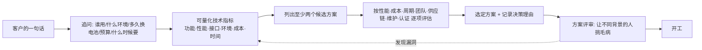

# 12.1 需求分析与方案选型

> **前置知识**：[0.1 嵌入式岗位图谱](../00-导读/01-嵌入式岗位图谱.md) · [2.1 单片机平台选型](../02-MCU与体系结构/01-单片机平台选型.md)
>
> **掌握标准**：拿到一个模糊的需求时，能把它拆成可执行的技术指标，并据此做出有理有据的方案选择（而不是"我会什么就用什么"）
>
> **对应岗位**：嵌入式软件工程师 · 系统工程师 · 硬件工程师 · 项目负责人 · 方案公司工程师
>
> **练手建议**：把你手上正在做或想做的项目，写一份一页纸的需求文档：功能清单、性能指标、成本上限、时间约束，然后列出至少两个可选方案并说明你选哪个、为什么

## 为什么这一步最容易被跳过，也最贵

学生做项目，通常是这样的节奏：先买一块板子，边做边加功能，觉得不好再改。整个过程没有"需求"这个概念，也没人问你为什么这么做。这种方式在学习阶段完全没问题，甚至值得鼓励——因为它的目的是学会，不是交付。

但产品不是这样。一个已经开了模具、贴了几千片板、写进了合同的产品，改一次需求意味着什么？可能是重新投板、重新做认证、重新写测试用例、重新培训产线。**方向错了，后面所有的努力都不是"打折"，而是"清零"。**

这也是为什么"需求分析"和"方案选型"被放在第 12 章的第一篇。它不教你任何新技术，但它是所有技术工作的起点。跳过它的代价，往往要到项目后期才暴露出来——而那时候，改不动了。

新人最容易犯的错，是把"我会什么"当成"该用什么"。会 STM32 就用 STM32，用过 ESP32 就上 ESP32，看上去是效率，实际上是把项目的约束替换成了自己的舒适区。**选型要回答的问题是"哪个方案最合适"，不是"哪个我最熟"。**

## 需求的三个层次

客户来找你，说的大概率是一句话：

> "我想要一个能自动浇花的设备。"

这句话是**需求的第一个层次：客户说的**。它是真实的诉求，但它不可执行——你没法拿它去写代码、去选芯片、去报价格。

要把它变成能干活的东西，中间还隔着两层。

**第二个层次是技术指标。** 同样是"自动浇花"，往下问几轮，会得到完全不同的东西：续航要 6 个月还是 6 天？土壤湿度测到 ±5% 还是 ±20% 就够？单台整机成本上限 50 元还是 500 元？要不要联网、要不要手机 App、要不要支持多盆？每答一个，方案的空间就收窄一圈。

**第三个层次是隐含约束。** 这一层最容易被漏掉，也最容易在后期爆炸：设备装在浴室里（高湿、有水汽）、要出口到欧洲（要过认证）、用户是老人（操作不能复杂）、坏了要能寄回来修（结构要能拆）、电池要用户自己换（不能是焊接的）。这些条件客户不会主动说，因为它们在他眼里是"理所当然"，而在你眼里可能是决定性的。

**从"客户说的一句话"到"能开工的技术指标"，中间那一段工作，就是需求分析。** 它不是填表格，是不断追问"到底要什么"和"什么情况下算不行"。

## 把模糊需求变成可量化指标

把模糊变清晰，靠的是问问题。下面这些问题几乎适用于所有项目，问完一轮，需求基本就成形了：

- **谁是用户，怎么用**：是专业运维人员还是完全不懂技术的普通人？他每天会碰这个设备几次？
- **用在什么环境**：室内还是室外？温度范围？湿度？有粉尘吗？有振动吗？有强电磁干扰吗？
- **电源怎么来**：市电、电池还是太阳能？电池的话，多久换一次？换电池是用户自己换还是返厂？
- **通信要不要**：本地显示就够，还是要远程看数据、远程控制？要联网的话用什么网络？
- **坏了怎么办**：能不能现场修？是否必须返厂？返修期间业务能不能停？
- **预算多少**：单台 BOM 成本上限是多少？这是整机成本还是只算核心板？
- **什么时候要**：有几台？什么时候要第一批？后面还会不会追加？
- **要不要认证**：卖到哪里？有没有强制认证要求？

其中**必须问清楚、问不清楚就不要开工**的，是下面这六项。它们的共同点是：**都会在后期"改不动"**，所以必须在开工前定下来。

| 指标 | 为什么必须问清 | 影响什么 |
|---|---|---|
| **数量** | 10 台和 10 万台是两种完全不同的做法 | 是否值得开模、是否值得做工装、用什么烧录方案 |
| **成本** | 决定方案的天花板 | 选什么芯片、用几层板、要不要用国产替代 |
| **环境** | 决定器件的等级和保护设计 | 温度等级、防护等级、接口保护、密封方式 |
| **寿命** | 决定电源和器件选型 | 电池容量、低功耗策略、电解电容的取舍 |
| **认证** | 决定能不能卖 | 无线认证、安规、EMC 设计、认证周期 |
| **维护方式** | 决定软件必须提供什么能力 | 要不要 OTA、要不要留串口、要不要远程日志 |

**一个务实的提醒**：这些问题问出去，客户未必答得上来。答不上来的时候，不要停在那里等——**你自己先给出一个合理的假设，写明"暂按 XXX 处理"，然后继续往下推进**。V1 的意义就是把假设摆到台面上，让它在评审时被质疑、被修正。最怕的不是假设错了，是假设藏在某个人脑子里，谁都不知道。

## 需求文档该包含什么

小项目不用写正式文档，但"写下来"这个动作不能省。**写在纸上的目的不是给别人看，是逼自己把含糊的地方想清楚**——很多人是写到一半才发现"这个参数其实我根本没定"。

一份够用的需求文档，下面六块就够：

| 部分 | 写什么 | 例子 |
|---|---|---|
| **功能清单** | 设备必须能做什么，按优先级排 | 定时浇水、湿度触发浇水、缺水报警 |
| **性能指标** | 每个功能要做到什么程度 | 湿度测量精度 ±5%、响应时间小于 1 秒 |
| **接口定义** | 对外有什么接口、和谁对接 | 4~20mA 输出、RS485、手机 App、云平台协议 |
| **环境条件** | 使用与存储的环境范围 | 工作温度 -10~50℃、IP54、浴室高湿环境 |
| **成本约束** | BOM 上限、开发预算 | 单台 BOM 不超过 50 元（不含外壳） |
| **时间节点** | 关键里程碑 | 打样 3 周、小批 6 周、认证 8 周 |

**功能清单一定要标优先级。** 因为项目几乎一定会延期，延期的时候必须砍功能——砍哪个取决于优先级，而不是取决于"哪个已经写了一半"。没有优先级的清单，等于没有清单。

## 方案选型的评估维度

需求确定之后，接下来是"用什么做"。这一节是整篇最实用的部分：**无论做硬件还是做软件，你都会反复用到这套维度。**

| 维度 | 要问的问题 | 常见陷阱 |
|---|---|---|
| **性能是否够用** | 主频、算力、内存、外设够不够，有没有留余量？ | 卡着上限选，后期加个功能就跑不动 |
| **成本** | BOM 成本 + 开发成本 + 长期维护成本 | 只算 BOM，不算开发和维护 |
| **开发周期** | 这个方案多久能出第一版？ | 为了省 3 元 BOM，多花两个月开发 |
| **团队能力** | 团队里有人会这个平台吗？生态资料够吗？ | 用冷门平台，卡住了没人能帮 |
| **供应链** | 器件好不好买？交期多久？会不会停产？ | 选了一颗年底停产或常年缺货的料 |
| **可维护性** | 三年后还能改吗？代码和工具链还能用吗？ | 用了厂商自己的私有工具链，锁死 |
| **认证要求** | 这个方案能不能过认证？ | 无线方案没选带认证的模组，后期重做射频 |

**性能这一项要单独说一句：不是越高越好，而是"够用 + 留余量"。** 留余量的意义是给后期需求变更留出空间——项目中后期加一个功能是常态，如果你的算力已经用到 90%，任何新需求都会变成一次重新选型。

**成本这一项也要说清楚，"成本"从来不等于 BOM。** 一个便宜但需要两个月开发的方案，和一个贵一点但一周就能跑的方案，在真正的项目里往往后者更划算，因为开发工时、返工风险、上市时间都是钱。这一点在消费电子里尤其明显：**省下的物料钱，可能还不够付加班费。**

### 几个具体的选型决策

**MCU 选型**。主要看主频与内核（够不够跑算法）、外设（几路串口、几路 ADC、要不要 CAN、要不要 USB）、封装（引脚够不够、好不好焊、需不需要手工返修）、价格与供货（有没有替代料、交期可不可控）。详细的方法在 [2.1 单片机平台选型](../02-MCU与体系结构/01-单片机平台选型.md) 里，这里只强调一条：**封装和供货这两项，新人最容易忽略，也最容易在量产时翻车。**

**通信方案选型**。有线（RS485、CAN、以太网）还是无线（WiFi、蓝牙、LoRa、蜂窝）？要看传输距离、数据量、是否需要组网、功耗预算、要不要认证。具体对比见 [7.3 无线通信模块](../07-通信与物联网/03-无线通信模块.md)。**一个常被忽略的点：无线方案如果不想自己做射频认证，就选已经带认证的模组，而不是自己从裸芯片画起。**

**电源方案选型**。线性还是开关？几路电源？上电时序要不要控制？效率和发热能不能接受？电池供电还要算功耗预算——**功耗预算要在选型阶段就算，不能等到发现"电池用不到一周"再回头改**。相关方法见 [10.3 电源设计](../10-硬件电路与PCB/03-电源设计.md)。

**是否上 RTOS**。任务多不多、有没有实时性要求、并发复杂度高不高？如果只有一两个任务、逻辑简单，裸机的状态机完全够，上操作系统反而增加复杂度和内存开销。判断标准见 [4.1 RTOS 概述与裸机局限](../04-实时操作系统/01-RTOS概述与裸机局限.md)。**别为了"显得专业"上 RTOS，也别因为"怕复杂"而在该上的时候硬扛裸机。**

## 选型的常见误区

**误区一：用自己熟悉的，而不是最合适的。**"我会 STM32 所以用 STM32"，"我以前用 ESP32 挺好，这次也用它"。熟悉意味着效率，但项目要满足的是需求，不是你的习惯。**正确的做法是：先按需求筛出可行方案，再在可行方案里优先选自己熟悉的那个**——顺序反了，就是在拿项目迁就自己。

**误区二：过度设计。** 用 M7 内核做点灯，用 4 层板做只有几个元件的电路，用 RTOS 跑一个状态机，用 32 位 MCU 做一颗 8 位机就能完成的事。过度设计不只是浪费钱，还会带来更多需要调试的东西——**复杂度本身就是要花成本去管理的**。

**误区三：只算 BOM 不算开发成本。** BOM 便宜 5 元，但需要多写三个月代码、多招一个会这个平台的人，这笔账要一起算。

**误区四：忽略供货和国产化要求。** 选了一颗交期半年的料，或者一颗已经进入停产（EOL）流程的芯片，量产时会非常被动。**有些行业还有明确的国产化比例要求**，这一条如果没在选型阶段问清楚，后期可能整个方案作废，替代方案见 [10.6 打样量产与国产替代](../10-硬件电路与PCB/06-打样量产与国产替代.md)。

**误区五：不做记录。** 半年后有人问"当初为什么不用另一个方案"，没人答得上来。**决策理由要写下来**——不是为了追责，是为了下一次选型时不必从零开始，也为了防止自己重复踩同一个坑。

## 方案评审的价值

一个人拍板，问题在于**盲区是看不见的**——你看不到自己想不到的东西。而评审的价值，就是把不同背景的人凑到一起，让他们从各自的角度挑毛病。

一个有效的评审，通常能问出这几类问题：

- 软件的人问：这个器件有驱动吗？中断资源够吗？我要为它写多少代码？
- 硬件的人问：这个接口电平匹配吗？功耗算过吗？封装好焊吗？
- 采购的人问：这料好买吗？交期多久？有替代吗？
- 测试的人问：这个指标怎么测？测不过怎么判定？
- 项目的人问：这个方案要多久？有没有更快的路？

**这些问题没有任何一个需要"专家"才能提出来，但它们合在一起，往往能挡住项目后期最贵的几类错误。** 评审不需要正式会议室，四五个人围着白板聊半小时就有价值。小团队里，至少要保证"做硬件的人和写软件的人一起看过方案"——很多灾难性设计，就来自这两拨人各干各的、谁也没跟对方对过。

## 需求一定会变，问题是怎么变

需求在项目进行到一半时增加，几乎是必然的。**不要把"需求变更"当成意外，它是常态。** 真正要防的不是变更本身，而是"变更悄悄发生、没人知道、事后才发现对不上"。

几个务实的做法：

**第一，变更要能被看见。** 需求文档改了就改一行，但要让相关的人都知道。最糟的情况是硬件按旧需求画完板子，软件按新需求写完代码，两边对不上——这时候谁都没错，但项目废了一半。

**第二，每次变更都要评估影响，而不是只评估工作量。**"再加一个传感器"看起来只是多写一段驱动，但它可能意味着：多一路 ADC、改一下引脚分配、功耗预算重算、续航掉一截、可能要重新投板。**影响评估要覆盖硬件、软件、成本、时间四条线。**

**第三，区分"必须加"和"可以排到下一版"。** 这又回到了前面说的优先级清单——有优先级的清单，让"砍哪个"变成一个可以讨论的问题；没有优先级的清单，让每一次变更都变成一次争吵。

**第四，改不动的时候要敢说不。** 项目到了后期，硬件已经投产、认证已经排期，这时候一个"顺手加个功能"的请求，代价可能是整个项目延期。**把代价清楚地讲出来，让提需求的人自己判断值不值**——这是工程师该做的事，不是"不配合"。

## 一个务实的提醒

最后说清楚一件事：**小项目不必写正式文档。** 你一个人做个小玩具，写一份需求规格说明书是浪费时间。

但 **"想清楚要做什么、为什么这么做"这件事不能省**。哪怕只是记事本上写三行：要做啥、给谁用、花多少钱。因为这三行会拦住你后面最贵的几类返工——做了一半发现方向错了、做完了发现成本超了、交付了发现用户根本用不了。

**判断自己有没有做好这一步，有个很简单的检验方法：你能不能用一句话说清楚"这个项目成功了是什么样"。** 说不出来，就说明需求还没想清楚。而需求没想清楚的时候，写再多代码也只是在给一个不确定的方向加码。

## 学习建议

1. **先做一次复盘**：把你手上正在做的项目，试着倒推出它的需求文档。你会发现有些指标你根本没定过，是"边做边凑"凑出来的——这正是这一步的价值所在。
2. **练习追问**。找一个人（同学、同事、朋友）说一句模糊的需求，你连问十个问题，看能不能问出量化指标。这个能力比任何工具都重要。
3. **每次选型都写"决策记录"**：候选方案、评估维度、选了哪个、为什么。三五行就够，半年后你会感谢自己。
4. **不要一开始就追求"最优方案"**。绝大多数项目里，"够用 + 能按期交付 + 后期能改"比"性能最好"更重要。
5. **面试中被问到"为什么用这颗芯片"时，答案应该是需求，不是习惯。** 这一条几乎是区分"学过"和"做过"的经典问题，值得提前想清楚。

## 小节总结

需求分析与方案选型是整个项目里**最便宜、也最贵的环节**：便宜在于它几个小时就能做完，贵在于它错了之后，后面所有的努力都要清零。学生项目可以边做边改，产品不行——这就是为什么这一篇是第 12 章的第一篇。（注意区分"篇序"和"通读顺序"：通读顺序上建议先从 [12.2 数据手册阅读方法](02-数据手册阅读方法.md) 开始，理由见本章目录页。）

需求不是"客户说的那句话"，而是它下面藏着的技术指标和隐含约束。把模糊变清晰的唯一办法是追问，而追问要覆盖的六项（数量、成本、环境、寿命、认证、维护方式）有一个共同特点：**它们都是后期改不动的**。所以它们必须在开工前定下来，定不了就明写假设，而不是绕过去。

方案选型要评估的是七个维度，其中新人最容易搞错的两个是：把"我会什么"当成"该用什么"，以及只算 BOM 不算开发成本。**正确顺序永远是先按需求筛出可行方案，再在可行方案里挑自己熟悉的那一个。**

最后，评审的价值在于补盲区，决策记录的价值在于防重复踩坑。这些动作都不重，但它们决定了你是"一个人埋头做出来"，还是"带着团队把产品交出去"——**这两者之间的差距，往往就是普通工程师和项目负责人之间的差距。**

---

本章目录：[12. 工程素养与交付](README.md) ｜ 总目录：[返回首页](../../README.md)
上一篇：[12. 工程素养与交付](README.md) ｜ 下一篇：[12.2 数据手册阅读方法](02-数据手册阅读方法.md)
