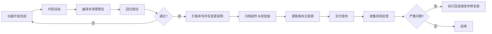

# 12.3 文档、评审与版本发布

> **前置知识**：[3.3 Git 与代码托管](../03-嵌入式软件工程/03-Git与代码托管.md) · [3.1 代码架构与分层设计](../03-嵌入式软件工程/01-代码架构与分层设计.md)
> **掌握标准**：知道一个嵌入式项目该产出哪些文档、评审该怎么开、版本该怎么发，并能说清"没有文档的项目"会付出什么代价
> **对应岗位**：嵌入式软件工程师 · 系统工程师 · 项目负责人 · 汽车电子工程师 · 医疗设备软件工程师
> **练手建议**：给你的项目补三份文档：一份接口说明（模块对外提供什么）、一份版本记录（每个版本改了什么）、一份问题清单（发现的问题和解决状态）

这三件事——写文档、开评审、发版本——学校课程里几乎不教，自学时也很少有人主动去补，但工作中天天要做。它们不产生任何新功能，所以新手本能地排斥；但一个项目能不能活过三个月，基本由它们决定。这一篇的立场可以概括成一句话：**代码决定项目能不能跑起来，文档、评审和版本发布决定项目能不能活下去。**

## 为什么工程师讨厌写文档，项目却离不开它

讨厌写文档的理由通常很实在：代码是给自己看的，写完就懂了；文档是给别人看的，写的时候感觉在浪费时间。这个判断在"只有我一个人做、明天就做完"的项目里成立，在其余所有情况下都不成立。具体是这几种情况逼着你必须写：

**迭代周期一长，自己就是那个"别人"。** 三个月后你回头看自己写的模块，能想起来的只有"这里当时好像绕过什么坑"。很多人有过这种经历：改一个自己半年前写的东西，要先花两个小时读代码把自己读明白。**这两个小时就是没写文档的成本，只是它来得晚，所以没人把它算在写文档的账上。**

**人员流动。** 有人离职、有人换组、有人来实习。新人接手一个没有文档的项目，唯一能做的就是追着原作者问——如果原作者还在的话。

**回归排查。** 客户反馈"上次还好好的，这版不行了"。你要回答哪个版本改了什么、当时为什么改，才能定位。没有版本记录，这个问题只能靠猜。

**交付验收。** 客户、甲方、集成商验收时要的不是你的源码，是"你怎么证明这个东西符合要求"。需求文档、测试报告、接口说明，一份都不能少。

**认证要求。** 功能安全（汽车的 ISO 26262、医疗的 IEC 62304）和行业认证会直接把文档列为审核项，缺文档就不发证。这类项目里，文档不是可选项。

所以写文档不是因为"规范要求"，是因为**它是给未来的自己和接手的人留下的证据**。理解这一点之后，"该写多少"这个问题的答案就自然出来了。

## 一个项目该有哪些文档

下面按"最小必要"到"完整交付"排列，越往上越是刚需：

| 文档 | 里面写什么 | 什么时候必须有 |
|---|---|---|
| **软件接口文档** | 模块对外提供哪些函数、参数含义、返回值、调用约束 | **任何超过一个人的项目** |
| **接线说明** | 板子怎么连、接口怎么接、跳线/拨码开关怎么设 | 任何有硬件的东西 |
| **版本记录** | 每次发布改了什么、为什么改 | 任何会被多次烧录的东西 |
| **问题清单** | 发现了什么问题、当前状态、谁在跟 | 任何活过一周的项目 |
| **需求文档** | 要做什么、做到什么程度算完（见 [12.1 需求分析与方案选型](01-需求分析与方案选型.md)） | 有外部交付对象时 |
| **硬件文档** | 原理图、PCB、BOM、器件选型理由 | 硬件项目标配 |
| **寄存器/协议手册** | 自定义协议的帧格式、字段含义、异常处理 | **只要涉及自定义协议就必须有** |
| **测试报告** | 测了什么、怎么测的、结果如何、遗留问题 | 交付/认证前 |
| **用户手册 / 安装说明** | 最终用户怎么用、怎么装 | 面向最终用户的产品 |

关于**软件接口文档**，多说一句：它是所有文档里性价比最高的一份——一份好的接口文档，能让接手的人不读一行实现就正确调用你的模块。反过来，如果别人必须先读你的实现才能用，说明这份文档没写或者写废了。

关于**自定义协议**，有个坑必须点出来：**协议是双方的事，所以协议文档必须是一份双方共同认可的文件，而不是代码里的注释。** 常见的事故是上游改了一个字节的含义，下游不知道，联调时两边对着抓包数据互相怀疑。**协议文档的规矩是：改协议先改文档，再改代码。** 至于 **BOM**（物料清单，Bill of Materials），它属于生产环节，见 [12.5 生产交付与 BOM 管理](05-生产交付与BOM管理.md)，这里只提一句：**它的错误代价是钱**，所以维护规矩比代码还严。

## 文档写多少才够

这是最实际的问题，也是最容易走偏的地方。**判断标准不是"完整"，是"新人接手能不能跑起来"。** "完整"是个无底洞：按完整标准，你得写需求规格、详细设计、模块设计、流程图、状态机图、每个函数的说明……一套下来两个月，而且写完就过期，所以大部分团队根本不会这么干。真正管用的标准就一句话：**把项目交给一个没参与过的同事，他能不能在一周内把东西跑起来、改出一个功能。** 做不到就说明缺文档，做得到就算文档齐全，哪怕只有三页。

在这个标准下，**有三份文档任何项目都该有：接口说明**（每个模块对外提供什么、怎么调）、**接线说明**（线怎么接、电源多少伏、跳线怎么设）、**版本记录**（每版改了什么）。

这三份的共同点是：**它们都是"接手时第一时间要看的东西"**。接口和接线让人能把东西跑起来，版本记录让人知道自己手里是哪一版、和上一版差在哪。其余文档都是在这三份的基础上，按项目性质往上加。反过来，以下这些东西**不用写**：不用给每个函数写文字说明（好代码加好注释已经说明白了），不用为一次性的测试脚本写设计文档，也不用把会议纪要当成项目文档维护。**省略不是偷懒，是把时间留给真正会被反复查的那几页。**

## 文档放在哪、怎么维护

这一节只有一条原则：**文档和代码放在一起，用 Markdown（纯文本标记语言，就是你现在读的这种格式）写，随代码一起提交到 Git。** 三条理由：**放在一起才不会分散**——文档放进网盘、聊天群、某个同事的电脑，等同于不存在，而放进仓库目录里，看代码的人顺手就能看到；**能 diff（比差异）才有人敢改**——Markdown 是纯文本，改了一句话 Git 就精确显示改了哪句，而 Word 文档改了什么只能靠肉眼比；**随代码提交，"过期"才看得见**——改接口的提交里同时改文档，评审的人一眼就能看出两者对不对得上。

由此引出这一节最重要的判断：**文档过期比没有文档更危险。**

没有文档，新人知道自己不懂，会去问、会去读代码；文档过期而没人知道它过期，新人会照着它做，一路做错，而且错的每一步都有"文档支持"。**一份没人维护的文档，是一份随时会把人带沟里的文件。** 所以文档维护的规矩应该和代码一样硬：**改接口必须同时改文档，同一份提交里改完；文档写不动了，就把它删掉，不要留着。**

顺便说一句 README——仓库首页那个文件，其实是全项目最重要的一页：它的作用是让第一次点进来的人在三十秒内知道这个项目是什么、怎么编译、怎么跑起来。

## 注释和文档的边界

这两样经常被混在一起说，其实分工很清楚：**注释解释"代码本身"**——这段逻辑为什么这么写、这个魔数（代码里出现的没有解释的常数）是什么含义、这个判断在绕哪个坑，它服务于正在读这段代码的人；**文档解释"模块之间的关系"**——这个模块对外提供什么、和谁交互、数据往哪流，它服务于正在使用或集成这个模块的人。

一个实用的检验方法：**注释删掉，代码应该看不懂；文档删掉，调用方应该不会用。** 如果删掉注释后代码依然清晰，说明这段注释是废话；如果删掉文档后调用方照着签名猜也能用，说明这份文档没提供额外信息。

还有一个反复出现的误区：把文档写成代码的翻译。**"这个函数先判断参数是否为空，然后循环遍历数组"——这种文档没有任何价值**，读代码两秒钟就知道。有价值的是**代码里看不出来的东西**：这个接口在什么时机调用、并发调用安全不安全、超时了会发生什么、参数传错会不会死机。**文档该写的是"约束"和"契约"，不是"实现过程"。**

## 评审：最便宜的找 bug 手段

代码评审（Code Review）指的是别人读你的代码并提出意见。它是所有找 bug 的手段里性价比最高的一个——比测试早，比调试省，而且顺带把知识传播了。

**为什么自己看自己的代码没用？** 因为写代码时你脑子里有一套"我以为的流程"，读自己的代码时你会自动按那套流程去读，跳过的恰好是写错的地方。别人没有这套预设，只能照着代码字面意思理解，于是错误就暴露了。这就是所谓的盲区：**盲区不是你"不够仔细"，是你根本不知道那里存在另一种可能。**

评审还有一层容易被忽略的价值：**它是新人成长最快的场合。** 一个新手看老手怎么写错误处理、怎么划分模块、怎么命名，比读十篇教程都管用。反过来，老手从新手的提问里也常能发现自己"一直这么写但没想过为什么"的地方。

## 评审看什么

评审最容易滑向两个极端：要么只挑缩进和空格（成了格式检查），要么漫无目的地从头看到尾（看不出重点）。正确的做法是**按优先级看**，前面几条没问题再看后面：

| 优先级 | 看什么 | 典型问题 |
|---|---|---|
| 1 | **接口设计是否合理** | 参数太多、语义不清、调用方必须知道内部实现才能用 |
| 2 | **边界条件是否处理** | 数组越界、除零、空指针、数据为 0 或最大值、长度刚好用满 |
| 3 | **错误路径是否覆盖** | 只写了成功分支；出错时直接返回，没有清理资源 |
| 4 | **并发是否有保护** | 中断和主循环共享的变量没加保护、标志位没做成原子操作 |
| 5 | **资源是否泄漏** | 申请的内存没释放、文件句柄没关、定时器/外设没关 |
| 6 | **命名与风格是否一致** | 同一个东西三个名字、风格和项目其他部分不一样 |

这一排顺序有讲究：**接口错了要重写，边界错了要出 bug，命名错了只是看着别扭。** 评审的时间和注意力有限，把它花在前面几项上，收益高一个量级。第 6 项如果项目已经配了静态分析工具和格式检查，可以完全交给机器，人不用管。

## 评审怎么做才有效

几个经过验证的做法：**小批量提交**——一次评审改动两三百行，人还能认真看；一次评审两千行，评审的人只会点"通过"，所以一个改动能拆成几个独立的小提交就拆开，这是提高评审有效性最直接的一招；**给出检查清单**——上表就可以直接拿来当清单，有清单的评审比"你帮我看看"有效得多，后者全看评审人当天状态；**对事不对人**——"这里有问题"和"你怎么又写错了"收到的是完全不同的反应，前者能继续讨论技术，后者会让人开始防御，评审就废了。

还有两条同样重要：**评论要能被讨论，而不是只能执行**——好的评审意见会说明理由（"这里如果长度是 0，下面的 memcpy 会怎样"），而不是下命令（"改成 if 判断"），因为**评审人也会犯错，无条件执行的评审反而会引入新的 bug**；**区分"必须改"和"建议改"**——阻塞性问题和风格偏好分开标注，作者才分得清哪些是发布前必须处理的。

## 方案评审比代码评审更重要

这一条必须单独讲：**代码评审再认真，也只能发现"实现写错了"，发现不了"方向选错了"。**

方案评审发生在动手写代码之前，讨论的是接口怎么划、数据怎么流、模块之间怎么解耦、要不要上 RTOS、这个功能该放中断还是放主循环。**代码写错了改一行，架构选错了要重写一遍。** 所以成熟的团队在方案上的评审投入往往比代码上还多。方案评审最该问的其实是三个问题：**这个设计解决了什么需求**（说不清对应哪条需求的模块，可能根本不该存在）、**如果需求变了哪部分要改**（要改的越少，设计越好）、**这个方案最可能在哪里出问题**（提前把风险说出来，比事后补救便宜得多）。

另外几类评审的关注点各有侧重：**设计评审**看结构划分和接口一致性；**硬件评审**看电源余量、保护电路、封装与焊接可行性、器件是否在售（详见 10、11 章的硬件篇目）；**测试评审**看测试用例是否覆盖了你没测过的那部分——**只测自己写过的路径，等于没测。**

## 个人项目怎么办

上面这些做法大多依赖"有别人"。一个人做项目时，可以这样替代：

**隔一天再看自己的代码。** 这是成本最低也最有效的自我评审。当天写的代码当天看，怎么看都对；隔一天再看，脑子里的那套预设已经淡了，写在明面的问题就会跳出来。**原理和"别人看你的代码"是同一个：让读的人不再共享你的预设。**

**用工具代替一部分人工检查。** 编译器警告开到最严、静态分析工具跑起来、格式工具自动检查。这些工具能覆盖掉评审清单里第 5、6 项的大部分内容，把人的注意力省下来看前面几项。工具的用法见 [3.4 代码规范与静态分析](../03-嵌入式软件工程/04-代码规范与静态分析.md)。

**找个人互相看。** 两个人各自负责不同的模块，交换评审。哪怕对方不完全懂你的领域，"这段代码我看不懂它要干什么"这句话本身就很有价值——**看不懂通常意味着代码或文档有问题，而不是读者水平不够。**

**最后给一个诚实的提醒：评审文化差的公司，代码质量通常也差。** 一个团队如果从来不评审、评审只是走流程、或者评审就是挑格式，它的代码里大概率积累着一堆没人知道的历史问题，接手的人会过得很痛苦。**所以面试时可以直接问："你们有 Code Review 吗？怎么开？"** 这是个很好的反向提问——既显得你真的做过项目，又能帮你判断这家公司值不值得去。

## 版本号怎么编

版本号不是随便起的名字，它是对使用者的一个承诺。行业里最通用的约定是**语义化版本**，格式是「主版本.次版本.修订号」，比如 2.3.1：

| 位置 | 什么时候加一 | 使用者要理解成 |
|---|---|---|
| **主版本** | 有不兼容的改动（接口变了、协议变了、旧配置不能用） | **必须重新适配，不能直接换** |
| **次版本** | 新增了功能，但旧功能照常能用 | 可以放心升级，有新增能力 |
| **修订号** | 只修了 bug，没有新功能也没有接口变化 | **可以直接换，风险最小** |

这个约定真正的价值不在于数字本身，而在于**读到一个版本号就能判断升级的风险**。看到修订号变了，运维可以直接换；看到主版本变了，就得先评估影响。**如果没有这个约定，每次升级都要重新评估，这就是版本号存在的意义。**

另外两种标记也要知道：**预发布版本**用 `-rc1`、`-beta2` 这类后缀，表示"能用但没最终验证"，正式发布时去掉后缀；**内部版本/构建号**通常是每次自动编译递增的一串数字，用来区分"同一天编出来的好几个固件"，它不进对外的版本号。

嵌入式还有个常见做法：把版本号编进固件，运行的时候能读出来。**这个做法强烈建议加上**——当客户反馈问题时，你能让他报出确切版本，而不是"我烧的是最新那版"（你并不知道他手里那版到底是什么时候的）。

## 一个版本发布要包含什么

发布不是"把 hex 文件发过去"。一个完整的发布包应该包含六样东西：

1. **固件二进制**——按型号/硬件版本分开，别只发一个通用文件。
2. **版本号**——和固件里编进去的那个一致。
3. **校验值**——通常是 CRC（循环冗余校验）或哈希值，用来确认文件传输过程没出错。
4. **变更说明**——这个版本改了什么、修了哪些问题、有没有已知缺陷。
5. **烧录方法**——用什么工具、接哪里、要不要先擦除、有没有特殊步骤。
6. **回滚方案**——出问题了怎么退回上一版。

第 3 项经常被跳过，但它在实际交付中很关键：**固件从你的电脑到客户手里，中间要过聊天软件、邮件、网盘、U 盘。** 一次传输错误就可能导致客户烧进去一个损坏的文件，然后两边花两天排查"为什么设备行为不对"。**给一个校验值，三十秒就能排除一整类问题。** 第 6 项的理由见下一节。

## 发布前检查清单

这一节最实用，可以直接抄成一张表贴在工位上。**每一条都对应一类真实发生过、而且重复发生的事故：**

| 检查项 | 不检查会怎样 |
|---|---|
| 版本号改了吗 | 出了问题和上一版分不清，变更说明也就失去了意义 |
| 编译有警告吗 | 警告里混着真 bug（未初始化变量、类型截断、函数少返回值） |
| 关键功能回归测试做了吗 | 修好一个问题、弄坏另一个，是最高频的发布事故 |
| 升级和回滚都测了吗 | 只能升不能退，出问题就现场僵住 |
| 配置参数是出厂值吗 | 带着调试用的参数发货，客户设备行为异常 |
| 日志级别合适吗 | 调试日志刷爆串口，拖慢实时任务甚至丢数据 |
| 调试代码和后门清了吗 | 测试用的固定密码、跳过校验的分支、隐藏命令流到客户手里 |
| 编译器优化等级和发布配置一致吗 | 调试时用的配置和正式发布的不是一套，行为不一样 |
| 有没有把不该带的东西打进固件 | 测试用的密钥、内网地址、个人信息 |

这张表里最值得强调的是**最后三项**。功能问题通常会在测试阶段暴露，而"调试后门没清掉"这类问题**不会在测试阶段暴露，因为测试的时候你正需要它。** 它只会在产品出去以后，被某个有心的人发现。**发布前的最后一步，应该专门花十分钟检查这一类"测试期有用、发布后可要命"的东西。**

## 可追溯与回滚

**发出去的每一个固件都必须可追溯**：哪个版本、什么时候发的、发给了谁、改了什么。

这不是流程洁癖，是排查的前提。客户报问题时的第一句话永远是"我这边不对"，你需要的第二句话是"你手上是哪一版、什么时候拿的"。不知道这两个信息，排查就无从下手。让这一条落地其实只要一张表：版本号、交付对象、变更摘要、对应代码提交号。**就这么几个字段，能省掉大量扯皮。**

**回滚方案**则是另一半。**发出去发现严重问题时的实际情况是：你不可能让所有设备立刻停下来等你修。** 所以要么能退回去，要么能在现场完成升级。这两种能力都来自同一个前提：设备上有 **Bootloader**（一段独立于应用程序、负责把新固件写进去的引导程序）。它的设计、分区划分和升级流程见 [3.7 Bootloader 与 OTA 升级](../03-嵌入式软件工程/07-Bootloader与OTA升级.md)。

**这里有一条必须在设计阶段就定下来的原则：升级路径和回滚路径要在第一版就一起设计好。** 事后补的常见结局是"设备只能通过拆机接线才能刷回来"——那就等于没有回滚。

## 发布节奏

**小步快跑**：每次改动少、发布频繁。好处是问题范围小、定位快、回滚代价低；代价是管理成本高，而且每次升级都要占用客户/产线的时间，对已经交付的产品来说，频繁升级本身就是一种打扰。

**攒大版本**：攒一批改动一起发。好处是发布次数少、单次交付内容完整、对客户打扰小；代价是问题混杂在一起难以定位，改动多而回滚困难，而且发版前的时间压力会集中爆发。

选哪一种，取决于**升级的代价**：设备联网、能自动升级的，适合小步快跑；设备装在客户现场、升级一次要派人过去的，适合攒大版本。**但无论选哪种，都不该出现"没有变更说明的发布"——攒大版本的团队最容易在这里翻车：改动太多，几次之后没人说得清这一版到底包含什么。**

## 一个务实判断

如果你在做个人项目，**不必走完整流程**：不用开评审会、不用写测试报告、不用维护发布清单。但下面这三件事，**任何项目都该做，包括只有你自己的项目**：**版本号**（知道自己手里是哪个版本）、**变更说明**（知道自己改了什么、为什么改）、**保留上一个可用版本**（改崩了能退回去）。

这三件事加起来，一次不超过五分钟。它们解决的是同一个问题：**当你搞砸了的时候，还有退路。** 而这正是文档、评审、版本发布这三件事全部的意义——它们不让你做得更快，它们让你**在出错的时候不至于全盘重来。**

## 学习建议

这一篇的内容不依赖任何前置技术，但**只读不做的收益接近于零**——因为它全是习惯，而习惯只能靠动手建立。如果你完全没做过，从这三件事入手，成本极低：

1. **给现在手上那个项目加一个版本记录文件**，把已经做过的几个阶段当成版本补记上去。你会发现写的时候就能想起好几个"当时改了什么"的细节。
2. **把模块对外提供的函数整理成一份接口说明**，只写参数、返回值、调用约束。整理过程中大概率会发现自己设计的接口有些地方连自己都说不清。**这就是这一篇里最有价值的收获。**
3. **下次改代码时，先开一个独立的分支或提交，改完对照看一下差异。** 这就是自我评审的入门版本。

至于代码评审，如果你的团队还没有评审文化，或者你在做个人项目，能做的是：找一个也在写代码的人，约定互相看对方的代码，每次只看一个模块。**不要因为"他不懂我的领域"就放弃，看不懂本身就是信号。** 最后，面试时可以直接问对方"你们有 Code Review 吗"，这是很有效的反向提问。

## 小节总结

**这一篇讲的不是三个独立技能，而是同一个问题的三个侧面：项目如何在没有你的情况下继续。** 文档解决"别人怎么接手"，评审解决"错误在哪里被发现"，版本发布解决"出问题怎么退回来"。三者都指向同一件事——**降低项目对某个具体的人的依赖。**

**文档的标准是"能接手"，不是"够完整"。** 接口说明、接线说明、版本记录这三份是底线，其余按需要加。判断一份文档该不该写，就问一句：它会不会被反复查。会被反复查的必须写，只查一次的不值得写。而**过期文档比没有文档更危险**，所以文档要么跟着代码一起维护，要么干脆删掉。

**评审按优先级看，效率差一个量级。** 接口设计和边界条件排在最前，格式和风格排在最末（那部分交给工具）。方案评审比代码评审更重要，因为方向错了改不回来。个人项目用"隔一天自己看"替代，效果比想象的好。

**发布的本质是把一个"可追溯、可回滚"的东西交出去。** 版本号、校验值、变更说明、回滚方案缺一不可，发布前那张检查清单里最容易被忽略的是"调试后门有没有清干净"——因为这一类问题的特点是测试时发现不了。而升级和回滚路径必须**在设计阶段就一起规划**，事后补的基本等于没有。

**最后，这三件事都有成本，所以要做减法，但减不减到零。** 个人项目砍掉流程、砍掉评审会没问题，**"版本号 + 变更说明 + 保留上一个可用版本"这三条不能砍**——它们是你搞砸之后唯一的退路。工程素养的高低，很多时候不体现在顺风顺水时做得多好，而体现在出事时有没有退路可走。

---

本章目录：[12. 工程素养与交付](README.md) ｜ 总目录：[返回首页](../../README.md)
上一篇：[12.2 数据手册阅读方法](02-数据手册阅读方法.md) ｜ 下一篇：[12.4 功能安全与可靠性](04-功能安全与可靠性.md)
