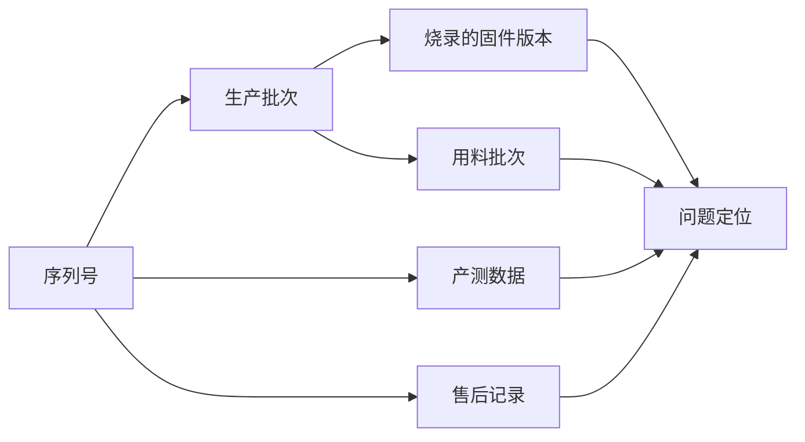

# 12.5 生产交付与 BOM 管理

> **前置知识**：[10.6 打样量产与国产替代](../10-硬件电路与PCB/06-打样量产与国产替代.md) · [3.7 Bootloader 与 OTA 升级](../03-嵌入式软件工程/07-Bootloader与OTA升级.md)
>
> **掌握标准**：知道一个产品从"我桌上这块能跑的板子"到"一千台出货"之间要经过哪些环节，以及软件工程师在其中要配合做什么
>
> **对应岗位**：嵌入式软件工程师 · 硬件工程师 · 产品工程师 · 测试工程师 · 项目负责人
>
> **练手建议**：给你的项目整理一份 BOM 表（型号、封装、数量、单价、供应商、是否常用料），并把所有需要写入的"一机一参数"（序列号、密钥、校准值）列出来，设计一个写入方案

## 从原型到量产的鸿沟

你桌上那块板子能跑了——上电、联网、数据上报、按键响应，全都正常。这时候人的第一反应是"做完了"。

但真正的工程里，这只是走完了**一半**，而且是比较容易的那一半。

原型阶段有很多"特权"：可以飞线、可以手工校准、可以用热风枪补焊一下、可以在代码里写死一个只适用于这块板子的参数、可以说"这块板子比较特殊"。这些做法在原型阶段完全合理，甚至是效率的关键。

**但量产阶段，这些特权全部消失。因为量产的核心要求只有两个字：可重复。**

- 产线上的工人不能"手工校准"，他只能按作业指导书操作，而且必须每台都一样。
- 不能有"这块板子特殊"，一千台板子必须能被同一份固件、同一套流程处理。
- 不能靠"我记得当时是这么弄的"，所有信息必须写在能被别人看懂的地方。

**鸿沟就在这里：原型能跑，靠的是你的经验和临场处理；量产能跑，靠的是流程和文档。** 从前者到后者，需要的不是更强的技术能力，而是把"你脑子里知道的东西"变成"别人照着做就能复现的东西"——这才是这一篇真正要讲的事。

## BOM 是什么，软件工程师为什么要关心

**BOM（Bill of Materials，物料清单）** 是产品所有物料的清单。它至少包含这几列：

| 列 | 内容 | 常见问题 |
|---|---|---|
| **位号** | 元件在板上的编号（R1、C5、U2） | 位号与实物不符，产线贴错 |
| **型号** | 具体到后缀的完整型号 | **只写大类，买了不对的规格** |
| **封装** | 0603、LQFP48、SOP-8 等 | 封装写错，贴片直接失败 |
| **数量** | 每块板用几个 | 漏填导致备料不足 |
| **供应商** | 从哪买 | 只有一个来源，缺货就停线 |
| **单价** | 单颗价格 | 成本核算不准 |
| **替代料** | 可以换用哪些型号 | 没写，缺料时临时找料出问题 |

很多软件工程师觉得 BOM 是硬件和采购的事，跟自己没关系。这个想法会让你在量产阶段非常被动，因为 **BOM 一变，软件常常要跟着改**：

- **器件换型号了**，寄存器地址、初始化序列、上电时序可能全都不一样。
- **换了替代料**，I2C 地址可能不同、上电建立时间可能更长、精度可能有差异。
- **换了晶振或时钟源**，所有基于时钟的延时、波特率、采样率都要重新核算。
- **温度等级或精度等级变了**，校准参数、补偿算法可能要重做。

**所以一个软件工程师至少要能做到：拿到 BOM 能看懂哪些变化会影响软件、能判断哪些改动需要重新验证。** 面试里问"你参与过量产吗"，能答出这一层的人，一眼就能看出和"只写过 demo"的人的区别。

## BOM 管理的实际坑

下面这几个坑，几乎每个走过量产的项目都踩过至少一个：

**坑一：同型号不同后缀不能混用。** 同一个系列里，后缀编码了温度等级、封装、容量、精度、是否车规。**只写"STM32F103C8T6"和只写"STM32F103"是两回事**，后者采购可能给你买回一个引脚不兼容的型号。同理，一颗"10k 电阻"可能是 1% 精度也可能是 5%，一颗"100nF 电容"可能是 50V 也可能是 16V。**规格书里要写全。**

**坑二：封装写错，贴片直接失败。** BOM 里写 0603，实际来料是 0805，贴片机就贴不上；写 LQFP48 来的是 QFN48，程序照跑，但产线停线。**封装错误是量产里代价最高的一类低级错误**，因为它通常到贴片那一刻才被发现。

**坑三：只写"常用料"导致采购困难。**"随便找个 10k 电阻"这种描述，在采购那里等于没有信息。**BOM 必须精确到可以下单的程度。**

**坑四：停产料没有替代方案。** 设计时用得好好的芯片，一年后进入停产（EOL）流程或者长期缺货。**如果 BOM 里没有替代料标注，这时候要么紧急改设计，要么高价找货。**

**坑五：BOM 和实物对不上。** 改过一版板子，BOM 忘了同步更新，产线照着旧 BOM 备料，结果少了几颗料或者多了几颗。**BOM 必须和当前版本的板子一一对应**，这属于版本管理的一部分。

## 元器件的可获得性

如果只从技术角度选型，你可能会挑一颗参数最合适的芯片。但真正决定项目能不能按期交货的，往往是**这颗料买不买得到**。

几个必须考虑的问题：

**常用料还是冷门料。**"常用料"指的是那些被大量产品使用、多家供应商都在备货的通用器件；"冷门料"是只有少数场景用、库存少、交期长的器件。**同样的功能，优先选常用料**，代价可能是参数差一点点，换来的是供应链的稳定。

**交期和最小起订量。** 有些料交期长达几个月，有些料最小起订量是几千颗起。**做一个十台的小批试产时，最小起订量可能直接决定你选哪颗料。**

**是否有国产替代。** 这几年很多行业对国产化有明确要求，同时国产替代也是应对缺货的重要手段。具体的替代思路和注意事项见 [10.6 打样量产与国产替代](../10-硬件电路与PCB/06-打样量产与国产替代.md)。**要注意的是：替代料不是"参数一样就能直接换"**，封装、引脚、时序、寄存器兼容性都要验证，软件也可能要改。

**为什么要"一颗料至少两个供应商"。** 因为单点供应意味着：那家缺货、涨价、停产、质量出问题，你的产线就得停。**双供应商不是为了省钱，是为了在出问题时还能继续交货。** 当然，双供应商本身也有代价——两家的料可能有细微差异，需要各自验证，有时候还要在软件里做兼容处理。**这个代价通常比停线的代价小得多。**

## 软件在量产环节要配合的事

这一节是重点。**下面这些事，很多软件工程师从没想过，但它们全部属于"软件该做的事"。**

### 固件版本管理：哪一批设备烧的是哪个版本

**这个必须能追溯。** 当售后反馈"某批设备有某个 bug"，你需要能立刻回答：这一批烧的是哪个版本的固件？

要做到这一点，几个基本动作：

- **每个发布版本有唯一的版本号**，写进固件里，能通过串口、显示屏或上报报文读出来。
- **烧录记录要留档**：哪一天、哪一批、烧的哪个版本。
- **固件文件本身要归档**，包括对应的源码版本和编译参数。**只留一个 .bin 文件是不够的**——半年后你想重现这个版本，得有源码和工具链。

**一个反面例子**：设备出了问题，你确认"这是固件 bug"，但没人说得清现场这台设备装的是哪个版本，只能挨个去现场升级。**有版本可读这一条，能把这类问题从"排查几天"变成"查一条记录"。**

### 烧录方案

产线用什么烧程序，是一个需要提前设计的事。常见方式：

- **脱机烧录器**：把固件放进烧录器，产线直接夹上夹具烧。优点是快、不依赖电脑；缺点是改固件要重新灌烧录器。
- **治具 + 上位机**：产线上做个测试治具，通过串口或 SWD 批量烧。适合需要同时做测试的场景。
- **通过 Bootloader 批量刷**：设备先烧一个基础固件，产线通过通信接口写入正式固件和参数。**这种方式最灵活，也最容易和产测程序整合**（相关内容见 [3.7 Bootloader 与 OTA 升级](../03-嵌入式软件工程/07-Bootloader与OTA升级.md)）。

**选哪种，核心看一个指标：烧录时间。**因为**产线是按秒算钱的**。假设每台多花 30 秒，一万台就是 83 个小时的产线工时——这笔钱往往比省下来的硬件成本高得多。**软件工程师在这里有一个很实际的优化空间：减少不必要的校验、并行化烧录步骤、把可以后置的初始化挪出烧录流程。**

### 一机一参数：必须每台不同，必须可追溯

有些东西**每一台设备都必须不一样**，或者必须在生产时写入：

| 参数 | 为什么每台不同 |
|---|---|
| **序列号** | 唯一标识，售后追溯的基础 |
| **MAC 地址 / 设备 ID** | 网络里不能重复 |
| **密钥与证书** | 安全要求每台独立，一台泄露不能影响其他设备 |
| **校准系数** | 每台的传感器偏差不同，必须单独标定 |
| **区域 / 型号配置** | 同一块板子卖不同地区、不同配置 |

**这里最容易出的事故是：所有设备用了同一个密钥、同一份证书。** 从工程上讲，这样最省事——烧一份固件就完事。但这等于把一万台设备的安全绑在一把锁上：**一台被破解，全部沦陷。** 这在安全要求高的场景里是不可接受的。

**另一个容易出的事故是：校准没做，或者做了但没记。** 传感器出厂时每台都有偏差，如果不逐台标定，你的精度指标就是纸面上的。而如果标定了却没把系数和设备绑定记录，售后返修时又得重新标一次。

### 一机一参数的写入方案对比

这是量产设计里一个很典型的权衡，值得单独列出来：

| 方案 | 怎么做 | 成本 | 安全性 | 量产效率 |
|---|---|---|---|---|
| **产测工具通过 Bootloader 接口写入** | 产线连上设备，工具逐台写入 | 低 | 中，取决于通道是否加密 | 取决于单台耗时，可优化 |
| **芯片唯一 ID + 派生根密钥** | 不预置密钥，用芯片出厂唯一 ID 在出厂时派生出密钥 | 低 | 较高，不需要传输密钥 | 高，无额外写入动作 |
| **安全芯片预置** | 用带密钥存储的安全芯片，密钥在芯片内产生或注入，读不出来 | 高（多一颗料） | 高 | 中，需要驱动支持 |
| **离线烧录器烧带参数的固件** | 每台的固件本身就带着参数，一台一个文件 | 低 | 中 | 低，文件管理和防错是负担 |

**怎么选？看三个约束：**

- **安全性要求多高**。消费级产品可能"能用就行"，金融、医疗、车规就可能必须上安全芯片。
- **产量多大**。几百台的产量，手工写参数也不是不行；几万台的产量，任何单台耗时都要被优化到极限。
- **产线有没有条件**。有没有联网、有没有治具、工人操作复杂度能不能接受——**方案再漂亮，产线做不出来就是零分。**

**一个实用的折中做法是"芯片唯一 ID 派生"**：密钥不需要在生产时传输和存储，而是由芯片自己的唯一 ID 加上一个主密钥派生出来。**这样既避免了"所有设备同一把钥匙"，也避免了"逐台安全传输密钥"的麻烦。**

### 序列号的编码规则

序列号不应该是一串随机字符，它应该**本身携带信息**。常见做法是把几个字段拼起来：

**批次号 + 生产日期 + 流水号 + 校验位**

这样设计的好处是：拿到一个序列号，就能知道它大概是什么时候生产的、属于哪一批。**校验位的作用是防止手工录入时敲错**——产线扫码、售后登记都可能出错，校验位能在当场发现。

还有一条容易被忽略的要求：**序列号必须能被程序读出来，并且在上报时带上。**

为什么？因为**这是远程运维的前提**。设备上报数据时如果带着序列号，你就能知道"这台设备在什么位置、属于哪一批、跑的是哪个固件版本"。出了问题，一个序列号就能把整条追溯链串起来。**没有这个字段，你面对一堆报上来的数据，只能猜是哪台设备。**

### 产测程序

产线的测试程序（产测程序）通常也是软件工程师写的，它要做的事比很多人想的要多：

- **测功能**：按键、屏幕、通信、传感器、执行器、指示灯，逐项测。
- **测指标**：电流是否在范围内（**这一项特别有用，能抓出焊接不良、器件损坏、漏装**）、通信误码率、传感器读数是否合理。
- **写参数**：前面说的一机一参数，通常就在这一步写入。
- **输出 Pass / Fail**：而且要**坏机能定位到具体是哪一项没过**。

**"能定位到哪一项"这一点比想象中重要。** 如果产测只输出一个"FAIL"，返修的人就得从头查一遍；如果输出"FAIL：第 3 项，屏幕无响应"，返修的人直接就去查屏幕相关的部分。**在一批货有 5% 不良的时候，这个差别是巨大的。**

另外几条实务经验：

- **产测要用和量产固件一致的版本**，或者至少保证测试的是真实的功能路径，不要只测个"能通信"就放过。
- **测试项要可配置**，不同型号、不同批次可能测的东西不一样。
- **要有"测试跳线"或特殊入口**，但不能让用户能进得去——**产测模式必须能退出，也必须不能被用户误触发**。

### 产测要留数据

**每台设备的测试结果要入库。**

这一条的价值，只有在出问题时才显现出来，但那时候没有它就晚了：

- **质量追溯**：哪一批不良率高？哪个测试项最容易挂？趋势是在变好还是变坏？
- **生产分析**：某个测试项耗时特别长，说明这个功能可能设计得过重；某项不良率突然上升，说明供应商的料或者产线工艺变了。
- **售后支撑**：客户反馈故障，你查一下记录，知道它出厂时各项指标是多少，能快速判断是"出厂就有隐患"还是"使用中损坏"。

**数据不用存得很复杂，一个表格、每台一行就够。**关键是**从第一批就开始存**——等你想起要存的时候，前面已经交出去的货就没有记录了。

## 标签与包装

这部分经常被当成"小事"，但它直接影响售后效率和用户的第一印象：

- **条码 / 二维码**：贴序列号，产线扫码录入、售后扫码查询。**扫码比手工录入快也更准**，这个小设计能省掉大量记录错误。
- **防拆标识**：涉及保修责任的判断，必须能在不影响功能的前提下标记"被拆过"。
- **说明书**：用户开机后能不能自己用起来，取决于它。
- **包装要求**：防静电、防潮、抗跌落、是否需要真空包装——**这批货是走快递还是走海运，包装要求完全不同**。

## 质量追溯的链条

把前面这些串起来，你就得到了一个产品最重要的基础设施：**追溯链**。

**有了这条链，一个售后故障才能被追到根因。**

举个具体场景：售后反馈"这批设备有 3% 出现偶发重启"。没有追溯链，你只能把设备拿回来慢慢复现；有追溯链，你可以立刻查出这几台是同一批、烧的是同一个固件版本、用的是同一批某型号的电容——**那你就知道该去查那个版本改了什么，或者那批电容有什么问题。**

**没有追溯链的后果不是"查不出来"，而是"只能靠猜"。** 而靠猜的排查，往往要花掉比建立追溯链多几十倍的时间。

## 售后与现场运维

产品交付之后，事情并没有结束。**一个能长期使用的产品，必须具备一定的远程支持能力**：

- **远程升级**：通过 OTA 给已售出的设备升固件。这是修 bug 最经济的方式——**没有 OTA，一个 bug 可能意味着召回或者大批派人上门**。相关设计见 [3.7 Bootloader 与 OTA 升级](../03-嵌入式软件工程/07-Bootloader与OTA升级.md)。
- **远程看日志**：设备把关键日志上报，出问题时不必人到现场。
- **远程改配置**：参数可远程调整，能让很多问题不必返厂就能解决。
- **返修流程**：坏了的设备怎么回来、怎么记录、怎么复现、怎么处理。**返修数据是产品改进最重要的输入之一**——如果同一类故障反复出现，说明设计有问题。
- **备件管理**：需要备用多少台、备用哪些模块。**这里要提前想清楚"返修期间业务怎么继续"，尤其是工业场景。**

**这几件事有一个共同前提：设备本身要有能力被远程访问、能被识别、能被更新。** 所以它们必须在设计阶段就规划进去——**事后想加一个远程升级功能，等于重新做一遍产品。**

## 一个诚实提醒

最后说一句实在话：

**量产和交付，是软件工程师最容易"看不上"、但实际决定产品成败的一环。**

技术能力强的人常常有一种倾向：觉得调通一个复杂的算法、写好一个精巧的驱动才叫本事，"整理 BOM""写产测程序""做序列号编码"这些是杂活。**这种判断在职场上会付出很大代价。**

因为产品的成败，从来不取决于最漂亮的那部分代码，而取决于**它能不能被稳定地生产出来、被可靠地交付出去、在被使用出问题后能被快速地定位和修复**。技术再强，产品交不出去，结果就是零。

**行业里有一句话值得记住：很多技术能力很强的人，栽在"产品交不出去"上。** 而反过来，那些能把产品从设计一路推到量产交付的人，往往是最快被委以重任的人——**因为他们证明了，自己不只是能写代码，而是能对结果负责。**

## 学习建议

1. **给手上项目整理一份完整的 BOM**。哪怕只有二十个元件，也要按"位号、型号（含后缀）、封装、数量、单价、供应商、替代料"填全。**填的过程中你会发现自己有好几项根本说不清楚。**
2. **列出所有"一机一参数"**，然后设计一个写入方案。这一项是最能体现"你有没有想过量产"的地方。
3. **把复位原因、固件版本、序列号都做成可读的**。这三项成本极低，是追溯链的起点。参考 [3.6 调试方法论](../03-嵌入式软件工程/06-调试方法论.md) 里关于现场信息留存的思路。
4. **如果条件允许，去产线看一次**。哪怕只是看别人怎么烧录、怎么测试。**看过一次产线，你对"烧录时间要控制到秒"这句话的理解会完全不同。**
5. **面试准备一个"量产相关"的问题**。被问到"你做的项目有没有量产"时，能讲出固件版本追溯、一机一参数、产测数据这些内容，说服力远超再讲一遍算法细节。

## 小节总结

从原型到量产，跨过的不是技术能力，而是"可重复性"这条线。原型阶段靠人的经验兜底，量产阶段靠流程和文档兜底——**把它们之间的差距补上，就是这一篇的全部内容**。

BOM 是这条路上最基础的物件，也是软件工程师最该主动关心的东西之一，因为它一变，软件常常要跟着改。同型号不同后缀、封装写错、停产无替代、BOM 与实物不同步，是量产里最常见也最贵的几类错误，而它们大多源于"没写清楚"。

软件在量产环节的真正职责，比多数人以为的多得多：**固件版本追溯、烧录方案、一机一参数、产测程序、产测数据留存**。其中有两件事需要特别记住：**密钥不能所有设备共用**，以及**序列号必须能被程序读出来并随数据上报**——后者是远程运维和追溯链的前提。

最后，追溯链（序列号 → 批次 → 固件版本 → 用料批次 → 测试数据 → 售后记录）是这一篇里最该带走的一个概念。**它是一条把"我桌上能跑的板子"变成"一千台可交付、可维护、可追责的产品"的链子。** 建它不难，但没有它，一个售后故障就只能靠猜——而靠猜的排查，比建链本身贵得多。

---

本章目录：[12. 工程素养与交付](README.md) ｜ 总目录：[返回首页](../../README.md)
上一篇：[12.4 功能安全与可靠性](04-功能安全与可靠性.md) ｜ 下一篇：[13. 学习路线与项目实战](../13-学习路线与项目实战/README.md)
