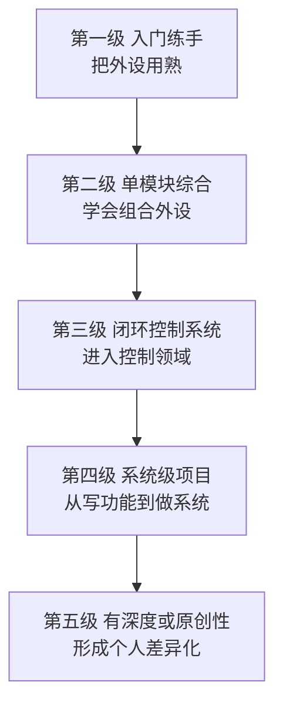

# 13.2 项目实战阶梯

> **前置知识**：[0.2 三条路线与技能依赖](../00-导读/02-三条路线与技能依赖.md) · [0.3 怎么用这份教程](../00-导读/03-怎么用这份教程.md)
>
> **掌握标准**：知道该做什么项目、按什么顺序做、每个项目要练到什么程度才算过关
>
> **对应岗位**：全部（项目经历是所有岗位的共同硬通货）
>
> **练手建议**：从本篇挑选一个高于你当前水平一级的项目立刻开始，不要等到"学完再做"

## 项目不是检验，项目就是学习方式

[0.3](../00-导读/03-怎么用这份教程.md) 里已经说过一遍，这里再说得狠一点：

> **嵌入式不是靠"读"学会的。项目不是学完之后用来"检验"的环节，项目本身就是学习方式。**

这句话有一个很实际的含义：如果你的学习方式是"先看教程 → 再看教程 → 觉得差不多了 → 开始做项目"，那你大概率会在"开始做项目"这一步卡死。因为教程里的知识是**线性**的，而一个真实项目需要的是**网状**的知识——你要同时用到外设配置、时序、内存、调试、硬件接线。你在教程里永远学不到"电机一转整个板子复位"这种问题该怎么查，因为教程的电路不会有这个毛病。

正确的姿势是反过来：**先立一个项目目标，然后为了把它做出来去查知识。** 卡在哪，查哪一篇。这样每学到的一个知识点，你都知道它是为了解决什么问题的——这种"带问题的学习"效率比"先学后用"高得多，而且记得住。

还有一个更现实的原因：**面试官几乎不会考你"看过什么教程"，只会问你"做过什么东西"。** 项目经历是嵌入式求职里唯一无法被背下来的东西，这一点在第 13 章的开篇已经强调过。

## 为什么很多人做了项目还是找不到工作

这是本篇最想说清楚的一个问题。你身边一定有这样的人（或者你自己就是）：项目做了好几个，简历上写满了，投出去却没什么回音。原因通常不是项目数量不够，而是下面这三条：

**第一条，项目是"跟着教程抄一遍"的。** 教程说 CubeMX 这么配，你就这么配；教程说这里调用 HAL 库的哪个函数，你就复制过来。这种项目你确实做出来了，但你没有做任何一个决策——所有的技术选择都是别人替你做好的。面试官只要问一句"这个串口为什么用 DMA 而不是中断收"，你就露馅了。**抄来的项目在简历上和在面试里是两回事**：简历上看起来一样，面试里一问就分高下。

**第二条，项目太同质化。** 循迹小车、温湿度显示、蓝牙点灯——这些项目全国每年有几十万个学生在做。面试官一天看几十份简历，看到第三个循迹小车就已经不看了。**同质化不是不让你做这些项目，而是要求你在上面做出差异。** 同样是循迹小车，一个是"能跑"，一个是"能跑 + 有 PID 参数整定记录 + 有上位机看曲线 + 有 PCB"，这在简历上是两个完全不同的项目。

**第三条，讲不清技术细节。** 这是最致命的。很多人能说"我做了个平衡车"，但说不清"为什么用串级 PID 而不是单环"、"直立环和速度环的周期为什么不一样"、"陀螺仪数据为什么要做互补滤波"。**能跑通说明你会用工具，能讲清楚为什么这么设计才说明你懂原理。** 招聘方要的是后者。

这三条合起来其实是一句话：**面试官评估的不是"你做出来没有"，而是"你在做的时候做了多少判断"。**

## 什么叫"做完了"

很多人对"做完"的定义是"能跑起来"。按这个标准，做一个项目的收获大概只有三成。

| 完成度 | 表现 | 面试价值 |
|---|---|---|
| 30% | 能跑起来，但换个环境/换块板子就不行 | 基本等于没做 |
| 60% | 稳定运行，能说清用了什么技术 | 及格，但和一堆人没差别 |
| 80% | 能讲清每个技术选择的理由，说不出"教程就这么写的" | 有说服力 |
| 100% | 上面全部 + 能说出踩过什么坑、怎么定位的 + 能演示边界情况 | 面试官会主动追问，这是好信号 |

具体来说，一个项目要算"做完"，至少要做到这三件事：

**能讲清楚每个技术选择的理由。** 为什么用这个芯片、为什么用中断不用轮询、为什么这个任务优先级高、为什么滤波用这个系数。讲不出理由的地方，就是你没真正掌握的地方，也是面试官一定会问的地方。

**能说出踩过什么坑、怎么解决的。** 这一条被严重低估。面试里最能证明能力的，往往不是"我做出来了"，而是"我遇到过 X 问题，我先怀疑 Y，用示波器验证后发现是 Z，最后用 W 方法解决了"。**这段叙述里有排查方法、有工具使用、有推理链条**，比任何技术名词堆砌都有说服力。

**能演示边界情况。** 正常的流程跑通不算本事，异常情况才是。断电重上电会不会丢配置？断网之后能不能自动重连？传感器拔掉会不会死机？输入超范围会不会溢出？能主动说出这些并且演示，说明你在设计时就考虑了可靠性——这是"做过产品"和"做过实验"的分水岭。

## 项目阶梯

项目不是随便做的，难度太低是浪费时间，难度太高是做不出来。合理的做法是**始终挑一个略高于你当前水平的项目**——做完这一个，再往上走一级。

下面五级是按难度排的。**不要跳级，也不要在一级上停太久。**

### 第一级：入门练手

**目标**：把常用外设用熟，形成"看手册就能配出来"的能力。这一级**不追求复杂度**，追求的是覆盖面和熟练度。

**涉及技术点**：GPIO 与按键消抖、外部中断、串口收发与 printf 重定向、定时器（定时与输出比较）、PWM 调光、ADC 采集电位器、I2C 读传感器、SPI 驱动屏幕或 Flash、DMA 搬运数据。

**达标标准**：**能不看例程，从零把每个外设配出来并写出自己的驱动。** 具体一点——给你一块新板子和一份数据手册，你能独立点亮 LED、跑通串口打印、读出一个传感器的数据，不需要回头翻别人写的工程。这一条听起来简单，但能真正做到的人不多，很多人只是"记得住 CubeMX 上的那几个选项"，换一块芯片就废了。

**常见做法**：跟着教程或视频，一个外设一个外设地过，每个外设写一个小 demo。

**能写进简历的亮点**：这一级**几乎写不进简历**，它的作用是打地基。唯一可能有用的是"独立完成过若干外设驱动"这类描述，但价值有限。**不要在这一级的项目上花太多篇幅写简历**，能做出来说明你入门了，仅此而已。

### 第二级：单模块综合

**目标**：学会"把几个外设组合起来完成一件事"。这一级的关键词是**数据流**——采集 → 处理 → 显示/发送，你要开始思考"数据从哪来、经过什么、到哪去"。

**涉及技术点**：多外设协同、串口协议设计（帧头/长度/校验）、OLED 或 LCD 显示、状态机、简单的数据结构（环形缓冲区）、上位机通信（可以先用串口助手，之后自己做一个小工具）。

**达标标准**：设备能连续跑几个小时不出错；通信协议能应对丢包和错帧（不会因为收到半截数据就卡死）；别人拿到你的程序，不改代码就能用串口工具读懂数据格式。

**常见做法**：温湿度采集 + OLED 显示；串口协议与上位机通信；蓝牙/WiFi 远程控制一个小设备（比如远程开关灯、调亮度）。这一级的项目很多人做，但多数人做得很浅——只是"能显示"和"能控制"。

**能写进简历的亮点**：**自定义的通信协议**是最有价值的一条。如果你能说清"我设计了一个带帧头、长度、CRC 校验的协议，用状态机解析，能处理粘包和半包"，这就是一个像样的技术点。其次是"数据不丢、连续运行 N 小时不出错"这类稳定性描述。

### 第三级：闭环控制系统

**目标**：进入"控制"领域——从"我让它动它就动"变成"我让它动到某个值它就稳定在某个值"。**这是很多人第一个真正拿得出手的项目。**

**涉及技术点**：传感器反馈、PID（位置式/增量式）、串级控制、参数整定、定时器与固定周期控制、滤波（滑动平均/低通/互补滤波）、电机驱动（H 桥/PWM）、实时性意识（控制周期抖动会怎样）。

**达标标准**：能说出控制周期的具体数值和为什么是这个值；能独立整定 PID 参数并解释每个参数的作用；能给出调试数据（比如超调量、稳态误差、调节时间）；能处理"参数一调就震荡"这类问题而不是凭感觉瞎试。

**常见做法**：PID 温控（恒温箱、加热台）、电机速度闭环、二轮平衡车、循迹/避障小车。这一级的项目最容易出成果，也最容易做得平庸——**差别全在"你有没有记录和分析数据"**。

**能写进简历的亮点**：**控制性能的数字**。比如"把温度稳态误差从 ±2℃ 压到 ±0.3℃"、"速度环带宽从 20Hz 提到 80Hz"、"加入前馈后调节时间缩短一半"。这种带数字的描述，比"实现了 PID 控制"强十倍。其次是"PID 参数整定过程"和"串级结构的设计理由"。

### 第四级：系统级项目

**目标**：从"写功能"上升到"做系统"。这一级的重点不再是某个算法，而是**架构、可靠性、通信、硬件**四件事怎么协同。

**涉及技术点**：实时操作系统（RTOS）的多任务划分与优先级设计、任务间通信（队列/信号量）、Bootloader 与 OTA 升级、掉电保护与参数存储、看门狗、低功耗管理、通信中间件、PCB 设计、结构配合。

**达标标准**：能画出系统的任务划分图和通信关系图；能说清每个任务的优先级和周期是怎么定的；系统能应对异常（断线重连、掉电恢复、任务跑飞被看门狗拉回）；代码分了层，不是一坨 main 里的流水账。

**常见做法**：带 RTOS 的多任务设备、带 Bootloader/OTA 的联网设备、自研 PCB 的完整产品、四轴飞行器、云台、机械臂。**这一级的项目才是"产品形态"**，前面三级都还是"实验形态"。

**能写进简历的亮点**：**系统设计能力**。比如"用 RTOS 划分了 5 个任务，通信任务优先级最高以保证实时性"、"设计了一套双分区 Bootloader，支持断点续传和回滚"、"自研 PCB 完成了从原理图到打样到调试的全流程"。这类描述传递的信息是：**这个人能独立负责一个模块甚至一个产品**，这是企业和学生项目之间最大的差距。

### 第五级：有深度或原创性的项目

**目标**：形成**个人差异化**。前面四级解决的是"我能不能做"，这一级解决的是"我比别人强在哪"。

**涉及技术点**：取决于方向。可能是无感 FOC 的观测器设计、视觉 SLAM 的前端后端、自定义协议栈、边缘 AI 的模型量化与部署、高速信号的 PCB 设计、功能安全流程。

**达标标准**：你能就这个项目讲上半小时不停，而且面试官问不穿；你在这个点上知道的东西比大多数工作三年的人多；你有自己的判断和取舍，而不是复述别人论文里的结论。

**常见做法**：软硬全自研并考虑量产（成本、良率、认证）；在某个方向深挖一层（把 FOC 的三电阻采样做透，比做一个只能转的 FOC 有价值得多）。

**能写进简历的亮点**：**这一级本身就是亮点**。它传递的是"这个人有技术纵深"和"能啃硬骨头"。校招里出现一个第五级项目，基本可以直接跳过技能清单的筛选。

**但要诚实提醒一句**：第五级不是必需品，也不是越早越好。**一个做到 80 分的第三级项目，比一个做到 30 分的第五级项目有说服力得多。** 很多人看到"深度"两个字就想直接冲第五级，结果做成半成品，反而减分。

### 每一级大概要花多久

下面这些时间只是**量级参考**，不是标准答案。差别主要来自你之前的积累、每天能投入的时间、以及有没有人带。**用它来判断"我是不是卡太久了"，而不是用来做 KPI。**

| 级别 | 建议投入 | 卡住的典型信号 |
|---|---|---|
| 第一级 | 2~6 周 | 每个外设都要抄例程，脱离例程就配不出来 |
| 第二级 | 3~8 周 | 数据一多就丢、通信一错就卡死、只能跑几分钟 |
| 第三级 | 1~3 个月 | 参数调不出来、一改就震荡、不知道怎么分析数据 |
| 第四级 | 3~6 个月 | 任务划分越改越乱、异常场景一个都处理不了 |
| 第五级 | 半年以上 | 卡在某个技术点上没有进展，说不清自己的方案好在哪 |

**怎么用这张表**：如果某一级你花的时间明显超过上限，大概率不是"你学得慢"，而是**卡在某个具体能力上**。这时候该做的不是继续硬耗，而是**回头找到那个卡点**——可能是没掌握调试方法，可能是某个基础知识点没打牢，也可能是项目定得太大了。**把卡点找出来单独解决，比在原项目上耗三个月有效得多。**

反过来，**如果某一级你两三天就"做完了"，那通常是没做到位**——对照上面每一级的达标标准重新检查一遍，尤其是"能不能讲清每个技术选择的理由"这条。

## 几个经典项目的做法与差异

下面这几个是嵌入式领域最经典的项目。它们不新鲜，但**经典意味着面试官熟悉、意味着能问出深度**。真正的问题不是"做不做"，而是"怎么做才能做出差异"。

**智能小车（循迹/避障/遥控）**。练的是传感器采集、电机驱动、控制逻辑、调试排错，是所有项目里综合度最高、门槛最低的一个。**容易停在**"能循线跑完一圈"。**做出差异的做法**：把开环控制改成 PID 闭环并记录不同参数下的轨迹偏差；加编码器做里程计；加蓝牙/WiFi 遥控和状态回传；把避障从"碰到就转"做成超声+红外的多传感器融合；画一块 PCB 把飞线收掉。**这一个项目做好，第二级到第三级的内容基本全覆盖了。**

**平衡车 / 自平衡云台**。练的是惯性测量单元（IMU）读取、姿态解算、互补滤波或卡尔曼滤波、串级 PID、实时性。它比小车难在 **"不倒"是一个硬性指标**，没有中间状态可以糊弄。**容易停在**"调参调到勉强能站起来"。**做出差异的做法**：记录不同滤波参数下的姿态噪声曲线；分析直立环和速度环的带宽差异；加入转向控制和蓝牙调参；用上位机实时画出姿态和 PID 输出。**姿态解算这一段如果讲得清楚，是很强的加分项。**

**四轴飞行器**。是第四级偏上的项目，涉及姿态控制、电机控制、通信、传感器融合、电源，难度陡增。**容易停在**"买了成品飞控改改参数"。**做出差异的做法**：自己写飞控（哪怕只是从开源飞控里读懂再重写关键模块）；做无感/有感电调；加光流或气压计做定高；把飞行日志导出来做频域分析。**提醒**：这个项目失败率很高，炸机是常态，投入产出比不一定好，不建议作为第一个项目。

**温控 / 电机控制器**。看起来最简单，其实最容易做出深度——因为**它是一个纯粹的闭环控制对象，好坏完全由数据说话**。**做出差异的做法**：做串级控制（外环温度、内环加热功率）；加入前馈；辨识被控对象的模型；记录阶跃响应曲线并算超调量、调节时间；对比不同整定方法的差异。**"我把温度稳在 ±0.3℃ 并且能给出阶跃响应曲线"这句话，比做一个飞行器更有技术说服力。**

**物联网数据采集网关**。练的是通信协议（Modbus/MQTT）、多设备管理、断线重连、数据缓存与补传、低功耗。**做出差异的做法**：做本地缓存，断网时数据不丢、恢复后补传；做远程 OTA 升级；做设备自检和心跳；加看门狗和异常重启记录。**这个项目最贴近实际工作里的 IoT 岗位，也最能让面试官问出"断网了怎么办"这类问题。**

**机械臂 / 多关节机器人**。练的是运动学（正逆解）、多轴联动、轨迹规划、力矩控制。**做出差异的做法**：把逆运动学的解算过程讲清楚；做轨迹插补而不是点位控制；加视觉做抓取定位。**门槛明显高于前面几个，建议放到有一定基础之后。**

**智能家居原型**。练的是无线通信、云平台对接、多设备组网、低功耗。**做出差异的做法**：做本地联动（断网也能用）；做配网流程和异常处理；做功耗测试并给出电池续航估算。**这个项目最常见的失败是"只在演示环境下能用"，能把它做到连续运行一周不出问题就是亮点。**

**自研 PCB 的桌面小设备**（比如自定义的时钟、传感器面板、小控制器）。练的是完整的**产品流程**：选型 → 原理图 → 布局布线 → 打样 → 焊接 → 调试 → 外壳。**做出差异的做法**：考虑成本（单板 BOM 多少）、考虑良率、写完整的设计说明文档。**这个项目的价值不在于技术多难，而在于它证明你能独立走完从想法到实物的全流程。**

## 怎么把项目做出深度

这一节是本篇最有价值的部分。绝大多数人的项目卡在同一个地方：**做到"能跑"就停了。** 而"能跑"到"有深度"之间，其实只差一层——**你愿不愿意在能跑之后，再往上面加一层东西。**

下面这些"加一层"的动作，随便挑两三个加上去，你的项目层次就不一样了。它们不需要多高的技术，但需要你多花一点时间：

**加 OTA。** 让设备能远程升级固件。这一下就把项目从"实验"变成"产品形态"，而且过程中你会被迫理解 Flash 分区、Bootloader、升级失败回滚。

**加断线重连。** 通信断了能自己恢复。实现过程会逼你处理超时、重试、状态机、心跳——这些正是 IoT 岗位日常。

**加掉电保护。** 断电再上电，配置和数据不丢。这需要你理解 Flash 的擦写特性、写保护、以及"什么时候该存、什么时候不该存"的取舍。

**加低功耗。** 用电池供电跑一个月。这会逼你理解睡眠模式、唤醒源、外设时钟管理，以及"功耗到底花在哪"的测量方法。

**加数据记录。** 把运行数据存下来，事后能分析。有了数据你才能谈"性能提升"，没有数据的项目只能谈"功能实现"。

**加自检。** 上电时检查各模块是否正常，异常时给出明确的状态码。这是工业设备的基本要求。

**做一个上位机。** 用 Python + 串口或者简单的网页，把设备的曲线画出来。**这一条性价比极高**——调试时它帮你，面试时它当演示，而且它证明你有软件工程能力。

**画一块 PCB。** 把面包板和飞线变成一块真正的板子。哪怕很简单，也证明你能走完硬件流程。

**写一份完整的 README。** 说明项目是干什么的、怎么跑起来、关键设计在哪。这一条零成本，但很多人不做。写法见 [3.3 Git 与代码托管](../03-嵌入式软件工程/03-Git与代码托管.md)。

**加运行日志和故障记录。** 把关键的运行事件记下来——什么时候重启过、通信失败过几次、参数被改过没有。出了问题能回溯，这是工业设备和玩具的区别。

**做一次性能基准测试。** 测一下你的程序占用多少 CPU、中断响应延迟多少、主循环一圈要多久、内存还剩多少。很多人做了几个项目都答不出"你的代码有多快"，而这是一个非常容易被问到的问题。

**核心逻辑是这样的**：上面这些动作，每一个都会把你逼到一个"教程里没讲"的场景里去。而**恰恰是这些教程里没讲的场景，才是面试官真正想问的东西。** 面试官问不出"你怎么实现 PWM"，但一定能问出"你的设备断网了会怎样"。

## 项目文档与展示

做完的项目要能被别人看见，否则等于没做。

**README 是必需品。** 它至少要回答：这个项目是做什么的、用什么硬件和软件、怎么编译和烧录、关键功能怎么用、有哪些已知问题。写法见 [3.3 Git 与代码托管](../03-嵌入式软件工程/03-Git与代码托管.md)。**一份好的 README 是低成本高回报的加分项**，因为大多数人的项目仓库里只有代码和一个空的 README。

**演示视频要拍得"能看出你懂行"。** 不要只拍成品跑起来的画面。更好的拍法是：拍调试过程（示波器/逻辑分析仪上的波形）、拍上位机上的实时曲线、拍异常处理（拔掉传感器看设备怎么反应）。**面试官从你选择拍什么，就能看出你关注什么。**

**几个值得记录的数据**：控制系统的响应曲线和超调量、测量精度、功耗（不同模式下的电流）、稳定性（连续跑了多少小时、重启了几次）、升级耗时、通信丢包率。**没有数据，你的"我做了一个 X"就只是一个说法；有了数据，它就是一个可验证的结果。**

## 几个务实的提醒

**项目不必高大上，但必须是你自己做的。** 一个把细节讲透的温控器，胜过一堆看不出来历的项目。而且面试官鉴别"是不是自己做的"非常容易——只要问到具体的调试细节和取舍，"借来的项目"立刻现形。

**一个做到 80 分的项目胜于三个做到 30 分的。** 简历上写三个半成品，传递的信号是"这个人做事情做不到底"。深挖一个项目，把它做到能应对追问，价值高得多。

**不要同时开三个项目。** 这是新手最常见的病。同时开三个的结果通常是一个都没做完，而且每个都停在"能跑"那一层，一个能讲的项目都攒不出来。

**不要为了填简历而做项目。** 如果做这个项目的目的只是让简历上多一行字，那你在面试里一定答不出来。做项目的动机应该是"我想搞明白这个东西怎么工作"。

**允许自己做完一个"烂项目"。** 第一个项目做得粗糙是正常的，重要的是你在里面踩了坑、建立了手感。**不要因为觉得"这个太简单了拿不出手"就不做**——什么都不做才是真的拿不出手。

## 学习建议

**先定位，再挑项目。** 对照 [0.1 岗位图谱](../00-导读/01-嵌入式岗位图谱.md) 看你想去的方向，然后从上面五级里挑一个**比你当前水平高一级**的项目。宁可略高，不要平级重复——重复做同一难度的项目，能力不会涨。

**今天就开始，不要等"学完"。** 你现在就可以把第一级的项目在你的板子上跑一遍。卡住了再回来翻 [2.3 通用外设](../02-MCU与体系结构/03-通用外设.md)，那种"带着问题找答案"的感觉和干读一遍完全不同。

**把"加一层"当成习惯。** 每做完一个项目，强迫自己从"怎么把项目做出深度"那一节里挑两件事加上去。这是本篇最值得反复看的一节。

**重视数据，不要只留代码。** 调试过程中的波形截图、串口日志、性能对比表，这些东西留在你的笔记里，找工作时会变成简历和面试里的素材。具体怎么排查问题见 [3.6 调试方法论](../03-嵌入式软件工程/06-调试方法论.md)。

**做不动的时候，缩小目标，不要放弃。** 大目标可以拆成小目标——"做一个四轴"太远，"先把一个电机用 PWM 转起来"很近。**能持续做出小东西的人，最后都能做出大东西。**

**哪些可以略过**：第五级项目在入门阶段可以完全不管；同质化严重的项目（比如又一个温湿度显示器）如果只是想凑数，不如不做。**把时间花在把一个项目做深，而不是把项目数量做多。**

## 小节总结

**项目在嵌入式里的地位和大多数人的理解是反的**：它不是一个"学完之后用来检验"的环节，它就是学习本身。所以"先学完再做"这个顺序是错的，"先立项目目标、卡住再查"才是对的。你越早接受这件事，学得越快。

**很多人做了项目还是找不到工作，问题不在项目数量，在项目的质地。** 抄教程的项目、和几十万人重名的项目、讲不清技术选择的项目，在简历上看起来和其他人一样，在面试里一问就崩。判断一个项目值不值得写的标准很简单：**你有没有为它做过技术决策，能不能说出每个决策的理由。**

**"做完"的标准比大多数人想的高。** 能跑起来只占三成。剩下七成在"能讲清为什么这么设计"、"能说出踩过什么坑怎么定位的"、"能演示边界情况"这三件事上。很多人卡在 30%，然后就去做下一个项目了，于是做了五个 30% 的项目，等于零。

**难度阶梯要一级一级走，但每一级都不该停太久。** 入门练手打地基、单模块综合练数据流、闭环控制进入控制领域、系统级项目练架构与可靠性、第五级形成差异化。**第三级是大多数人第一个真正拿得出手的项目**，第五级不是必需品，而且半成品的第五级反而减分。

**最后一条也是本篇最实用的方法**：项目做到"能跑"之后，别停，往上加一层——加 OTA、加断线重连、加掉电保护、加低功耗、加数据记录、加自检、加运行日志和故障记录、做上位机、画 PCB、写 README、做一次性能基准测试。这些动作会把你推到一个"教程里没讲"的场景里去，而**这些场景恰恰就是面试官真正想问的东西**。

---

本章目录：[13. 学习路线与项目实战](README.md) ｜ 总目录：[返回首页](../../README.md)
上一篇：[13.1 方向路线图](01-方向路线图.md) ｜ 下一篇：[13.3 资源地图](03-资源地图.md)
